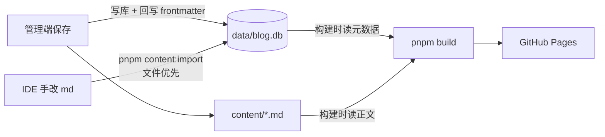

# 内容工作流手册

从写作到上线的完整流程。适用于重构后的 monorepo 架构（管理端 + SQLite + md 源文件），旧版指南已废弃。

## 0. 核心心智模型

一句话：**正文永远在 md 文件里，元数据与状态以数据库为准，两边由工具保持同步。**



三条同步规则：

| 你做了什么 | 需要做什么 |
|------------|------------|
| 管理端里任何操作（新建/编辑/改状态/排序） | 什么都不用做——自动双写数据库和 frontmatter |
| IDE 里只改了 **正文** | 什么都不用做——正文构建时实时从文件读取 |
| IDE 里改了 **frontmatter** 或 **新建/删除了 md 文件** | 执行 `pnpm content:import`（以文件为准重建数据库，幂等可重跑） |

> ⚠ 最容易踩的坑：**手动新建的 md 不执行 `content:import` 不会出现在站点上**（构建只会打漂移告警，不会自动收录）。

## 1. 两种写作方式

### 方式 A：管理端全流程（推荐日常使用）

```bash
pnpm dev:admin   # http://localhost:3001
```

1. 「文章」→「新建文章」：填标题、slug、选分类 → 自动生成脚手架文件和数据库记录（初始 draft）
2. 编辑器写作：左源码右预览（Mermaid 可渲染），粘贴/拖拽图片自动存入文章 `assets/` 目录
3. 右侧面板改元数据（日期/标签/摘要/封面/分类），`Cmd+S` 保存
4. 写完点「发布」把状态改为 published
5. 「发布」页一键 git 提交推送 → GitHub Actions 自动部署

### 方式 B：IDE 手写 md

1. 按规范创建文件（见 §2/§3）
2. 执行 `pnpm content:import` 注册进数据库
3. `pnpm dev:web` 预览（草稿 dev 可见）
4. 发布：改 frontmatter `status: published` 后再跑一次 `content:import`，或直接在管理端点状态按钮
5. git 提交推送（手动，或用管理端发布页）

### 混合流（作者实际最顺手的）

管理端「新建文章」生成骨架 → **正文在 IDE 里写**（改正文不需要任何同步）→ 元数据/状态回管理端点按钮 → 管理端一键发布。全程不需要手跑 `content:import`。

## 2. 文章规范（content/posts/）

### 目录结构

```text
content/posts/<分类slug>/<年份>/<文章slug>/
├── index.md          # 正文 + frontmatter
└── assets/           # 随文档图片（可选）
    └── diagram.png
```

### Frontmatter 模板

```yaml
---
title: 文章标题
slug: article-slug          # 全站唯一；创建后不要改（改 = URL 变更，当前不支持）
date: "2026-08-15"          # 发布日期，建议加引号
updatedAt: "2026-08-16"     # 可选，更新时间（管理端不会自动更新，作者自控）
category: technical         # 分类 slug（不是中文名）
tags:
  - Next.js
excerpt: 一句话摘要，列表页展示。
coverImage: ./assets/cover.png   # 可选；相对路径走优化管道，旧 /images/... 绝对路径也兼容
status: draft               # draft / published / archived；不写会按 published 导入！
---
```

字段规则：

- `slug`：小写字母/数字/中文与连字符（`^[a-z0-9一-鿿]+(-[a-z0-9一-鿿]+)*$`）。URL 建议纯 ASCII。
- `category`：分类 slug，可在管理端「分类」页查看全部；不匹配任何分类时落入「未分类」。
- `status`：**手写新文件务必显式写 `status: draft`**，否则导入即公开。
- 旧字段 `coverCard` 仍可解析，但管理端保存时会归一为 `coverImage`。

### 当前分类

分类以数据库为准（管理端「分类」页可增删改）。初始四类：`technical` 工程札记、`notes` 专题整理、`learning` 学习记录、`life` 生活手记。**新建分类请走管理端**（自动建目录 + 入库，前台零代码生效）；手动建目录的话需要先在管理端建好同名分类，否则文章会归入「未分类」。

## 3. 专栏笔记规范（content/collections/）

专栏 = 独立一级路由的笔记集（如 `/rightCapital/`、`/addx-ai/`）。

```text
content/collections/<专栏slug>/<任意文件名>.md
```

```yaml
---
title: 笔记标题
slug: "01"        # 专栏内唯一，即 URL 第二段：/<专栏>/<slug>/
order: 1          # 排序（管理端可拖拽调整，会回写此字段）
status: published
---
```

- **新建专栏必须走管理端**（「专栏」→ 新建）：slug 会做保留字校验（不能与 `posts`、`categories`、`about` 等既有路由冲突），并可配置列表页标签、详情徽标、是否对搜索引擎隐藏（noindex，默认隐藏、不进 sitemap）。
- 专栏文档同样适用 §0 的同步规则。

## 4. 图片规范

**新文章统一用随文档目录**（进构建优化管道：≥50KB 位图自动生成限宽 1600 的 WebP，原图兜底）：

```markdown

```

- 管理端编辑器里粘贴/拖拽即可自动落盘并插入引用；封面用「上传封面」按钮。
- 手动放置：图片放进文章目录 `assets/` 子目录，用 `./assets/文件名` 相对路径引用。
- 存量图片在 `public/images/` 下用 `/images/...` 绝对路径引用的，继续有效，不必迁移。

## 5. 状态与可见性

| 状态 | `pnpm dev:web` | 生产构建 | 管理端 |
|------|:--:|:--:|:--:|
| `draft` | ✅ 可见（带草稿标识） | ❌ | ✅ |
| `published` | ✅ | ✅ | ✅ |
| `archived` | ❌ | ❌ | ✅（可恢复） |

流转：draft ↔ published，published → archived，archived → draft/published。删除 = 软删除，文件移入 `content/.trash/`（不进 git，可手动找回）。

## 6. 预览与发布上线

```bash
pnpm dev:web          # 本地预览（含草稿），http://localhost:3000
pnpm build            # 生产构建（含漂移检测告警）
pnpm preview          # 预览构建产物，http://localhost:4173
```

上线两种方式（内容改动才会触发部署，改的是 main 分支）：

1. **管理端「发布」页（推荐）**：展示内容变更清单（只提交 `content/` 与 `data/`，代码改动不会被带上）→ 确认提交信息 → 一键推送 → Actions 自动构建部署。
2. **手动 git**：`git add content data && git commit && git push`。

## 7. 一致性自检与修复

```bash
pnpm content:check    # 漂移检测：报告 frontmatter 与数据库的差异（构建时也会自动跑，仅告警）
pnpm content:import   # 以文件为准全量重建数据库（幂等；slug 冲突会报错并列出文件）
```

| 症状 | 原因 | 处理 |
|------|------|------|
| 新建的 md 在站点/管理端都看不到 | 没导入 | `pnpm content:import` |
| 构建时告警 `field-diff` | IDE 改了 frontmatter 未导入 | 确认改动是你想要的 → `content:import`；不是 → 在管理端改回（以库为准回写） |
| 构建时告警 `missing-file` | 文件被删但库里有记录 | `content:import`（会同步删除记录） |
| 导入报「重复 slug」 | 两篇文章 slug 相同 | 改其中一篇的 slug 后重跑 |
| dev 访问专栏/文章 500 | 极少数 dev 缓存问题 | 重启 `pnpm dev:web`（启动时会自动清理 .next） |

## 8. 命令速查

| 命令 | 用途 |
|------|------|
| `pnpm dev:admin` | 管理端（写作/管理/发布一体） |
| `pnpm dev:web` | 前台预览（含草稿） |
| `pnpm content:import` | md → 数据库（文件优先，幂等） |
| `pnpm content:check` | 漂移检测 |
| `pnpm build` / `pnpm preview` | 生产构建 / 本地预览产物 |
| `pnpm test` | core 单元测试 |

## 9. Markdown 书写约定（沿用）

- 标准 Markdown + GFM（表格、任务列表）；代码块标注语言。
- ```mermaid 代码块自动渲染为可交互图例（点击全屏，支持缩放/拖拽）。
- 文章用一个一级标题，正文从二级标题开始分段（目录/锚点基于 h2/h3 生成）。
- URL 相关标识（slug）建议纯 ASCII，中文仅作展示名。
