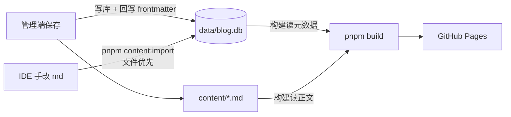
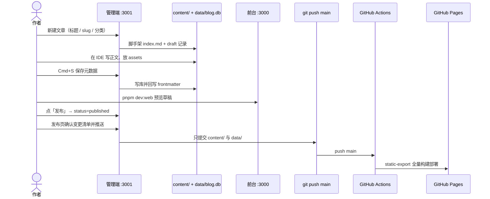
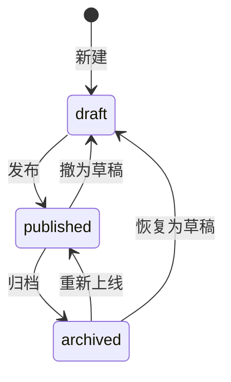

# 博客主使用说明

给站点作者用的日常手册：怎么写、怎么发、怎么修。生产链路是 **本地 Admin + Markdown + SQLite + GitHub Pages**。部署态 v2 代码已在仓库里，但**不要在观察期改生产 flag 或删除 filesystem**。

相关文档：[README](./README.md)（架构总览）· [CONTRIBUTING](./CONTRIBUTING.md)（改代码）。

## 0. 先记住三件事

1. **正文在 Markdown，元数据与状态以数据库为准。** 管理端保存会双写；你在 IDE 里只改正文，构建时直接读文件。
2. **生产可见的只有 `published`。** `draft` 仅本地 `pnpm dev:web` 可见；`archived` 全隐藏，文件还在。
3. **上线 = 把 `content/` 和 `data/` 推到 `main`。** 管理端「发布」页只提交这两处，不会把未完成的代码改动带上去。



同步规则：

| 你做了什么 | 需要做什么 |
|------------|------------|
| 管理端里任何操作（新建 / 编辑 / 改状态 / 排序） | 不用额外同步 |
| IDE 里只改了 **正文** | 不用同步，构建读文件 |
| IDE 里改了 **frontmatter**，或新建 / 删除了 md | `pnpm content:import`（以文件为准，幂等） |

最容易踩的坑：**手动新建的 md 不执行 `content:import`，站点和管理端都看不到。** 构建只会打漂移告警，不会自动收录。

---

## 1. 推荐工作流（混合流）

这是实际最好用的路径：骨架走管理端，长文在 IDE 里写，状态和发布回管理端点按钮。全程不用手跑 `content:import`。



### 每天打开什么

```bash
pnpm dev:admin    # http://127.0.0.1:3001
pnpm dev:web      # http://localhost:3000（含草稿标识）
```

管理端只绑本机 loopback，不要改成局域网可访问。

### 写一篇新文章

1. 管理端「文章」→「新建文章」：标题、slug、分类。初始状态一定是 `draft`。
2. 正文可以在管理端左右分栏写（Mermaid 可预览），也可以打开生成的 `content/posts/<分类>/<年份>/<slug>/index.md` 用 IDE 写。
3. 图片：编辑器里粘贴 / 拖拽即可，会落到该文章的 `assets/` 并插入相对引用。封面用「上传封面」。
4. 右侧改日期、标签、摘要、封面、分类，`Cmd+S` 保存。
5. 本地前台确认阅读体验（目录、图片、Mermaid 全屏）。
6. 管理端把状态改为 `published`。
7. 「发布」页：确认清单只有 `content/` 和 `data/` → 填写提交信息 → 推送。等 Actions 完成即上线。

slug 创建后不要改（改 = URL 变，当前不支持重定向）。建议纯 ASCII。

### 改一篇已发布文章

打开管理端对应文章 → 改正文或元数据 → 保存。已发布文章保存后仍是 `published`，再走发布页推送即可。想暂时撤下：状态改为 `draft` 或 `archived`，再推送。

### 专栏笔记

专栏是独立一级路由，例如 `/rightCapital/`、`/addx-ai/`。

- **新建专栏必须走管理端**（会校验保留字，避免和 `posts`、`categories`、`about` 等冲突）。
- 文档可拖拽排序，`order` 会回写 frontmatter。
- 默认 `noindex`、不进 sitemap，适合面试笔记这类不希望被检索的目录。

---

## 2. 文章规范

### 目录

```text
content/posts/<分类slug>/<年份>/<文章slug>/
├── index.md
└── assets/           # 可选，随文档图片
    └── diagram.png
```

### Frontmatter

```yaml
---
title: 文章标题
slug: article-slug
date: "2026-08-18"
updatedAt: "2026-08-18"    # 可选；filesystem 模式下管理端不会自动改，作者自控
category: technical          # 分类 slug，不是中文名
tags:
  - Next.js
excerpt: 一句话摘要，列表页展示。
coverImage: ./assets/cover.png
status: draft                # 手写新文件必须写；不写导入会当成 published
---
```

- `category` 以管理端「分类」页为准。对不上的文章会进「未分类」。
- 旧字段 `coverCard` 仍能解析，管理端保存时会归一成 `coverImage`。
- 初始分类：`technical` 工程札记、`notes` 专题整理、`learning` 学习记录、`life` 生活手记。新建分类走管理端（自动建目录 + 入库，前台零代码生效）。有文章的分类不能删。

### 专栏 frontmatter

```yaml
---
title: 笔记标题
slug: "01"
order: 1
status: published
---
```

路径：`content/collections/<专栏slug>/<任意文件名>.md`。

---

## 3. 图片

新内容统一用**文章包内相对路径**，会进构建优化（≥50KB 位图生成限宽 1600 的 WebP，原图兜底）：

```markdown

```

- 管理端粘贴 / 拖拽会自动落盘。
- 存量 `public/images/` + `/images/...` 绝对路径仍然有效，不必迁移。
- 封面建议 16:9 或 4:3；内容图小于 1MB 更合适。

---

## 4. 状态与可见性



| 状态 | `pnpm dev:web` | 生产构建 | 管理端 |
|------|:--:|:--:|:--:|
| `draft` | 可见（草稿标识） | 不可见 | 可见 |
| `published` | 可见 | 可见 | 可见 |
| `archived` | 不可见 | 不可见 | 可见（可恢复） |

删除是软删除：文件进 `content/.trash/`（不进 git，可手动捞回）。

---

## 5. 预览与上线

```bash
pnpm dev:web          # 含草稿，http://localhost:3000
pnpm build            # 生产构建（先跑漂移检测，只告警不阻断）
pnpm preview          # 预览产物，http://localhost:4173
```

上线两种方式（都是推 `main`）：

1. **管理端「发布」页（推荐）**  
   只提交 `content/` 与 `data/`。若有已暂存的代码改动，发布会被拒绝，先 unstage。不在 `main` 上推送不会触发 Pages。
2. **手动 git**

```bash
git add content data
git commit -m "publish: 说明这次内容改动"
git push
```

生产构建读仓库里的 SQLite 和 Markdown，不依赖任何外部服务或 secret。Actions 在 `push main`、手动 `workflow_dispatch`，以及（v2 用的）`repository_dispatch` 时都会跑；当前日常只有 push `main`。

---

## 6. 一致性自检

```bash
pnpm content:check     # 报告 frontmatter 与库的差异（构建时也会跑）
pnpm content:import    # 以文件为准全量重建 SQLite（幂等；slug 冲突会列出文件）
```

| 症状 | 原因 | 处理 |
|------|------|------|
| 新建的 md 在站点 / 管理端都没有 | 没导入 | `pnpm content:import` |
| 构建告警 `field-diff` | IDE 改了 frontmatter 未导入 | 确认改动想要 → import；不想要 → 管理端改回 |
| 构建告警 `missing-file` | 文件删了库里还在 | `pnpm content:import` |
| 导入报重复 slug | 两篇文章 slug 相同 | 改其中一篇再导入 |
| 专栏 / 文章 dev 500 | 偶发缓存 | 重启 `pnpm dev:web`（启动会清 `.next`） |
| 发布页拒绝 | 暂存了白名单外的文件 | `git restore --staged` 那些文件 |
| 推了但线上没变 | 不在 `main`，或 Actions 失败 | 看 GitHub Actions；确认分支 |

---

## 7. Markdown 约定

- GFM（表格、任务列表），代码块标明语言。
- ` ```mermaid ` 会渲染成可交互图（点击全屏、缩放拖拽）。
- 一篇文章一个一级标题，正文从二级标题分段（目录 / 锚点来自 h2 / h3）。
- URL 相关标识用 ASCII；中文只用在标题和正文。

---

## 8. 维护节奏（建议）

| 频率 | 做什么 |
|------|--------|
| 每篇 | 本地 `dev:web` 看一遍；发布前确认状态是 `published` |
| 每次上线前 | 发布页看变更清单，确认没有把代码改动混进去 |
| 手改 frontmatter 后 | 立刻 `pnpm content:import` |
| 大改前台 / 渲染时 | `pnpm build && pnpm preview`，必要时 `pnpm test` |
| 观察期（v2 切流前） | 至少完整走完一轮「写 → 发 → Actions 变绿 → 线上可打开」 |

生产环境变量保持：

```text
ADMIN_STORAGE=filesystem
WEB_CONTENT_SOURCE=filesystem
WEB_RENDER_MODE=static-export
GIT_PUBLISH_ENABLED=true
```

`.env` 里的 Postgres / MinIO / OAuth 只用于本地或 staging 演练，**不要写进 GitHub Pages 的生产 vars 去切流**。真要切流，按 [07-cutover-runbook](./docs/deployment/07-cutover-runbook.md) 走冻结写入 → 迁移 → 备份恢复 → 影子构建 → 同一窗口改 flag。

---

## 9. 命令速查

| 命令 | 用途 |
|------|------|
| `pnpm dev:admin` | 写作 / 管理 / 发布 |
| `pnpm dev:web` | 前台预览（含草稿） |
| `pnpm content:import` | md → SQLite，文件优先 |
| `pnpm content:check` | 漂移检测 |
| `pnpm build` / `pnpm preview` | 生产构建 / 预览产物 |
| `pnpm test` | core 单元测试 |
