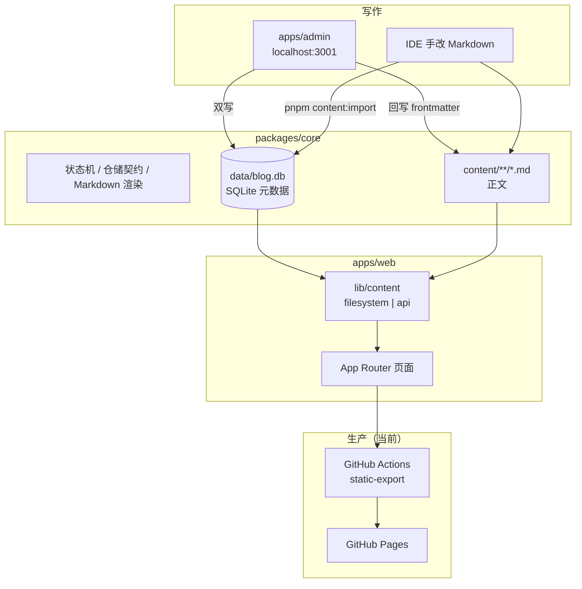

# Color 手记（cBlog）

个人知识站点：**博客前台 + 本地内容管理 + 共享核心包**。生产仍是 GitHub Pages 上的静态站；仓库里已经具备可切换的部署态 v2（PostgreSQL、Content API、Outbox、ISR），但**尚未切真实流量**。

公开站点：[https://lee-ng915.github.io/cBlog](https://lee-ng915.github.io/cBlog)

## 现在怎么跑

日常写作和发布走 **v1 文件链路**，不需要 Postgres、对象存储或鉴权：

```bash
pnpm install
pnpm dev:admin          # 管理端 http://127.0.0.1:3001（仅本机；filesystem 下无登录）
pnpm dev:web            # 前台 http://localhost:3000（dev 可见草稿）
```

写完后在管理端「发布」页一键提交 `content/` 与 `data/`，push 到 `main` 后 GitHub Actions 全量静态构建并部署 Pages。

**博客主日常操作**见 [CONTENT_GUIDE.md](./CONTENT_GUIDE.md)。改代码见 [CONTRIBUTING.md](./CONTRIBUTING.md)。

## 架构一览

仓库是 pnpm monorepo。页面不直接读文件或数据库，统一走内容适配层；管理端按存储模式选择实现。



| 包 | 职责 |
|---|---|
| `apps/web` | 公开站点。默认 `output: "export"`，产物在 `apps/web/out/` |
| `apps/admin` | 本地 CMS：文章 / 分类 / 专栏 / 发布。绑定 `127.0.0.1:3001` |
| `packages/core` | 共享领域：路径、状态机、SQLite/Postgres 仓储、frontmatter、Markdown 管道 |

内容心智模型：**正文在 Markdown 里，元数据与状态以数据库为准，工具负责两边同步。**

## 生产默认 vs 仓库内已就绪

| | 生产默认（v1，当前流量） | 仓库内已实现（v2，未切流） |
|---|---|---|
| 管理端存储 | `ADMIN_STORAGE=filesystem` | `postgres` + 对象存储 |
| 前台内容源 | `WEB_CONTENT_SOURCE=filesystem` | `api`（构建期拉 Content API） |
| 发布 | Git 白名单提交 `content/` + `data/` | Outbox worker → GitHub dispatch 或 ISR webhook |
| 渲染 | `WEB_RENDER_MODE=static-export` | 另支持 `runtime-isr`（单副本） |
| 鉴权 | 无（仅 loopback） | GitHub OAuth allowlist |

切流前不要改生产 flag，也不要删除 filesystem / Git 发布 / SQLite。步骤见 [Phase 7 runbook](./docs/deployment/07-cutover-runbook.md)。

## 仓库结构

```text
apps/web/                 博客前台（静态导出或 Runtime ISR）
apps/admin/               内容管理（本机；postgres 模式可独立部署）
packages/core/            共享核心：schema、仓储、导入导出、Markdown
content/posts/            文章包：<分类>/<年份>/<slug>/index.md
content/collections/      专栏笔记
data/blog.db              SQLite（v1 元数据真源，随仓库提交）
docs/refactor/            v1 重构 PRD / 技术设计
docs/deployment/          部署态 v2 方案与切流 runbook
docs/implementation-journal/  Phase 0–7 实施日志
.github/workflows/        Pages 部署；预发布双 profile 为手动触发
```

## 常用命令

```bash
pnpm install              # 安装工作区依赖
pnpm dev:web              # 前台预览（含草稿）
pnpm dev:admin            # 管理端
pnpm build                # 漂移检测 + 生产静态构建
pnpm preview              # 预览产物 http://localhost:4173
pnpm test                 # core 单元测试（不连外部库）
pnpm content:import       # 以 Markdown 为准重建 SQLite（幂等）
pnpm content:check        # frontmatter 与数据库漂移检测
```

部署态 v2 本地演练（需要 Postgres + MinIO，**不影响生产**）：

```bash
pnpm test:cutover         # 备份/恢复确认门禁单测
pnpm cutover:drill        # 本地 CUT 演练
pnpm profile:build        # fixture API 上双 profile 构建
```

## 文档

| 文档 | 给谁看 |
|---|---|
| **[博客主使用说明](./CONTENT_GUIDE.md)** | 日常写作、图片、状态、发布、自检 |
| [开发协作](./CONTRIBUTING.md) | 改代码、跑测试、双模式约束 |
| [v1 重构](./docs/refactor/01-prd.md) | 已完成的 SQLite + 本地 Admin 重构 |
| [部署态 v2](./docs/deployment/README.md) | PostgreSQL / API / Outbox / 双 profile |
| [实施日志](./docs/implementation-journal/README.md) | Phase 0–7 逐章复盘 |
| [切流 runbook](./docs/deployment/07-cutover-runbook.md) | 真正切流量时才用 |
