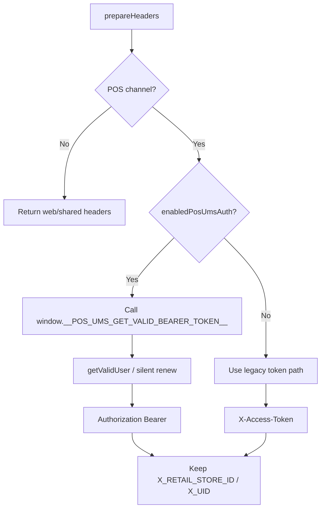
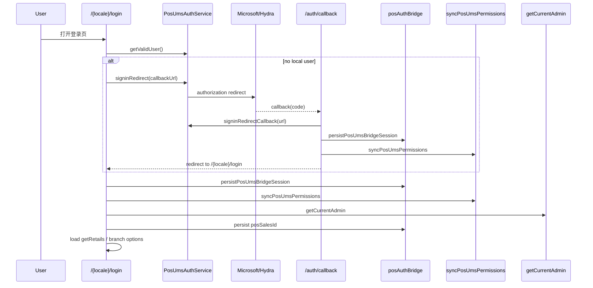
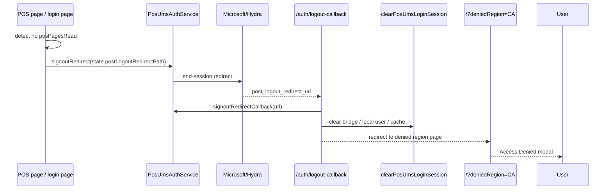
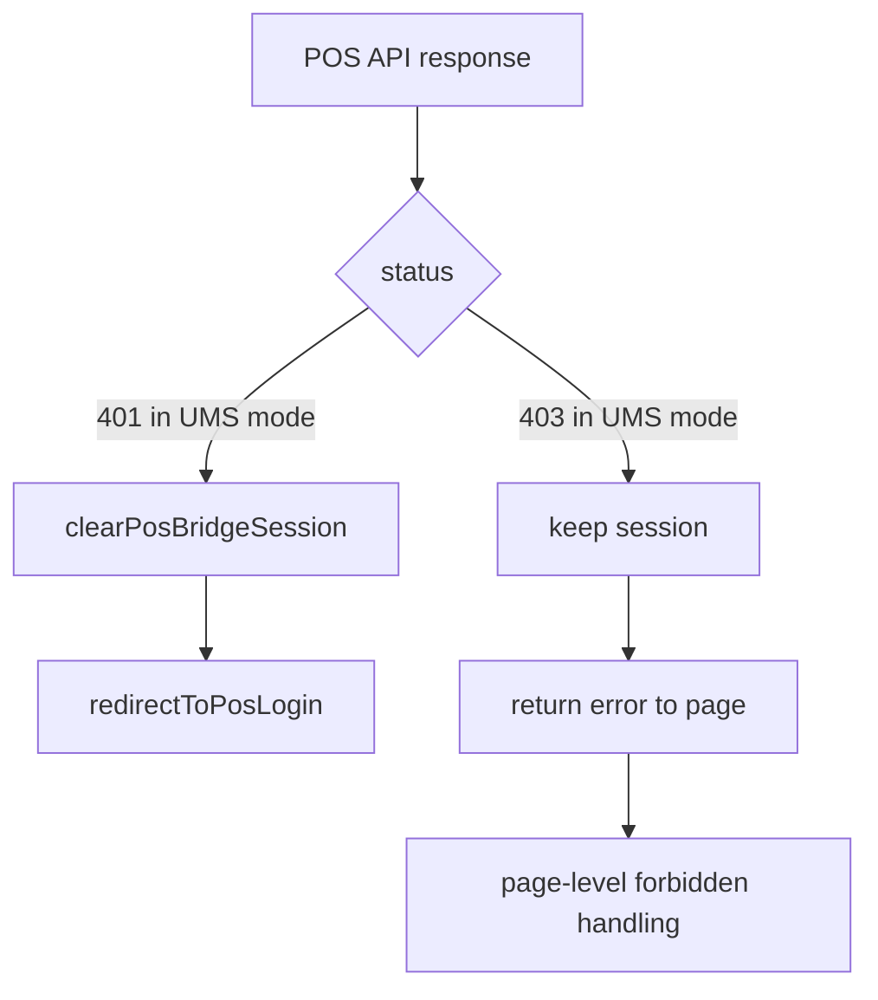

# POS Auth Bridge 兼容方案设计

## 1. 文档范围

本文描述 POS 如何接入 UMS OIDC 登录，并将 OIDC 会话桥接为现有 POS 业务链路可消费的最小状态。

本文只描述当前代码中的真实实现，不描述未来目标态。

## 2. 目标与边界

### 2.1 目标

- 在 CA 市场先启用 UMS 登录，其他市场保持 legacy 行为。
- 保留现有 POS 业务初始化链路：
  - `getCurrentAdmin`
  - `retailId`
  - `posSalesId`
  - `getRetails`
- 保留现有 middleware、RTK Query、业务请求头体系。
- 通过 bridge 层把 OIDC 会话翻译成 POS 当前可消费的登录态。

### 2.2 非目标

- 不重写 POS 业务初始化协议。
- 不让业务代码直接感知 OIDC SDK 细节。
- 不在第一阶段引入独立的新用户状态模型替代 `retailId / posSalesId`。

## 3. 兼容矩阵

| 场景   | 登录入口                    | 认证头                  | 会话刷新                        | 业务初始化                      |
| ------ | --------------------------- | ----------------------- | ------------------------------- | ------------------------------- |
| Legacy | 用户名密码                  | `X-Access-Token`        | `/oauth/token`                  | `getCurrentAdmin -> posSalesId` |
| UMS    | `signinRedirect / callback` | `Authorization: Bearer` | `getValidUser()` + silent renew | `getCurrentAdmin -> posSalesId` |

当前 feature 开关按市场控制：

- CA: `enabledPosUmsAuth = true`
- SG / AU / US / UK: `enabledPosUmsAuth = false`

## 4. 核心设计

### 4.1 Bridge 的职责

UMS 登录成功后，bridge 只输出 POS 当前真正需要消费的最小状态：

- `accessToken`
- `isLoggedIn`
- `retailId`
- `posSalesId`

其中：

- `accessToken` 复用旧持久化槽位
- `isLoggedIn` 继续作为 middleware 的轻量门闩
- `retailId / posSalesId` 继续服务旧业务链路

### 4.2 当前实现中的关键模块

| 模块                                                                                                                                                                                    | 责任                                                    |
| --------------------------------------------------------------------------------------------------------------------------------------------------------------------------------------- | ------------------------------------------------------- |
| [`posAuthBridge.ts`](/Users/colorli/castlery/mergeProject/joyboy/libs/shared/persistence-kit/src/lib/posAuthBridge.ts)                                                                  | bridge 状态写入/清理、POS auth route 判定               |
| [`ums-auth.service.ts`](/Users/colorli/castlery/mergeProject/joyboy/libs/modules/user/services/src/lib/ums-auth/ums-auth.service.ts)                                                    | OIDC user 管理、`getValidUser`、signin/signout callback |
| [`shared-prepare-headers.ts`](/Users/colorli/castlery/mergeProject/joyboy/libs/shared/redux/services/src/shared-prepare-headers.ts)                                                     | 请求头注入策略                                          |
| [`shared-base-query-with-re-auth.ts`](/Users/colorli/castlery/mergeProject/joyboy/libs/shared/redux/services/src/shared-base-query-with-re-auth.ts)                                     | UMS 401/403 行为收口                                    |
| [`auth/callback/page.tsx`](/Users/colorli/castlery/mergeProject/joyboy/apps/pos/app/[locale]/auth/callback/page.tsx)                                                                    | OIDC 登录回调                                           |
| [`auth/logout-callback/page.tsx`](/Users/colorli/castlery/mergeProject/joyboy/apps/pos/app/[locale]/auth/logout-callback/page.tsx)                                                      | OIDC 登出回调                                           |
| [`pos-ums-select-branch-content.tsx`](/Users/colorli/castlery/mergeProject/joyboy/libs/modules/user/components/src/lib/pos-ums-select-branch-content/pos-ums-select-branch-content.tsx) | CA 市场登录页编排器                                     |

## 5. Bridge 状态模型

### 5.1 持久化字段

| 字段           | 含义                        | UMS 模式写法                  |
| -------------- | --------------------------- | ----------------------------- |
| `accessToken`  | 业务侧复用的 token 槽位     | `Bearer <ums_access_token>`   |
| `refreshToken` | legacy refresh token 槽位   | 清空，不复用                  |
| `isLoggedIn`   | middleware / 客户端快速门闩 | `1`                           |
| `retailId`     | branch 上下文               | 保留旧语义                    |
| `posSalesId`   | 销售身份                    | 仍由 `getCurrentAdmin` 初始化 |

### 5.2 为什么复用 `accessToken`

当前代码选择复用旧字段而不是新建一套 token 存储，原因是：

- middleware 已依赖 `isLoggedIn`
- 请求层已依赖 `accessToken`
- 业务层不需要知道 token 的真实来源

因此 bridge 的目标不是建立“新登录模型”，而是把 UMS 登录结果折叠进现有 POS 消费面。

## 6. 请求层行为

### 6.1 Header 注入策略

请求层在 POS 场景下同时保留 legacy 业务头，并在 UMS 模式下注入标准 Bearer Token。

当前实现见 [`shared-prepare-headers.ts`](/Users/colorli/castlery/mergeProject/joyboy/libs/shared/redux/services/src/shared-prepare-headers.ts)。



### 6.2 当前实现细节

UMS 模式下：

- 请求层优先通过 `window.__POS_UMS_GET_VALID_BEARER_TOKEN__` 获取“当前有效 bearer token”
- 该 getter 内部走 `PosUmsAuthService.getValidUser()`，必要时触发 silent renew
- 该 getter 当前有超时保护，避免运行时 token 获取挂起后阻塞整个请求链路
- 获取到有效 user 后，会同步 bridge token，避免业务侧继续发历史 token

这意味着：

- 业务请求头层不直接依赖 OIDC SDK
- OIDC 生命周期仍由 `PosUmsAuthService` 统一管理

## 7. 登录链路

### 7.1 登录主流程



### 7.2 callback 页职责

[`auth/callback/page.tsx`](/Users/colorli/castlery/mergeProject/joyboy/apps/pos/app/[locale]/auth/callback/page.tsx) 当前承担：

1. 处理 `code -> token`
2. 写 bridge 状态
3. 同步 UMS 权限
4. 根据是否已有 `retailId` 决定回 `/{locale}/login` 还是业务页

当前实现中，callback 页**不直接判断 `posPagesRead`**。  
市场页面访问权限由：

- `PosUmsSelectBranchContent` 在登录页判断
- `PosUmsPermissionBootstrap` 在业务页刷新时判断

## 8. 分支选择与业务初始化

`PosUmsSelectBranchContent` 是 CA UMS 登录页的业务编排器，而不是单纯登录按钮。

它当前负责：

1. 恢复 OIDC user
2. 对齐 bridge 状态
3. 同步市场权限
4. 调 `getCurrentAdmin`
5. 持久化 `posSalesId`
6. 加载 `getRetails`
7. 自动继续 remembered branch 或等待用户选择 store

### 8.1 分支选择交互

```mermaid
flowchart TD
  A[login page ready] --> B{has posPagesRead?}
  B -->|No| C[trigger OIDC signout]
  C --> D[/auth/logout-callback]
  D --> E[/?deniedRegion=locale]
  B -->|Yes| F[render store button list]
  F --> G{click store}
  G --> H[initializePosSessionByRetail]
  H --> I[getCurrentAdmin]
  I --> J[persist posSalesId]
  J --> K[enter callbackUrl or /discover]
```

## 9. 登出与权限回收

### 9.1 为什么“仅本地清理”不够

当前 UMS 登录背后同时存在两层会话：

1. **应用侧会话**
   - bridge token
   - `isLoggedIn`
   - 本地 OIDC user
2. **IdP 会话**
   - Microsoft / Hydra 侧 cookie
   - 浏览器下一次 redirect 到 IdP 时的 SSO 状态

如果只做 `removeUser()` 和本地存储清理，IdP 会话仍然存在。  
再次进入 `/{locale}/login` 时，`signinRedirect()` 仍会无感拿到新的 authorization code，形成“看似没重新登录、实际再次走了 callback”的循环。

### 9.2 当前实现的处理方式

权限被回收时，当前实现改为：

1. 发起 `signoutRedirect()`
2. 由 IdP 清 end-session
3. 回到 `/auth/logout-callback`
4. 清本地 bridge 与 OIDC user
5. 跳回国家页并展示 denied modal

### 9.3 权限回收时序



## 10. 401 / 403 策略

当前逻辑在 [`shared-base-query-with-re-auth.ts`](/Users/colorli/castlery/mergeProject/joyboy/libs/shared/redux/services/src/shared-base-query-with-re-auth.ts)。

### 10.1 401

UMS 模式下的 `401` 视为认证失效：

- 清 bridge session
- 跳回 `/{locale}/login`

当前请求层同时兼容两类 401：

- 正常 JSON 响应：`status === 401`
- 非 JSON 响应被 RTK Query 包装为：`status === 'PARSING_ERROR' && originalStatus === 401`

### 10.2 403

UMS 模式下的普通业务接口 `403` 不直接清会话。当前策略是：

- base query 保留会话
- 把错误返回业务层
- 页面由 guard / 业务逻辑自行展示 forbidden

注意：**当前市场访问权限回收不依赖随机业务接口 403。**  
它依赖的是 `/api/v1/user/info` 同步后的 `posPagesRead` 结果，并通过登录页或 layout bootstrap 触发 signout。



## 11. 兼容性说明

### 11.1 对 legacy 的兼容

- 非 CA 市场仍走旧登录页逻辑
- 未启用 `enabledPosUmsAuth` 时，不进入 UMS 登录或权限流程

### 11.2 对 POS 业务链路的兼容

- `getCurrentAdmin` 仍是销售身份来源
- `posSalesId` 仍由 `getCurrentAdmin` 初始化
- `retailId` 仍是 branch 上下文
- `getRetails` 仍是 branch 数据来源
- `X_SALES_ID / X_RETAIL_STORE_ID / X_UID` 等业务头保持不变
