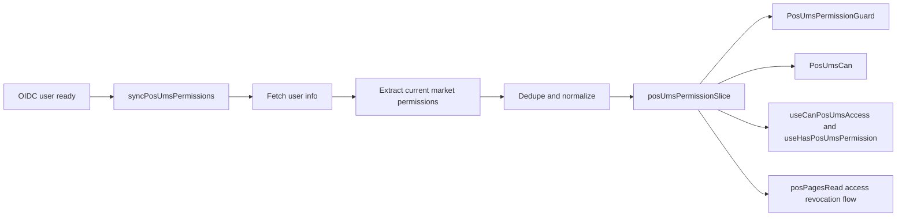
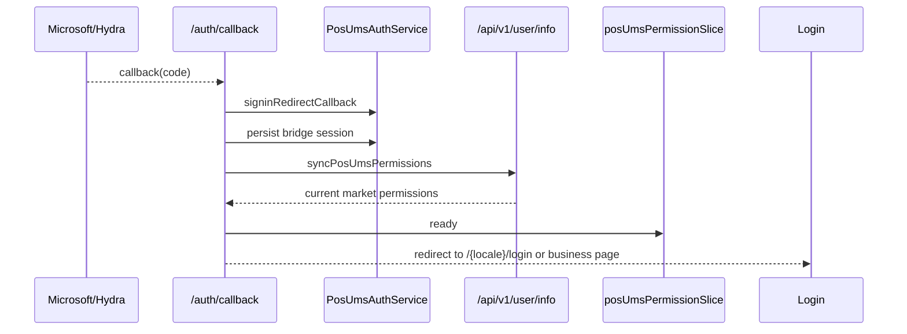
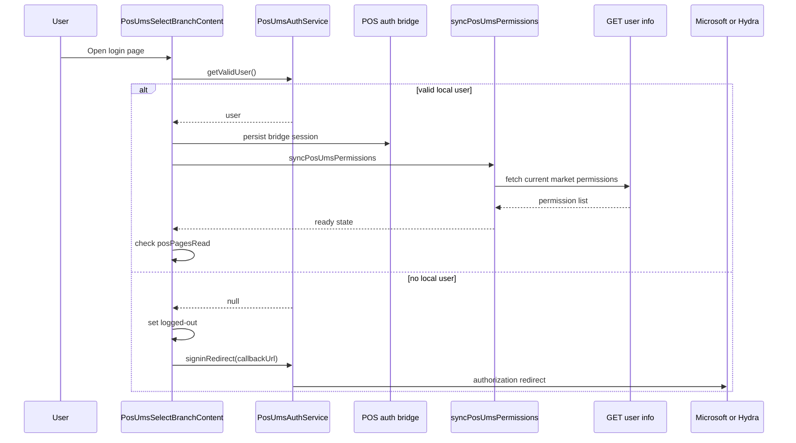
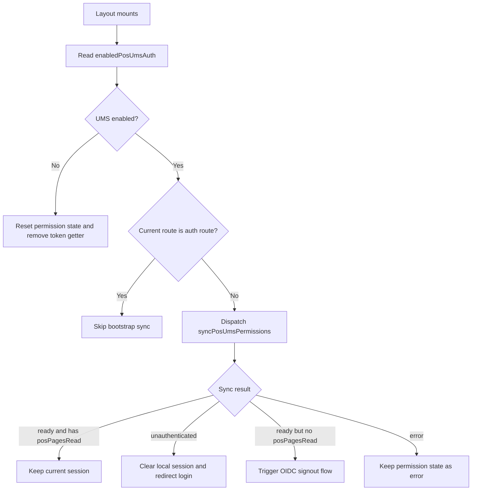
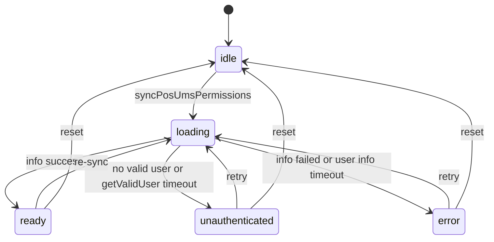
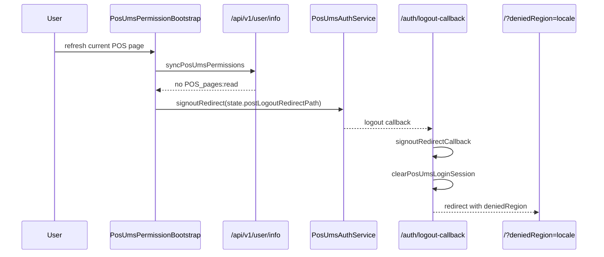

# POS UMS 市场权限设计

## 1. 文档范围

本文描述 POS 当前基于 UMS `/api/v1/user/info` 的市场权限实现，只覆盖已经落地的逻辑。

当前实现只消费：

```json
data.country_codes_permissions
```

并且只读取“当前市场”的权限集合。

## 2. 核心目标

- 只维护当前市场的最小权限快照
- 不持久化整份 UMS 用户信息
- 与现有 POS 登录和业务初始化链路兼容
- 支持页面级、组件级、hook 级消费
- 在页面访问权限被回收时，清空当前 UMS 登录态并回到国家选择页

## 3. 非目标

- 不消费顶层 `permissions`
- 不消费 `roles`
- 不消费 `applications`
- 不做通配符或层级推导
- 不把整份 `/user/info` 写进 Redux / localStorage

## 4. 数据来源与提取规则

### 4.1 来源

权限来源是：

- UMS `/api/v1/user/info`

当前实现入口主要有三处：

1. [`auth/callback/page.tsx`](/Users/colorli/castlery/mergeProject/joyboy/apps/pos/app/[locale]/auth/callback/page.tsx)
2. [`pos-ums-select-branch-content.tsx`](/Users/colorli/castlery/mergeProject/joyboy/libs/modules/user/components/src/lib/pos-ums-select-branch-content/pos-ums-select-branch-content.tsx)
3. [`permission-bootstrap.tsx`](/Users/colorli/castlery/mergeProject/joyboy/libs/modules/user/components/src/lib/pos-ums-permission/permission-bootstrap.tsx)

### 4.2 提取规则

当前实现只读取：

- `data.country_codes_permissions[CURRENT_MARKET]`

例如：

```json
{
  "data": {
    "permissions": ["ignored:permission"],
    "country_codes_permissions": {
      "CA": ["POS_pages:read", "sms:product_review:edit"],
      "US": ["sms:product_review:export"]
    }
  }
}
```

在 CA 市场，最终快照只会保留：

```json
{
  "market": "CA",
  "permissions": ["POS_pages:read", "sms:product_review:edit"]
}
```

## 5. 权限状态模型

当前 Redux 状态只保留最小必要字段：

```ts
type PosUmsPermissionStatus = 'idle' | 'loading' | 'ready' | 'unauthenticated' | 'error';

type PosUmsPermissionState = {
  status: PosUmsPermissionStatus;
  market: 'SG' | 'US' | 'AU' | 'CA' | 'UK' | null;
  permissions: string[];
  loadedAt?: number;
  error?: string;
};
```

状态位含义：

| 字段          | 含义                 |
| ------------- | -------------------- |
| `status`      | 权限快照生命周期     |
| `market`      | 当前 POS 市场        |
| `permissions` | 当前市场权限集合     |
| `loadedAt`    | 最近一次成功同步时间 |
| `error`       | 同步失败信息         |

## 6. 市场来源

权限市场只来自当前 POS locale，不与 `retailId` 绑定。

原因：

- POS 按市场部署
- `retailId` 是 branch/store 维度
- 市场访问权限与门店上下文不是同一层语义

当前实际来源：

1. `params.locale`
2. 转大写，例如 `ca -> CA`
3. 命中 `SG / US / AU / CA / UK`

## 7. 系统结构



## 8. 模块划分

### 8.1 Domain

- [`pos-ums-permission.pos.slice.ts`](/Users/colorli/castlery/mergeProject/joyboy/libs/modules/user/domain/src/slice/pos-ums-permission.pos.slice.ts)

职责：

- 持有当前市场权限状态
- 暴露 selector
- 接收 `syncPosUmsPermissions` 生命周期结果

### 8.2 Services

- [`pos-ums-permission.constant.ts`](/Users/colorli/castlery/mergeProject/joyboy/libs/modules/user/services/src/lib/ums-permission/pos-ums-permission.constant.ts)
- [`pos-ums-permission.helper.ts`](/Users/colorli/castlery/mergeProject/joyboy/libs/modules/user/services/src/lib/ums-permission/pos-ums-permission.helper.ts)
- [`pos-ums-permission.service.ts`](/Users/colorli/castlery/mergeProject/joyboy/libs/modules/user/services/src/lib/ums-permission/pos-ums-permission.service.ts)

职责：

- 定义权限常量
- 解析当前市场权限
- 提供 `can / has / anyOf / allOf`
- 提供 `syncPosUmsPermissions`
- 为 `getValidUser()` 和 `/user/info` 增加超时收敛，避免权限状态永久停在 loading

### 8.3 Components / Hooks

当前权限 UI 能力已经拆分为两层：

1. 登录流专属组件

   - [`PosUmsPermissionBootstrap`](/Users/colorli/castlery/mergeProject/joyboy/libs/modules/user/components/src/lib/pos-ums-permission/permission-bootstrap.tsx)

2. 业务消费入口
   - `@castlery/shared-components/pos-ums-permission`

当前业务消费入口包括：

- `useHasPosUmsPermission`
- `useCanPosUmsAccess`
- `PosUmsCan`
- `PosUmsPermissionGuard`

之所以单独走子路径而不是 shared-components 根 barrel，是为了避免 root barrel 循环初始化导致的运行时导出问题。

## 9. 权限同步入口

### 9.1 callback 页

登录成功后，callback 页会先同步权限，再决定下一跳。



说明：

- callback 页当前只负责同步权限，不负责判断 `posPagesRead`
- `posPagesRead` 的页面访问校验放在登录页和 layout bootstrap

### 9.2 登录页

[`PosUmsSelectBranchContent`](/Users/colorli/castlery/mergeProject/joyboy/libs/modules/user/components/src/lib/pos-ums-select-branch-content/pos-ums-select-branch-content.tsx) 当前在以下时机同步权限：

1. 恢复到有效 OIDC user 后
2. 与 bridge token 对齐后
3. 在 branch/store 展示前

如果当前市场没有 [`POS_UMS_PERMISSIONS.posPagesRead`](/Users/colorli/castlery/mergeProject/joyboy/libs/modules/user/services/src/lib/ums-permission/pos-ums-permission.constant.ts)，则不会继续进入 store 选择，而是触发 OIDC signout 并回国家页。



### 9.3 layout bootstrap

[`PosUmsPermissionBootstrap`](/Users/colorli/castlery/mergeProject/joyboy/libs/modules/user/components/src/lib/pos-ums-permission/permission-bootstrap.tsx) 挂在 [`apps/pos/app/[locale]/layout.tsx`](/Users/colorli/castlery/mergeProject/joyboy/apps/pos/app/[locale]/layout.tsx)。

它的职责是：

1. 在业务页刷新时兜底同步权限
2. 在 feature 关闭时清空权限态
3. 向请求头层注册 `window.__POS_UMS_GET_VALID_BEARER_TOKEN__`
4. 在会话失效时清理本地 UMS 会话并回登录页
5. 在业务页刷新后发现 `posPagesRead` 被回收时，触发 OIDC signout



## 10. 权限状态机



## 11. 页面访问权限：`posPagesRead`

`POS_UMS_PERMISSIONS.posPagesRead` 是当前实现里的页面访问基础权限点。

使用位置包括：

- [`discover/layout.tsx`](/Users/colorli/castlery/mergeProject/joyboy/apps/pos/app/[locale]/discover/layout.tsx)
- [`checkout/layout.tsx`](/Users/colorli/castlery/mergeProject/joyboy/apps/pos/app/[locale]/checkout/layout.tsx)
- [`sale-history/layout.tsx`](/Users/colorli/castlery/mergeProject/joyboy/apps/pos/app/[locale]/sale-history/layout.tsx)
- [`products/[slug]/layout.tsx`](/Users/colorli/castlery/mergeProject/joyboy/apps/pos/app/[locale]/products/[slug]/layout.tsx)

### 11.1 登录后在 store 选择页被拒绝

```mermaid
flowchart TD
  A[login page init] --> B[syncPosUmsPermissions]
  B --> C{has posPagesRead?}
  C -->|Yes| D[show store list]
  C -->|No| E[dispatch resetPosUmsPermission]
  E --> F[signoutRedirect]
  F --> G[/auth/logout-callback]
  G --> H[clearPosUmsLoginSession]
  H --> I[/?deniedRegion=locale]
  I --> J[show Access Denied modal]
```

### 11.2 浏览业务页后刷新，被回收权限



## 12. 为什么权限回收要走 signoutRedirect

这个点是当前实现中的重要细节。

如果只清：

- bridge token
- Redux 权限态
- 本地 OIDC user

仍然可能保留上游 IdP 会话。  
再次进入 `/{locale}/login` 时，`signinRedirect()` 可能会直接拿到新的 authorization code，导致用户看起来“没有重新登录，却又回到了 callback”。

因此当前实现采用：

- `signoutRedirect()` 清上游 IdP 会话
- `/auth/logout-callback` 清本地会话
- 再跳回国家页

## 13. 401 / 403 策略

### 13.1 401

在 UMS 模式下，`401` 视为认证失效：

- 清 bridge session
- 回登录页

当前请求层同时兼容两类 401：

- 正常 JSON 响应：`status === 401`
- 非 JSON 响应被 RTK Query 包装为：`status === 'PARSING_ERROR' && originalStatus === 401`

这是请求层行为，不走权限回收 signout 流。

### 13.2 403

在 UMS 模式下，普通业务接口 `403` 当前不直接清会话：

- 保留当前会话
- 由页面/业务逻辑展示 forbidden

当前代码里真正触发“权限回收 -> 强制退出”的入口，不是随机业务接口 403，而是：

- 登录页同步 `/user/info` 后发现 `posPagesRead` 缺失
- layout bootstrap 同步 `/user/info` 后发现 `posPagesRead` 缺失

## 14. 业务消费方式

### 14.1 页面级

```tsx
import { POS_UMS_PERMISSIONS } from '@castlery/modules-user-services';
import { PosUmsPermissionGuard } from '@castlery/shared-components/pos-ums-permission';

<PosUmsPermissionGuard
  requirement={POS_UMS_PERMISSIONS.posPagesRead}
  loadingFallback={<PermissionLoading />}
  fallback={<PermissionDeny />}
>
  <PageContent />
</PosUmsPermissionGuard>;
```

适用场景：

- 整页
- layout 级入口
- tab 内容区

### 14.2 组件级

```tsx
import { PosUmsCan } from '@castlery/shared-components/pos-ums-permission';

<PosUmsCan requirement="sms:product_review:export">
  <ExportButton />
</PosUmsCan>;
```

适用场景：

- 无权限直接不展示
- 用 fallback 替换整个组件

### 14.3 Hook 级

```tsx
import { Button, Tooltip } from '@castlery/fortress';
import { POS_UMS_PERMISSIONS } from '@castlery/modules-user-services';
import { useCanPosUmsAccess } from '@castlery/shared-components/pos-ums-permission';

function ReplyButton() {
  const canReply = useCanPosUmsAccess(POS_UMS_PERMISSIONS.productReviewCommentReply);

  return (
    <Tooltip title={canReply ? '' : 'You do not have permission to reply'}>
      <span>
        <Button disabled={!canReply}>Reply</Button>
      </span>
    </Tooltip>
  );
}
```

适用场景：

- 按钮禁用态
- tooltip 文案差异
- 保留组件结构但改变交互能力

### 14.4 `useHasPosUmsPermission` vs `useCanPosUmsAccess`

| Hook                                 | 适用场景                                 |
| ------------------------------------ | ---------------------------------------- |
| `useHasPosUmsPermission(permission)` | 单权限点判断                             |
| `useCanPosUmsAccess(requirement)`    | 规则判断，支持单权限 / `anyOf` / `allOf` |

## 15. 市场开关策略

当前实现先判断市场是否启用 UMS：

- `sharedFeatureService.enabledPosUmsAuth === false`
  - 权限 hook 直接返回 `true`
  - `PosUmsCan / PosUmsPermissionGuard` 直接放行
  - `PosUmsPermissionBootstrap` 不同步权限

这保证了：

- CA 可先上线 UMS
- 其他市场继续完全走旧逻辑

## 16. 风险与边界

### 16.1 当前已解决

- 刷新业务页后丢失权限快照
- `getValidUser()` 或 `/user/info` 挂起导致的权限 bootstrap 无限 loading
- silent renew 后业务侧继续带旧 token
- 无页面访问权限时只清本地态导致的自动 callback 循环
- shared-components 根 barrel 暴露权限 hook 的运行时导出问题

### 16.2 当前未解决

- 更细粒度的用户业务权限错误可观测性
- 服务端预取权限
- 多标签页跨会话同步
- 所有业务 `403` 都统一映射为权限系统事件

## 17. 总结

当前 POS UMS 权限系统的本质是：

- 只维护当前市场权限快照
- 只使用 `country_codes_permissions[currentMarket]`
- 用登录页和 layout bootstrap 承担两次关键同步
- 用 `posPagesRead` 作为页面访问基础权限点
- 用 `signoutRedirect -> logout-callback` 收口“权限被回收”这一类强制退出场景

这样既保留了现有 POS 业务初始化链路，也让 CA 市场可以先以最小侵入方式接入 UMS 市场权限。
