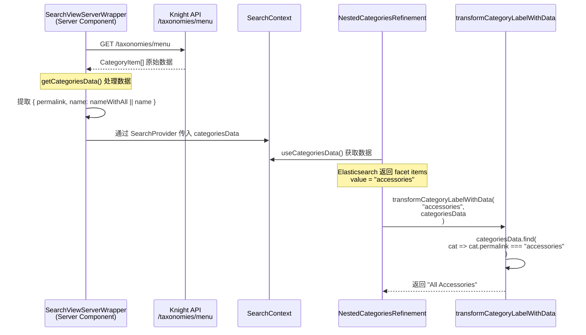

# PLP 分类筛选器 Label 展示逻辑 PRD

## 1. 功能概述

PLP（Product Listing Page）页面的分类筛选器中，分类标签（如 "All Accessories"、"Throws & Blankets"）的展示需要从 **Knight 后端 API** 获取人类可读的名称，而非直接使用 Elasticsearch 返回的 permalink/slug。

### 1.1 目标

- 展示用户友好的分类名称
- 支持 "All XXX" 格式的一级分类显示
- 保持与导航菜单的名称一致性

### 1.2 涉及页面

- Category PLP 页面（如 `/sofas`、`/accessories`）
- 所有带有分类筛选器的搜索结果页

---

## 2. 数据来源

### 2.1 后端 API 接口

| 项目         | 说明                                              |
| ------------ | ------------------------------------------------- |
| **接口地址** | `${NEXT_PUBLIC_API_HOST}/taxonomies/menu`         |
| **提供方**   | Knight 后端 API                                   |
| **缓存策略** | `revalidate: 3600`（1 小时）                      |
| **调用位置** | `libs/modules/cms/domain/src/lib/api/menu.api.ts` |

### 2.2 返回数据结构

```typescript
interface CategoryItem {
  permalink: string; // URL 路径标识，如 "accessories"、"sofas/leather-sofas"
  name: string; // 原始分类名称，如 "Accessories"
  nameWithAll?: string; // 带 "All" 前缀的名称，如 "All Accessories"
  url?: string; // 分类页面 URL
  children?: CategoryItem[];
}
```

### 2.3 关键字段说明

| 字段          | 用途                                      | 示例                                 |
| ------------- | ----------------------------------------- | ------------------------------------ |
| `permalink`   | 与 Elasticsearch facet value 匹配的标识符 | `accessories`, `sofas/leather-sofas` |
| `nameWithAll` | 一级分类的显示名称（优先使用）            | `All Accessories`                    |
| `name`        | 子分类的显示名称                          | `Leather Sofas`                      |

---

## 3. 数据处理流程

### 3.1 流程图



### 3.2 处理步骤

1. **服务端获取数据**：`SearchViewServerWrapper` 调用 `getCategoriesData()`
2. **数据扁平化**：`fetchFlatCategories()` 将嵌套的分类树扁平化
3. **字段提取**：提取 `permalink` 和 `name`（优先 `nameWithAll`）
4. **Context 传递**：通过 `SearchProvider` 将 `categoriesData` 传递给客户端组件
5. **Label 转换**：`transformCategoryLabelWithData()` 根据 Elasticsearch 的 facet value 匹配并返回显示名称

---

## 4. 核心代码位置

### 4.1 数据获取

**文件**：`libs/modules/search/components/src/lib/search-view/search-view-server-wrapper.tsx`

```typescript
// 第 165-181 行
async function getCategoriesData() {
  try {
    const categories = await fetchFlatCategories();
    return (
      categories?.map((category) => ({
        permalink: category.permalink,
        name: category.nameWithAll || category.name, // 优先使用 nameWithAll
      })) || []
    );
  } catch (error) {
    logger.error('Failed to fetch categories data', { error });
    return [];
  }
}
```

### 4.2 nameWithAll 自动生成

**文件**：`libs/modules/cms/domain/src/lib/api/menu.api.ts`

```typescript
// 第 74-86 行 - addAllCategory 函数
if (!hasAllItem) {
  const allCategoryName = `All ${name}`;

  item?.children?.unshift({
    ...item,
    name,
    nameWithAll: allCategoryName, // 自动生成 "All XXX"
    children: [],
  });
  item.nameWithAll = allCategoryName;
}
```

### 4.3 Label 转换函数

**文件**：`libs/modules/search/components/src/lib/config/facet-display.config.ts`

```typescript
// 第 368-385 行
export const transformCategoryLabelWithData = (
  categoryValue: string,
  categoriesData?: { permalink: string; name: string }[],
  isGroupHeader = false
): string => {
  // 优先从 categoriesData 中查找
  if (categoriesData && categoriesData.length > 0) {
    const categoryData = categoriesData.find((cat) => {
      return cat.permalink === categoryValue;
    });
    if (categoryData) {
      return categoryData.name;
    }
  }

  // 兜底：使用 slug 转换逻辑
  return transformCategoryLabel(categoryValue, isGroupHeader);
};
```

### 4.4 兜底转换逻辑

**文件**：`libs/modules/search/components/src/lib/config/facet-display.config.ts`

```typescript
// 第 352-362 行
export const transformCategoryLabel = (categoryValue: string, isGroupHeader = false): string => {
  const parts = categoryValue.split('/');

  if (parts.length === 1) {
    // 一级分类：首字母大写 + "All" 前缀
    const category = categoryValue.charAt(0).toUpperCase() + categoryValue.slice(1).toLowerCase();
    return isGroupHeader ? category : `All ${category}`;
  } else {
    // 子分类：slug 转人类可读名称
    const subCategory = parts[parts.length - 1];
    return slugToName(subCategory);
  }
};
```

### 4.5 Context 传递

**文件**：`libs/modules/search/components/src/lib/config/search-context.tsx`

```tsx
// SearchProvider 组件传入 categoriesData
<SearchProvider categoriesData={categoriesData}>{children}</SearchProvider>;

// 组件中通过 hook 获取
const categoriesData = useCategoriesData();
```

---

## 5. 使用场景

### 5.1 筛选器中的分类 Label

**组件**：`NestedCategoriesRefinement`

**文件**：`libs/modules/search/components/src/lib/instantsearch/nested-categories-refinement.tsx`

```typescript
// 第 188-208 行 - transformItems 回调
const transformItems = useCallback(
  (items) => {
    return items.map((item) => ({
      ...item,
      label: transformCategoryLabelWithData(item.value, categoriesData),
    }));
  },
  [categoriesData]
);
```

### 5.2 当前筛选条件展示

**组件**：`CustomCurrentRefinements`

同样使用 `transformCategoryLabelWithData` 来展示用户已选择的分类筛选条件。

---

## 6. 特殊处理

### 6.1 特定分类的自定义名称

```typescript
// menu.api.ts 第 65-69 行
if (item.permalink === 'chairs') {
  name = 'Chairs & Benches'; // 特殊处理
} else if (item.permalink === 'beds') {
  name = 'Bedroom'; // 特殊处理
}
```

### 6.2 过滤 "all-" 开头的子分类

```typescript
// nested-categories-refinement.tsx 第 115-123 行
.filter((permalink) => {
  const parts = permalink.split('/');
  if (parts.length >= 2 && parts[1].startsWith('all-')) {
    return false; // 过滤掉 all-sofas 等冗余项
  }
  return true;
})
```

---

## 7. 错误处理

| 场景                            | 处理方式                                        |
| ------------------------------- | ----------------------------------------------- |
| 后端 API 调用失败               | 返回空数组，使用兜底的 `transformCategoryLabel` |
| `categoriesData` 中找不到匹配项 | 使用 `slugToName()` 转换 permalink              |
| `nameWithAll` 字段为空          | 使用 `name` 字段                                |

---

## 8. 相关文件索引

| 文件路径                                                                                | 职责                                          |
| --------------------------------------------------------------------------------------- | --------------------------------------------- |
| `libs/modules/cms/domain/src/lib/api/menu.api.ts`                                       | Knight API 调用、数据扁平化、nameWithAll 生成 |
| `libs/modules/search/components/src/lib/search-view/search-view-server-wrapper.tsx`     | 服务端数据获取、categoriesData 构建           |
| `libs/modules/search/components/src/lib/config/search-context.tsx`                      | Context Provider、useCategoriesData hook      |
| `libs/modules/search/components/src/lib/config/facet-display.config.ts`                 | Label 转换函数                                |
| `libs/modules/search/components/src/lib/instantsearch/nested-categories-refinement.tsx` | 分类筛选器组件                                |
| `libs/modules/search/components/src/lib/instantsearch/filter-list.tsx`                  | 筛选列表展示组件                              |

---

## 9. 版本历史

| 日期       | 版本 | 变更说明     |
| ---------- | ---- | ------------ |
| 2026-01-09 | 1.0  | 初始文档创建 |
