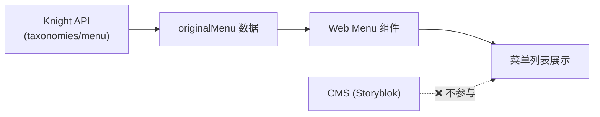
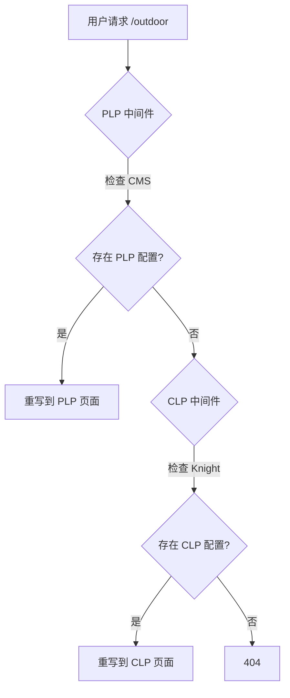
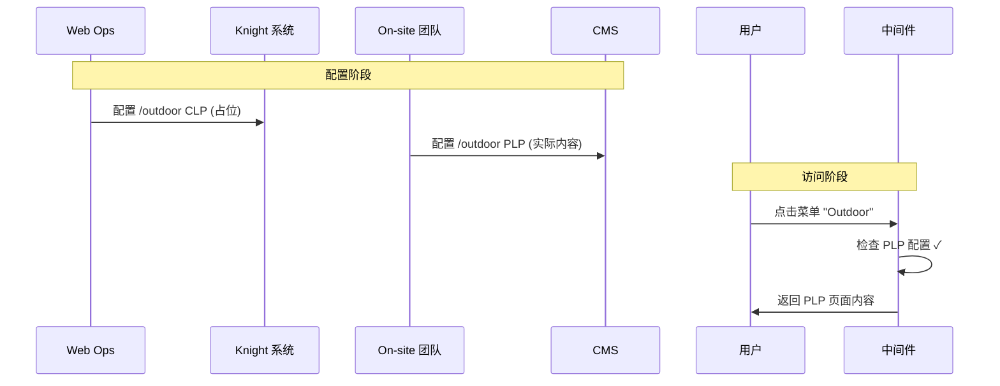
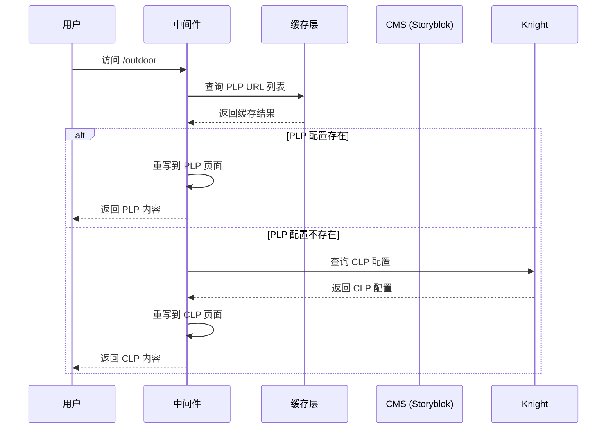
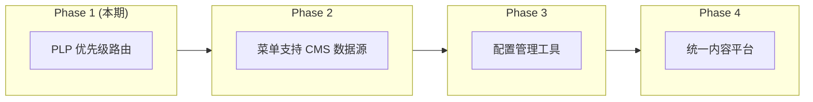
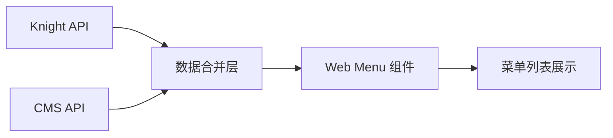

# PRD: PLP 优先级高于 CLP 路由策略

## 1 背景与问题

### 1.1 系统角色

| 系统            | 管理团队 | 职责                         | 产出                       |
| --------------- | -------- | ---------------------------- | -------------------------- |
| Knight          | Web Ops  | 电商后台，管理分类和产品数据 | CLP 页面、菜单数据         |
| CMS (Storyblok) | On-site  | 内容管理，配置营销页面       | PLP 页面、Banner、促销内容 |

### 1.2 页面类型

- **CLP (Category Landing Page)**: 分类着陆页，Knight 配置的固定分类，如 `/sofas`、`/outdoor`
- **PLP (Product Listing Page)**: 产品列表页，CMS 配置的自定义营销页面，如新品页、促销页

### 1.3 当前架构

#### 菜单数据流



**问题**: 菜单组件只读取 Knight 数据，无法展示 CMS 配置的 PLP 页面。

#### 中间件路由流程



### 1.4 业务痛点

```mermaid
flowchart TB
    subgraph 现状问题
        A[菜单只能展示 Knight 的 CLP] --> B[无法直接展示 CMS 的 PLP]
        B --> C[运营需要两个系统配合]
    end

    subgraph 当前 Workaround
        D[1. Knight 配置 /outdoor 占位] --> E[2. CMS 配置 /outdoor PLP]
        E --> F[3. 中间件 PLP 优先]
        F --> G[用户点击进入 PLP]
    end

    现状问题 --> 当前 Workaround
```

### 1.5 典型场景



**期望**: 用户点击 Menu 中的 "Outdoor" 后，进入 CMS 配置的 PLP 页面，而非 Knight 的 CLP 页面。

## 2 目标

### 2.1 短期目标（本期）

1. **明确路由优先级规则**: 当同一 URL 同时存在 PLP 和 CLP 配置时，优先展示 PLP 页面
2. **保持向后兼容**: 不影响现有仅配置 CLP 或仅配置 PLP 的页面
3. **支持现有 Workaround**: 正式支持"Knight 占位 + CMS 内容"的配置模式

### 2.2 长期目标（未来规划）

1. **菜单数据源统一**: 让菜单组件支持同时读取 Knight 和 CMS 的数据，无需 Knight 占位
2. **配置可视化**: 提供配置冲突检测工具，避免 PLP/CLP 配置混乱
3. **运营自助化**: 业务可以在单一系统完成菜单配置和页面内容配置

## 3 产品方案

### 3.1 路由优先级规则

| 配置情况            | 展示结果     | 说明              |
| ------------------- | ------------ | ----------------- |
| 仅配置 CLP          | 展示 CLP     | ✅ 保持现有行为   |
| 仅配置 PLP          | 展示 PLP     | ✅ 保持现有行为   |
| 同时配置 PLP 和 CLP | **展示 PLP** | ⭐ PLP 优先级更高 |
| 均未配置            | 404          | ✅ 保持现有行为   |

### 3.2 数据流（修改后）



## 4 验收标准

### 4.1 功能验收

- [ ] 当 URL 仅在 CMS 中配置 PLP 时，正确展示 PLP 页面
- [ ] 当 URL 仅在 Knight 中配置 CLP 时，正确展示 CLP 页面
- [ ] 当 URL 同时配置 PLP 和 CLP 时，优先展示 PLP 页面
- [ ] PLP 页面正确加载 CMS 配置的 Banner、筛选逻辑、SEO 信息

### 4.2 性能验收

- [ ] 页面首屏加载时间增量 < 50ms
- [ ] 缓存命中率 > 95%

### 4.3 监控指标

- PLP/CLP 路由命中率
- 缓存命中率
- 中间件处理耗时

## 5 未来规划

### 5.1 演进路线图



### 5.2 Phase 2: 菜单数据源扩展

**目标**: 让菜单组件直接支持 CMS 数据源，无需 Knight 占位



**收益**：

- 运营无需在 Knight 配置占位
- 减少跨系统协调成本
- 菜单配置更灵活

### 5.3 Phase 3: 配置管理工具

**目标**: 提供 PLP/CLP 配置的可视化管理

**功能方向**：

- URL 冲突检测和提示
- 配置预览功能
- 批量配置管理

### 5.4 Phase 4: 统一内容平台

**目标**: 长期考虑将菜单配置迁移到 CMS，实现单一数据源

## 6 风险与缓解

| 风险                       | 影响 | 缓解措施                             |
| -------------------------- | ---- | ------------------------------------ |
| 缓存不一致导致页面展示错误 | 中   | 设置合理 TTL，实现 Webhook 实时更新  |
| 配置冲突导致运营困惑       | 低   | 提供配置检查工具，文档说明优先级规则 |
| 性能影响                   | 中   | 使用多层缓存，设置查询超时           |

## 7 实施计划

| 阶段    | 任务                    | 预估工时 |
| ------- | ----------------------- | -------- |
| Phase 1 | 实现 PLP 优先级路由逻辑 | 3d       |
| Phase 1 | 添加监控和日志          | 1d       |
| Phase 1 | 测试和验收              | 2d       |

**总预估工时**: 6 人天

## 8 附录

### 8.1 相关文档

- [PLP 技术方案](./PLP技术方案.md)
- [中间件架构设计](../apps/web/middleware/lib/README.md)

### 8.2 术语表

| 术语   | 全称                      | 说明                                  |
| ------ | ------------------------- | ------------------------------------- |
| PLP    | Product Listing Page      | 产品列表页，CMS 配置的自定义营销页面  |
| CLP    | Category Landing Page     | 分类着陆页，Knight 配置的固定分类页面 |
| Knight | -                         | 电商管理系统，管理分类和产品数据      |
| CMS    | Content Management System | 内容管理系统 (Storyblok)              |
