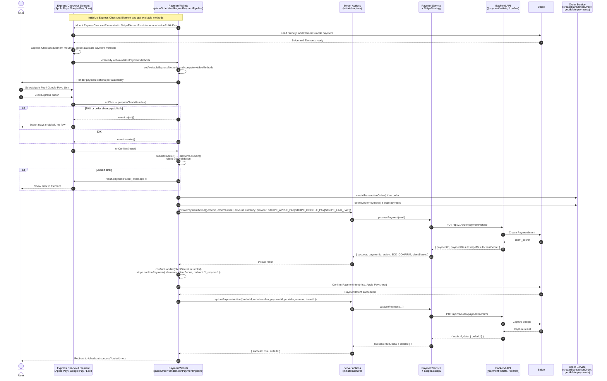

# Stripe Express Checkout Element 集成方案 (Integration Solution for Stripe Express Checkout Element)

## 1. 集成目标与适用范围 (Goal & Scope)

- **ZH**: Stripe Express Checkout Element 用于 Web Checkout 页的快捷支付方式：Apple Pay、Google Pay、Link。用户点击对应按钮后由 Stripe 弹窗或原生流程完成支付，无需在页内填写卡信息。适用于已配置的 `stripe-apple-pay`、`stripe-google-pay`、`stripe-link-pay` 支付方式，依赖 Stripe 官方 Express Checkout Element + Payment Intent API（与 Payment Element 共用同一套 initiate/confirm 后端流程）。
- **EN**: The Stripe Express Checkout Element provides one-click express payment methods on the Web Checkout page: Apple Pay, Google Pay, and Link. The user clicks the corresponding button and completes payment via Stripe’s flow without entering card details inline. It applies to the configured `stripe-apple-pay`, `stripe-google-pay`, and `stripe-link-pay` methods and uses Stripe’s Express Checkout Element with the Payment Intent API (same backend initiate/confirm flow as the Payment Element).

## 2. 集成概览 (Integration Overview)

- **FE entry**: `libs/modules/payment/components` — `PaymentWallets` 为入口；Express 方式通过 `PaymentSubmitSection` 的 `expressSlot` 渲染 `ExpressCheckoutElement`；当用户选择 Apple Pay / Google Pay / Link 时展示对应 Express 按钮，点击后由 Element 的 `onConfirm` 触发 `placeOrderHandler`，内部走 `runPaymentPipeline`（initiate → SDK confirm → capture）。
- **BE entry**: Server Actions `initiatePaymentAction`、`capturePaymentAction`；Strategy 层 `StripeStrategy`（`libs/modules/payment/infrastructure`），按 provider 分别实例化（`STRIPE_APPLE_PAY`、`STRIPE_GOOGLE_PAY`、`STRIPE_LINK_PAY`）；Link 在服务端归一化为 `STRIPE_ONLINE` 同一后端能力。
- **Provider**: Stripe JS SDK（`@stripe/stripe-js`、`@stripe/react-stripe-js`），Express Checkout Element 文档：<https://docs.stripe.com/elements/express-checkout-element/accept-a-payment?payment-ui=elements#submit-the-payment>。

## 3. 时序流程 (Sequence Flow)

- **ZH**: 用户在选择 Apple Pay / Google Pay / Link 后，点击 Express 按钮 → Element 触发 `onClick`，前端执行 `prepareCheckHandler`（TAU 校验、订单已付校验），通过则 `event.resolve()` 否则 `event.reject()` → Stripe 触发 `onConfirm` → 前端在 `handleConfirm` 内调用 `placeOrderHandler({ submitHandler, confirmHandler })`（即 `onExpressCheckoutSubmit`）→ 先执行 `submitHandler()`（即 `elements.submit()`）做客户端校验 → 再执行 `runPaymentPipeline({ confirmHandler })`：若无订单则 `createTransactionOrder`，若有残留未完成支付则 `deleteOrderPayment` → `initiatePaymentAction`（provider 为当前选中的 STRIPE_APPLE_PAY / STRIPE_GOOGLE_PAY / STRIPE_LINK_PAY），后端经 `PaymentService` + `StripeStrategy` 调用 `/api/v1/order/payment/initiate`，返回 `clientSecret` 与 `SDK_CONFIRM` → 前端执行 `confirmHandler(clientSecret, returnUrl)`，即 `stripe.confirmPayment({ elements, clientSecret, confirmParams: { return_url }, redirect: 'if_required' })` → 成功后调用 `capturePaymentAction`，经 `/api/v1/order/payment/confirm` → 跳转 `/checkout-success?orderId=xxx`。若任一步失败则调用 `result.paymentFailed({ reason: 'fail', message })` 通知 Element 展示错误。
- **EN**: User selects Apple Pay / Google Pay / Link and clicks the Express button → Element fires `onClick`, frontend runs `prepareCheckHandler` (TAU and order-already-paid checks), then `event.resolve()` or `event.reject()` → Stripe fires `onConfirm` → frontend in `handleConfirm` calls `placeOrderHandler({ submitHandler, confirmHandler })` (i.e. `onExpressCheckoutSubmit`) → runs `submitHandler()` (i.e. `elements.submit()`) for client-side validation → then `runPaymentPipeline({ confirmHandler })`: create order via `createTransactionOrder` if needed, cleanup via `deleteOrderPayment` if stale payment exists → `initiatePaymentAction` with provider STRIPE_APPLE_PAY / STRIPE_GOOGLE_PAY / STRIPE_LINK_PAY, backend uses `PaymentService` + `StripeStrategy` to call `/api/v1/order/payment/initiate`, returns `clientSecret` and `SDK_CONFIRM` → frontend runs `confirmHandler(clientSecret, returnUrl)` i.e. `stripe.confirmPayment(...)` → on success calls `capturePaymentAction` via `/api/v1/order/payment/confirm` → redirects to `/checkout-success?orderId=xxx`. On any failure, `result.paymentFailed({ reason: 'fail', message })` is called so the Element can show the error.

## 4. 前端集成细节 (Frontend Integration Details)

- **Entry 与布局**

  - `PaymentWallets`：根据 `supportedMethods` 与 `availableExpressMethods` 计算 `visibleMethods`，仅当 `availableExpressMethods.applePay` / `googlePay` / `link` 为 true 时在列表中展示对应方式。`PaymentSubmitSection` 的 `expressSlot` 始终渲染（便于 Stripe 在后台探测可用方式），内容为 `ExpressCheckoutElement`，外层容器 `#stripe-express-checkout-element` 在 `isExpressMethodSelected` 时 `display: block`，否则 `display: none`。
  - `ExpressCheckoutElement`（`libs/modules/payment/components/src/lib/stripe/express-checkout-element/express-checkout-element.tsx`）：接收 `stripePublicKey`、`amount`、`activePaymentProvider`（当前选中的 STRIPE_APPLE_PAY / STRIPE_GOOGLE_PAY / STRIPE_LINK_PAY）、`onGetAvailablePaymentMethods`、`prepareCheckHandler`、`placeOrderHandler`。使用 `StripeElementProvider`（与 Payment Element 共用，`mode: 'payment'`，金额最小单位）包裹；内部 `ExpressElement` 根据 `activePaymentProvider` 设置 `extraElementOptions.paymentMethods`（例如 Google Pay 为 `googlePay: 'always', applePay: 'never', link: 'never'`），并传入 `onClick`（即 `prepareCheckHandler`）、`onConfirm`（内部调 `placeOrderHandler`）、`onReady`（上报 `availablePaymentMethods`）。

- **ExpressElement（express-element.tsx）**

  - 使用 `useStripe()`、`useElements()` 获取 Stripe 与 Elements 实例；`submitHandler` 为 `elements.submit()` 的封装，返回 `true` 或 `IPaymentProcessingError`；`confirmHandler` 为 `stripe.confirmPayment({ elements, clientSecret, confirmParams: { return_url }, redirect: 'if_required' })` 的封装。
  - `onConfirm` 时调用 `placeOrderHandler({ submitHandler, confirmHandler })`；若返回 `status: 'error'` 则调用 `result.paymentFailed({ reason: 'fail', message })`；用 `isMountedRef` 避免卸载后仍执行回调。
  - `onClick` 时执行 `prepareCheckHandler()`，为 false 则 `event.reject()`，为 true 则 `event.resolve()`。
  - `onReady` 将 `availablePaymentMethods` 通过 `onGetAvailablePaymentMethods` 回传给 `PaymentWallets`，用于控制列表中是否显示 Apple Pay / Google Pay / Link。

- **状态与提交**

  - `availableExpressMethods`：由 `ExpressCheckoutElement` 的 `onReady` 更新，决定 `visibleMethods` 中是否包含三种 Express 方式。
  - `paymentState.isReadyToSubmit`：当用户选中任一 Express 方式时由 `onExpressMethodsDetected` 设为 true（Express 无表单填写，点击即视为可提交）。
  - `placeOrderHandler` 即 `onExpressCheckoutSubmit`：先可选执行 `submitHandler()`，再调用 `runPaymentPipeline({ confirmHandler })`，与 Stripe 卡支付共用同一 pipeline（buildOrderAndInitiate → SDK_CONFIRM → capture → redirect）。
  - 倒计时与订单已付检测：与 Payment Element 相同，依赖 `orderInfo?.createdAt` 与 `getOrderPayments` / `isOrderAlreadyPaid`。

- **SDK 行为**
  - Express 流与 Payment Element 一致：先 `elements.submit()`（在 `placeOrderHandler` 内通过传入的 `submitHandler`），再 `initiatePaymentAction`，收到 `action: 'SDK_CONFIRM', clientSecret` 后执行 `confirmHandler(clientSecret, returnUrl)`，即 `stripe.confirmPayment(...)`，成功后 `capturePaymentAction` 并跳转成功页。差异在于触发点来自 Element 的 `onConfirm` 而非自定义「Place your order」按钮。

## 5. 后端依赖与配置 (Backend Dependencies & Configuration)

| API                                  | 用途 (Purpose)                                                                              |
| ------------------------------------ | ------------------------------------------------------------------------------------------- |
| `PUT /api/v1/order/payment/initiate` | 创建 PaymentIntent，返回 `paymentResult.stripeResult.clientSecret`，供前端 confirmPayment。 |
| `PUT /api/v1/order/payment/confirm`  | 确认/捕获支付，Express 场景下与 Payment Element 相同，无额外 confirmData。                  |
| `DELETE /api/v1/order/payment`       | 删除未完成的 payment（body: `orderId`, `paymentId`），用于提交前清理残留。                  |

- **Provider 与 Strategy**：`PaymentStrategyFactory` 为 `STRIPE_APPLE_PAY`、`STRIPE_GOOGLE_PAY`、`STRIPE_LINK_PAY` 分别注册 `StripeStrategy`；前端传入的 provider 在 initiate/capture 中保持不变（除服务端对 Link 的归一化）。`PaymentService.processPayment` 中将 `STRIPE_LINK_PAY` 归一化为 `STRIPE_ONLINE` 再调 Strategy，以便与现有 Stripe 后端能力一致。
- **配置**: 前端使用与 Payment Element 相同的 `stripePublicKey`（如 `stripeOnlineConfig?.stripePublicKey?.publicApiKey`）。后端 Stripe 密钥与支付能力配置与 Payment Element 一致；Apple Pay / Google Pay 需在 Stripe Dashboard 与域名/环境侧完成相应配置。

## 6. 错误处理与特殊场景 (Error Handling & Edge Cases)

- **错误分类**：与 Payment Element 相同，使用 `classify-payment-error.ts` 将 Stripe 相关错误码映射到 i18n 的 `paymentProcessingError.<category>`（如 orderAlreadyPaid、paymentPending、canceledOrExpired、cardDeclinedError、invalidDetailsError、serverError 等）。Express 流程中错误通过 `placeOrderHandler` 返回 `status: 'error', errorMessage`，再由 `ExpressElement` 调用 `result.paymentFailed({ reason: 'fail', message })`，由 Stripe Element 展示；同时 `handlePaymentError` 会设置 `paymentState.error`，若 `displayType: 'inline'` 在提交区下方展示。
- **用户可见行为**：用户取消或支付失败时，Element 内由 `paymentFailed` 展示 Stripe 或业务错误信息；重复点击由 `isProcessing` 与 Element 自身状态防护。订单已付时 `prepareCheckHandler` 内通过 `isOrderAlreadyPaid` 拦截并 `event.reject()`，避免重复支付。
- **边界场景**：Express 按钮仅在 `onReady` 上报的 `availablePaymentMethods` 包含对应方式时才在列表中显示；若浏览器/设备不支持（如无 Apple Pay），该方式不会出现。残留 payment 在每次 `runPaymentPipeline` 前通过 `deleteOrderPayment` 清理。

## 7. 测试建议 (Testing Recommendations)

- **手工测试**
  - 成功路径：选 Apple Pay / Google Pay / Link（在支持的设备/浏览器下）→ 点击 Express 按钮 → 通过 TAU/订单校验 → 完成 Stripe 弹窗或跳转流程 → 跳转 checkout-success。
  - 失败：取消支付、卡/账户被拒、网络错误、initiate/capture 失败，确认 Element 内错误提示与 `paymentState.error` 一致。
  - 订单已付：先完成一笔支付后再次点击 Express，应被 `prepareCheckHandler` 拒绝（event.reject）或提示 orderAlreadyPaid。
  - 可用性：在不同环境（无 Apple Pay、无 Google Pay）下确认列表中仅展示可用的 Express 方式。
- **自动化**
  - 单元：`submitHandler` / `confirmHandler` 在 elements 未就绪时的错误返回；`classifyPaymentError` 对 Stripe 相关 code 的分类。
  - E2E：在支持的环境中走一条从选 Express 方式 → 点击按钮 → 成功页的 happy path（需 Stripe 测试环境与可用 Express 方式）。

## 8. 与 Payment Element 的关系及限制 (Relationship to Payment Element & Limitations)

- **关系**：Express Checkout Element 与 Payment Element 共用同一 Stripe Elements 实例（`StripeElementProvider`）、同一后端 initiate/confirm API 及同一套 `runPaymentPipeline`。Payment Element 中已关闭 Apple Pay / Google Pay / Link（`wallets: { applePay: 'never', googlePay: 'never', link: 'never' }`），由本集成在 `expressSlot` 中单独承载，避免重复入口。
- **限制**：Express 方式依赖浏览器/设备能力与 Stripe 配置，若 `availablePaymentMethods` 全为 false，列表中不会显示任一 Express 方式。订单创建后若后端未返回 `createdAt`，倒计时逻辑与 Payment Element 相同，依赖 BE 补充。相关设计：`libs/modules/payment/payment-state-design.md`、`docs/payment-refactoring-design.md`、`docs/adr/2026-03-payment-architecture-refactoring.md`。
