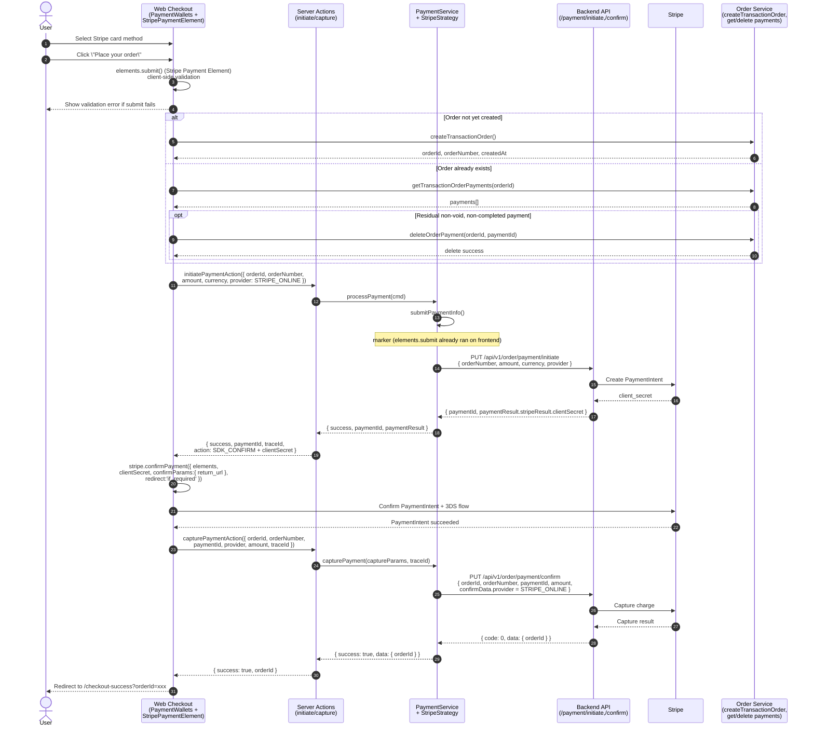

# Stripe Payment Element 集成方案 (Integration Solution for Stripe Payment Element)

## 1. 集成目标与适用范围 (Goal & Scope)

- **ZH**: Stripe Payment Element 用于 Web Checkout 页的信用卡/借记卡等内联支付。用户在结账页填写卡信息并提交，无需跳转第三方页面。适用于当前项目已配置的 Stripe Online（`stripe-online`）支付方式，依赖 Stripe 官方 Payment Element + Elements 模式。
- **EN**: The Stripe Payment Element provides inline card (and other payment method) collection on the Web Checkout page. The user enters card details and submits without leaving the site. It applies to the configured Stripe Online (`stripe-online`) method and uses Stripe’s Payment Element in Elements mode.

## 2. 集成概览 (Integration Overview)

- **FE entry**: `libs/modules/payment/components` — `PaymentWallets` 为入口；当选中 `STRIPE_ONLINE` 时展开 `StripePaymentElement`，并通过 `PaymentSubmitSection` 的自定义按钮提交。
- **BE entry**: Server Actions `initiatePaymentAction`、`capturePaymentAction`；Strategy 层 `StripeStrategy`（`libs/modules/payment/infrastructure`）。
- **Provider**: Stripe JS SDK（`@stripe/stripe-js`、`@stripe/react-stripe-js`），Payment Element 文档：<https://docs.stripe.com/payments/accept-a-payment?payment-ui=elements>，Deferred 示例：<https://docs.stripe.com/payments/accept-a-payment-deferred?type=payment>.

## 3. 时序流程 (Sequence Flow)

- **ZH**: 用户在选择 Stripe 信用卡后，点击「Place your order」→ 前端先调用 `elements.submit()` 做客户端校验 → 若无订单则先 `createTransactionOrder` 创建订单 → 若有残留未完成支付则 `deleteOrderPayment` 清理 → 调用 `initiatePaymentAction`，后端经 `PaymentService` + `StripeStrategy` 调用 `/api/v1/order/payment/initiate`，返回 `clientSecret` 与 `SDK_CONFIRM` → 前端调用 `stripe.confirmPayment({ elements, clientSecret, confirmParams: { return_url }, redirect: 'if_required' })` → 成功后调用 `capturePaymentAction`，经 `PaymentService` + `StripeStrategy` 调用 `/api/v1/order/payment/confirm` → 跳转 `/checkout-success?orderId=xxx`。
- **EN**: User selects Stripe card, clicks Place your order → client first runs `elements.submit()` for local validation → creates order via `createTransactionOrder` if needed → cleans up any stale payment via `deleteOrderPayment` → calls `initiatePaymentAction`, which uses `PaymentService` + `StripeStrategy` to hit `/api/v1/order/payment/initiate` and returns `clientSecret` with `SDK_CONFIRM` → client calls `stripe.confirmPayment({ elements, clientSecret, confirmParams: { return_url }, redirect: 'if_required' })` → on success calls `capturePaymentAction`, which in turn calls `/api/v1/order/payment/confirm` → finally redirects to `/checkout-success?orderId=xxx`.

## 4. 前端集成细节 (Frontend Integration Details)

- **Entry 组件**

  - `PaymentWallets`：根据 `selectedPaymentMethod === PaymentMethodProviderEnum.STRIPE_ONLINE` 显示自定义提交按钮，并将 `renderExpandedContent` 中 `methodKey === STRIPE_ONLINE` 时渲染 `StripePaymentElement`。
  - `StripePaymentElement`（`libs/modules/payment/components/src/lib/stripe/stripe-payment-element/stripe-payment-element.tsx`）：使用 `Elements` 包裹，`mode: 'payment'`，金额转为最小单位（如分）；子组件 `PaymentElementForm` 内使用 `<PaymentElement>`，并通过 `onGetStripeSubmitHandler` / `onGetStripeConfirmHandler` 将 `elements.submit()` 与 `stripe.confirmPayment()` 的 handler 注册到父组件 ref。
  - `PaymentSubmitSection`：`showSubmitButton` 在 Stripe 选中时为 true，`onSubmit` 绑定 `onStripeCardSubmit`。

- **状态管理**

  - `orderInfo`：订单创建后保存 `id / referenceNumber / number / createdAt`，用于 initiate/capture 及倒计时。
  - `paymentState.isReadyToSubmit`：由 `StripePaymentElement` 的 `onFormChange(_, complete)` 更新，仅当 form complete 时按钮可点。
  - `stripeSubmitHandlerRef`、`stripeConfirmHandlerRef`：由 `StripePaymentElement` 注入，供 `onStripeCardSubmit` 与 `runPaymentPipeline` 使用。
  - 倒计时：`usePaymentCountdown(orderInfo?.createdAt)`，按钮文案为 "Make Payment (H:MM:SS)"，过期弹 Order Expired Modal。

- **SDK 行为**
  - 先 `elements.submit()`（在 `onStripeCardSubmit` 内通过 `stripeSubmitHandlerRef.current()`）再调 `initiatePaymentAction`；后端返回 `action: 'SDK_CONFIRM', clientSecret` 后执行 `stripeConfirmHandlerRef.current(clientSecret, returnUrl)`，即 `stripe.confirmPayment({ elements, clientSecret, confirmParams: { return_url: returnUrl }, redirect: 'if_required' })`。无 redirect 时成功后直接走 `capturePaymentAction` 并跳转成功页。

## 5. 后端依赖与配置 (Backend Dependencies & Configuration)

| API                                  | 用途 (Purpose)                                                                              |
| ------------------------------------ | ------------------------------------------------------------------------------------------- |
| `PUT /api/v1/order/payment/initiate` | 创建 PaymentIntent，返回 `paymentResult.stripeResult.clientSecret`，供前端 confirmPayment。 |
| `PUT /api/v1/order/payment/confirm`  | 确认/捕获支付，Stripe 场景下无额外 confirmData。                                            |
| `DELETE /api/v1/order/payment`       | 删除未完成的 payment（body: `orderId`, `paymentId`），用于提交前清理残留。                  |

- **配置**: 前端使用 `stripePublicKey`（来自 payment method config，如 `stripeOnlineConfig?.stripePublicKey?.publicApiKey`）。后端需配置 Stripe 密钥与支付能力；不同环境通过 `NEXT_PUBLIC_API_HOST` 等区分。

## 6. 错误处理与特殊场景 (Error Handling & Edge Cases)

- **错误分类**（`classify-payment-error.ts`）：Stripe 相关错误码映射到 i18n 的 `paymentProcessingError.<category>`，例如：

  - `payment_already_paid` → orderAlreadyPaid
  - `processing` / `PENDING` → paymentPending
  - `user_canceled`, `payment_intent_canceled`, `session_expired` 等 → canceledOrExpired
  - `card_declined`, `insufficient_funds`, `expired_card` 等 → cardDeclinedError
  - `authentication_required` 等 → authorizationError
  - `invalid_number`, `incorrect_number`, `invalid_expiry_month` 等 → invalidDetailsError
  - `INTERNAL_ERROR`, `INITIATE_FAILED`, `CAPTURE_FAILED` 等 → serverError
  - 未匹配则 genericPaymentError。

- **用户可见行为**：错误通过 `usePaymentErrorHandler` 设置 `paymentState.error`；`displayType: 'inline'` 在提交区下方展示，`displayType: 'modal'` 弹窗展示详情（含 orderNumber、failureCode 等）。

- **边界场景**：用户关闭 3DS 弹窗或取消支付 → Stripe 返回错误，走上述分类并展示对应文案。重复点击由 `isProcessing` 与按钮 disabled 防护。残留 payment 在每次提交前通过 `deleteOrderPayment` 清理；订单已支付时通过 `getOrderPayments` 检测并展示 orderAlreadyPaid。

## 7. 测试建议 (Testing Recommendations)

- **手工测试**

  - 成功路径：选 Stripe 卡 → 填写有效卡信息 → Place your order → 完成 3DS（若触发）→ 跳转 checkout-success。
  - 失败：卡被拒、用户取消、网络错误、initiate/capture 接口失败，确认对应错误码与文案。
  - 订单已支付：先完成一笔支付后再在同一订单尝试支付，应提示 orderAlreadyPaid。
  - 倒计时：订单创建后等待或 mock 时间，确认按钮文案含倒计时及过期弹窗与跳转。

- **自动化**
  - 单元：`classifyPaymentError` 对 Stripe 相关 code 的分类结果。
  - E2E：一条从选 Stripe → 填测试卡 → 提交 → 成功页的 happy path（可用 Stripe 测试卡号）。

## 8. 已知限制与后续工作 (Limitations & Follow-ups)

- Payment Element 内已关闭 Apple Pay / Google Pay / Link（`wallets: { applePay: 'never', googlePay: 'never', link: 'never' }`），这些由同库下的 Express Checkout Element 单独承载。
- 订单创建后若后端未返回 `createdAt`，倒计时依赖 BE 补充字段。
- 相关设计：`libs/modules/payment/payment-state-design.md`、`docs/payment-refactoring-design.md`、`docs/adr/2026-03-payment-architecture-refactoring.md`。
