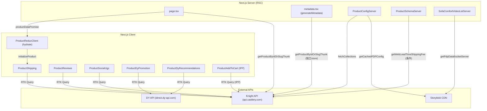
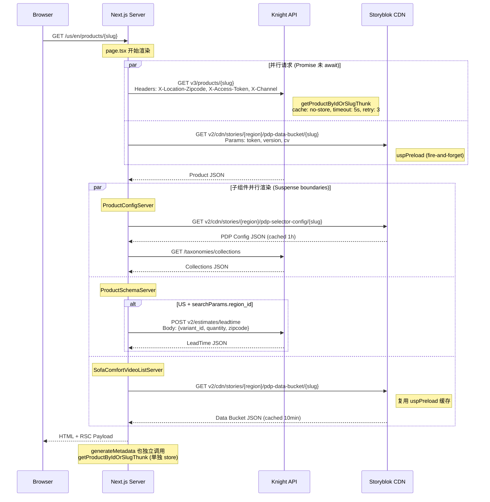
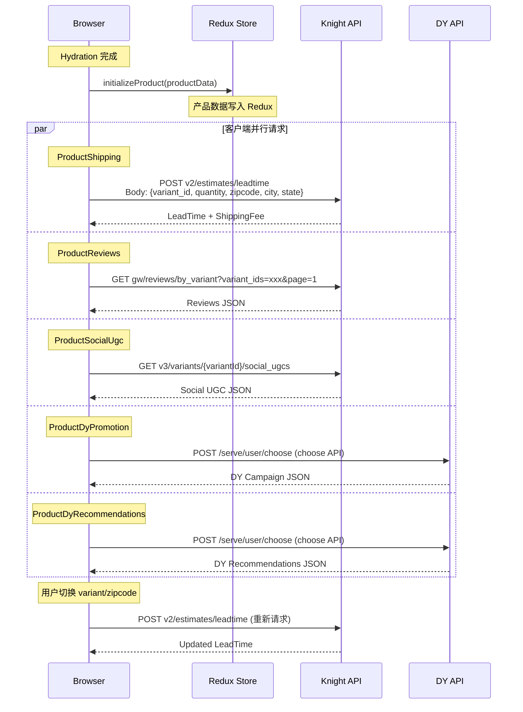
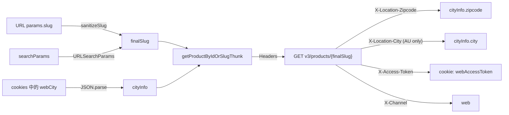
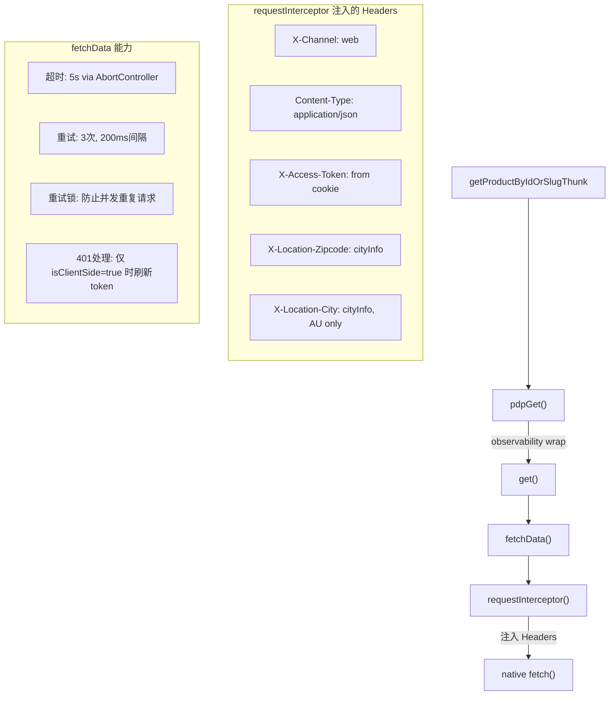
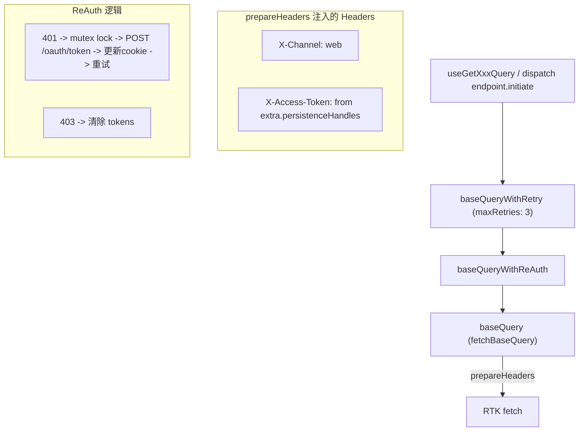
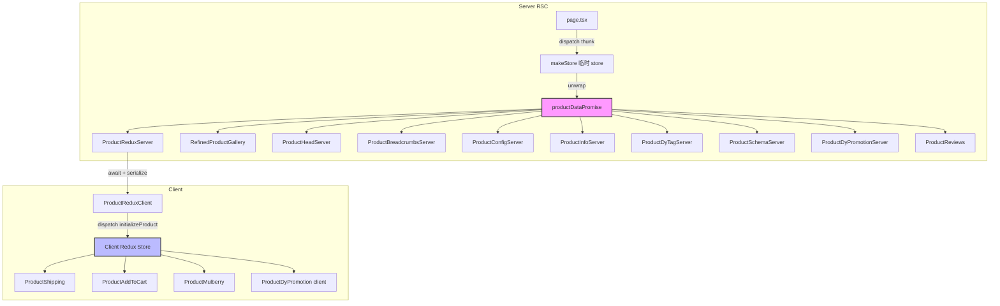
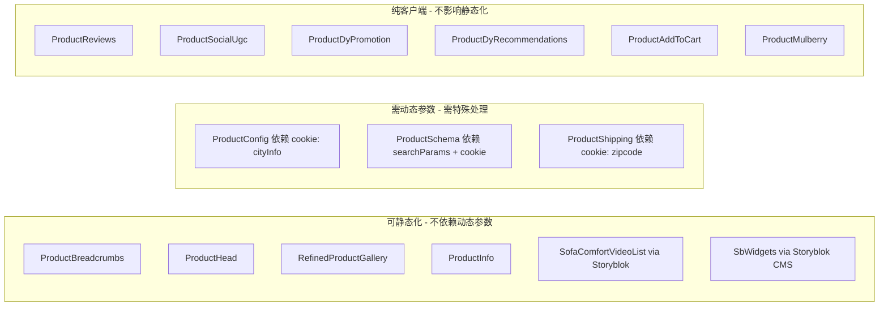

# PDP Product API 请求流程文档

> 路径: `apps/web/app/[deviceTheme]/[region]/[locale]/(pdp)/products/[slug]`
>
> 生成日期: 2026-05-08

---

## 目录

1. [整体架构概览](#1-整体架构概览)
2. [请求时序图](#2-请求时序图)
3. [Server-Side 请求详解](#3-server-side-请求详解)
4. [Client-Side 请求详解](#4-client-side-请求详解)
5. [两套 HTTP 层详解](#5-两套-http-层详解)
6. [数据流 & Redux 水合](#6-数据流--redux-水合)
7. [API 版本 & Header 汇总](#7-api-版本--header-汇总)
8. [缓存策略汇总](#8-缓存策略汇总)
9. [静态化重构影响面分析](#9-静态化重构影响面分析)

---

## 1. 整体架构概览

PDP 页面存在 **两套并行的 HTTP 请求体系**:

| 体系                                                        | 运行环境               | 实现                             | 用途                                         |
| ----------------------------------------------------------- | ---------------------- | -------------------------------- | -------------------------------------------- |
| **Server Action fetch** (`get/post` from `@castlery/utils`) | Server Component (RSC) | 原生 `fetch` + 重试 + 超时       | 首屏核心数据 (`getProductByIdOrSlugThunk`)   |
| **RTK Query** (`productApi.endpoints.*`)                    | Client Component       | `fetchBaseQuery` + 重试 + reAuth | 交互后的增量数据 (shipping, reviews, UGC 等) |



---

## 2. 请求时序图

### 2.1 Server-Side 请求时序



### 2.2 Client-Side 请求时序



---

## 3. Server-Side 请求详解

### 3.1 核心产品数据 -- `getProductByIdOrSlugThunk`

| 属性         | 值                                                                                     |
| ------------ | -------------------------------------------------------------------------------------- |
| **调用位置** | `page.tsx:73-80`, `metadata.tsx:42-50`                                                 |
| **HTTP 层**  | Server Action fetch (`libs/shared/utils/src/lib/fetch.actions.ts`)                     |
| **包装层**   | `pdpGet` (`libs/modules/product/domain/src/api/http.ts`) -- 注入 observability tracing |
| **URL**      | `${NEXT_PUBLIC_API_HOST}/v3/products/${slug}`                                          |
| **Method**   | GET                                                                                    |
| **超时**     | 5 秒                                                                                   |
| **重试**     | 3 次, 200ms 间隔                                                                       |
| **缓存**     | `no-store` (每次请求最新)                                                              |
| **Auth**     | `authOption: true` -- 从 cookie 读取 `X-Access-Token`                                  |

**参数来源:**



**slug 处理逻辑:**

```
1. params.slug (URL 路由参数)
2. sanitizeSlug() -- 移除 Unicode 控制字符、XSS 字符
3. 如果有 searchParams -> 拼接为 querystring: slug?key=value
4. 最终传给 API: GET v3/products/{slug}?{searchParams}
```

**重要:** `metadata.tsx` 中也调用了同样的 thunk，但使用 **独立的 `makeStore()`**，意味着 **同一个请求生命周期内 product API 会被调用两次** (page.tsx + generateMetadata 各一次)。Next.js 的 fetch dedup 不一定生效，因为使用了 `cache: 'no-store'`。

---

### 3.2 PDP Selector Config -- Storyblok

| 属性             | 值                                                                             |
| ---------------- | ------------------------------------------------------------------------------ |
| **调用位置**     | `ProductConfigServer` -> `getCachedPDPConfig(slug)`                            |
| **URL**          | `https://api.storyblok.com/v2/cdn/stories/{region}/pdp-selector-config/{slug}` |
| **Query Params** | `token={STORYBLOK_TOKEN}`, `version=draft 或 published`, `cv={timestamp}`      |
| **缓存**         | `unstable_cache` 1 小时 + React `cache` per-request dedup                      |
| **超时**         | 2000ms                                                                         |

---

### 3.3 Collections -- Knight API

| 属性         | 值                                            |
| ------------ | --------------------------------------------- |
| **调用位置** | `ProductConfigServer` -> `fetchCollections()` |
| **URL**      | `${APP_API_BASE_URL}/taxonomies/collections`  |
| **Method**   | GET                                           |
| **缓存**     | React `cache` (仅 per-render dedup)           |

---

### 3.4 Lead Time (Schema 用) -- Knight API

| 属性         | 值                                                                |
| ------------ | ----------------------------------------------------------------- |
| **调用位置** | `ProductSchemaServer` (条件调用)                                  |
| **条件**     | 仅 US 区域 + `searchParams.region_id` 存在时                      |
| **URL**      | `${NEXT_PUBLIC_API_HOST}/v2/estimates/leadtime`                   |
| **Method**   | POST                                                              |
| **Body**     | `{ variant_id, quantity, zipcode, city, state, bundle_options? }` |

---

### 3.5 PDP Data Bucket -- Storyblok

| 属性             | 值                                                                         |
| ---------------- | -------------------------------------------------------------------------- |
| **调用位置**     | `SofaComfortVideoListServer` -> `getPdpDataBucketServer(slug)`             |
| **URL**          | `https://api.storyblok.com/v2/cdn/stories/{region}/pdp-data-bucket/{slug}` |
| **Query Params** | `token={STORYBLOK_TOKEN}`, `version=draft 或 published`, `cv={timestamp}`  |
| **缓存**         | `unstable_cache` 10 分钟 + React `cache` dedup                             |
| **预加载**       | `uspPreload({ slug })` 在 page.tsx 中 fire-and-forget 调用                 |

---

## 4. Client-Side 请求详解

以下请求全部通过 **RTK Query** 发起，共享同一个 `baseQuery` 配置。

### 4.1 Lead Time & Shipping Fee

| 属性         | 值                                                                |
| ------------ | ----------------------------------------------------------------- |
| **组件**     | `ProductShipping`                                                 |
| **触发**     | `useEffect` -> `refreshWebLeadTimeCommand`                        |
| **Endpoint** | `POST v2/estimates/leadtime` (`getWebLeadTimeShippingFee`)        |
| **Body**     | `{ variant_id, quantity, zipcode, city, state, bundle_options? }` |
| **重触发**   | 用户切换 variant 或修改 zipcode 时                                |

还有一个 legacy endpoint:

| 属性         | 值                                                                |
| ------------ | ----------------------------------------------------------------- |
| **Endpoint** | `POST estimates/leadtime_shipping_fee` (`getLeadtimeShippingFee`) |

### 4.2 Reviews

| 属性          | 值                                                     |
| ------------- | ------------------------------------------------------ |
| **组件**      | `ProductReviews` (client-side dynamic import)          |
| **Endpoint**  | `GET gw/reviews/by_variant?variant_ids={ids}&page={n}` |
| **Cache Tag** | `Review:{query}`                                       |

### 4.3 Social UGC

| 属性          | 值                                              |
| ------------- | ----------------------------------------------- |
| **组件**      | `ProductSocialUgc` (client-side dynamic import) |
| **Endpoint**  | `GET v3/variants/{variantId}/social_ugcs`       |
| **Cache Tag** | `SocialUgc:{variantId}`                         |

### 4.4 DY Promotion & Recommendations

| 属性         | 值                                                            |
| ------------ | ------------------------------------------------------------- |
| **组件**     | `ProductDyPromotionServer` / `ProductDyRecommendationsServer` |
| **Base URL** | `https://direct.dy-api.com/v2/`                               |
| **RTK API**  | `dyApi` (独立 reducerPath: `dy-api`)                          |

### 4.5 IPP (Instalment)

| 属性         | 值                       |
| ------------ | ------------------------ |
| **组件**     | `ProductAddToCart`       |
| **Endpoint** | `GET instalment_options` |
| **触发**     | 按需 (lazy query)        |

---

## 5. 两套 HTTP 层详解

### 5.1 Server Action Fetch (`fetch.actions.ts`)



**关键:** Server 端调用时 `isClientSide=false`，所以 **401 不会触发 token refresh**，直接返回错误。

### 5.2 RTK Query (`api.ts`)



---

## 6. 数据流 & Redux 水合



**关键节点:**

1. **`makeStore()`** -- 每次请求创建临时 Redux store (仅用于 thunk dispatch，不用于 RTK Query server 端)
2. **`productDataPromise`** -- 核心数据 Promise，被约 10 个 Server Component 共享 (不重复请求)
3. **`ProductReduxServer` -> `ProductReduxClient`** -- Server/Client 边界，通过 `await promise` 获取数据后序列化传给客户端
4. **`initializeProduct`** -- 客户端 Redux action，将产品数据写入 store，供所有客户端组件使用

---

## 7. API 版本 & Header 汇总

### API 版本

| Endpoint                              | 版本            | 说明                      |
| ------------------------------------- | --------------- | ------------------------- |
| `v3/products/{slug}`                  | **v3**          | 主产品数据                |
| `v3/variants/{variantId}`             | **v3**          | 变体详情                  |
| `v3/variants/{variantId}/social_ugcs` | **v3**          | UGC 数据                  |
| `v2/estimates/leadtime`               | **v2**          | 新版 lead time (Web 用)   |
| `estimates/leadtime_shipping_fee`     | **v1 (无前缀)** | 旧版 lead time + shipping |
| `gw/reviews/by_variant`               | **gw**          | Reviews gateway           |
| `instalment_options`                  | **v1 (无前缀)** | IPP 分期                  |
| `taxonomies/collections`              | **v1 (无前缀)** | 商品集合                  |
| `products/{id}/swatches`              | **v1 (无前缀)** | 色板数据                  |
| `places/autocomplete`                 | **v1 (无前缀)** | 地址自动补全              |
| `places/formatted_address`            | **v1 (无前缀)** | 格式化地址                |

### 通用 Headers

| Header               | 值                  | 来源                                 |
| -------------------- | ------------------- | ------------------------------------ |
| `X-Channel`          | `web`               | 固定值 (`EcEnv.NEXT_PUBLIC_CHANNEL`) |
| `X-Access-Token`     | JWT token           | Cookie (`webAccessToken`)            |
| `Content-Type`       | `application/json`  | 固定值                               |
| `X-Location-Zipcode` | 用户 zipcode        | Cookie (`webCity`)                   |
| `X-Location-City`    | 用户 city (AU only) | Cookie (`webCity`)                   |

---

## 8. 缓存策略汇总

| 数据                            | 缓存策略                         | TTL                       | 说明                |
| ------------------------------- | -------------------------------- | ------------------------- | ------------------- |
| Product Data (Thunk)            | `no-store`                       | 0                         | 每次请求最新        |
| Product Data (RTK Query)        | RTK Cache                        | 直到 invalidate           | 客户端内存缓存      |
| PDP Selector Config (Storyblok) | `unstable_cache` + React `cache` | 1 小时                    | Storyblok CMS 数据  |
| PDP Data Bucket (Storyblok)     | `unstable_cache` + React `cache` | 10 分钟                   | 沙发视频等 CMS 数据 |
| Collections                     | React `cache`                    | per-render                | 仅同一渲染去重      |
| Lead Time (server schema)       | 无缓存                           | 0                         | 仅条件请求          |
| Lead Time (client shipping)     | RTK Cache                        | 直到 variant/zipcode 变更 | 用户交互触发更新    |
| Reviews                         | RTK Cache + tag                  | 直到 invalidate           | 按 query 缓存       |
| Social UGC                      | RTK Cache + tag                  | 直到 invalidate           | 按 variantId 缓存   |

---

## 9. 静态化重构影响面分析

### 重点关注

1. **`getProductByIdOrSlugThunk` 被调用两次** -- `page.tsx` 和 `metadata.tsx` 各有独立的 `makeStore()` + thunk dispatch。如果要做静态化 (ISR/SSG)，需要统一数据获取。

2. **`no-store` 缓存策略** -- 当前核心产品数据强制不缓存。静态化需要改为 `force-cache` 或 `next: { revalidate: N }`。

3. **动态参数依赖:**

   - `cityInfo` (来自 cookie) -- 影响库存和价格展示，静态化后无法个性化
   - `searchParams` -- 拼接到 slug 后影响 API 请求
   - `X-Access-Token` -- 认证用户看到个性化价格

4. **Storyblok 数据** 已有缓存策略 (1h / 10min)，可以直接用于静态化。

5. **客户端请求不受影响** -- Shipping/Reviews/UGC/DY 均为客户端 RTK Query 请求。

### 组件数据依赖图 (哪些可以静态化)



---

## 附录: 关键文件索引

| 文件                                                  | 作用                                      |
| ----------------------------------------------------- | ----------------------------------------- |
| `apps/web/.../products/[slug]/page.tsx`               | PDP 页面入口，发起核心产品请求            |
| `apps/web/.../products/[slug]/metadata.tsx`           | SEO metadata，独立发起产品请求            |
| `apps/web/.../products/layout.tsx`                    | PDP layout，Sentry context                |
| `libs/modules/product/domain/src/api/product.api.ts`  | RTK Query endpoints + thunk 定义          |
| `libs/modules/product/domain/src/api/http.ts`         | pdpGet 包装层 (observability)             |
| `libs/shared/utils/src/lib/fetch.actions.ts`          | Server 端 fetch 封装 (重试/超时/auth)     |
| `libs/shared/redux/services/src/api.ts`               | RTK Query baseQuery 配置 (reAuth/retry)   |
| `libs/shared/utils/src/lib/knightMap/knightApiMap.ts` | API path 映射: slug -> v3/products/{slug} |
