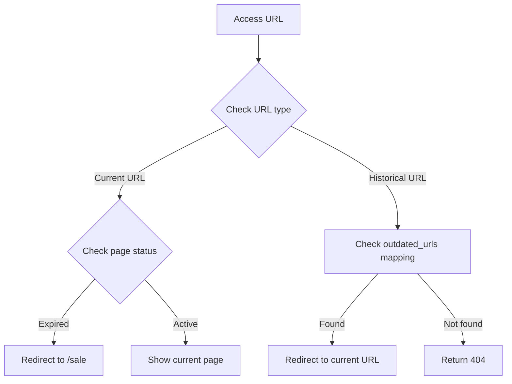

# Storyblok Sale Pages Management System PRD

## 1. Product Overview

A sale page management system powered by Storyblok CMS, supporting flexible content management, page layout, and promotional timing control. The system is designed to create and manage various marketing campaign pages, including holiday sales and themed promotions.

## 2. User Stories

### 2.1 Marketing Team Stories

```gherkin
Scenario: Create a new sale page
Given: I am a marketing team member
When: I need to create a new promotional page
Then: I can create a new page in Storyblok
And: Set basic campaign information (name, timing, description)
And: Configure page content and layout
```

```gherkin
Scenario: Create SEO-focused landing page
Given: I am a marketing team member
When: I need to create a page optimized for search engines
Then: I can set is_seo_page to true
And: The page will be treated as an SEO landing page
And: The page will have appropriate GTM tracking
```

```gherkin
Scenario: Monitor SEO page performance
Given: I have created an SEO-focused landing page
When: I check the analytics
Then: I can see SEO-specific metrics
And: The page is tracked separately from regular sale pages
```

```gherkin
Scenario: Update existing sale page URL
Given: I need to optimize an existing sale page URL
When: I change the page access path
Then: I can add the old URL to outdated_urls
And: System will automatically redirect users from old URL to new URL
```

### 2.2 SEO Team Stories

```gherkin
Scenario: Optimize landing page for search engines
Given: I am an SEO specialist
When: I create a category-specific landing page
Then: I can mark it as an SEO page using is_seo_page
And: Configure SEO-specific content and metadata
And: Track its performance separately from promotional pages
```

```gherkin
Scenario: Analyze SEO page effectiveness
Given: I am reviewing our SEO strategy
When: I look at our landing pages' performance
Then: I can distinguish between promotional and SEO pages
And: Make data-driven decisions about our SEO strategy
```

### 2.3 User Stories

```gherkin
Scenario: Access expired sale page
Given: I am a user with a bookmarked sale page
When: I visit an expired promotion link
Then: I am redirected to the default sale page (/sale)
And: I see a friendly notification about the ended sale
```

```gherkin
Scenario: Visit country-specific sale page
Given: I am a user from a specific country
When: I visit a sale page
Then: I see content specific to my region
And: URLs are properly localized for my region
```

## 3. Page Structure

### 3.1 Basic Information

```typescript
interface SalesPageStoryblok {
  key: string; // Unique page identifier
  name: string; // Page name
  path: string; // Access path
  description: string; // Page description
  keywords: string; // SEO keywords
  published_at?: string; // Launch time
  ended_at?: string; // End time
  is_seo_page?: boolean; // Whether it's an SEO-specific page
}
```

### 3.2 Banner Section

```typescript
interface BannerSection {
  banner_title?: string; // Main title
  banner_sub_title?: string; // Subtitle
  banner_intro?: string; // Introduction text
  banner_background_image?: string; // Desktop background image
  banner_background_image_mobile?: string; // Mobile background image
  banner_desktop_image?: string; // Desktop main image
  banner_mobile_image?: string; // Mobile main image
  background_color?: string; // Background color
}
```

### 3.3 Activity Control

```typescript
interface ActivityControl {
  countdown_deadline?: string; // Countdown end time
  countdown_color?: '' | 'black' | 'white'; // Countdown color
  query?: string; // Page query parameters
  query_deliver_before?: DeliverBeforeStoryblok[]; // Delivery time restrictions
}
```

### 3.4 Page Content

```typescript
interface PageContent {
  body_section?: // Main content area
  (FullWidthBannerStoryblok | TieredSaleBannerStoryblok | LinkBannerStoryblok)[];
  bottom_section?: // Bottom content area
  (
    | FullWidthBannerStoryblok
    | ImageTextBannerStoryblok
    | AccordionStoryblok
    | DynamicYieldEmbedStoryblok
    | UgcCarouselStoryblok
  )[];
  seo_content?: string; // SEO content
  faqs?: QuestionStoryblok[]; // FAQ section
}
```

## 4. Page Types and Implementation

### 4.1 Page Categories and Tracking

| Page Type    | is_seo_page | GTM Page Name | Primary Purpose                              |
| ------------ | ----------- | ------------- | -------------------------------------------- |
| Regular Sale | false       | salePage      | Promotional campaigns and time-limited sales |
| SEO Landing  | true        | seoPage       | Long-term category or keyword targeting      |
| Visual Sale  | false       | campaignPage  | Rich visual content campaigns                |

### 4.2 Core Interface

```typescript
interface SalePageStoryblok {
  // Basic fields
  key: string; // Unique page identifier
  name: string; // Page name
  path: string; // Access path
  description: string; // Page description
  keywords: string; // SEO keywords

  // Time control
  published_at?: string; // Launch time
  ended_at?: string; // End time

  // Page control
  is_seo_page?: boolean; // Whether it's an SEO-specific page
  outdated_urls?: string; // Historical URLs, comma separated
}
```

### 4.3 Implementation Status

```typescript
interface CurrentImplementation {
  redirect_handling: {
    current: 'All expired pages redirect to /sale';
  };
  url_management: {
    outdated_urls: 'Active - handles historical URLs';
    path: 'Active - current page URL';
    is_seo_page: 'Active - determines page type and tracking';
  };
}
```

## 5. Page Lifecycle

### 5.1 Creation

```gherkin
Scenario: Create a new sale page
Given: I am a marketing team member
When: I need to create a new promotional page
Then: I can create a new page in Storyblok
And: Set basic campaign information (name, timing, description)
And: Configure page content and layout
```

### 5.2 Update

```gherkin
Scenario: Update existing sale page URL
Given: I need to optimize an existing sale page URL
When: I change the page access path
Then: I can add the old URL to outdated_urls
And: System will automatically redirect users from old URL to new URL
```

### 5.3 Expiration

```gherkin
Scenario: Access expired sale page
Given: I am a user with a bookmarked sale page
When: I visit an expired promotion link
Then: I am redirected to the default sale page (/sale)
And: I see a friendly notification about the ended sale
```

## 6. URL Management

### 6.1 URL Fields

| Field         | Purpose         | Example                     | Notes           |
| ------------- | --------------- | --------------------------- | --------------- |
| path          | Current URL     | "/christmas-sale"           | Active URL      |
| outdated_urls | Historical URLs | "/xmas-sale, /holiday-sale" | Comma-separated |

### 6.2 Redirect Handling

#### Implementation

```javascript
// Implementation
if (isOutdated(page.publishedAt, page.endedAt) && page.url !== getUrl('sale')) {
  return {
    url: page.url,
    redirectUrl: getUrl('sale'), // 所有过期页面一律重定向到 /sale
    from: page.key,
  };
}
```

### 6.3 URL Processing Flow



### 6.4 Historical URL Scenarios

#### 6.4.1 URL Optimization

```json
{
  "name": "Christmas Sale 2024",
  "path": "/christmas-sale-2024",
  "outdated_urls": "/xmas-sale-2024,/christmas-sales-2024",
  "published_at": "2024-12-20",
  "ended_at": "2024-12-26"
}
```

- **Purpose**: SEO optimization or brand consistency
- **Scenario**: Standardize URL format
- **Example**:
  - Original URL: /xmas-sale-2024
  - Optimized: /christmas-sale-2024
  - Handling: Add original URL to outdated_urls

#### 6.4.2 Campaign Merger

```json
{
  "name": "Year End Sale 2024",
  "path": "/year-end-sale-2024",
  "outdated_urls": "/christmas-sale-2024,/boxing-day-sale-2024",
  "published_at": "2024-12-20",
  "ended_at": "2024-12-31"
}
```

- **Purpose**: Combine multiple small campaigns
- **Scenario**: Integrate related campaigns into one major campaign
- **Example**:
  - Original campaigns: Christmas Sale, Boxing Day Sale
  - Merged: Year End Sale
  - Handling: Add original campaign URLs to outdated_urls

#### 6.4.3 Brand Adjustment

```json
{
  "name": "Designer Living Sale",
  "path": "/designer-living-sale",
  "outdated_urls": "/luxury-furniture-sale,/premium-home-sale",
  "published_at": "2024-01-15",
  "ended_at": "2024-02-15"
}
```

- **Purpose**: Brand strategy adjustment
- **Scenario**: Unify brand language and market positioning
- **Example**:
  - Original URL: /luxury-furniture-sale
  - Adjusted: /designer-living-sale
  - Handling: Maintain accessibility of original URLs

### 6.5 URL Management Best Practices

1. **URL Naming Conventions**

   - Use lowercase letters
   - Use hyphens (-) to separate words
   - Avoid special characters
   - Include year for recurring campaigns

2. **Historical URL Management**

   - Record all URL changes promptly
   - Regularly clean up expired records
   - Avoid duplicate historical URLs
   - Document reasons for URL changes

3. **Redirect Strategy**
   - Permanent redirect (301) for historical URLs
   - Temporary redirect (302) for expired campaigns (all expired campaigns redirect to /sale)
   - Keep redirect chain short (maximum one hop)

## 7. SEO Page Characteristics

### 7.1 Content Focus

- Evergreen content
- Category-specific information
- Rich product descriptions
- Educational content
- Structured data optimization

### 7.2 Technical Considerations

- Permanent URLs (less likely to change)
- Enhanced meta descriptions
- Schema markup
- Internal linking structure
- Content hierarchy

### 7.3 Analytics Tracking

- Separate GTM tracking
- Long-term performance metrics
- Organic traffic focus
- Conversion attribution
- Search ranking monitoring

## 8. Browser Support

### 8.1 Compatibility

- Modern browsers: Full support
- Legacy browsers: Basic support
- Mobile optimization: Required

### 8.2 Device Detection

- Desktop/Mobile detection
- App detection (Castlery APP)
- Responsive design requirements

## 9. Testing Checklist

### 9.1 Functional Testing

- [ ] URL redirects (outdated_urls)
- [ ] Expiration handling
- [ ] SEO page features
- [ ] Regional content
- [ ] GTM tracking

### 9.2 Performance Testing

- [ ] Page load times
- [ ] Mobile responsiveness
- [ ] CDN integration
- [ ] Cache effectiveness

### 9.3 SEO Testing

- [ ] Meta information completeness
- [ ] Structured data validation
- [ ] Image alt text
- [ ] Content indexability
- [ ] Mobile optimization
- [ ] Page load performance

## 10. Monitoring Metrics

### 10.1 Page Performance

- Page load time
- Resource load time
- First contentful paint

### 10.2 User Behavior

- Page views by type
- Average time on page
- Bounce rate
- Conversion rate
- Regional engagement

## 11. Future Enhancements

### 11.1 Planned Features

1. Enhanced analytics integration
2. Improved A/B testing capabilities
3. Advanced SEO optimization tools

### 11.2 Migration Path

1. Enhance regional support
2. Improve tracking granularity
3. Optimize cache strategy

## Appendix A: Legacy Regional Implementation

For historical reference, the system includes some region-specific implementations in the codebase:

1. Mid-year Sale Example:

```javascript
{
  key: 'mid-year-sale',
  url: {
    SG: '/midyear-sale',
    US: '/midyear-sale',
    CA: '/midyear-sale',
    AU: '/eofy-sale',
    UK: '/eofy-sale',
  }
}
```

2. Content Fetching:

```javascript
// Content is fetched from country-specific Storyblok spaces
client.get(`/story_bloks/${country.toLowerCase()}/general-content/sale-pages/sale-pages`);
```

This legacy implementation shows how the system handled regional variations before the current CMS-focused approach.

## 12. Change Log

| Date       | Version | Changes     |
| ---------- | ------- | ----------- |
| 2025-07-07 | 1.0     | Initial PRD |
