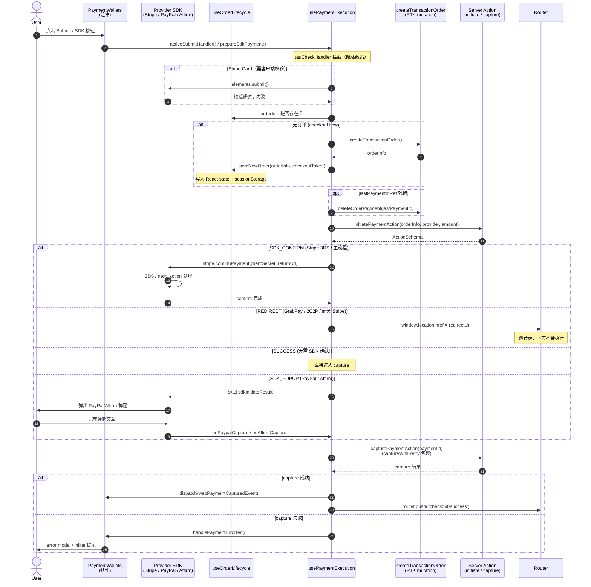
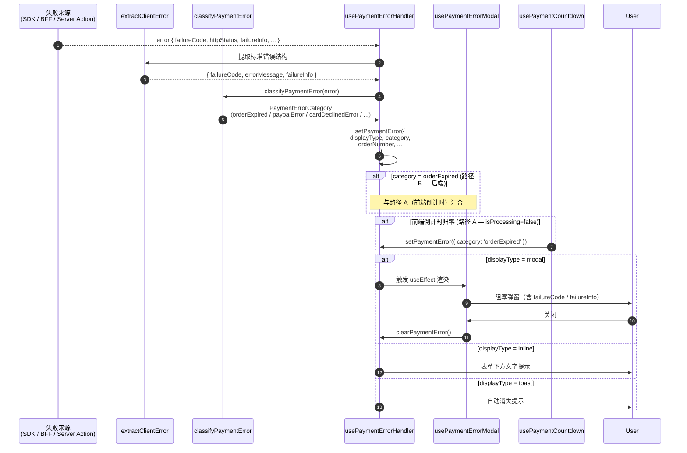

# PaymentWallets 技术实现方案

> 入口文件：`libs/modules/payment/components/src/lib/payment-wallets/payment-wallets.tsx`
> 重构记录：同目录 `REFACTOR.md`

## 1. 模块定位

`PaymentWallets` 是 checkout / orderCheckout 流程的支付页主容器组件，负责：

- 渲染所有可用支付方式列表
- 接管用户从「选支付方式 → 填表单 → 提交」的完整交互
- 把客户端 SDK（Stripe / PayPal / Affirm / 2C2P / GrabPay / Stripe Express）与服务端 Server Action 串成一条统一的支付管道
- 统一处理订单生命周期、错误展示、过期倒计时、tracking 事件

设计上遵循 **薄组件 + 专职 hook** 原则：组件本体只负责「连线 + 渲染」，业务逻辑全部下沉到 hook。

---

## 2. 整体架构

```
PaymentWallets (组件 ~460 行)
  │
  ├── useOrderLifecycle           ← 订单创建/恢复、pending 支付检查、sessionStorage 写入
  ├── usePaymentExecution         ← 支付管道：initiate / confirm / capture，各方式 submit handler
  ├── usePaymentMethodSelection   ← 方法列表、选中态、可见性、isXxxSelected 标志位
  │
  ├── usePaymentCountdown         ← 订单过期倒计时
  ├── usePaymentErrorHandler      ← 错误分类、映射、setPaymentError
  ├── usePaymentErrorMessages     ← i18n 错误文案
  └── usePaymentErrorModal        ← 错误弹窗 contextHolder
```

### 子组件

- `PaymentWalletsHeader` — 标题 + "Secure and Encrypted" 标识
- `PaymentMethodsList` / `PaymentMethodItem` — 支付方式选择列表
- `PaymentSubmitSection` — 底部提交区（包含 submitButton / expressSlot / sdkSlot / inlineError）
- `PaymentWalletsSkeleton` — configs 加载中的骨架屏
- `PaymentErrorPopupDetail` — modal 错误详情

### 客户端 SDK Element

- `StripePaymentElement` — Stripe Card / 主支付元素
- `ExpressCheckoutElement` — Stripe Express（Apple Pay / Google Pay / Link）
- `PaypalPaymentElement` — PayPal SDK 按钮
- `AffirmPaymentElement` — Affirm SDK

---

## 3. Phase 5 支付管道（核心流水线）

整页设计的核心思想：**UI 只驱动 SDK，业务逻辑全部托管在 Server Action**。

```
1. elements.submit()           Stripe 客户端表单校验（仅 Stripe）
2. createTransactionOrder()    RTK mutation — checkout validation + 创建订单
                               错误由 CheckoutProcessFailedEvent Redux listener 处理
3. initiatePaymentAction()     Server Action — 返回 ActionSchema
4. ActionSchema 分支处理：
     SDK_CONFIRM → stripe.confirmPayment(clientSecret)
     REDIRECT    → window.location.href = redirectUrl
     SUCCESS     → 直接进入第 5 步
5. capturePaymentAction()      Server Action — 闭环 capture
6. redirect → /checkout-success
```

注释参见 `payment-wallets.tsx:62-77`。

### 3.1 完整支付时序图（按 `ActionSchema` 三分支汇总）



### 3.2 错误处理时序（任意阶段失败）



> ⚠️ 错误分类详细规则、所有 provider code 归属、PRD 行号映射，详见附录：[error-classification.md](./error-classification.md)

---

## 4. 三个核心 Hook

### 4.1 `useOrderLifecycle`

**职责**：管理订单实体（id / referenceNumber / number / paymentExpiredAt）的生命周期。

| 状态                      | 含义                                                                                  |
| ------------------------- | ------------------------------------------------------------------------------------- |
| `orderInfo`               | 当前订单信息，null 表示尚未创建                                                       |
| `orderPaymentsHasPending` | 三态：`null` 未检查 / `true` 无记录或有 PENDING / `false` 已有终态支付（会 redirect） |
| `lastPaymentIdRef`        | 上次失败/未完成的支付 ID，用于 cleanup（`deleteOrderPayment`）                        |

**行为**：

1. **mount 时**：若 `paymentDataSource.source === 'orderCheckout'`，从 `checkoutInfo` 恢复 `orderInfo`
2. **mount 后**：调 `getOrderPayments(orderId)` 检查现有支付
   - 无记录 → 留在页面（新订单）
   - 存在 `PENDING / PROCESSING` 且未 voided → 注册为残留，留在页面
   - 其它（已成功 / 已取消等终态） → `router.replace('/order-history')`
3. **saveNewOrder**：checkout flow 在 `createOrder` 成功后写入 React state + sessionStorage（`webTransactionOrderId` / `webTransactionSymbol`）

**双路径差异**（保留现状）：

- **checkout flow**：主动创建订单 → 写入 sessionStorage
- **orderCheckout flow**：从 `paymentDataSource` 恢复 → 不写 sessionStorage

### 4.2 `usePaymentExecution`

**职责**：把所有支付方式的 submit handler 收口到一个 hook，统一封装支付管道。

**输出 handler**：

| Handler                               | 用于                                    |
| ------------------------------------- | --------------------------------------- |
| `onStripeCardSubmit`                  | Stripe Card 主流程                      |
| `onGrabPaySubmit`                     | GrabPay 跳转                            |
| `onTwoCTwoPSubmit`                    | 2C2P                                    |
| `onExpressCheckoutSubmit`             | Stripe Express（Apple/Google/Link Pay） |
| `onPaypalCapture` / `onAffirmCapture` | SDK 弹窗回调后的 capture                |
| `prepareSdkPayment`                   | PayPal / Affirm 的 SDK_POPUP 前置流程   |
| `onSdkError`                          | SDK 异常回调                            |

**内部公共流程**：

- `buildOrderAndInitiate` — 创建订单（若无）→ 清理 stale payment → `initiatePaymentAction`
- `runPaymentPipeline` — 按 `ActionSchema` 分支处理 SDK_CONFIRM / REDIRECT / SUCCESS
- `handleCaptureResult` — capture 结果（含重试）统一处理，进一步走 `webPaymentCapturedEvent` tracking + redirect

**Refs（用于把 SDK Element 的内部 handler 暴露出来）**：

- `stripeSubmitHandlerRef` — Stripe `elements.submit()` 引用
- `stripeConfirmHandlerRef` — Stripe `confirmPayment` 引用
- `twoCTwoPConfirmHandlerRef` — 预留，等 2C2P SDK Element 接入

**Observability 织入**：

- `trackTransactionStart` / `trackTransactionSuccess` / `trackTransactionFailure`（`@castlery/observability/client`）
- 失败走 `captureTransactionError` / `captureStructuredError` + `addBreadcrumb`
- `captureWithRetry` 工具处理 capture 阶段网络抖动

### 4.3 `usePaymentMethodSelection`

**职责**：管理「显示哪些方法 + 哪个被选中 + 派生标志位」。

**状态**：

- `selectedPaymentMethod` — 当前选中 key
- `availableExpressMethods` — Stripe Express 实际可用 wallet（mount 后由 Element 上报）

**关键派生**：

- `defaultSelectedMethod`：优先 `defaultSelectedKey`，fallback 到 `STRIPE_ONLINE`
- **Async fallback**：mount 时 `supportedMethods` 可能为空，等 configs 加载后再补设默认
- `chosenExpressWallet`：Apple Pay > Google Pay > Link Pay 的优先级，只在 methods list 里露一个 Express 入口
- `visibleMethods`：过滤掉浏览器/设备不支持的 Express 方法
- `isStripeSelected` / `isPaypalSelected` / `isAffirmSelected` / `isGrabPaySelected` / `isTwoCTwoPSelected` / `isExpressMethodSelected` — 渲染分支用

**Tracking**：选中支付方式时调 `trackTransactionSuccess({ step: 'payment_method_select', skipSentry: true })`。

---

## 5. 状态机

```ts
// payment-wallets.types.ts
type PaymentState = {
  error: PaymentError | null;
  isProcessing: boolean;
  isReadyToSubmit: boolean;
};

type PaymentError =
  | { displayType: 'inline' | 'toast'; message: string }
  | {
      displayType: 'modal';
      message: string;
      orderNumber: string; // modal 必填
      category?: PaymentErrorCategory; // 'orderExpired' / 'orderCanceled' / ...
      title?: string;
      failureCode?: string;
      failureInfo?: string;
      shortMessage?: string; // 注入 {{shortMessage}} i18n slot（目前只用于 paypalError）
      details?: Record<string, any>;
    };
```

| `displayType` | 表现                         |
| ------------- | ---------------------------- |
| `inline`      | 表单下方文字提示，非阻塞     |
| `toast`       | 自动消失的浮动提示，非阻塞   |
| `modal`       | 阻塞性弹窗，必须用户主动关闭 |

错误分类逻辑见 `utils/classify-payment-error.ts`（含对照表 `payment-error-classification-table.md`）。

---

## 6. 各支付方式的提交路径

| 方式               | Element                                      | Submit 入口                                   | 备注                                                                    |
| ------------------ | -------------------------------------------- | --------------------------------------------- | ----------------------------------------------------------------------- |
| **Stripe Card**    | `StripePaymentElement` (内嵌表单)            | `onStripeCardSubmit`                          | 需先 `elements.submit()` 校验；`isReadyToSubmit` 由 `onFormChange` 驱动 |
| **GrabPay**        | 无                                           | `onGrabPaySubmit`                             | 无客户端表单，submit 永远 ready；REDIRECT 跳转                          |
| **2C2P**           | 无（TODO 接入 Element）                      | `onTwoCTwoPSubmit`                            | submit 永远 ready                                                       |
| **PayPal**         | `PaypalPaymentElement` (SDK 按钮)            | `prepareSdkPayment` → SDK → `onPaypalCapture` | SDK_POPUP 模式，按钮自带交互                                            |
| **Affirm**         | `AffirmPaymentElement` (SDK)                 | `prepareSdkPayment` → SDK → `onAffirmCapture` | 同上                                                                    |
| **Stripe Express** | `ExpressCheckoutElement` (Apple/Google/Link) | `onExpressCheckoutSubmit`                     | Element 自带 submit 入口                                                |

`activeSubmitHandler`（payment-wallets.tsx:398）按 `isXxxSelected` 标志位选用对应 handler，并在调用前 dispatch `placeOrderClickedEvent`。

---

## 7. 关键设计点

### 7.1 Stripe Keep-Mounted

切换到其它支付方式时，Stripe DOM 不卸载，只用 `display: none` 隐藏，以保留用户已填好的表单状态。

```tsx
// payment-wallets.tsx:269-283
const hasStripeElementRendered = useRef(false);
useEffect(() => {
  if (isStripeSelected && stripePublicKey && paymentAmount > 0) {
    hasStripeElementRendered.current = true;
  }
}, [isStripeSelected, stripePublicKey, paymentAmount]);

const shouldRenderStripeElement = useMemo(() => {
  const hasConfig = !!(stripePublicKey && paymentAmount > 0);
  return hasConfig && (isStripeSelected || hasStripeElementRendered.current);
}, [...]);
```

### 7.2 过期弹窗双路径合并

订单过期有两条来源，统一汇入 error modal `useEffect`：

- **Path A**：前端 `usePaymentCountdown` 倒计时归零（仅在无支付进行时触发）
- **Path B**：后端返回 `ORDER_EXPIRED` 错误

合并方式：Path A 触发时主动 `setPaymentError({ category: 'orderExpired', ... })`，让 `usePaymentErrorModal` 通过 `category` 分支统一渲染。

```ts
// payment-wallets.tsx:229-239
useEffect(() => {
  if (!isExpired || isProcessingRef.current) return;
  setPaymentError({
    displayType: 'modal',
    category: 'orderExpired',
    message: '',
    orderNumber: orderInfo?.number ?? '',
  });
}, [isExpired]);
```

### 7.3 ResumeState 处理

支付页支持外部传入 `resumeState`（如从 magic link / 失败页恢复），自动展示对应错误：

- `status === 'processing'` → 显示 inline `paymentPending` 文案
- `status === 'failure'` → 用 `handlePaymentError` 走完整错误分类流程

### 7.4 Ref 稳定化避免 SDK Element 重建

`ExpressCheckoutElement` 创建成本高，需要稳定 callback：

```ts
// payment-wallets.tsx:289-304
const tauCheckHandlerRef = useRef(tauCheckHandler);
tauCheckHandlerRef.current = tauCheckHandler;
const stableTauCheck = useCallback(() => tauCheckHandlerRef.current(), []);

const onExpressCheckoutSubmitRef = useRef(onExpressCheckoutSubmit);
onExpressCheckoutSubmitRef.current = onExpressCheckoutSubmit;
const stablePlaceOrder = useCallback(
  (opts) => {
    dispatchPlaceOrderClick();
    return onExpressCheckoutSubmitRef.current(opts);
  },
  [dispatchPlaceOrderClick]
);
```

### 7.5 Tracking 织入

- `paymentMethodClickedEvent` — 用户点击某支付方式（含 `category: 'pay' | 'repay'` 判定）
- `placeOrderClickedEvent` — 用户点击 submit / express 按钮（`label`: `checkout_place_order` / `checkout_retry_payment` / `order_retry_payment`）
- `checkoutPaymentMethodSelectedForFunnelEvent` — GA `checkout` funnel step 5
- `webPaymentCapturedEvent` — capture 成功的业务事件

`paymentMethodClickCategory` / `placeOrderLabel` 根据 `paymentDataSource.source` + `orderInfo` 是否存在 + `resumeState?.status` 联合派生（payment-wallets.tsx:155-165）。

### 7.6 Submit Button 文案与可用性

```ts
// payment-wallets.tsx:441-451
isDisabled={!isSubmitReady || isExpired}
showSubmitButton={isStripeSelected || isGrabPaySelected || isTwoCTwoPSelected}
submitLabel={
  orderInfo && orderPaymentsHasPending !== false
    ? `Make Payment${formattedCountdown ? ` (${formattedCountdown})` : ''}`
    : 'Place your order'
}
```

- PayPal / Affirm / Express 的提交入口在自己的 Element 上，因此 `showSubmitButton` 排除它们
- 文案根据是否已有订单 + 是否有 pending 支付切换 "Make Payment" / "Place your order"

---

## 8. 错误处理体系

### 8.1 分层

```
SDK / Server Action 抛错
       ↓
extractClientError / extractErrorMessage   ← utils/extract-error-message.ts
       ↓
classifyPaymentError                       ← utils/classify-payment-error.ts
       ↓
usePaymentErrorHandler                     ← hooks/usePaymentErrorHandler.ts
   → setPaymentError({ displayType, category, ... })
       ↓
usePaymentErrorModal / inline / toast      ← 渲染层
```

### 8.2 错误分类（PaymentErrorCategory）

详见 `utils/payment-error-classification-table.md`。常见 category：

- `orderExpired` — 订单过期
- `orderCanceled` — 订单已取消
- `paymentFailed` — 通用支付失败
- `paypalError` — PayPal 特有错误（支持 `{{shortMessage}}` 模板插值）
- `cardDeclined` / `cardError` — 卡相关错误
- `networkError` — 网络问题
- `paymentPending` — 支付处理中

### 8.3 Capture 重试

`utils/capture-with-retry.ts` 封装 capture 阶段的指数退避重试，防止网络抖动导致最后一步失败用户已扣款无法闭环。

---

## 9. 文件目录索引

```
payment-wallets/
├── REFACTOR.md                              重构方案与决策记录
├── payment-wallets.tsx                      主组件（连线 + 渲染）
├── payment-wallets.types.ts                 PaymentState / PaymentError 类型
├── types.ts                                 内部辅助类型
├── constants.ts                             路径常量（checkoutSuccessPath / orderHistoryPath）
│
├── components/
│   ├── payment-wallets-header.tsx           标题 + secure 标识
│   ├── payment-wallets-skeleton.tsx         加载骨架屏
│   ├── payment-methods-list.tsx             支付方式列表
│   ├── payment-method-item.tsx              单个方式 item
│   ├── payment-submit-section.tsx           底部提交区（含 expressSlot / sdkSlot）
│   └── payment-error-popup-detail.tsx       modal 错误详情
│
├── hooks/
│   ├── use-order-lifecycle.ts               订单生命周期
│   ├── use-payment-execution.ts             支付管道
│   ├── use-payment-method-selection.ts      方法选择
│   ├── use-payment-method-selection.spec.ts 单测
│   └── use-payment-error-modal.tsx          错误弹窗渲染
│
└── utils/
    ├── classify-payment-error.ts            错误分类映射
    ├── classify-payment-error.spec.ts       单测
    ├── extract-error-message.ts             错误信息提取
    ├── capture-with-retry.ts                capture 重试
    └── payment-error-classification-table.md  错误分类对照表
```

---

## 10. 上下游依赖

### 外部依赖（package 边界）

| Package                             | 用途                                                                                  |
| ----------------------------------- | ------------------------------------------------------------------------------------- |
| `@castlery/modules-payment-domain`  | `PaymentMethodProviderEnum` / payment method configs / `paymentMethodClickedEvent` 等 |
| `@castlery/modules-payment-actions` | `initiatePaymentAction` / `capturePaymentAction` (Server Action)                      |
| `@castlery/modules-order-domain`    | `useCreateTransactionOrderMutation` / `useLazyGetTransactionOrderPaymentsQuery`       |
| `@castlery/modules-checkout-domain` | `checkoutPaymentMethodSelectedForFunnelEvent` (GA funnel)                             |
| `@castlery/observability/client`    | `trackTransactionStart/Success/Failure` / `captureStructuredError` / `addBreadcrumb`  |
| `@castlery/shared-components`       | `useGetPaymentDataSource` / `BackdropLoading`                                         |
| `@castlery/shared-persistence-kit`  | `makePersistenceHandles` — sessionStorage handles                                     |
| `@castlery/shared-redux-store`      | `useAppDispatch` / `useAppSelector`                                                   |
| `@castlery/monorepo-i18n`           | i18n                                                                                  |
| `@castlery/config`                  | `MarketCurrency`                                                                      |
| `@castlery/fortress`                | UI 组件（Box / Stack）                                                                |

### 同 layer 同事模块

- `../hooks/useGetFormattedMethodsSettings` — 把后端 configs 拍平成 UI 友好结构
- `../hooks/use-payment-countdown` — 倒计时
- `../hooks/usePaymentErrorHandler` / `usePaymentErrorMessages` — 错误处理基础设施
- `../stripe/*` / `../paypal/*` / `../affirm/*` — 各 SDK Element 封装

---

## 11. 扩展指引（新增支付方式）

新增一个支付方式（例如 KlarnaPay）的工作量大致：

1. **Domain 层**：在 `@castlery/modules-payment-domain` 注册 enum + config schema
2. **Settings 层**：扩展 `useGetFormattedMethodsSettings` 输出
3. **SDK Element**：在 `libs/modules/payment/components/src/lib/klarna/` 新建 Element 封装（如有 SDK）
4. **Execution Hook**：在 `usePaymentExecution` 加 `onKlarnaSubmit` / `onKlarnaCapture`（复用 `buildOrderAndInitiate` + `runPaymentPipeline`）
5. **Selection Hook**：在 `usePaymentMethodSelection` 增加 `isKlarnaSelected` 派生
6. **组件层**：
   - 在 `sdkPaymentSlot` 或 `expressSlot` 加渲染分支（按 SDK 形态选）
   - 或在 `activeSubmitHandler` 加上 `isKlarnaSelected` 分支
7. **错误分类**：在 `classify-payment-error.ts` 补齐 Klarna 特有错误码
8. **i18n**：在 `packages/monorepo-i18n/.../checkout/*.json` 补 `klarnaError` 等模板
9. **Tracking**：检查 `paymentMethodClickedEvent` / `webPaymentCapturedEvent` 是否需要新增 label
10. **Server Action**：在 `@castlery/modules-payment-actions` 的 `initiatePaymentAction` 加 provider 分支

---

## 12. 待办 / 已知 TODO

- `twoCTwoPConfirmHandlerRef` 占位，等 `TcTpPaymentElement` SDK Element 接入后才会被赋值
- `PaymentMethodProviderEnum.STRIPE_LINK_PAY` 在 `chosenExpressWallet` 中是兜底优先级，需要继续观察用户体验
- `paymentMethodConfigsLoading` 与 `isStripeLoading` 当前各自展示 `BackdropLoading`，可考虑统一 loading 协议
