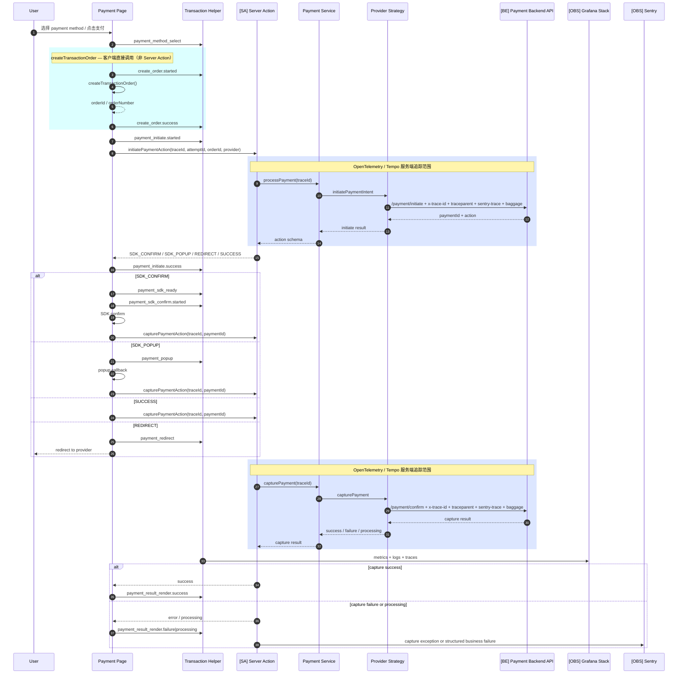
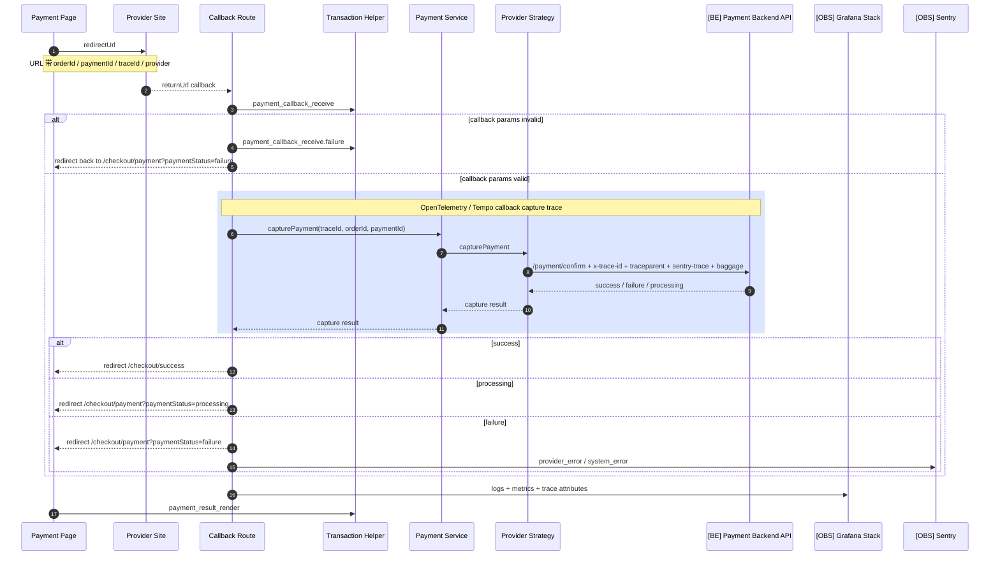
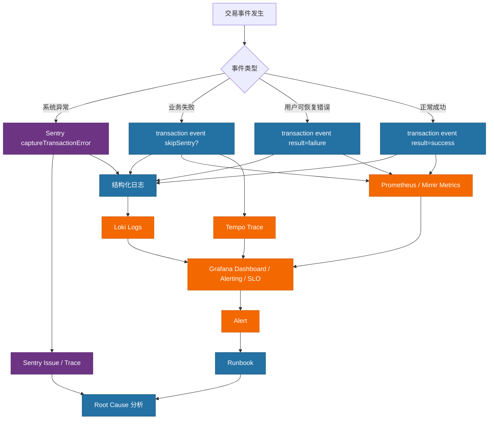
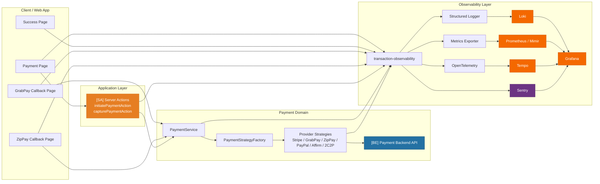

# 支付可观测性图示

- 作者：Codex
- 日期：2026-05-25
- 适用范围：`checkout` + `payment`
- 目标平台：Sentry + Grafana

---

## 图例

| 标记 | 含义 |
| --- | --- |
| `[SA]` | Next.js Server Action（内部服务端） |
| `[BE]` | Payment Backend API（内部后端） |
| `[OBS]` | 可观测性平台（Sentry / Grafana / Loki / Tempo / Prometheus） |
| 无标记 | 客户端页面 / 内部 Domain Service |

## 1. 支付主链路时序图

## 2. Redirect Provider Callback 时序图

适用：

1. `GrabPay`
2. `ZipPay`
3. 后续新增 redirect provider

## 3. 错误监控流转图

## 4. 整体架构图

## 5. 图示说明

1. `createTransactionOrder` 为客户端直接调用（非 Server Action）。
2. `[SA]` Server Action 仅负责 `initiatePaymentAction` 和 `capturePaymentAction`，不包含下单逻辑。
3. `[BE]` Payment Backend API 接收含 `x-trace-id`、`traceparent`、`sentry-trace`、`baggage` 的请求头。
4. Grafana stack 负责影响面、趋势、日志查询、trace 查询、alerting 和 SLO。
5. Sentry 负责异常聚合、root cause、stack trace 和错误分桶。
6. `Affirm` 当前故意没有画 callback route 闭环，因为仓库现状仍存在 `SDK_POPUP` 与 strategy `REDIRECT` 分叉。
7. `PayPal` 也没有单独展开 callback route，因为当前前端实际用法偏 `SDK_POPUP`。
8. 当前已真实落地的 redirect callback 只有：
   - `GrabPay`
   - `ZipPay`
