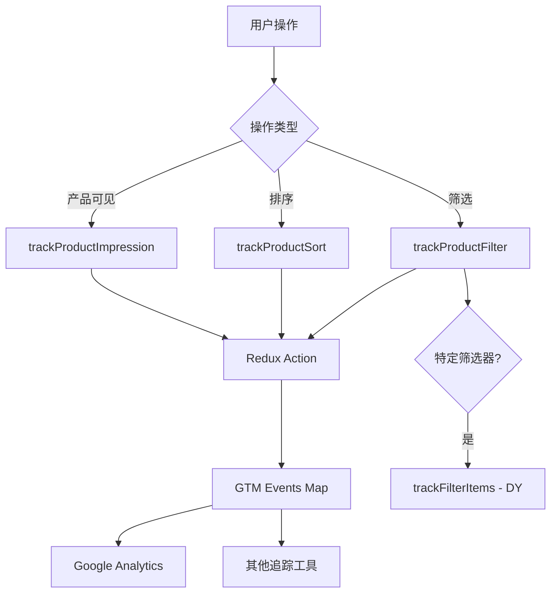

# Search Tracking 重构技术方案

## 概述

将 onepiece 中 Category 相关的事件上报功能重构到 joyboy 的 search 模块中，使用 InstantSearch 的事件系统来实现。

## 原有事件上报分析

### 1. 事件类型

#### 1.1 产品筛选事件 (Product Filter)

- **触发时机**: 用户应用筛选条件时
- **数据结构**:
  ```javascript
  {
    filterKey: string, // 筛选字段名
    label: string      // 筛选值的显示标签
  }
  ```
- **支持的筛选字段**:
  - `category`: 分类筛选
  - `tags`: 特色标签筛选 (新品、促销、清仓等)
  - `lead_time`: 发货时间筛选
  - `material_filter`: 材质筛选
  - `color`: 颜色筛选
  - `price`: 价格范围筛选
  - `length`: 长度范围筛选
  - `bed_frame_size`: 床架尺寸筛选
  - `overall_sit_rating`: 座椅舒适度筛选
  - `seat_depth_rating`: 座椅深度筛选
  - `seat_height_rating`: 座椅高度筛选
  - `seat_softness_rating`: 座椅软硬度筛选
  - `fabric_feature`: 面料特性筛选
  - `fabric_type`: 面料类型筛选
  - `quickship`: 快速发货筛选

#### 1.2 产品排序事件 (Product Sort)

- **触发时机**: 用户更改排序方式时
- **数据结构**:
  ```javascript
  {
    label: string; // 排序方式的显示标签
  }
  ```

#### 1.3 产品展示事件 (Product Impression)

- **触发时机**: 产品在页面上可见时
- **数据结构**:
  ```javascript
  {
    id: string,        // SKU
    name: string,      // 产品名称
    price: number,     // 价格
    dimension1: string, // 主分类名称
    category: string,  // 子分类名称
    brand: string,     // 品牌
    list: string       // 列表名称 (页面标识)
  }
  ```

#### 1.4 DY 筛选事件 (Filter Items for DY)

- **触发时机**: 特定筛选器应用时 (用于 Dynamic Yield)
- **支持的筛选类型**:
  - `material`: 材质
  - `featured`: 特色标签
  - `deliver`: 发货时间
  - `color`: 颜色

### 2. 事件上报流程



## InstantSearch 事件系统集成方案

### 1. 事件监听架构

InstantSearch 提供了多种事件监听方式：

#### 1.1 Middleware 方式 (推荐)

```typescript
const trackingMiddleware = (): Middleware => {
  return {
    onStateChange({ uiState }) {
      // 处理状态变化事件
    },
    subscribe() {
      // 组件挂载时的初始化
    },
    unsubscribe() {
      // 组件卸载时的清理
    },
  };
};
```

#### 1.2 组件级别的 Hook 监听

```typescript
// 在各个组件中使用对应的 hook 监听
const { items, refine } = useRefinementList({
  attribute: 'category',
  // 自定义 refine 函数来添加追踪
});
```

### 2. 实现方案

#### 2.1 创建 Tracking Middleware

```typescript
// src/lib/tracking/search-tracking-middleware.ts
export interface SearchTrackingConfig {
  // GTM 配置
  enableGTM?: boolean;
  // DY 配置
  enableDY?: boolean;
  dyFilters?: string[];
  // 其他追踪工具配置
}

export function createSearchTrackingMiddleware(config: SearchTrackingConfig = {}): Middleware {
  return {
    onStateChange({ uiState, setUiState }) {
      // 处理筛选和排序事件
      handleFilterAndSortTracking(uiState);
    },

    subscribe() {
      // 初始化产品展示追踪
      initializeImpressionTracking();
    },

    unsubscribe() {
      // 清理定时器等资源
      cleanupTracking();
    },
  };
}
```

#### 2.2 筛选和排序追踪

```typescript
// src/lib/tracking/filter-sort-tracking.ts
function handleFilterAndSortTracking(uiState: UiState) {
  const indexState = uiState[indexName];

  // 处理筛选追踪
  Object.entries(indexState.refinementList || {}).forEach(([attribute, values]) => {
    if (values && values.length > 0) {
      const lastValue = values[values.length - 1];
      trackProductFilter({
        filterKey: attribute,
        label: transformFilterLabel(attribute, lastValue),
      });

      // DY 特定筛选追踪
      if (isDyTrackedFilter(attribute)) {
        trackFilterItems(getDyFilterType(attribute), transformFilterLabel(attribute, lastValue));
      }
    }
  });

  // 处理范围筛选追踪
  Object.entries(indexState.range || {}).forEach(([attribute, range]) => {
    if (range && (range.min !== undefined || range.max !== undefined)) {
      trackProductFilter({
        filterKey: attribute,
        label: formatRangeLabel(attribute, range),
      });
    }
  });

  // 处理排序追踪
  if (indexState.sortBy && indexState.sortBy !== previousSortBy) {
    trackProductSort({
      label: getSortLabel(indexState.sortBy),
    });
    previousSortBy = indexState.sortBy;
  }
}
```

#### 2.3 产品展示追踪

```typescript
// src/lib/tracking/impression-tracking.ts
import { useHits } from 'react-instantsearch';

export function useImpressionTracking() {
  const { hits } = useHits();

  useEffect(() => {
    // 设置 Intersection Observer 来追踪产品可见性
    const observer = new IntersectionObserver(
      (entries) => {
        entries.forEach((entry) => {
          if (entry.isIntersecting) {
            const productElement = entry.target as HTMLElement;
            const hitIndex = productElement.dataset.hitIndex;
            if (hitIndex) {
              const hit = hits[parseInt(hitIndex)];
              trackProductImpression(hit);
            }
          }
        });
      },
      { threshold: 0.5 }
    );

    // 观察所有产品元素
    const productElements = document.querySelectorAll('[data-hit-index]');
    productElements.forEach((el) => observer.observe(el));

    return () => observer.disconnect();
  }, [hits]);
}
```

#### 2.4 Hit 组件集成

```typescript
// src/lib/instantsearch/hit.tsx (修改现有组件)
export function CustomHit({ hit, ...props }: CustomHitProps) {
  const hitRef = useRef<HTMLDivElement>(null);

  // 添加 data 属性用于追踪
  return (
    <div
      ref={hitRef}
      data-hit-index={hit.__position}
      data-hit-sku={hit._source.variants[0]?.sku}
      onClick={() => {
        // 处理产品点击追踪
        trackProductClick(hit);
        onProductClick?.(convertSearchHitToProductData(hit), selectedVariant);
      }}
    >
      {/* 现有的产品展示内容 */}
    </div>
  );
}
```

### 3. 配置和初始化

#### 3.1 在 SearchView 中集成

```typescript
// src/lib/search-view/index.tsx (修改现有组件)
export function SearchView({
  // ... 现有 props
  trackingConfig,
}: SearchViewProps & { trackingConfig?: SearchTrackingConfig }) {
  const trackingMiddleware = useMemo(() => createSearchTrackingMiddleware(trackingConfig), [trackingConfig]);

  return (
    <InstantSearch searchClient={searchClient} indexName={indexName}>
      <Configure {...searchParameters} />

      {/* 添加追踪中间件 */}
      <Middleware middleware={trackingMiddleware} />

      {/* 现有组件 */}
      <SearchBox />
      <RefinementList attribute="category" />
      <CustomHits />
    </InstantSearch>
  );
}
```

#### 3.2 类型定义

```typescript
// src/lib/tracking/types.ts
export interface FilterTrackingData {
  filterKey: string;
  label: string;
}

export interface SortTrackingData {
  label: string;
}

export interface ImpressionTrackingData {
  id: string;
  name: string;
  price: number;
  dimension1: string;
  category: string;
  brand: string;
  list: string;
}

export interface DyFilterTrackingData {
  filterType: string;
  filterStringValue: string;
}
```

### 4. 外部集成接口

#### 4.1 事件回调接口

```typescript
// src/lib/tracking/callbacks.ts
export interface SearchTrackingCallbacks {
  onProductFilter?: (data: FilterTrackingData) => void;
  onProductSort?: (data: SortTrackingData) => void;
  onProductImpression?: (data: ImpressionTrackingData) => void;
  onDyFilter?: (data: DyFilterTrackingData) => void;
}

// 在应用层注册回调
const trackingCallbacks: SearchTrackingCallbacks = {
  onProductFilter: (data) => {
    // 发送到 GTM
    gtag('event', 'product_filter', {
      custom_parameter_1: data.filterKey,
      custom_parameter_2: data.label,
    });
  },

  onProductSort: (data) => {
    // 发送到 GTM
    gtag('event', 'product_sort', {
      sort_method: data.label,
    });
  },

  onProductImpression: (data) => {
    // 发送到 GTM Enhanced Ecommerce
    gtag('event', 'view_item_list', {
      currency: 'USD',
      value: data.price,
      items: [data],
    });
  },

  onDyFilter: (data) => {
    // 发送到 Dynamic Yield
    window.dy?.('event', {
      name: 'Filter Items',
      properties: {
        dyType: 'filter-items-v1',
        filterType: data.filterType,
        filterStringValue: data.filterStringValue,
      },
    });
  },
};
```

## 迁移步骤

### 1. 阶段一：基础架构搭建

- [ ] 创建 tracking 模块目录结构
- [ ] 实现 Middleware 基础框架
- [ ] 定义事件数据类型

### 2. 阶段二：筛选和排序追踪

- [ ] 实现筛选事件追踪
- [ ] 实现排序事件追踪
- [ ] 添加 DY 特定筛选追踪

### 3. 阶段三：产品展示追踪

- [ ] 实现 Intersection Observer 基础
- [ ] 集成到 Hit 组件
- [ ] 处理定时批量上报

### 4. 阶段四：外部集成

- [ ] 实现回调接口
- [ ] 集成 GTM
- [ ] 集成 Dynamic Yield
- [ ] 添加配置选项

### 5. 阶段五：测试和优化

- [ ] 单元测试
- [ ] 集成测试
- [ ] 性能优化
- [ ] 文档完善

## 技术优势

1. **松耦合设计**: 通过 Middleware 和回调接口实现与具体追踪工具的解耦
2. **性能优化**: 使用 Intersection Observer 和批量上报减少性能影响
3. **类型安全**: 全面的 TypeScript 类型定义
4. **可配置**: 支持灵活的配置选项
5. **渐进式迁移**: 可以逐步替换原有系统

## 注意事项

1. **事件去重**: 需要防止重复事件上报
2. **性能监控**: 监控追踪代码对搜索性能的影响
3. **向后兼容**: 确保与现有追踪系统的兼容性
4. **数据一致性**: 确保新旧系统上报的数据格式一致
