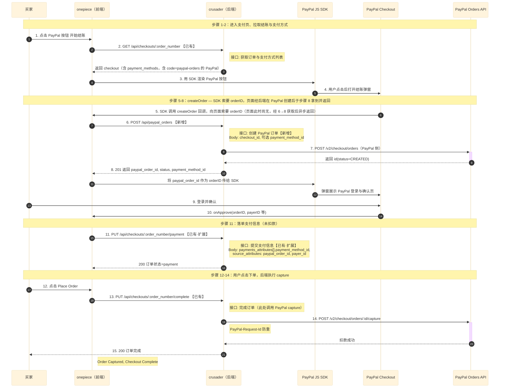

# Braintree PayPal 切换至 PayPal Orders API 技术方案

> 同步自 Confluence：[技术方案]braintree 切 paypal  
> https://castlery.atlassian.net/wiki/spaces/EC/pages/3889856534/braintree+paypal

## 1. 背景

### 1.1 项目/需求概述

**需求来源：**  
Braintree 即将到期，需用 PayPal 官方 Orders API 替代当前通过 Braintree 的在线 PayPal 支付流程。

**当前业务现状：**  
在线 PayPal 支付通过 Braintree 实现：前端拉取 Braintree client token → 用户授权得到 nonce → 提交 payment 落库 → complete 时调用 Braintree transaction.sale 扣款。  
支付信息落在 `Spree::CreditCard`（含 `gateway_payment_nonce`、`payer_email` 等）。

**本方案目标：**

- 新增 PayPal Orders API 支付方式（create order → 前端授权 → payment 落单 → complete 时 capture），与现有 Braintree 在线 PayPal 并行；
- 前端可先灰度切至新 PayPal，稳定后下线 Braintree 在线 PayPal 相关接口与配置；
- 保持现有 checkout 主链（payment 仅落单、complete 时扣款），不改变订单状态机；
- 同一订单仅支持一种支付方式，同一 Email 仅与单笔订单支付对应，无额外幂等维度。

**工作量评估：** 约 8 sprint points（后端 5 + 前端联调 2 + 测试与文档 1）

### 1.2 相关背景

- **数据规模：** 与现有 checkout 一致，无新增高 QPS 接口。
- **涉及市场：** AU, SG, US, CA, UK（与现网一致，按 store/路由区分）。
- **技术栈：** Rails、Solidus、PayPal REST API（Orders API）、现有支付链（`Spree::PaymentMethod` / Gateway）。
- **路由方式：** 沿用现有 `/api` 路由，无新网关或域名。
- **环境：** 与现网一致；PayPal 侧使用 sandbox / live 由 ENV 控制。

---

## 2. 时序图与接口文档

### 2.1 接口时序图



图中按步骤标注了与后端接口的对应关系，并区分【新增】、【已有】、【已有·扩展】接口：

- **步骤 2**：`GET /api/checkouts/:order_number` 【已有】
- **步骤 6**：`POST /api/paypal_orders` 【新增】
- **步骤 11**：`PUT /api/checkouts/:order_number/payment` 【已有·扩展】
- **步骤 13**：`PUT /api/checkouts/:order_number/complete` 【已有】

### 2.2 接口文档

- https://app.apifox.com/link/project/497933/apis/api-421595477

---

## 3. 接口变更

### 3.1 新增接口

| 方法 | 路径               | 描述                                                      | 备注                                                   |
| ---- | ------------------ | --------------------------------------------------------- | ------------------------------------------------------ |
| POST | /api/paypal_orders | 创建 PayPal 订单，返回 paypal_order_id、payment_method_id | 供前端 createOrder 回调调用，需在 PUT payment 之前调用 |

**接口文档（Apifox）：**  
[【新增】创建 PayPal 订单 - POST /paypal_orders（接口 ID：421595477）](https://app.apifox.com/link/project/497933/apis/api-421595477)

**接口详情：**

- **请求参数：** `checkout_id`（必填）、`payment_method_id`（可选）。
- **请求头：** X-Channel（必填）、X-Access-Token / X-Spree-Order-Token（按登录/游客）。
- **响应格式：** JSON，成功 201 返回 `paypal_order_id`、`status`、`payment_method_id`；失败 4xx/5xx 返回错误信息。
- **错误码：** 沿用现有 API 错误码体系，无单独错误码表。

详细说明见上文 **2.2 接口文档**（Apifox 链接）。

### 3.2 修改接口

| 方法 | 路径                                 | 变更说明                                                                                                                                                                              |
| ---- | ------------------------------------ | ------------------------------------------------------------------------------------------------------------------------------------------------------------------------------------- |
| PUT  | /api/checkouts/:order_number/payment | **请求体扩展**：`payments_attributes[].source_attributes` 支持新增字段 `paypal_order_id`、`payer_id`。当 payment_method 为 PayPal 时，传上述两字段即可，无需 `payment_method_nonce`。 |

**兼容性：** 仅新增可选字段，原有 Braintree/卡支付请求体不变，不影响现有调用方。

### 3.3 删除接口

无。Braintree 下线阶段将关闭 `POST /api/braintree_client_tokens` 及 Braintree 支付方式配置，不在本方案开发范围内，单独排期。

**兼容性处理说明：** 新增接口 + 扩展 payment 请求体，不改变现有接口契约语义，不影响现有 Braintree/Stripe/ZipPay 等支付流程。

---

## 4. 测试点

### 4.1 功能测试点

- 调用 `POST /api/paypal_orders` 传入有效 `checkout_id`，验证返回 `paypal_order_id`、`payment_method_id`，且 PayPal 侧订单状态为 `CREATED`。
- 使用返回的 `paypal_order_id`、前端 `onApprove` 的 `payer_id` 调用 `PUT payment`，验证订单进入 payment 状态，且 `spree_paypal_sources` 落库正确。
- 调用 `PUT complete`，验证 PayPal capture 成功、订单完成，且 `paypal_capture_id`、`payer_email` 等回写正确。
- 同一 `paypal_order_id` 或同一订单重复 complete：验证幂等（已 capture 则不再调 PayPal，或返回业务错误）。
- 边界：`checkout_id` 不存在、`payment_method` 非 PayPal 或未激活、`paypal_order_id` 无效或已过期等，验证错误响应。

### 4.2 兼容性测试点

- 现有 Braintree 在线 PayPal 流程仍可正常完成支付与下单。
- 现有 Stripe、ZipPay、Affirm 等支付方式不受影响。
- `GET /api/checkouts/:order_number` 返回的 `payment_methods` 中同时存在 Braintree 与 PayPal 时，前端可按 `code` 区分（`paypal-online` vs `paypal-orders`）。

### 4.3 非功能测试点

- 性能：`POST /api/paypal_orders`、`PUT payment`、`PUT complete` 响应时间与现有接口同量级（目标 P99 < 3s，视 PayPal API 与网络而定）。
- 异常：PayPal API 超时/失败时，complete 返回明确错误，不重复扣款；External/积分等不在此方案范围。
- 安全：ENV 中 PayPal 密钥不落库、不写日志；`PayPal-Request-Id` 用于 capture 幂等。

### 4.4 回归测试点

- 现有用户注册、登录、结账流程不受影响。
- 管理端支付方式配置（模式 A：ENV + 静态偏好）可正常启用/停用 PayPal 支付方式。

---

## 5. 技术实现

### 5.1 接口时序与接口文档

接口时序图与接口文档见上文 **第 2 节 时序图与接口文档**。

### 5.2 DB 设计

**新增表：** `spree_paypal_sources`（支付源，与 `Spree::PaypalSource` 对应）

```sql
CREATE TABLE `spree_paypal_sources` (
  `id` bigint(20) NOT NULL AUTO_INCREMENT,
  `user_id` int(11) DEFAULT NULL,
  `payment_method_id` int(11) DEFAULT NULL,
  `paypal_order_id` varchar(255) NOT NULL COMMENT 'PayPal 订单 ID',
  `payer_id` varchar(255) DEFAULT NULL,
  `paypal_capture_id` varchar(255) DEFAULT NULL COMMENT 'PayPal capture 返回的 ID，用于幂等与对账',
  `payer_email` varchar(255) DEFAULT NULL,
  `raw_response` text,
  `created_at` datetime(6) NOT NULL,
  `updated_at` datetime(6) NOT NULL,
  PRIMARY KEY (`id`),
  KEY `index_spree_paypal_sources_on_paypal_order_id` (`paypal_order_id`),
  KEY `index_spree_paypal_sources_on_paypal_capture_id` (`paypal_capture_id`)
) ENGINE=InnoDB DEFAULT CHARSET=utf8mb4 COMMENT='PayPal Orders API 支付源';
```

**字段说明：**

| 字段名                  | 类型         | 是否可空 | 说明                                |
| ----------------------- | ------------ | -------- | ----------------------------------- |
| id                      | bigint       | 否       | 主键                                |
| user_id                 | int          | 是       | 用户 ID（若已登录）                 |
| payment_method_id       | int          | 是       | 支付方式 ID                         |
| paypal_order_id         | varchar(255) | 否       | PayPal 订单 ID（create order 返回） |
| payer_id                | varchar(255) | 是       | PayPal payer id（onApprove 回调）   |
| paypal_capture_id       | varchar(255) | 是       | capture 成功后的 ID，用于幂等       |
| payer_email             | varchar(255) | 是       | 回写用于展示                        |
| raw_response            | text         | 是       | 可选，capture 原始响应              |
| created_at / updated_at | datetime(6)  | 否       | 审计时间                            |

**数据迁移方案：** 仅新增表，无历史数据迁移。

**回滚方案：** 下线 PayPal 支付方式后可保留表结构便于历史订单查询，或 `DROP TABLE`（需确认无未完成订单引用）。

### 5.3 关键代码

**新增/修改文件（概要）：**

- **新增**

  - `app/models/spree/payment_method/paypal.rb`  
    PayPal 支付方式，`create_order`、`purchase`（内部调 capture），幂等依赖 `paypal_capture_id`。
  - `app/models/spree/paypal_source.rb`  
    支付源模型，校验 `paypal_order_id`。
  - `app/lib/pay_pal_checkout/api_client.rb`  
    PayPal REST 调用（token、create order、capture），带 `PayPal-Request-Id`。
  - `app/lib/pay_pal_checkout/provider.rb`  
    封装 `create_order` / `capture_order` 与订单金额、currency 构造。
  - `app/controllers/api/paypal_orders_controller.rb`  
    `POST /api/paypal_orders`，校验订单与 payment_method，返回 `paypal_order_id` 等。
  - `app/serializers/spree/order_paypal_source_serializer.rb`  
    订单支付列表中 PayPal source 的序列化。
  - `db/migrate/*_create_spree_paypal_sources.rb`  
    创建上表。

- **修改**
  - `config/routes/v1.rb`：增加 `resources :paypal_orders, only: [:create]`。
  - `app/controllers/api/checkouts_controller.rb`：`payment_params` 中 `source_attributes` 增加 `paypal_order_id`、`payer_id`。
  - `app/serializers/spree/order_payment_serializer.rb`：source 为 `PaypalSource` 时使用 `OrderPaypalSourceSerializer`。
  - `app/serializers/spree/payment_method_serializer.rb`：可选返回 `code`，便于前端区分 `paypal-orders`。
  - `config/initializers/spree.rb`：注册 `Spree::PaymentMethod::Paypal`、静态偏好 `paypal_env_configuration`（ENV：`PAYPAL_CLIENT_ID`、`PAYPAL_CLIENT_SECRET`、`PAYPAL_ENV`、`PAYPAL_BRAND_NAME`）。
  - `db/samples/payment_methods.rb`：新增 PayPal 支付方式（默认 `active: false`），管理端不录入密钥（模式 A）。

**幂等与防重：**

- 同一 `paypal_order_id` 仅能对应一笔订单支付（由业务流保证）；同一订单仅允许一笔 PayPal 支付。
- Capture：若 source 已存在 `paypal_capture_id`，则 `purchase` 直接返回成功，不再调 PayPal。
- 请求层使用 `PayPal-Request-Id`（如 `capture-{payment.number}`）降低重复 capture 风险。

### 5.4 接口鉴权

- **鉴权方式：** 与现有 checkout 一致，无需新增鉴权逻辑。
  - 登录用户：`X-Access-Token`
  - 游客：`X-Spree-Order-Token` + 订单归属校验
- **PayPal 侧：** 使用 ENV 中的 `client_id` / `client_secret` 调用 PayPal OAuth2 与 Orders API，密钥不传输、不写日志。

### 5.5 异步/定时任务

- 无新增定时任务。
- 积分、风控等由现有流程/External 系统负责，本方案不涉及。

### 5.6 其他实现细节

- **缓存：** 无新增缓存；PayPal 支付方式列表随现有 `payment_methods` 接口返回。
- **监控/日志：** 建议记录 create order、capture 成功/失败及 `request_id`，便于对账与排查；不记录密钥及完整 payer 信息。
- **配置：** 管理端仅可启用/停用 PayPal 支付方式，密钥通过 ENV + 静态偏好配置（模式 A），见 `etc/env/env` 中 `PAYPAL_*` 变量说明。

---

## 6. 安全相关

- **输入校验：** `checkout_id`、`payment_method_id`、`paypal_order_id`、`payer_id` 格式与存在性校验；Email 由 PayPal 侧返回后回写，不做前端不可信输入解析。
- **权限控制：** 沿用现有订单归属与 checkout 权限，无新增权限模型。
- **限流/熔断：** 沿用现有 API 限流；PayPal API 超时或失败时返回错误，不重试扣款（避免重复扣款）。
- **风险点与防范：**
  - 重复 capture：通过 `paypal_capture_id` 幂等与 `PayPal-Request-Id` 控制。
  - 密钥泄露：密钥仅存 ENV，管理端不可见，需运维规范保管。

---

## 7. 文档参考

- **需求/背景：** 业务侧 Braintree 切 PayPal 需求说明（可贴 Confluence/ClickUp 链接）。
- **时序图：** 见上文 **第 2.1 节**。
- **接口文档：** 见上文 **第 2.2 节**。
- **支付流程说明：** `docs/know-how/Payment Flow.md`（含 Braintree 与 PayPal 小节）。
- **现有 Braintree 时序：** `docs/know-how/在线PayPal-Braintree支付流程.mmd`。
- **PayPal 官方：**
  - https://developer.paypal.com/studio/checkout/standard/getstarted

---

## 8. 附录

### 8.1 变更历史

| 版本 | 作者  | 日期    | 修改内容                                                               |
| ---- | ----- | ------- | ---------------------------------------------------------------------- |
| v1.0 | kaize | 2026-03 | 初始版本，覆盖新增 PayPal Orders API、扩展 payment、DB、配置与上线节奏 |

### 8.2 风险评估

- **PayPal API 不可用/超时：** complete 失败，用户可重试或换支付方式；需监控 capture 成功率与告警。
- **前端未按序调用：** 依赖前端按 createOrder → payment → complete 顺序调用；接口侧校验 order 状态与 payment 合法性。
- **Braintree 下线时机：** 需与前端、产品确认灰度与全量切流计划，避免双写或漏切。

### 8.3 上线计划

- **Phase 1（并行）：** 上线 PayPal 新链路，Braintree 保持可用；PayPal 支付方式默认关闭或仅对部分市场开放。
- **Phase 2（灰度）：** 前端按市场/比例切流至新 PayPal，监控成功率与错误码。
- **Phase 3（下线 Braintree）：** 关闭 Braintree 在线 PayPal 入口及 `POST /api/braintree_client_tokens`，保留历史订单与数据查询。

**回滚：** 关闭 PayPal 支付方式（`active=false` 或从 `payment_methods` 移除），前端切回 Braintree；无需回滚 DB 表结构。

### 8.4 工作量评估

| 项                                            | Points   | 说明                                                                  |
| --------------------------------------------- | -------- | --------------------------------------------------------------------- |
| 后端：支付方式 / Provider / API / 路由 / 配置 | 3        | create order、capture、幂等、ENV 配置                                 |
| 后端：DB 与 migration、Source 模型与序列化    | 1        | `spree_paypal_sources`、`PaypalSource`、`OrderPaypalSourceSerializer` |
| 接口文档与 know-how 更新                      | 0.5      | `paypal_checkout.json`、时序图、Payment Flow                          |
| 前端联调与联调用例                            | 2        | createOrder、onApprove、payment/complete 调用                         |
| 测试与回归                                    | 1.5      | 功能、兼容性、幂等、回归                                              |
| **合计**                                      | **约 8** |                                                                       |
