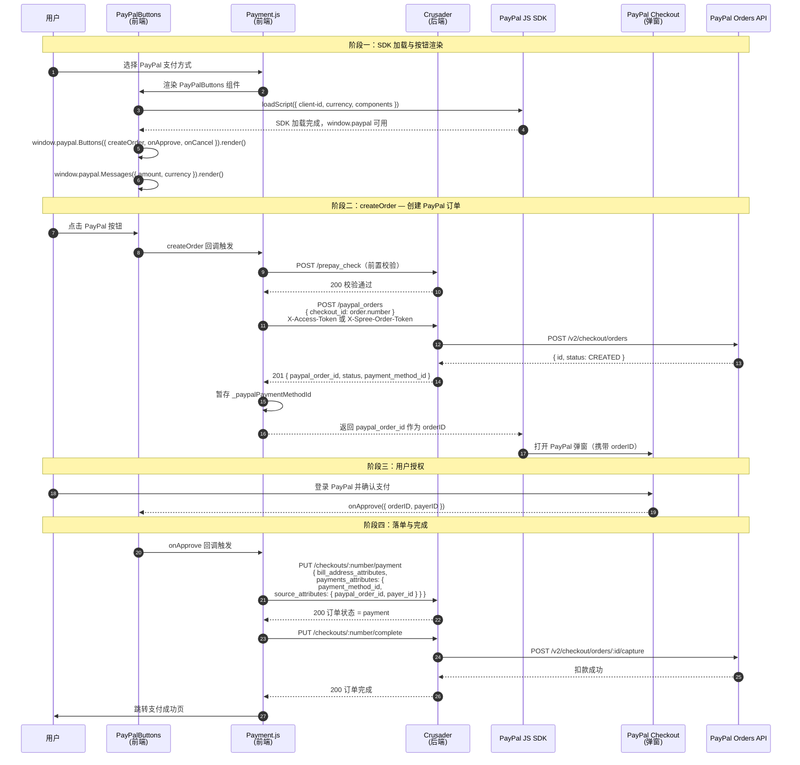

# PayPal 原生 SDK 迁移技术说明

> 文档版本：v2.0
> 更新日期：2026-03-04
> 背景：Braintree 集成 PayPal 的 SDK 即将到期，迁移至 PayPal 原生 JS SDK，并对接后端 PayPal Orders API

---

## 一、背景与目标

前端使用 PayPal 原生 JS SDK（`@paypal/paypal-js`）直接接入 PayPal 支付，后端通过 PayPal Orders API（`POST /v2/checkout/orders` + `POST /v2/checkout/orders/:id/capture`）完成建单与扣款，不影响其他支付方式（Stripe、Zip、Affirm、GrabPay 等）。

### 涉及站点

| 站点 | PayPal 支持 | 说明                      |
| ---- | ----------- | ------------------------- |
| AU   | ✅          | `PAYPAL_CLIENT_ID` 已配置 |
| US   | ✅          | `PAYPAL_CLIENT_ID` 已配置 |
| SG   | ✅          | `PAYPAL_CLIENT_ID` 已配置 |
| CA   | ❌          | 不支持 PayPal             |
| UK   | ❌          | 不支持 PayPal             |

---

## 二、架构决策

### 决策 1：使用 `@paypal/paypal-js` 代替手动注入 `<script>`

**背景**：旧方案和早期迁移草案均使用手动创建 `<script>` 标签的方式加载 SDK。

**选择**：改用官方 npm 包 `@paypal/paypal-js` 的 `loadScript` 函数。

**理由**：

- `loadScript` 内部处理脚本去重、加载状态缓存，避免多次渲染时重复注入 `<script>`
- 返回 Promise，错误处理更清晰
- 与官方推荐实践一致

```javascript
// PayPalButtons.js
import { loadScript } from '@paypal/paypal-js';

loadScript({
  'client-id': __PAYPAL_CLIENT_ID__,
  currency: order.currency, // important
  components: 'buttons,messages',
});
```

---

### 决策 2：SDK 加载与按钮渲染封装至独立组件 `PayPalButtons`

**背景**：旧方案所有 PayPal 逻辑（SDK 加载、按钮初始化、回调）都在 `Payment.js` 中。

**选择**：将 SDK 加载和按钮渲染抽离为 `PayPalButtons.js` 函数组件，业务回调（`createOrder`、`onApprove`、`onCancel`）由 `Payment.js` 传入。

**理由**：

- `Payment.js` 只关注业务逻辑，不关心 SDK 的加载细节
- 组件卸载时自动清理 DOM，不需要手动 `teardown`
- `PayPalMessages` 渲染逻辑独立管理，支持 `order.total` 变更时重新渲染

## 三、完整支付时序



---

## 四、前端实现

### 4.1 组件结构

```
Payment.js (Class Component)
├─ 状态: paymentMethod, processing, checked, ...
├─ 业务回调:
│   ├─ handlePayPalCreateOrder()   → createOrder 回调
│   ├─ handlePayPalApprove()       → onApprove 回调
│   └─ handlePayPalCancel()        → onCancel 回调
└─ renderSubmitButton()
    └─ case 'paypal':
        └─ <PayPalButtons
               order={order}
               createOrder={handlePayPalCreateOrder}
               onApprove={handlePayPalApprove}
               onCancel={handlePayPalCancel}
               ...
           />

PayPalButtons.js (Function Component)
├─ useEffect: loadScript() → renderButtons() + renderMessages()
├─ useEffect([order.total]): 金额变更时重渲染 Messages
└─ 渲染 #paypalButtons 容器 + #paypalMessage 容器
```

### 4.2 createOrder 实现

```javascript
// Payment.js
handlePayPalCreateOrder = () => {
  const { checked } = this.state;
  if (!checked) {
    return Promise.reject(new Error("User haven't accept terms"));
  }
  const {
    prePayCheck,
    cart: { data: order },
  } = this.props;
  this.setState({ processing: true });

  const accessToken = Cookie.get('access_token');
  const orderToken = Cookie.get('order_token');
  const options = { data: { checkout_id: order.number } };
  if (accessToken) {
    options.auth = 'strict'; // ApiClient 自动附加 X-Access-Token
  } else {
    options.header = { 'X-Spree-Order-Token': orderToken };
  }

  return prePayCheck()
    .then(() => this.client.post('/paypal_orders', options))
    .then(({ paypal_order_id, payment_method_id }) => {
      this._paypalPaymentMethodId = payment_method_id; // 暂存，onApprove 时使用
      return paypal_order_id; // 返回给 PayPal SDK
    });
};
```

> **注意**：`X-Channel: web` 由 `ApiClient.createRequest` 对所有非外部 URL 自动注入，无需手动传递。

### 4.3 onApprove 实现

```javascript
// Payment.js
handlePayPalApprove = ({ orderID, payerID }) =>
  this.confirmPayment({
    payment_method_id: this._paypalPaymentMethodId,
    source_attributes: {
      paypal_order_id: orderID,
      payer_id: payerID,
    },
  })
    .then((result) => this.complete(result)) // PUT /complete → 后端 capture
    .catch((e) => this.errMsg(e))
    .finally(() => this.setState({ processing: false }));
```

> `this.confirmPayment(paymentAttributes)` 是 `Payment.js` 内部封装，调用时自动附加 `bill_address_attributes`，然后 dispatch `confirmPayment` Redux action（`PUT /checkouts/:n/payment`）。

### 4.4 SDK 加载实现

```javascript
// PayPalButtons.js
import { loadScript } from '@paypal/paypal-js';

useEffect(() => {
  onLoading(true);
  loadScript({
    'client-id': __PAYPAL_CLIENT_ID__,
    currency: order.currency, // 必须与后端创建 PayPal 订单时的 currency 一致
    components: 'buttons,messages',
  })
    .then(() => {
      onLoading(false);
      renderButtons();
      renderMessages();
    })
    .catch((e) => {
      onLoading(false);
      onError(e);
    });
}, []);
```

---

## 五、后端接口对接

### 5.1 接口一览

| 接口                            | 方法 | 调用时机              | 说明                                                        |
| ------------------------------- | ---- | --------------------- | ----------------------------------------------------------- |
| `POST /paypal_orders`           | 新增 | `createOrder` 回调    | 后端调 PayPal 创建订单，返回 `paypal_order_id`              |
| `PUT /checkouts/:n/payment`     | 扩展 | `onApprove` 回调后    | 新增 `source_attributes.paypal_order_id` 和 `payer_id` 字段 |
| `PUT /checkouts/:n/complete`    | 已有 | `PUT /payment` 成功后 | 后端在此处执行 PayPal capture                               |
| `POST /braintree_client_tokens` | 废弃 | —                     | 迁移后前端不再调用                                          |

### 5.2 `POST /paypal_orders` 请求与响应

**请求**

```
POST /paypal_orders
X-Channel: web
X-Access-Token: <token>          （登录用户）
X-Spree-Order-Token: <token>     （游客）

{
  "checkout_id": "R123456789"
}
```

**响应（201）**

```json
{
  "paypal_order_id": "5O190127TN364715T",
  "status": "CREATED",
  "payment_method_id": 42
}
```

> `paypal_order_id` 字段名与 PayPal SDK 期望的 `orderID` 含义一致，前端直接返回给 `createOrder` 回调。

### 5.3 `PUT /checkouts/:n/payment` 请求扩展

PayPal 支付时的请求体（新增 `source_attributes` 字段，其余不变）：

```json
{
  "bill_address_attributes": { ... },
  "payments_attributes": {
    "payment_method_id": 42,
    "source_attributes": {
      "paypal_order_id": "5O190127TN364715T",
      "payer_id": "PAYERID123"
    }
  }
}
```

---

## 六、关键代码变更汇总

### `src/containers/Checkout/Payment.js`

| 变更类型                   | 内容                                                                                                          |
| -------------------------- | ------------------------------------------------------------------------------------------------------------- |
| 删除 import                | `approvePaypal`                                                                                               |
| 删除 connect dispatch      | `approvePaypal`                                                                                               |
| 删除 propTypes             | `approvePaypal: PropTypes.func.isRequired`                                                                    |
| 新增实例变量               | `_paypalPaymentMethodId = null`                                                                               |
| 新增方法                   | `handlePayPalCreateOrder`、`handlePayPalApprove`、`handlePayPalCancel`                                        |
| 修改 `changePaymentMethod` | 选择 PayPal 时仅 setState，SDK 加载委托给 `PayPalButtons` 组件                                                |
| 修改 `renderSubmitButton`  | PayPal 分支渲染 `<PayPalButtons>` 组件                                                                        |
| 删除旧方法                 | `setUpBrainTreeClient`、`setUpDataCollector`、`registerCreditcard`、`loadPayPalSDK`（原 Payment.js 内联版本） |
| 删除实例变量               | `braintreeClientToken`、`braintreeClientInstance`、`paypalCheckoutInstance`、`deviceData`                     |

### `src/redux/modules/cart.js`

| 变更类型 | 内容                                                                         |
| -------- | ---------------------------------------------------------------------------- |
| 删除     | `approvePaypal` 函数（原调用 `PUT /paypal_approve`，该接口不存在于后端方案） |

### `src/containers/Checkout/components/PayPalButtons.js`

| 变更类型       | 内容                                                                       |
| -------------- | -------------------------------------------------------------------------- |
| 新增组件       | 封装 SDK 加载（`@paypal/paypal-js` `loadScript`）、按钮渲染、Messages 渲染 |
| funding source | 仅渲染 `PAYPAL`，不单独渲染 `PAYLATER`                                     |
| Messages       | 独立 ref，`order.total` 变更时重渲染                                       |

### 未改动

- `src/containers/Checkout/components/PaymentMethod.js`
- Stripe / Zip / Affirm / GrabPay 相关代码
- `confirmPayment` Redux action（`cart.js`）

---

## 七、风险与处理

### 风险 1：`device_data`（Kount 反欺诈）不再收集

**问题**：旧方案通过 Braintree Data Collector 收集 `device_data` 随支付请求提交。移除 Braintree 后不再有此数据。

**处理**：PayPal 原生 SDK 内置风控，无需额外 Kount 数据。后端 `PUT /payment` 已做容错（原代码为 `if (this.deviceData)` 条件判断），不受影响。

---

### 风险 3：PayPal 按钮重复渲染

**问题**：用户多次切换支付方式时，`PayPalButtons` 组件重新 mount，可能重复渲染按钮。

**处理**：`renderButtons()` 执行前先 `containerRef.current.innerHTML = ''` 清空容器。`loadScript` 内部有去重机制，不会重复注入 `<script>` 标签。

---

## 八、部署检查清单

### 代码

- [x] 移除 `braintree-web` 相关 import 与依赖
- [x] 删除 `setUpBrainTreeClient`、`setUpDataCollector`、`registerCreditcard` 方法
- [x] 移除 `approvePaypal` Redux action
- [x] 新增 `PayPalButtons` 组件（SDK 加载 + 按钮渲染）
- [x] `handlePayPalCreateOrder`：`prePayCheck` → `POST /paypal_orders` → 返回 `paypal_order_id`
- [x] `handlePayPalApprove`：`confirmPayment`（含 PayPal source_attributes）→ `complete`

### 环境配置

- [ ] AU / US / SG：确认 `PAYPAL_CLIENT_ID` 已正确填写

### 后端联调确认

- [ ] `POST /paypal_orders` 响应包含 `paypal_order_id`、`payment_method_id` 字段
- [ ] `PUT /payment` 支持 `source_attributes.paypal_order_id` 和 `source_attributes.payer_id`
- [ ] `PUT /payment`（无 `payments_attributes`，仅 `bill_address_attributes`）后端不报错
- [ ] `PUT /complete` 在 `PUT /payment` 落单后可正确执行 PayPal capture

### 测试

- [ ] AU / US / SG 站：PayPal 正常支付全流程（弹窗打开 → 登录 → 确认 → 跳转成功页）
- [ ] PayPal Messages 正常渲染
- [ ] 取消 PayPal 弹窗后可重新发起支付
- [ ] 多次切换支付方式后 PayPal 按钮正常重渲染，无重复
- [ ] 其他支付方式（Stripe、Zip、Affirm、GrabPay）回归验证

---

## 九、待清理（不纳入本次范围）

- `src/config/index.js` 中 `paypalClientIdRequired` 变量（已废弃，可删除）
- `componentWillUnmount` 中 `this.hostedFields.teardown()` 相关死代码（`hostedFields` 从未被赋值）
