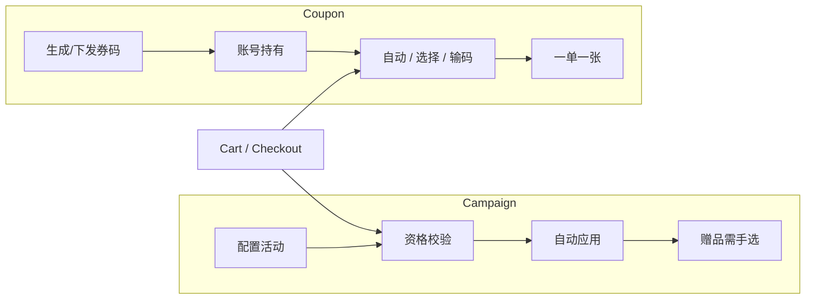

先说结论：海外独立站的用户促销，不要做成「一个促销工具里堆所有能力」。要拆成两套对象：

- **Campaign（促销活动）**：面向一群人、短周期、多数自动应用。
- **Coupon（优惠券）**：面向个体、有券码生命周期（生成 → 下发 → 核销），用户可选择或输入。

我在这个项目里做的是 C 端 / POS 前台。后台配置字段很多，但前台真正要盯住的只有三件事：**这笔订单现在命中了什么、能不能叠加、金额怎么摊到每一个费项上**。Cart、Address、Shipping、Payment 每走一步都要重算，因为商品、运费、服务费、邮编一变，资格就可能失效。

---

## 1. 为什么旧系统撑不住

旧促销和整站后台捆在一个单体里，多年功能堆积之后会出现三类问题：

1. **结果不可控**：同类活动、券、免运、赠品叠在一起，运营和用户都说不清最终扣了哪几笔。
2. **配置效率低**：活动和券互相牵制，改一个字段容易牵出另一套规则。
3. **前台体验差**：自动应用、进度条、选赠品、输码失败提示各走各的，VOC 会把「算错了 / 用不上」打回来。

重构目标不是再堆组件，而是把促销做成可扩展的系统：结构先分清，计算规则先写死，前台只消费计算结果。

---

## 2. 活动和券的本质差异

| 维度 | Campaign | Coupon |
|---|---|---|
| 典型场景 | 日常大促、全场满减、免运、满赠 | 用户激励、投放、积分兑换、定向券 |
| 作用范围 | 更偏全体或分群 | 更偏账号或一张码 |
| 用户动作 | 多数自动应用 | 自动（极严条件）/ 列表选择 / 输入券码 |
| 生命周期 | 活动生效窗口 + 次数上限 | 生成、下发、绑定、核销、失效 |
| 前台形态 | 进度条、选赠品、Promotion Details | 可用券列表、输码、My Voucher |

一句话记：

**活动是「系统替你用」；券是「你持有一张凭证再用」。**

---

## 3. 能力地图（合并 Phase 1 结构，不按排期读）

后台可以按模块记，前台按「会碰到的对象」记：

1. **权限与类目**
   - 角色权限：谁能配活动/券。
   - Category：Main / Sub / Sub2，用来追踪渠道和效果，不是给用户看的。
2. **Campaign 类型**
   - Product Discount、Bundle Discount、Order Discount
   - Free Gift、Free Shipping、Free Service
3. **Coupon 类型**
   - Discount / Free Gift / Free Shipping / Free Service / Mixed
4. **计算内核**
   - 默认叠加互斥
   - 自定义优先级（CAP / 全互斥 / Stack）
   - 分摊到 Item、运费、服务费
5. **前台**
   - 进度 Widget、选赠品、View Details
   - 自动用券、选券、输码、失败文案、积分兑换券

Phase 2 没有另起一套模型，主要是后台治理：例如免运券在「没有仍可用的已生成码」时，允许改 Share Code / 门槛 / 折扣类型。前台核销口径不变。

---

## 4. 前端读这套系统时的固定坐标系

把订单金额拆成几个**互相独立的费项**，优惠只会打在对应费项上：

| 费项 | 谁来减 |
|---|---|
| Item Subtotal | Product / Bundle / Order Discount，以及 Discount Coupon |
| Shipping | Free Shipping Campaign / Coupon |
| Service | Free Service Campaign / Coupon |
| Gift 行 | Free Gift（赠品售价 100% 减免，不进 Subtotal） |
| Warranty / Tax | 目前只有 Mixed Coupon 能免 |

计算顺序（默认层）永远是：

`Product > Bundle > Order > Gift > Shipping > Service`

再叠券时，同一费项上 **Campaign 先于 Coupon**。某项剩余可折扣金额到 0，后面所有优惠都停。

---

## 5. 资格什么时候重算

未登录也可以命中 Campaign（只要条件满足）。登录后还要看分群、首单、Unique Checker。

以下节点都要重新验证并自动应用（Free Gift 除外，赠品只能在 Cart 选）：

- 进 Cart / Address / Shipping / Payment
- 加减商品、改配送、改服务、改邮编

次数类限制都以 **支付成功** 为计数节点：

- User Times Limit：该账号参与次数
- Overall Usage Limit：活动总次数
- Unique Checker：同一用户/地址/手机是否已用过
- 首单：账号下没有「未取消且非纯色卡」的订单

纯色卡订单：订单里所有商品 `type = Swatch`。夹了任何非色卡商品，这笔单就要计入首单判断。

Campaign 和 Coupon 的首单口径必须一致，否则会出现「活动能用、券不能用」或反过来。

---

## 6. 我读前台时怎么用这张图

遇到一个促销 bug，按这个顺序问，基本能定位：

1. 这是 Campaign 还是 Coupon？
2. 打的是哪个费项？该项是不是已经为 0？
3. 有没有全互斥 / CAP / Stack？
4. 这一步是否触发了重算（邮编、服务、库存）？
5. 赠品是不是被要求回 Cart 重选？

下一篇把 Campaign 配置项收成一张表，再往下才是计算细节。
