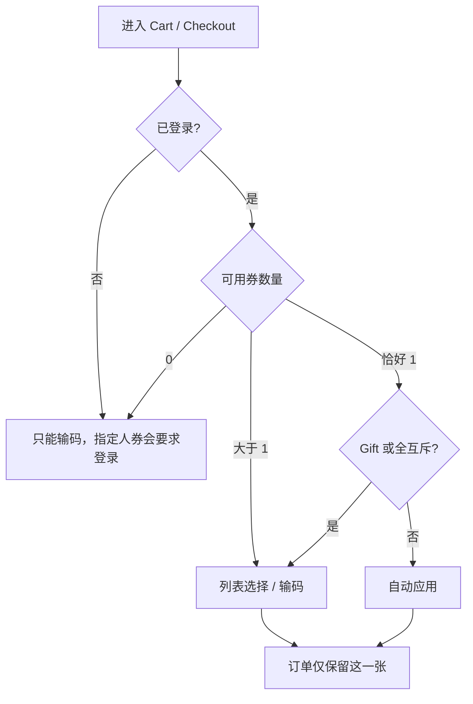

先说结论：券比活动多一层 **码**。一笔订单只能用 **一张 Coupon**。自动应用条件非常苛刻，绝大多数路径是「列表选」或「输码」。

---

## 1. 券和活动共用资格，但多了码状态

公共配置与 Campaign 类似：市场、名称、说明、有效期、邮编、用户范围、商品范围、渠道、是否与全部活动互斥。

多出来的是码：

| 能力 | 含义 |
|---|---|
| Share Code | 传播码，多人可兑成自己的 Unique Code |
| Unique Code | 落到账号上的那一张 |
| 批量生成 | 异步生成一批码 |
| 自动生成 | 按请求现生成 |
| 下发 | 邮箱绑定 / 批量导入 / 到账邮件 |
| 失效 | 运营作废某张码 |
| 每人限领 | 领码次数，不是核销次数 |

有效期三种：固定窗口、领取起 N 天、领取 X 天后再生效 N 天。

---

## 2. 五种券类型

| 类型 | 打在哪 | 前台要点 |
|---|---|---|
| Discount Coupon | 目标 Item，满额/满件、减或折 | 和 Product/Order 折扣一起摊到商品 |
| Free Gift Coupon | 赠品行全额免 | **只能在 Cart 用**；Checkout 输码要拒绝 |
| Free Shipping Coupon | 运费 | 运费已为 0 则不再用 |
| Free Service Coupon | 指定服务费 | Shipping 选完服务后才可能自动用上 |
| Mixed Coupon | 一次勾多个费项，含 Warranty / Tax 全免 | 列表默认排最前；Warranty 要并进券折扣展示 |

Mixed 的 Warranty：Cart / Checkout 要把这笔减免并进券的折扣金额；邮件和订单明细单独一行，才能和后台对账。

---

## 3. 一单一张，以及谁能自动用

自动应用必须同时满足：

1. 已登录
2. 这个 Cart/Checkout **账户下当前只有 1 张**可用券
3. 不是 Free Gift Coupon
4. 没有勾选「与全部活动互斥」
5. 用户这趟流程里没有已经手选或输过码（包括刚才被弹出的码）

多张可用 → 不自动用，提示 `xx vouchers available`。

勾了「与全部 Campaign 互斥」的券：**优先级高于活动的全互斥**。用户一旦选它，订单上所有 Campaign 都要拿掉。

同一 Web 渠道里，Checkout 手选的券要同步回 Cart；不同渠道隔离。

---

## 4. 码怎么核销（前台要接的失败语义）

输码或重算失败时，不要只丢一句 invalid。至少要能对上这些原因：

| 原因 | 用户侧含义 |
|---|---|
| Invalid Code | 码不存在 |
| Expired / Not started | 过期或未到有效期 |
| Fully Redeemed | Share Code 领完 |
| Already Redeemed | 这张 Unique 用过了 |
| Minimum Amount / Quantity | 门槛不够 |
| Limited to Location / SKUs | 邮编或商品范围不对 |
| Invalid channel | Web / POS / 门店不对 |
| Unique checker | 人/地址/手机已经用过这类优惠 |
| User usage limit | 达到参与次数 |
| Cannot combine | 和当前已应用活动互斥且活动优先 |
| Need login | 指定用户或「仅登录可用」 |

Checkout 过程中上一步还可用、下一步不可用，要带上 code 再提示一次，然后从订单上摘掉。

---

## 5. 逆向

整单取消：券退回账号。部分取消：券不退。Gift 券删赠品或关弹窗，等于释放这张码，要二次确认。

---

## 6. Phase 2 补丁：没有「仍可用的码」时允许改配置

这是后台规则，但会影响你对「为什么这个 Share Code 突然能改」的理解。

旧规则：只要生成过任何码，Share Code / Min Spend / 门槛类型 / 折扣类型全部锁死。运营配错就只能新建一整条活动、换一个码。

新规则：看生成码里是否还有 **仍可用** 的（未作废且未过期）。

- 有仍可用的码 → 继续锁
- 全部作废、全部过期、或两者混合 → 解锁
- 从未生成 → 和现在一样可改
- Share Code 改成功后，旧码记录释放，允许以后新建券时复用旧码
- 改码要做全局唯一校验；失败则旧码不释放
- 不改生成、下发、核销、前台结算

前后端判定必须同一套，禁止出现「表单能改、接口拒绝」或反过来。
