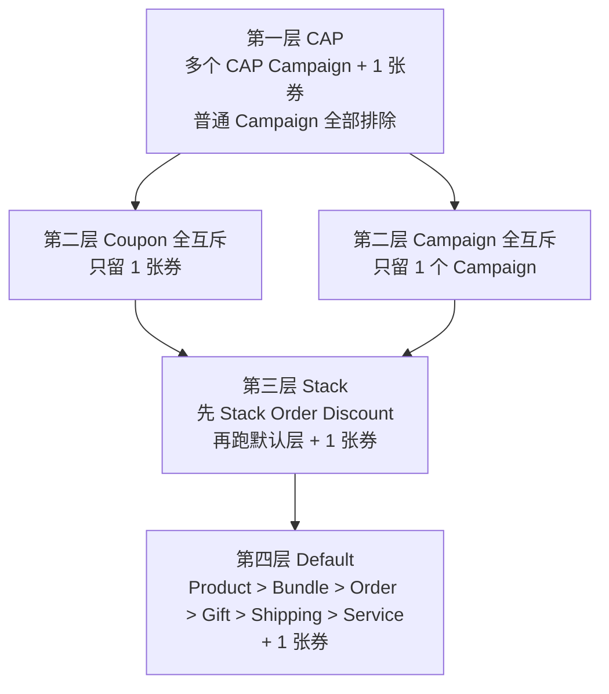

先说结论：前台看到的「-$xx」不是把所有折扣简单相加。系统先决定 **留下哪些 Campaign / 哪一张券**，再按费项和顺序做分摊。三个自定义开关在同一个 Campaign 上 **三选一**：Custom Application Priority（CAP）、Campaign 全互斥、Stack with default。

原 Confluence 流程图是超大位图，导出需要登录附件权限，这里按规则还原成分层图。数字例子保留，方便你自己手算。

---

## 1. 四层优先级（先决定「谁留下」）

读法：

1. **CAP**：勾了 CAP 的活动不受默认互斥约束。订单一旦用上 CAP，默认层活动全部排除；**券不受这条互斥**，仍按券规则留 1 张。多个 CAP 按 Priority 数值从小到大；Priority 相同看创建时间近的。
2. **Coupon 全互斥**：券勾了与全部活动互斥，且用户选了它 → 任何 Campaign 都不能自动留在订单上。这条 **高于** Campaign 的全互斥。
3. **Campaign 全互斥**：活动勾了与全部优惠互斥 → 普通活动和券都互斥，最终只留这 1 个活动（多条全互斥时取力度最大）。
4. **Stack**：仅 Order Discount 能勾。先应用 Stack 活动（多条取力度最大），再应用默认层。
5. **Default**：见下文同类型 / 跨类型规则。

CAP、全互斥、Stack 不能同时勾。

---

## 2. 默认层：同类型怎么留

- Product、Bundle：优惠 Item **不重合**可同时留；重合则该 Item 只吃力度最大的那条。
- Order、Gift、Shipping、Service：同类型只留 1 条，力度最大；力度相同看创建时间近的。
- Free Gift 原则上不要配成同一条件多条；真发生了，创建时间近的优先。

跨类型默认不互斥，顺序固定：

`Product > Bundle > Order > Gift > Shipping > Service`

叠加时 **按优惠前金额算各条优惠**，但分摊时用的是 **商品剩余可折扣金额**。某项 ≤ 0，后续 Campaign 和 Coupon 都停。可叠加额度大于剩余，按剩余封顶。

---

## 3. 分摊：钱怎么落到行上

全局原则：按对象售价占「本次优惠对象售价合计」的比例摊。最后一件用总优惠减去前面，避免一分钱对不上。

更新后的顺序：**剩余可折扣金额从小到大**。相等再按商品 code 从小到大。若摊到最后一个还有剩余，再滚一轮，先给剩余最大的商品，直到摊完。

### 手算例子

购物车：Casa bench $853（文案里后续按 839 计折扣基线）、Andre table $500。

1. Product 9 折只打 Casa → 折扣 755.1，Casa 剩余 83.9，Andre 仍 500。
2. Bundle 30% 打两件，封顶 $100。剩余 Andre > Casa，先 Casa 后 Andre → Casa 59.97，Andre 40.03。Casa 剩余 25.66，Andre 459.97。
3. Order 减 $100。总剩余 485.63 > 100。先 Casa：本应 59.97，但只剩 25.66，Casa 吃满归零；Andre 吃 74.34，剩余 385.63。

记住：**顺序是类型优先级，分摊是剩余从小到大。** 两者不是一回事。

### Product 不重合 / 重合

- Tag A 打 8%、Tag B 打 5%，商品不重合 → 两路都留。
- 一件商品同时带 A 和 B → 这件只走 8%，B 活动只打纯 B 商品。

同类两场都打 A、B，一场 8 折、一场减 200，取力度大的那一场，再把优惠摊回参与商品。

### Bundle 交叉商品

桌子既算餐桌又算茶几时，两个 Bundle 都可能算得出金额，只留更大的那个 Bundle，避免同一件货被两套组合重复打折。

### 运费 / 服务费

- 免运：最高限额封顶；已免运的运单不参与。
- 免服务：只打勾选的服务种类；金额为 0 不触发。

Gift：按赠品当前售价（或勾了原价则按原价）100% 减免，Subtotal 不含 Gift。

---

## 4. 券叠上来之后

一单一张券。同一费项：

| 费项 | 公式 | 顺序 |
|---|---|---|
| Item | 原价 − Product − Order − Coupon Discount | Product > Order > Coupon |
| Shipping | 原价 − 免运活动 − 免运券 | Campaign > Coupon |
| Service | 原价 − 免服务活动 − 免服务券 | Campaign > Coupon |

减穿了按 0。Warranty / Tax 目前只有 Mixed Coupon 能全免，不走均摊。

订单明细里 Mixed 按折扣类型拆行；商品折扣按参与商品拆行。后台订单要能对上每一行的 Promo Type / 券码 / 金额。

---

## 5. 前台最小检查清单

重算之后问自己：

1. 现在留下的是 CAP、全互斥、Stack 还是 Default？
2. 同类型是不是只留了该留的那些？
3. 每个 Item 的剩余可折扣金额有没有到 0？
4. 运费/服务费是不是本来就是 0，导致免运券/免服务券不该出现？
5. 详情里的合计是否等于各费项优惠之和？
