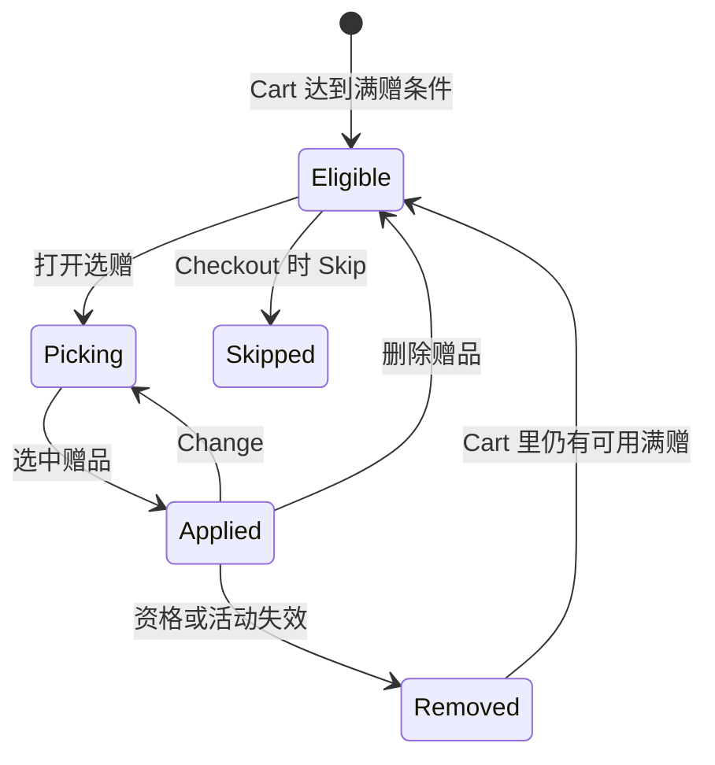

先说结论：Campaign 在前台几乎没有「领取」动作。用户能看见的只有三块：**差多少能触发**、**满赠要不要选**、**已经减了多少**。赠品是唯一必须手选的活动，而且只能在 Cart 选。

---

## 1. 进度 Widget（AOV 引导）

目标：告诉用户再加购多少能拿到满减 / 免运 / 满赠。

范围上，产品期望覆盖 Order Discount、Free Shipping、Free Gift，Web 和 POS 都要。现状里这块长期由第三方个性化投放配置，和促销服务不是同一套规则：

| Widget | 依赖促销服务？ | 备注 |
|---|---|---|
| 全场满减进度 | 否 | 投放侧按日期和参数算差额 |
| Free Gift 进度 | 是 | 查 eligible 的满赠和 min spend |
| 免运进度 | 否 | 多数是运费模板门槛，不是 Free Shipping Campaign |
| 推荐/积分条 | 否 | 不要误当成促销 |

所以排查「差 $xx 免运」时，先确认这条文案到底来自运费模板还是促销 Campaign。产品里曾规划由促销接管（按差额最小的可自动应用活动展示，已达最高档则隐藏），文档里仍标了待定。前台不要把两套逻辑混在一个组件里硬切。

---

## 2. 选赠品（Choose Gift）

触发：Cart / Mini Cart 达到某条 Free Gift Campaign。多条满赠只留一条（创建时间近的优先）。

交互骨架：

1. 入口「Choose Gift」→ 展开赠品列表。
2. 展示主图、名称、规格、Free + 划线现价（现价 0 则不划线）。
3. 可加购；售罄、下架、活动库存不够 → Unavailable。
4. 选中后入口隐藏，商品行打 GIFT 标，数量用活动配置的 Quantity，支持 Change / 删除。
5. 未选就 Checkout：提示选赠或 Skip；Skip 则本单不应用这条满赠。
6. POS 还要选仓库/展厅库存和取货方式（配送 / 现场带走），Gift 加入后物流时效按普通行展示。

金额：Cart 里 Gift 显示 Free，不进 Subtotal；订单落库时按售价 100% 减免（勾原价则按原价）。View Details 里，选了才记这条满赠。

---

## 3. 赠品失效：摘不摘、说什么

只允许回 Cart 重选。Address / Shipping / Payment 不提供选赠。

| 类别 | 是否自动移除 Gift | 文案要点 |
|---|---|---|
| 活动过期/停用 | 是 | Free gift removed. The campaign has expired. 只在当次操作提示一次 |
| 无库存 / disable / 活动库存 0 | 否，行置灰 | This gift is unavailable. Please reselect in the cart. |
| 商品被删除 | 是 | 同上，请重选 |
| 换邮编不再命中 | 是 | 该区域不可用，换回范围内地址再选 |
| 分群被改掉 | 是 | 账号不再享受该赠品 |
| 门槛不再满足 | 是 | 加购以满足条件（兜底文案） |
| 用了互斥券 | 是 | 券和赠品不能叠加 |
| 用了互斥活动 | 是 | 该活动名和赠品不能叠加 |

活动失效类提示固定放在 Cart Summary：预估运费下方、加券入口上方。因为有的场景根本没有 Promotion 行，不能把提示绑在优惠明细上。

---

## 4. Promotion View Details

Cart / Address / Shipping / Payment 都用 Accordion，不弹窗、没有 Close。再点一次收起。

展示已自动应用的 Campaign：Name、Description、折扣金额，按金额从大到小。外面那一行 `-$xxx` 是全部 Campaign 合计。满赠用所选赠品现价（若活动按原价算则用原价）。

POS 和 Web 交互一致。

---

## 5. 和计算内核的衔接

- 进度条用的「还差多少」必须和资格校验用的金额口径一致（是否含已应用折扣、是否排除某些商品类型）。
- 选完赠品才进入分摊；没选 = 这条 Gift Campaign 不在订单上。
- View Details 的每一行，应该能在第 04 篇的费项公式里找到对应项。
