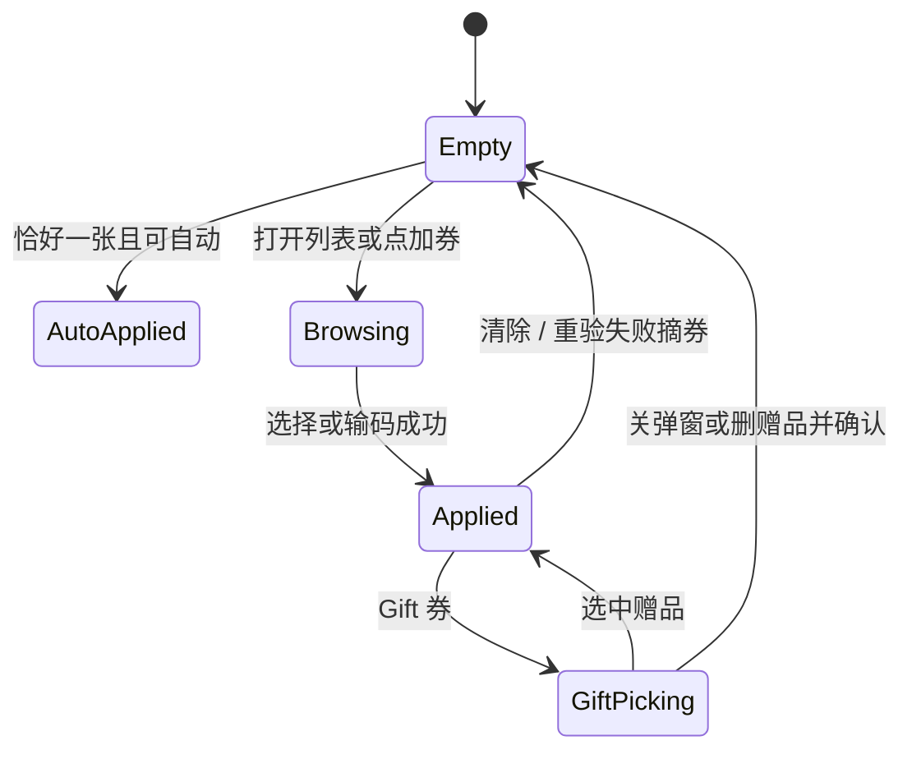

先说结论：券的前台是一个小状态机。默认路径不是自动用，而是 **提示有券 → 选或输 → 每一步重验 → 失败给出可对因的文案**。Gift 券只能在 Cart 用。一单一张。

---

## 1. 自动应用（极窄）

进入 Cart 时，已登录且账户下对当前订单 **恰好 1 张**可用券，才自动用。排除：

- Free Gift Coupon（必须选手选赠品）
- 勾了与全部活动互斥的券
- 这趟流程已经手选或输过码（含刚被弹出的码）

费项目前已经是 0，对应类型的券也不要自动用（运费已免就不要免运券）。

Cart 里用上的券，只要后面环节仍满足条件，Address / Shipping / Payment 保持。Cart 没用券时，后面环节仍可自动补：例如选完服务后出现免服务券，选完地址后出现免运券。

---

## 2. 选择券

已登录且有可用券时，加券入口显示 `xx vouchers available`。

列表规则：

- 当前订单可用的在前，按本单优惠金额从高到低；金额相同按 code。
- Gift / 免运 / 免服务如果算不出金额，排可用列表末尾。
- Mixed 默认排最前。
- 不可用的排后面，按到期近到远，置灰并给原因。
- 展示：折扣、门槛、有效期、code、说明、不可用原因。

选中后收起列表，显示 code、类型、折扣；可清除后重选。同一 Web 渠道 Checkout 的选择要写回 Cart。

---

## 3. 输码

未登录也可以输。但「指定用户 / 仅登录可用」的码必须先登录，文案引导去登录。

Share Code 在整单过程都显示 Share Code；订单侧要同时记下 Share Code 和兑出来的 Unique Code，方便对账。

Apply 时按第 03 篇的原因返回。成功后展示 code + 折扣金额。清除后不要再走自动应用。

---

## 4. Gift 券

1. 仅 Cart。Checkout 列表里 Gift 券显示不可用；Checkout 输码提示只能在购物车使用。
2. 校验通过立刻弹出选赠。关闭弹窗等于释放这张码，要确认。
3. 删除赠品或删除码，另一边一起去掉，同样要确认。
4. 赠品商品失效：无库存等先置灰、不摘券；商品被删除则 Gift 和券一起摘掉。
5. 资格/活动失效：Gift 和券都摘，文案走券的原因表。

---

## 5. 积分兑换券

已登录且积分余额 ≥ 50 时，Cart 可提示去兑换。按 1:1 兑 50 / 100 / 200 / 300 档，余额不够的档不出现。兑换事件交给积分平台扣分，促销侧下发对应面额券。积分和券都按市场隔离。

这不是普通 Discount Coupon 的自动应用，是「先兑出一张券，再走用券状态机」。

---

## 6. 展示口径

**My Voucher**

- 可用 / 过期（灰，保留约半年）/ 作废（Invalidated）
- 用过的不再展示；规则 inactive 的不展示
- 金额按市场货币；分层满减/满折要能展开看档位
- Mixed 把勾选的动作拼在标题里，太长省略

**Cart / Checkout 列表**

- 只列出有效期内的券，再用本单资格区分可点 / 置灰
- 分层券展示本单实际档，不是最高档；非最高档给 Upgrade
- 多个不可用原因只展示第一个

---

## 7. 重验提示（带着 code）

Cart → Address → Shipping → Payment，以及改购物车，都要重算。上一步用着、这一步不行，提示里带上 code，例如：

- 未达金额门槛：`Your order does not meet the coupon(xxxxxx)’s minimum required amount of $xx.`
- 与当前活动互斥：`This coupon code(xxxxxx) cannot be combined with the current promotion.`
- Unique Checker：`This coupon(xxxxxx) cannot be applied. It seems you have used this promotion in another order.`

完整原因表见第 03 篇。这里只强调：**重验失败要摘券，并且文案和输码失败同源。**

---

## 8. 前台状态机（建议记这一张）

和活动那篇合在一起看：活动负责自动减和满赠手选；券负责凭证。两者在第 04 篇的费项公式里汇合。
