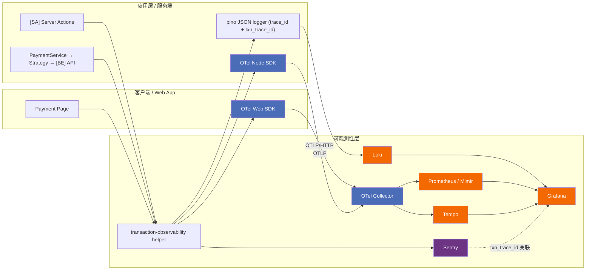
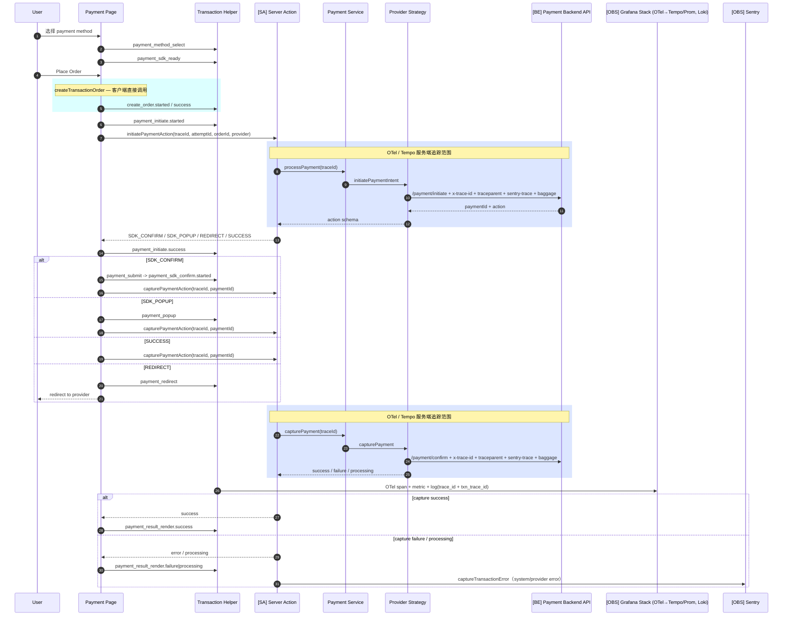
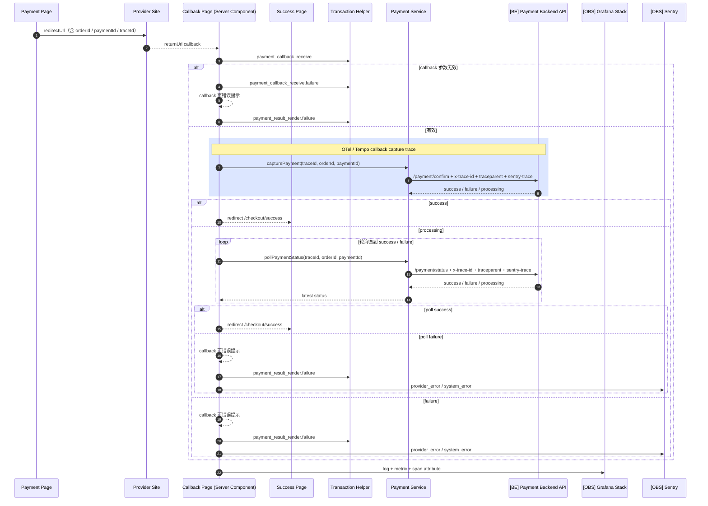
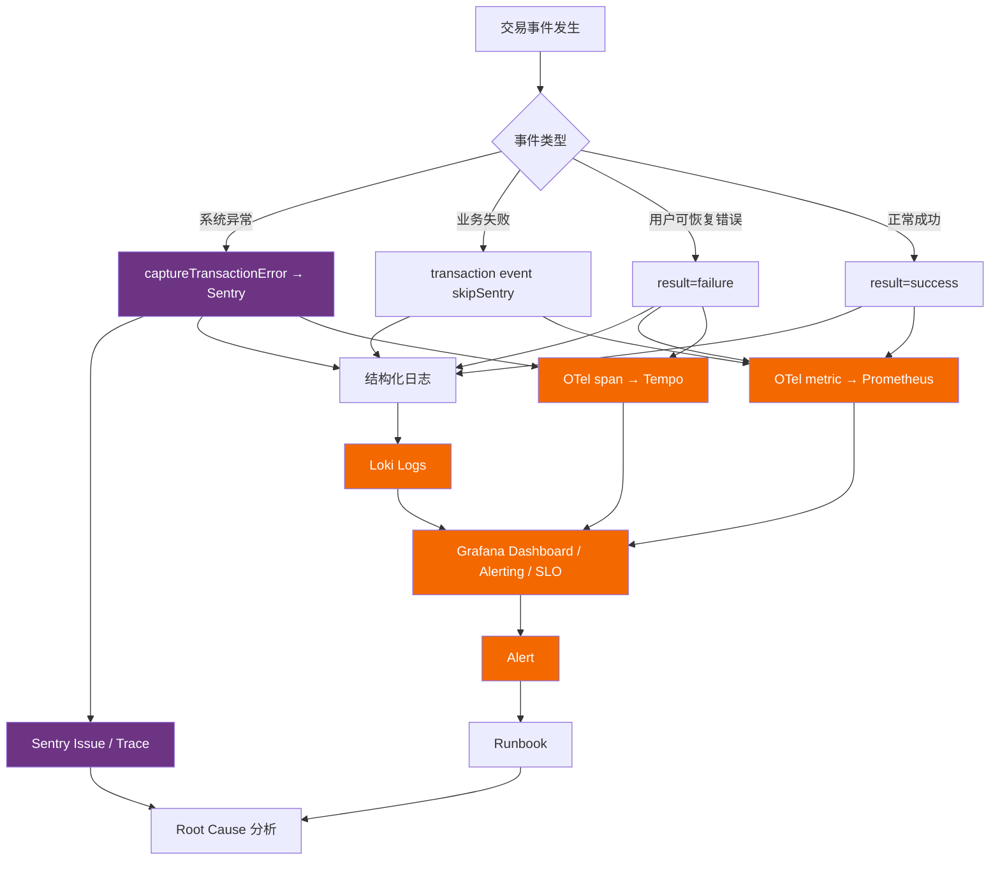

# 交易可观测性图示

* 适用范围：`checkout` + `payment`
* 目标平台：Sentry + Grafana（OTel 发射）

---

## 图例

| 标记 | 含义 |
| --- | --- |
| `[SA]` | Next.js Server Action（内部服务端） |
| `[BE]` | Payment Backend API（内部后端） |
| `[OBS]` | 可观测性平台（Sentry / Grafana / Loki / Tempo / Prometheus） |
| 无标记 | 客户端页面 / 内部 Domain Service |

## 1. 整体架构（OTel 为发射路径）

读图重点：

1. `transaction-observability helper` 是前端、Server Action、Payment Service 的统一入口。
2. OTel 负责发射 metrics / traces，日志通过 Loki 聚合。
3. Sentry 只承接错误与 trace 关联，不作为 metrics 平台。

## 2. 支付主链路时序图

阅读顺序：

1. 用户选择支付方式后，先记录 `payment_method_select` 与 `payment_sdk_ready`。
2. 用户点击 Place Order 后，客户端调用 `createTransactionOrder` 创建订单。
3. 订单创建成功后，再进入 `initiatePaymentAction`。
4. 支付 Provider 返回不同 action 后，页面进入 SDK confirm、popup、success 或 redirect 分支。
5. capture 结束后，页面渲染最终支付结果，并记录 `payment_result_render`。

## 3. Redirect Provider Callback 时序图

适用范围：

* Provider：`ZipPay`、`GrabPay`、`2C2P`
* 保留未实现：`Affirm` REDIRECT callback
* 页面形态：Next.js Server Component `page.tsx`，不是 `route.ts`

目标态：

* 使用统一的 `payment-callback` 页。
* `payment_callback_receive` 只在统一页发一次。
* 通过 `provider` 区分不同 redirect provider。
* 落点见 [transaction-instrumentation-spec.md](/transaction-observability/03) §9.2。

分支规则：

* callback 参数无效：callback 页展示错误，并记录 `payment_result_render.failure`。
* callback 成功：跳转 `/checkout/success`。
* callback 进行中：callback 页轮询支付状态，直到 success / failure。
* callback 或轮询失败：callback 页展示错误，并记录 `payment_result_render.failure`。

下图 `Callback Page` 代表收敛后的统一回调页。

## 4. 错误监控流转图

读图重点：

* 系统异常进入 Sentry，并同时写结构化日志与 OTel span。
* 业务失败和用户可恢复错误不进 Sentry，主要进入日志与 metrics。
* Grafana 通过 Loki、Prometheus / Mimir、Tempo 汇总 dashboard、alert 与 SLO。

## 5. 说明

### 链路边界

1. `createTransactionOrder` 为客户端直接调用，非 Server Action。
2. `[SA]` Server Action 仅负责：

* `initiatePaymentAction`
* `capturePaymentAction`

3. Server Action 不包含下单逻辑。

### 关联字段

`[BE]` 请求头包含：

* `x-txn-trace-id`
* `traceparent`
* `sentry-trace`
* `baggage`

`[BE]` 响应头回传后端 `X-Request-Id`（OTel trace）。  
前端采集该字段做弱关联。

### 平台分工

* metrics / traces：由 **OTel SDK** 产生，经过 Collector 进入 Tempo / Prometheus。
* logs：进入 Loki。
* errors：进入 Sentry。
* Datadog：本方案不使用。

### 目标态说明

`payment_result_render` 在枚举中已定义，但代码尚未发射。

图中该节点为目标态。  
埋点补齐后才会产生实际数据。
