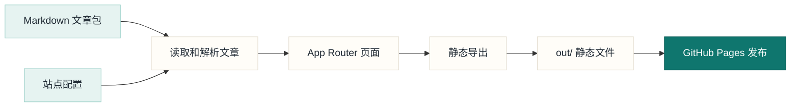
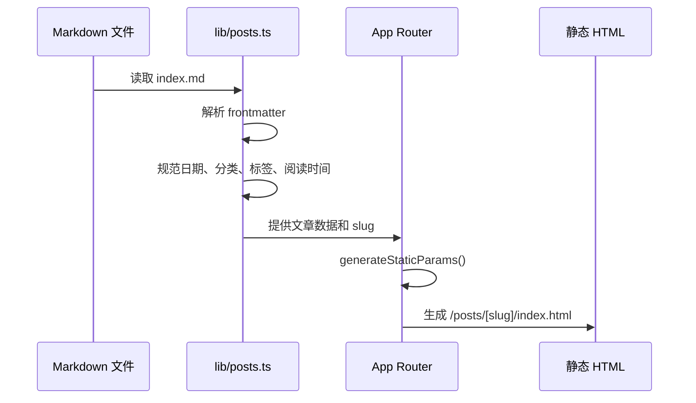
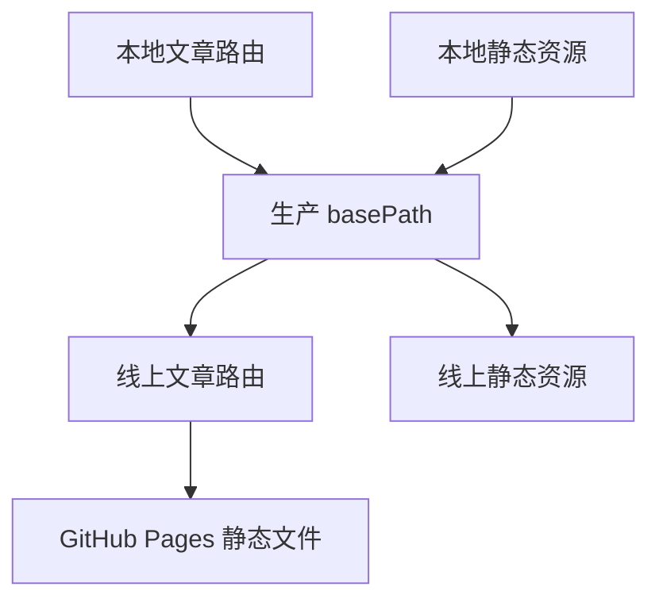
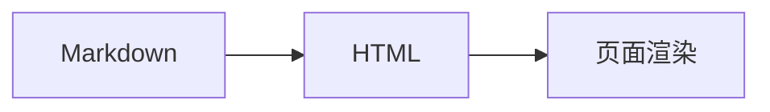
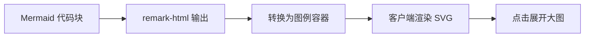

# 使用 Next.js 搭建个人博客

这个博客不是一个复杂的内容平台，而是一个长期维护的个人知识站点。它需要满足几个很现实的目标：

- 文章用 Markdown 写，方便迁移和版本管理。
- 部署仍然使用 GitHub Pages，成本低，维护简单。
- 页面必须是静态 HTML，方便搜索引擎抓取。
- 分类、文章 URL 和 SEO 信息要稳定，不能因为中文路径或部署子路径导致 404。
- 后续可以接管理后台，但一期不依赖后端服务。

最终选择是：**Next.js App Router + Markdown 内容包 + 静态导出 + GitHub Pages**。

## 当前架构

现在的博客可以理解为三层：内容层、构建层、展示层。内容层只负责文章和分类配置；构建层把 Markdown 转成 HTML 并生成静态页面；展示层负责博客首页、分类页、文章页和 SEO。



这个结构的好处是边界清晰：写文章只动 `content/posts`；改分类只动 `lib/site.ts`；改页面体验只动 `app/` 和 `components/`。

## 内容结构

文章采用“文章包”结构：

```text
content/posts/<category-slug>/<year>/<post-slug>/index.md
```

例如：

```text
content/posts/technical/2025/nextjs-blog-setup/index.md
```

这样组织比把所有 Markdown 平铺在一个目录里更适合长期维护：

- `category-slug` 决定文章所属阅读路径。
- `year` 保留归档能力。
- `post-slug` 决定最终文章 URL。
- 每篇文章未来可以继续放配图、数据文件或附件。

当前分类配置集中在 `lib/site.ts`：

```ts
export const postCategories = [
  {
    slug: "technical",
    name: "工程札记",
    description: "前端工程、部署实践、工具链和架构取舍。",
  },
  {
    slug: "learning",
    name: "学习记录",
    description: "阶段性学习记录、读书笔记、课程复盘和知识整理。",
  },
  {
    slug: "life",
    name: "生活手记",
    description: "日常观察、阅读笔记、兴趣和工作之外的生活记录。",
  },
];
```

这里有一个重要约束：**URL 使用英文 slug，页面展示使用中文名称**。这样可以避免 GitHub Pages 上中文路径编码不一致导致的 404。

## Markdown 到页面的流程

文章页不是运行时去请求接口，而是在构建阶段完成读取和生成。



`lib/posts.ts` 负责几件核心事情：

- 递归扫描 `content/posts` 下的 Markdown。
- 用 `gray-matter` 解析 frontmatter。
- 根据路径和 frontmatter 解析分类。
- 过滤草稿，只展示 `published` 文章。
- 按发布时间和更新时间排序。
- 计算阅读时间。
- 将 Markdown 转换为 HTML。

文章 frontmatter 的基本格式如下：

```yaml
---
title: 使用 Next.js 搭建个人博客
slug: nextjs-blog-setup
date: 2024-01-02
updatedAt: 2026-05-14
category: technical
tags:
  - Next.js
  - GitHub Pages
status: published
excerpt: 文章摘要
---
```

其中 `category` 建议写分类 slug，例如 `technical`，不要写中文分类名。系统目前兼容中文名称，但新文章应该统一使用 slug。

## 路由和 GitHub Pages

这个项目部署在：

```text
https://lee-ng915.github.io/cBlog/
```

它不是根路径站点，而是 GitHub Pages 项目页，所以生产环境需要 `/cBlog` 子路径。

当前 `next.config.js` 的核心配置是：

```js
const isProd = process.env.NODE_ENV === "production";
const basePath = isProd ? process.env.BASE_PATH || "" : "";

const nextConfig = {
  output: "export",
  images: {
    unoptimized: true,
  },
  trailingSlash: true,
  basePath: basePath,
  assetPrefix: basePath,
};
```

这几个配置对应的问题是：

- `output: "export"`：输出纯静态文件，适合 GitHub Pages。
- `images.unoptimized: true`：静态导出不能依赖 Next.js 图片优化服务。
- `trailingSlash: true`：生成目录式 URL，例如 `/posts/nextjs-blog-setup/`。
- `basePath` 和 `assetPrefix`：让页面和静态资源在 `/cBlog` 下正常访问。



## 页面设计

当前页面采用偏编辑型的个人博客设计：

- 顶部导航保持轻量，避免传统后台式侧边栏。
- 首页突出“最近文章”和“阅读路径”。
- 文章页左侧是正文，右侧是可吸顶的阅读路径导航。
- 文章标题区域只保留必要信息：分类、阅读时间、摘要、发布日期和标签。

这种布局适合 PC 端阅读：正文保持稳定宽度，右侧提供快速跳转，但不抢夺正文注意力。

## Mermaid 图例支持

博客已经支持在 Markdown 中直接写 Mermaid 图：

````markdown

````

渲染逻辑分成两步：

1. 构建阶段：`markdownToHtml()` 将 `language-mermaid` 代码块转换成 `.mermaid-diagram` 容器。
2. 浏览器端：`MermaidEnhancer` 初始化 Mermaid，渲染 SVG，并给图例绑定点击放大能力。

这样处理的原因是 Mermaid 依赖浏览器环境，直接在服务端 Markdown 转换阶段渲染会让实现复杂很多。现在的方案仍然保持静态导出，只在浏览器端做图例增强。



## SEO

静态博客最值得先做的是基础 SEO，而不是复杂的增长技巧。当前已经落地：

- 全站 metadata。
- 首页、分类页、文章页 canonical。
- 文章页 OpenGraph 和 Twitter Card。
- sitemap.xml。
- robots.txt。
- 文章页 `BlogPosting` JSON-LD。
- 默认分享图 `/og/default.png`。

由于站点部署在 `/cBlog` 子路径下，SEO URL 必须统一包含：

```text
https://lee-ng915.github.io/cBlog
```

例如：

```text
https://lee-ng915.github.io/cBlog/posts/nextjs-blog-setup/
https://lee-ng915.github.io/cBlog/categories/technical/
https://lee-ng915.github.io/cBlog/sitemap.xml
```

## 构建和部署

本地开发：

```bash
npm run dev
```

生产构建时建议模拟 GitHub Pages 子路径：

```bash
BASE_PATH=/cBlog npm run build
```

构建成功后会输出：

```text
out/
├── index.html
├── posts/
├── categories/
├── sitemap.xml
└── robots.txt
```

部署链路如下：


## 目前的取舍

当前阶段没有引入后端服务，主要是因为 GitHub Pages 只适合托管静态文件。文章管理后台可以作为二期能力，但发布结果仍然应该回到 Markdown 或静态内容文件，最后通过构建生成页面。

现阶段更重要的是把这些基础做稳：

- URL 规范。
- 内容结构规范。
- SEO 基础配置。
- Markdown 能力扩展。
- 页面阅读体验。
- GitHub Pages 部署链路。

等文章数量增加后，再考虑管理后台、草稿工作流、搜索、目录自动生成和数据分析会更合适。
