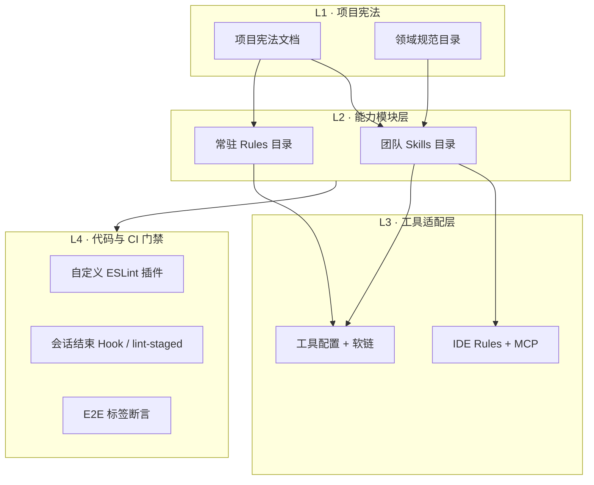

# 前言

把 AI 接进日常开发，难点从来不是「会不会写 Prompt」，而是**知识放哪、约束怎么 enforce、换工具会不会全丢**。

我参与搭建了一套可版本化、可 Review、可渐进扩展的 AI 工程体系，覆盖 Cursor 与 Claude Code 双 IDE。核心思路是：**规范进仓库、能力拆成 Skills、硬约束交给 ESLint/Hook，项目宪法做统一入口**。可观测性方向已跑通完整的 Harness 八组件闭环——这篇按结构梳理落地方式，方便复用到自己的 Monorepo 或轻量个人仓库。

---

## 1. 总体架构：四层分工



| 层级 | 职责 | 谁读 |
| --- | --- | --- |
| **L1 宪法** | 构建命令、目录结构、架构矩阵、Hard Rules | 所有 AI 会话默认加载 |
| **L1 规范** | 权威技术规范（可观测性、告警分桶等） | Skills 按需引用 |
| **L2 Skills** | 可触发的工作流（告警分诊、提 PR、埋点变更） | Cursor 自动扫描；另一 IDE 经软链 |
| **L2 Rules** | 轻量 always-on 规则（文档新鲜度、自检循环） | 链入宪法文档 |
| **L3 适配** | 各 IDE 的 rules、权限、MCP 配置 | 按工具分别维护 |
| **L4 门禁** | ESLint 插件 + CI + Hook | 人 + 机器 |

**设计原则**：AI 负责「理解上下文 + 按流程执行」；**不能仅靠 Prompt 保证的约束必须下沉到 L4**。

---

## 2. 项目宪法：单一事实来源

仓库级 AI 说明书，相当于「新同事入职文档 + 架构决策摘要」。

### 典型章节结构

1. **Overview** — 技术栈、包管理器、运行时版本
2. **Commands** — 开发、构建、测试、领域专用 lint
3. **Project Structure** — 应用层、业务模块层、共享基础设施分层
4. **Architecture** — 模块依赖矩阵、边界约束
5. **Code Conventions** — 命名、import 顺序、RSC/Client 切分
6. **领域 Hard Rules** — 不可协商规则（如可观测性红线）
7. **Multi-Region** — 多市场配置说明

### 模块化引用

重型规则不堆在一份文件里，用引用拆分。一个 IDE 侧入口通常只有一行「指向宪法文档」，避免双份维护。

### Hard Rules 示例（可观测性）

这类规则在宪法里用表格写死，并注明「不接受替代方案」：

| 规则 | 要点 |
| --- | --- |
| Edge 运行时禁止错误平台上报 | 只允许结构化日志写 stdout |
| 每个页面路由必须设置全局错误上下文 | 与 Layout Provider 并存 |
| 禁止裸调第三方错误 SDK | 统一走结构化封装 |
| 第三方错误分桶单点维护 | 域名列表只在一处定义 |

AI 改可观测性相关代码时，先读 Hard Rules，再配合 Skill 走具体场景 API。详见 [前端可观测性平台](/posts/observability-platform-harness/)。

---

## 3. Skills 体系：可复用的「工作流包」

### 目录约定

```text
团队 Skills 源目录/          ← git tracked，单一事实来源
├── README.md                ← 决策：何时装社区 skill / 何时自建
├── 告警分诊工作流/           ← 团队专属：错误分诊 + 可选自动修复
├── Harness 引导/            ← 八组件治理框架引导
├── PR 提交规范/             ← 统一 PR 描述与检查项
├── 埋点变更工作流/           ← 事件契约变更 SOP
├── 社区技能发现/            ← 搜索安装开源 skill
└── React 性能最佳实践/      ← 社区：性能规则集

另一 IDE 的 skills 目录/     ← 软链 → 源目录
技能版本锁文件               ← 社区 skill 版本锁定
```

| 工具 | 发现路径 | 是否需要软链 |
| --- | --- | --- |
| **Cursor** | 团队 Skills 源目录 | 否，自动扫描 |
| **Claude Code** | IDE 专用 skills 目录 | 是，指向源目录 |

### 内部 Skill vs 社区 Skill

- **优先社区** — 通用能力（React 最佳实践、技能发现）用包管理器安装
- **自建内部** — 团队术语、告警矩阵、埋点变更 SOP 等无法外包的流程
- **修改优于新建** — 差少量补充时直接改现有 Skill，避免碎片化

每个 Skill 的 frontmatter 关键是 **description**：必须写清「做什么 + 什么时候触发」，否则 AI 不会自动选用。

### 核心 Skills 一览

| Skill | 触发场景 | 价值 |
| --- | --- | --- |
| **告警分诊工作流** | 线上错误分诊、分桶合规 | 连接监控 API + 规范 + 可选修复链 |
| **Harness 引导** | 新领域要建治理 | 八组件 checklist，可复制到模块边界/设计系统 |
| **可观测性接入** | 接入错误监控、页面/服务端埋点 | 按场景给最短集成路径 |
| **埋点变更工作流** | 新增/修改/删除埋点事件 | 输出 Diff Report + 契约同步清单 |
| **PR 提交规范** | 创建 PR | 统一描述格式与自检项 |
| **React 性能最佳实践** | 写/审 React 性能 | 按类别拆分的规则集 |

### 告警分诊工作流：旗舰 Skill

子命令契约（显式模式，默认只分析不改代码）：

| 模式 | 改文件 | 跑验证 | 开 PR |
| --- | --- | --- | --- |
| analyze-only | 否 | 否 | 否 |
| fix | 是 | 是 | 否 |
| fix + PR | 是 | 是 | 是 |

流程概要：加载领域规范 → 拉取监控 issue → 对照告警矩阵 → 可选修复循环。

**会话结束 Hook** 在 IDE 会话结束时跑合规审查脚本，对本次改动做可观测性扫描——把「记得检查」变成「停不下来就不放行」。

---

## 4. Rules：轻量 Always-On 约束

与 Skills（按需触发）不同，**Rules 通过引用常驻加载**：

| Rule | 作用 |
| --- | --- |
| **文档新鲜度** | 改带元数据的规范文档时，同步更新版本与审阅日期 |
| **可观测性自检** | 改监控相关路径后，最多 3 轮领域 lint，失败则升级人工 |

可观测性自检的验证环：

```text
完成编辑 → 领域专用 lint → 0 违规则结束
           ↓ 有违规且未达上限 → 修复 → 重试
           ↓ 达到上限 → 升级人工，禁止声称任务完成
```

---

## 5. IDE 适配层

### Cursor Rules

按 `globs` 和 `alwaysApply` 控制作用范围。项目级规范通常全局生效，覆盖：

- Monorepo 结构与模块边界
- 组件库设计约定
- AI 改代码必须带测试的交付要求
- 对话语言偏好（如中文）

### MCP

可挂载设计协作等外部工具，扩展 AI 的「手」而不污染宪法正文。

### Claude 适配

- **权限白名单** — 限制可执行的 shell 命令范围
- **会话结束 Hook** — 触发合规审查
- **Evals** — 核心 Skill 的评测用例，变更后回归「AI 是否仍按流程执行」

---

## 6. Harness 八组件：从可观测性推广到全域

可观测性是我参与最深的 AI+工程交叉领域，已形成可复制的 **Harness 范式**：

| # | 组件 | 回答问题 | 可观测性实例 |
| --- | --- | --- | --- |
| 1 | Spec | 正确长什么样？ | 领域规范索引 + 分场景说明 |
| 2 | Static | 编写时能发现吗？ | 自定义 ESLint 插件 |
| 3 | Dynamic | 运行时能验证吗？ | beforeSend 单测 + E2E 标签断言 |
| 4 | Gate | 合并前能拦住吗？ | lint-staged + CI + CODEOWNERS |
| 5 | Feedback | 正确的人知道吗？ | IDE 红线 + PR comment + AI 修复循环 |
| 6 | Evaluation | 合规率多少？ | 覆盖率扫描 + baseline + PR delta |
| 7 | Knowledge | 新人能维护吗？ | 宪法文档 + Skills 索引 + 贡献指南 |
| 8 | Evolution | 规则怎么安全演进？ | 变更协议 + 版本 bump |

推广候选：模块边界（已有构建规则，缺 Spec/Evaluation）、设计系统、性能预算。

Harness 引导 Skill 用交互式 checklist 带人在新领域搭 Phase 1（Spec + Static + Gate）最小闭环。平台层落地见 [前端可观测性平台](/posts/observability-platform-harness/)。

---

## 7. 个人博客的轻量落地

大型 Monorepo 体系过重时，博客仓库用**最小子集**即可：

```text
.agents/skills/
├── style-optimization/     ← UI 改版对齐品牌 token
└── tech-doc-migration/     ← 技术方案 → 个人博客的去企业化规范
```

博客不复制企业仓库的完整宪法体系，但 **迁移 Skill 即宪法**：去品牌、去真实路径、人称个人化、保留技术细节。样式 Skill 则约束设计 token 与展示页同步。

这是「**重型工程体系 → 轻量个人仓库**」的剪裁版：只保留真正会触发的 Skills。

---

## 8. 落地原则与踩坑

### 原则

1. **规范进 Git** — 和代码一起 PR Review，不要只存在聊天记录
2. **AI 不替代门禁** — Hard Rules + ESLint + Hook 才是真相
3. **双工具一份源** — 源目录 + 软链，避免两套 Skills 漂移
4. **Skill 描述决定触发率** — description 写不好等于没装
5. **分阶段.harness** — 先 Spec+Static+Gate，再 Evaluation+AI 修复

### 踩坑

| 现象 | 对策 |
| --- | --- |
| 改 Skill 不生效 | 开新会话；Skill 在会话初始化时加载 |
| 宪法文档太长占上下文 | 拆引用 + 领域规范按需读 |
| AI 仍违反 Hard Rules | 补 ESLint 规则，而不加更多 Prompt |
| 双 IDE 行为不一致 | 检查软链是否提交、Rules 是否镜像 |

---

## 9. 与工程笔记的关联

| 主题 | 博客 | 与 AI 体系的关系 |
| --- | --- | --- |
| 交易可观测性 | [交易链路可观测性](/posts/transaction-observability-tech-plan/) | 业务层 15 阶段模型 |
| 可观测性平台 | [可观测性 Harness](/posts/observability-platform-harness/) | 平台层八组件 |
| HTTP 错误 | [HTTP 错误处理](/posts/http-error-handling-strategy/) | 与错误分桶、服务端错误路径对齐 |
| 埋点契约 | [Events Book](/posts/tracking-events-book-contract/) | 埋点变更工作流的文档化 |
| 知识地图 | [工程知识图谱](/posts/ecommerce-knowledge-map/) | 资料索引入口 |

---

## 总结

这套 AI 落地的本质不是「给 AI 更多文档」，而是：

```text
项目宪法（AGENTS）
    ↓
Skills（可触发工作流）+ Rules（常驻约束）
    ↓
Cursor / Claude 适配
    ↓
ESLint + Hook + CI（机器强制执行）
```

可观测性是第一个跑通 Harness 全链路的领域；其余领域可以复制同一套八组件问卷，按优先级逐个补齐。如果你也在 Monorepo 里推 AI 协作，建议从 **一份宪法文档 + 一个团队专属 Skill + 一条 ESLint 规则** 开始，比一上来堆 Prompt 有效得多。
