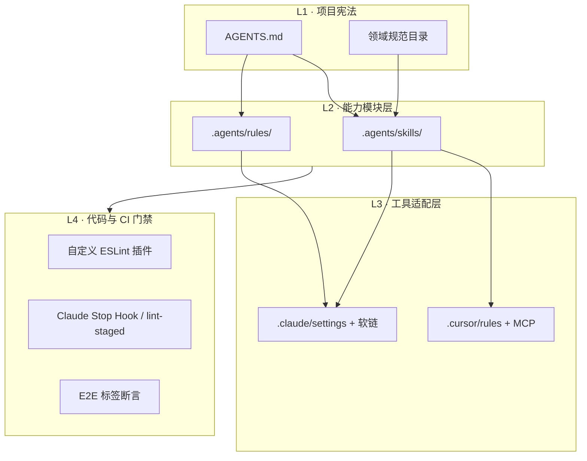

# 前言

把 AI 接进日常开发，难点从来不是「会不会写 Prompt」，而是**知识放哪、约束怎么 enforce、换工具会不会全丢**。

我参与搭建了一套可版本化、可 Review、可渐进扩展的 AI 工程体系，覆盖 Cursor 与 Claude Code 双 IDE。核心思路是：**规范进仓库、能力拆成 Skills、硬约束交给 ESLint/Hook，AGENTS.md 做统一入口**。可观测性方向已跑通完整的 Harness 八组件闭环——这篇笔记按结构梳理整套落地方式，方便你复用到自己的 Monorepo 或博客项目。

---

## 1. 总体架构：四层分工



| 层级 | 目录 / 文件 | 职责 | 谁读 |
| --- | --- | --- | --- |
| **L1 宪法** | `AGENTS.md` | 构建命令、目录结构、架构矩阵、Hard Rules | 所有 AI 会话默认加载 |
| **L1 规范** | 领域规范目录 | 权威技术规范（可观测性、告警分桶等） | Skills 按需引用 |
| **L2 Skills** | `.agents/skills/<name>/SKILL.md` | 可触发的工作流（修 Sentry、提 PR、埋点变更） | Cursor 自动扫描；Claude 经软链 |
| **L2 Rules** | `.agents/rules/*.md` | 轻量 always-on 规则（文档新鲜度、自检循环） | `@include` 链入 AGENTS |
| **L3 Cursor** | `.cursor/rules/*.mdc` | IDE 级编码规范、测试工作流、中文对话 | Cursor only |
| **L3 Claude** | `.claude/settings.json` | 权限白名单、Stop Hook | Claude Code only |
| **L4 门禁** | ESLint 插件 + CI + Hook | 机器 enforce，AI 说了不算 | 人 + 机器 |

**设计原则**：AI 负责「理解上下文 + 按流程执行」；**不能仅靠 Prompt 保证的约束必须下沉到 L4**。

---

## 2. AGENTS.md：单一事实来源

`AGENTS.md` 是仓库级 AI 说明书，相当于「新同事入职文档 + 架构决策摘要」。

### 2.1 典型章节结构

1. **Overview** — 技术栈、包管理器、Node 版本
2. **Commands** — `dev` / `build` / `test` / 领域专用命令（如规范 lint、E2E 断言）
3. **Project Structure** — 应用层、业务模块层、共享基础设施分层
4. **Architecture** — Clean Architecture 依赖矩阵、Nx tag 边界
5. **Code Conventions** — 命名、import 顺序、RSC/CC 后缀
6. **领域 Hard Rules** — 如可观测性 10 条不可协商规则
7. **Multi-Region** — 多市场配置说明

### 2.2 模块化引用（@include）

重型规则不堆在一份文件里，用引用拆分：

```markdown
@.agents/rules/doc-freshness.md
@.agents/rules/observability-self-check.md
```

Claude 侧 `CLAUDE.md` 通常只有一行：

```markdown
@AGENTS.md
```

这样 **Cursor 读 AGENTS + Rules，Claude 读 CLAUDE → AGENTS → Rules**，避免双份维护。

### 2.3 Hard Rules 示例（可观测性）

这类规则在 AGENTS 里用表格写死，并注明「Do not suggest alternatives」：

| 规则 | 要点 |
| --- | --- |
| Middleware/Edge 禁止 Sentry 上报 | 只允许 `logger.*` 写 stdout |
| 每个 `page.tsx` 必须 `setGlobalSentryContext` | 与 Layout Provider 并存 |
| 禁止裸 `Sentry.captureException` | 统一走结构化封装 |
| `error_bucket` 单点维护 | 第三方域名列表只在一处定义 |

AI 在改可观测性相关代码时，先读 Hard Rules，再配合 Skill 走具体场景 API。

---

## 3. Skills 体系：可复用的「工作流包」

### 3.1 目录约定（兼容 skills.sh 生态）

```text
.agents/skills/           ← 源文件（git tracked）
├── README.md             ← 决策：何时装社区 skill / 何时自建
├── observability-fix/    ← 团队专属：Sentry 分诊 + 自动修复
├── harness-guide/        ← 八组件治理框架引导
├── submit-pr/            ← PR 模板与流程
├── merge-to-test/        ← 分支合并工作流
├── ec-fe-clickup/        ← 任务系统联动
├── find-skills/          ← 发现社区 skill
└── vercel-react-best-practices/  ← 社区：React 性能规则集

.claude/skills/           ← 软链 → .agents/skills/<name>
skills-lock.json          ← 社区 skill 版本锁
```

| 工具 | 发现路径 | 是否需要软链 |
| --- | --- | --- |
| **Cursor** | `.agents/skills/` | 否，自动扫描 |
| **Claude Code** | `.claude/skills/` | 是，指向源目录 |

### 3.2 内部 Skill vs 社区 Skill

README 里的决策树：

- **优先社区** — 通用能力（React 最佳实践、find-skills）用 `npx skills add` 安装
- **自建内部** — 团队术语、告警矩阵、埋点变更 SOP 等无法外包的流程
- **修改优于新建** — 差少量补充时直接改现有 `SKILL.md`

每个 `SKILL.md` 的 frontmatter 关键是 **description**：必须写清「做什么 + 什么时候触发」，否则 AI 不会自动选用。

### 3.3 核心 Skills 一览

| Skill | 触发场景 | 价值 |
| --- | --- | --- |
| **告警分诊工作流** | Sentry 分诊、error_bucket 合规 | 连接 MCP + 规范 + 可选自动修复链 |
| **harness-guide** | 新领域要建治理、「工程范式」 | 八组件 checklist，可复制到模块边界/设计系统 |
| **observability** | 接入 Sentry、Layout/Page/SA 埋点 | 按场景给最短集成路径 |
| **tracking-event-ops** | 新增/修改/删除埋点事件 | 输出 Diff Report + 三件套同步清单 |
| **submit-pr** | 创建 PR | 统一描述格式（含 Sentry fixes 规则） |
| **vercel-react-best-practices** | 写/审 React 性能 | 57 条规则，按类别拆分 markdown |

### 3.4 告警分诊工作流：旗舰 Skill

子命令契约（显式模式，默认 analyze-only）：

| 模式 | 改文件 | 跑验证 | 开 PR |
| --- | --- | --- | --- |
| analyze-only | 否 | 否 | 否 |
| fix | 是 | 是 | 否 |
| fix --with-pr | 是 | 是 | 是 |

流程概要：加载领域规范目录 → Sentry MCP 拉 issue → 对照告警矩阵 → 可选修复循环。

Claude **Stop Hook** 在会话结束时跑合规审查脚本，对本次改动做可观测性扫描——把「记得检查」变成「停不下来就不放行」。

---

## 4. Rules：轻量 Always-On 约束

与 Skills（按需触发）不同，**Rules 通过 @include 常驻加载**：

| Rule | 作用 |
| --- | --- |
| **doc-freshness** | 改带 YAML frontmatter 的文档时，同步更新 `version` / `last-reviewed` |
| **observability-self-check** | 改可观测性路径后，最多 3 轮领域专用 lint，失败则 ESCALATE |

observability-self-check 的验证环：

```
完成编辑 → 领域专用 lint → 0 违规则结束
           ↓ 有违规且 attempt < 3 → 修复 → 重试
           ↓ attempt == 3 → ESCALATE，禁止声称任务完成
```

---

## 5. Cursor 适配层

### 5.1 Rules（`.cursor/rules/*.mdc`）

| 文件 | alwaysApply | 内容 |
| --- | --- | --- |
| **project-rules** | 是 | Monorepo 结构、组件库设计规范、ESLint 边界、Storybook 约定 |
| **ai-test-workflow** | 是 | AI 改代码必须带测试；交付含 `AI Test Record` |
| **my-rule** | 是 | 对话使用中文 |
| **doc-freshness** | — | AGENTS Rules 的 Cursor 镜像 |

`globs` + `alwaysApply` 控制作用范围；项目级规范通常 `alwaysApply: true`。

### 5.2 MCP

`mcp.json` 可挂载设计协作等外部工具（如 Figma 编辑插件），扩展 AI 的「手」而不污染 AGENTS 正文。

---

## 6. Claude 适配层

### 6.1 settings.json

- **permissions.allow** — 白名单 bash（git、lint 脚本、审查脚本）
- **hooks.Stop** — 会话结束触发合规审查

### 6.2 Evals

`.claude/evals/` 存放核心 Skill 的评测用例与脚本，用于变更 Skill 后回归「AI 是否仍按流程执行」。

---

## 7. Harness 八组件：从可观测性推广到全域

可观测性是我参与最深的 AI+工程交叉领域，已形成可复制的 **Harness 范式**：

| # | 组件 | 回答问题 | 可观测性实例 |
| --- | --- | --- | --- |
| 1 | Spec | 正确长什么样？ | 领域规范索引 + 分场景 spec 文档 |
| 2 | Static | 编写时能发现吗？ | 自定义 ESLint 插件（多条 AST 规则） |
| 3 | Dynamic | 运行时能验证吗？ | beforeSend 单测 + 5 页面 E2E 标签断言 |
| 4 | Gate | 合并前能拦住吗？ | lint-staged + CI workflow + CODEOWNERS |
| 5 | Feedback | 正确的人知道吗？ | IDE 红线 + PR comment + AI 修复循环 |
| 6 | Evaluation | 合规率多少？ | coverage-scan + baseline.json + PR delta |
| 7 | Knowledge | 新人能维护吗？ | AGENTS + Skills README + CONTRIBUTING |
| 8 | Evolution | 规则怎么安全演进？ | Change Protocol + 版本 bump |

推广候选：模块边界（已有 Nx 规则，缺 Spec/Evaluation）、设计系统、性能预算。

`/harness-guide` Skill 用交互式 checklist 带人在新领域搭 Phase 1（Spec + Static + Gate）最小闭环。

---

## 8. 个人博客（cBlog）的轻量落地

大型 Monorepo 体系过重时，博客仓库用**最小子集**即可：

```text
.agents/skills/
├── style-optimization/     ← UI 改版对齐品牌 token
└── tech-doc-migration/     ← 技术方案 → 个人博客的去企业化规范
```

博客不复制企业仓库的完整 AGENTS 体系，但 **迁移 Skill 即宪法**：去品牌、去真实路径、人称个人化、保留技术细节。样式 Skill 则约束 `lib/brand.ts` ↔ `/brand` 展示页同步。

这是「**重型工程体系 → 轻量个人仓库**」的剪裁版：只保留你真正会触发的 Skills。

---

## 9. 落地原则与踩坑

### 9.1 原则

1. **规范进 Git** — 和代码一起 PR Review，不要只存在聊天记录
2. **AI 不替代门禁** — Hard Rules + ESLint + Hook 才是真相
3. **双工具一份源** — `.agents` 源文件 + `.claude` 软链
4. **Skill 描述决定触发率** — description 写不好等于没装
5. **分阶段.harness** — 先 Spec+Static+Gate，再 Evaluation+AI 修复

### 9.2 踩坑

| 现象 | 对策 |
| --- | --- |
| 改 Skill 不生效 | 开新会话；Skill 在会话初始化时加载 |
| AGENTS 太长占上下文 | 拆 @include + 领域 spec 按需读 |
| AI 仍违反 Hard Rules | 补 ESLint 规则，而不加更多 Prompt |
| Cursor/Claude 行为不一致 | 检查软链是否提交、Rules 是否镜像 |

---

## 10. 与工程笔记的关联

| 主题 | 博客 | 与 AI 体系的关系 |
| --- | --- | --- |
| 交易可观测性 | [交易链路可观测性](/posts/transaction-observability-tech-plan/) | 业务层 15 阶段模型 |
| 可观测性平台 | [可观测性 Harness](/posts/observability-platform-harness/)（草稿） | 平台层八组件 |
| HTTP 错误 | [HTTP 错误处理](/posts/http-error-handling-strategy/) | 与 Sentry 分桶、SA 错误路径对齐 |
| 埋点契约 | [Events Book](/posts/tracking-events-book-contract/) | tracking-event-ops Skill 的文档化 |
| 知识地图 | [工程知识图谱](/posts/ecommerce-knowledge-map/) | 资料索引，含可观测性/规范方向 |

---

## 总结

这套 AI 落地的本质不是「给 AI 更多文档」，而是：

```
AGENTS.md（宪法）
    ↓
Skills（可触发工作流）+ Rules（常驻约束）
    ↓
Cursor / Claude 适配
    ↓
ESLint + Hook + CI（机器强制执行）
```

可观测性是第一个跑通 Harness 全链路的领域；其余领域可以复制同一套八组件问卷，按优先级逐个补齐。如果你也在 Monorepo 里推 AI 协作，建议从 **一份 AGENTS.md + 一个团队专属 Skill + 一条 ESLint 规则** 开始，比一上来堆 Prompt 有效得多。
