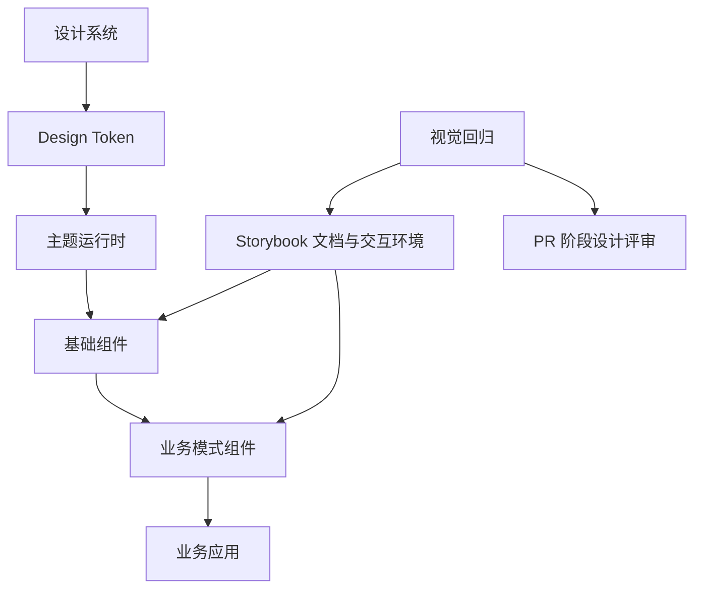
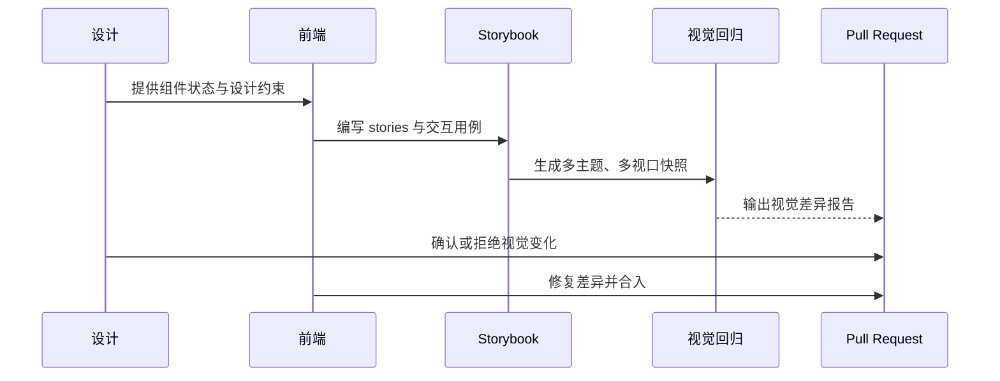
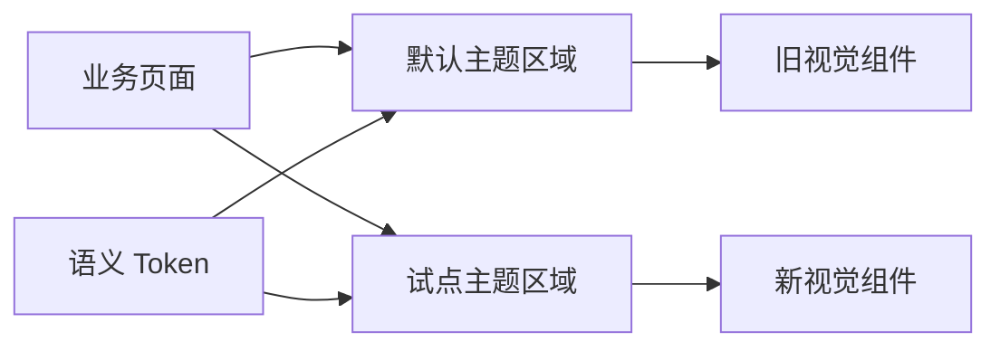
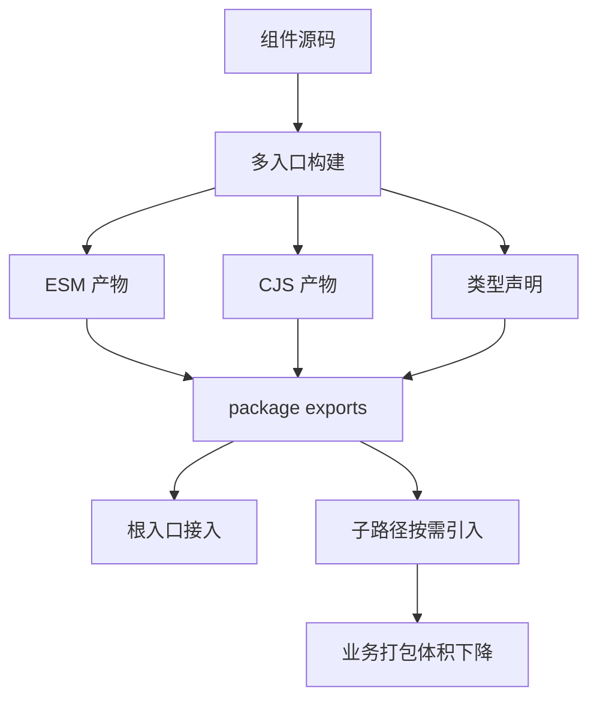

# 前言

这篇文章复盘的是一个大型企业级电商前端体系中的组件库建设。总的来说，它不是一次单纯的 UI 组件重写，而是一次围绕设计系统、组件治理、视觉回归、主题演进、构建发布和性能治理的工程化改造。

开始阶段很容易把重点理解成“把组件补齐”。真正深入之后会发现，组件只是表象，真正困难的是：

- 让设计规范真正约束代码
- 让新旧主题在同一个业务体系里长期并存
- 能够落地并且持续优化的开发流程

## 问题背景

在长期迭代的电商系统里，不同的业务场景应用会分别维护自己的 `Button、Input、Modal、Card、Form` 等基础组件，比如Cart中的`Card`组件和Payment中的`Card`组件间距会不一样，移动端的表现也不一样

短期看，这种方式能让业务快速上线；长期看，它会带来几个问题：

- 同一类组件在不同页面出现不同的间距、圆角、字号和交互反馈。
- 设计稿更新后，工程侧没有统一入口可以同步视觉变化。
- 组件行为分散在业务页面里，复用时需要复制样式和交互逻辑。
- UI 走查发生在提测后，发现问题时返工成本已经很高。
- 新旧视觉体系并存时，缺少主题隔离、兼容策略和回滚抓手。

真正需要解决的不是“再做一套组件”，而是建立一套可以持续演进的前端设计系统基础设施。

## 角色定位

负责整体技术方案设计和落地推进，包括：

- 设计组件库的分层模型和边界，明确基础组件、组合组件和业务模式组件各自承担什么职责。
- 推进 Design Token、主题运行时和组件 API 的统一，避免样式继续散落在业务代码中。
- 引入 Storybook 作为组件开发、文档和设计评审的统一入口。
- 引入视觉回归流程，把设计验收前移到 PR 阶段。
- 设计新旧主题并存方案，支持业务应用渐进式迁移。
- 设计构建与发布模型，让组件库既能支持按需引入，也能兼容 SSR 和 RSC 场景。
- 制定组件准入标准、review 清单和发布策略，保证组件库不是“一次性重构”，而是可维护的长期工程资产。

## 架构设计

组件库拆成四层：Token、Theme、Primitive、Pattern。

Token 层负责承载设计系统的最小变量，例如颜色、字体、间距、圆角、阴影和动效节奏。Theme 层把 Token 组合成具体视觉体系，并提供运行时注入能力。Primitive 层提供无业务语义的基础组件。Pattern 层则沉淀电商场景中复用频率高的业务交互模式。



这个分层的核心价值不是“理论上更优雅”，而是能真正控制复杂度：

- 基础组件只负责状态、可访问性、主题适配和 API 稳定性。
- 业务模式组件只负责场景组合，不反向污染基础组件。
- 主题变化优先落在 Token 和 Theme 层，而不是让每个业务页面手动改样式。

## 组件约束策略

组件库真正开始稳定，是从“写组件”转向“约束组件应该怎么被写”开始的。

核心规则可以概括为几条：

- 组件库只沉淀基础组件，不把业务特例直接塞进底层。
- Storybook 必须覆盖设计稿中的关键变体和典型用例，而不是只写 happy path。
- 组件实现、样式定义、类型声明和测试用例要明确分层，避免逻辑和样式互相缠绕。
- 基于已有 UI 基座做扩展时，优先走主题扩展和变体扩展，不鼓励业务页面局部打补丁。

这套规则有一个很实际的收益：它迫使开发者在实现组件之前，先回答“这个能力应该沉淀在主题里、组件里，还是业务层里”。

### 一个具体例子：新增变体，而不是在页面上写死样式

在组件体系中，最容易失控的是“设计临时提了一个样式变化，于是业务页面直接加一段样式覆盖”。短期很快，长期一定失控。

更稳妥的做法，是把这种变化提升为受控的组件能力。比如一个 Tooltip 需要新增特定变体时，不是在调用方直接写覆盖，而是走三步：

1. 在主题类型里声明新的 `variant`
2. 在主题层补充默认视觉映射
3. 在具体组件上接入该变体的样式覆盖

```ts
type TooltipVariant = "solid" | "soft" | "editorial";

declare module "@mui/joy/Tooltip" {
  interface TooltipPropsVariantOverrides {
    editorial: true;
  }
}

const tooltipVariants = {
  editorial: {
    backgroundColor: "var(--palette-surface-elevated)",
    color: "var(--palette-text-primary)",
    border: "1px solid var(--palette-border-subtle)",
  },
};
```

这个动作看似比“页面里多写几行 CSS”更慢，但它能保证新的视觉能力是可复用、可测试、可文档化的。

## 关键技术决策

### 1. Storybook 不是文档站，而是组件研发环境

过去的组件文档通常是静态说明：展示一段用法、列出 Props 表格，再放几张截图。但这种方式无法验证组件在真实交互中的表现。

Storybook 的定位不是单纯的文档站，而是组件研发环境。每个组件进入组件库前，都必须在 Storybook 中覆盖关键状态：

- 默认、悬停、聚焦、禁用、加载、错误等基础状态。
- 空数据、长文本、极端数量、异步加载等边缘场景。
- 键盘操作、焦点顺序、弹层关闭等交互行为。
- 不同视口下的响应式表现。
- 不同主题下的视觉表现。

这样做之后，组件的“文档”不再是额外维护的说明，而是随源码一起演进的可交互用例。开发、设计、QA 都可以在同一个环境里讨论问题，避免只靠截图沟通。

### 2. 视觉回归前移到 PR 阶段

传统 UI 走查的问题是太晚。等业务页面开发完成后再发现基础组件间距、颜色或状态不一致，修复范围往往已经扩大到多个页面。

视觉回归流程基于 Storybook 搭建，让每个组件变更在 PR 阶段就生成视觉对比。评审不再只看代码 diff，还要看组件在多主题、多视口、多状态下的视觉 diff。



这套流程的价值不在于“截图自动化”，而在于改变评审时机：设计验收从业务提测后提前到组件开发阶段。

### 3. 主题切换不能依赖全局覆盖

在品牌视觉升级或多品牌业务中，最容易出问题的是主题泄漏。如果主题只是全局 CSS 变量覆盖，那么一个页面里的局部试点、A/B 实验或渐进式迁移都很难做。

主题方案遵循三个原则：

- 同一个应用里可以同时渲染新旧主题。
- 主题作用域必须绑定到组件子树，而不是全局页面。
- 组件内部只读取语义 Token，不直接写死颜色、字号和阴影。



这个设计让迁移可以按页面、模块甚至组件粒度推进。新主题上线时，不需要整站一次性切换，也不需要在组件里写大量条件分支。

## 新旧主题兼容是怎么做的

兼容问题不是一句“支持双主题”就能解决的。真正落地时，兼容策略可以分成三类：

### 第一类：同构组件，直接用主题覆盖

对于结构不变、只是视觉映射发生变化的组件，最优先的策略是通过 `styleOverrides` 或语义变量映射做兼容。这样旧用法不需要改动，主题层负责把新组件能力映射到旧视觉语义上。

```ts
const legacyThemeBridge = {
  Button: {
    styleOverrides: {
      root: ({ ownerState, theme }) => ({
        ...(ownerState.color === "primary" &&
          ownerState.variant === "solid" && {
            backgroundColor: theme.vars.palette.surface.accent,
            color: theme.vars.palette.text.primary,
          }),
      }),
    },
  },
};
```

对应的落地链路可以抽象成下面这条：


### 第二类：变量体系不同，做受控回退

新旧主题并存时，很多问题不是组件逻辑冲突，而是 CSS 变量体系不同。这类场景里，所有新变量都必须有明确回退链，避免因为某个变量未定义而直接退回硬编码样式。

```ts
const styles = {
  backgroundColor:
    "var(--variant-solidBg, var(--palette-primary-500, #0B6BCB))",
  color: "var(--variant-solidColor, var(--palette-common-white, #fff))",
};
```

这类多级 fallback 很枯燥，但它是兼容链路稳定的关键。

### 第三类：组件语义变了，做属性兼容层

有些组件不是样式变化，而是能力抽象本身变了。比如旧版通过一种 props 组合表达状态，新版拆成了 `variant + color + size` 这样的语义组合。对这类场景，更合适的做法是加一层很薄的兼容层，把旧属性翻译成新属性，而不是强迫业务一次性改完。

这种方式的原则是：

- 兼容层只做过渡，不成为长期主路径。
- 兼容规则必须显式、可测试、可删除。
- 文档里明确标识弃用时间和升级路径。

## 构建与发布不是附属工作

一个组件库如果只解决“本地能跑”，它很快就会在消费侧出问题。构建出口和发布模型会直接影响体积、按需加载、SSR 兼容和升级成本。

### 1. 多入口构建

组件库没有只做成一个大入口，而是设计成根入口加子路径入口并存。这样消费侧既能快速接入，也能按组件粒度引入。

构建上采用的是多入口库模式，每个组件保留独立模块输出，并显式维护 `exports`。

```json
{
  "exports": {
    ".": {
      "import": "./dist/index.js",
      "types": "./dist/index.d.ts"
    },
    "./Button": {
      "import": "./dist/Button/index.js",
      "types": "./dist/Button/index.d.ts"
    }
  }
}
```

这个结构有两个好处：

- 为 Tree Shaking 和子路径导入创造前提。
- 为后续 codemod 和 lint 约束提供明确出口边界。

实际接入链路大致如下：



### 2. 保留运行时指令，兼容 RSC

组件库里会存在客户端组件。如果构建产物把 `use client` 这样的指令吞掉，进入 Next.js 的 RSC 环境时就会出现边界错误。

构建链路里需要专门处理指令保留，确保产物仍然保留客户端边界声明。这个点在纯 CSR 应用里不明显，但在 App Router 或 RSC 环境中非常关键。

### 3. CJS 与 ESM 不是“顺手都打一下”就够了

双产物不是简单地多打一份文件。真实项目里经常会遇到：

- CJS 侧的导出解析不一致
- 类型声明与子路径导出不同步
- 构建结果可以运行，但被消费端 bundler 解析失败

这个阶段的原则是，构建成功不等于可以交付。必须同时验证：

- 根入口和子入口都能被正确解析
- 类型声明能跟着子路径导出走
- SSR/RSC、普通 CSR 和 Storybook 环境都能消费

## 性能与 SSR：一组典型问题

这个项目后期最有意思的一部分，其实不是组件 API，而是组件库本身对 SSR 带来的负担。

在一次性能诊断里，能观察到这样一组现象：

- 首屏 FCP 一度在 2.5 秒左右
- 页面注入的 CSS 变量超过 2000 个
- 首屏涉及二十多种组件类型
- 服务端输出的 HTML 一度接近 1MB
- 其中仅样式相关注入就已经是一个不可忽视的体量

这类问题很典型：单个组件看不出异常，但当主题变量、样式系统、字体、图标和多组件组合一起进入 SSR 时，累计成本会突然放大。

### 怎么拆这类问题

没有直接从“删组件”开始，而是先把问题拆成四块：

1. 包体积
2. 样式注入
3. 字体资源
4. 消费方式

对应动作也很明确：

- 为主入口和子入口建立体积基线
- 给典型页面建立升级前后的体积对比
- 给字体做子集化和动态加载
- 收紧根入口使用，推动子路径导入

### 字体不是视觉问题，而是性能问题

很多团队谈设计系统时很少把字体当成工程对象，但字体对首屏的影响其实非常直接。

字体优化里主要做了几件事：

- 盘点真实使用到的字重和字符覆盖范围
- 按语言或页面维度拆分子集字体
- 用 `unicode-range` 和 `font-display: swap` 控制加载时机
- 让开发环境保守加载，生产环境按需加载

这类优化不炫技，但很有效，因为它不是在“压资源”，而是在减少首屏必须立即承担的资源。

### Tree Shaking 不是一句配置项

很多人会说“把 `sideEffects` 配好就行”。实际落地时，真正影响摇树效果的往往是：

- 是否只有单一 barrel 导出
- 副作用代码是不是跟着根入口一起加载
- 子路径导出是不是足够明确
- 消费侧有没有继续大而全地从根入口引入

因此同时做了两件事：

- 调整构建出口，让每个组件都具备独立入口
- 从消费侧约束导入方式，必要时通过 codemod 和 lint 推动迁移

## 开发流程如何闭环

组件库能不能长期稳定，最后看的是闭环，而不是某几个技术点本身。

整个闭环大概是这样的：


这里最关键的不是步骤顺序，而是任何一个组件能力都必须同时回答四个问题：

- 它怎么被设计系统表达？
- 它怎么在主题里落地？
- 它怎么被 Storybook 和视觉回归覆盖？
- 它怎么在旧系统里兼容和迁移？

只回答前两个，组件会变成“局部可用”；四个都回答清楚，组件才能进入长期维护状态。

## 成果

这次组件库建设带来的变化主要体现在四个方面。

第一，设计一致性从“人工约定”变成了“工程约束”。颜色、字体、间距、状态和主题不再散落在业务代码里，而是通过 Token、Theme 和组件 API 统一表达。

第二，UI 走查显著前移。大量视觉问题在 PR 阶段就被发现，不再等到业务页面提测后才集中返工。

第三，业务开发效率更稳定。新页面不需要从零处理基础组件状态和样式，开发者可以把精力放在业务数据流和交互逻辑上。

第四，后续视觉升级的成本降低。只要组件层遵守 Token 和主题约束，很多品牌层面的调整可以通过主题层完成，而不是逐个页面手工修改。

## 复盘

这类项目最终会反复验证一个判断：组件库不是组件集合，而是一套协作机制。

如果只看代码，它可能只是 Button、Input、Modal、Form、Tabs、Toast 等组件；但从工程管理角度看，它解决的是更大的问题：设计如何被代码准确表达，组件如何被稳定复用，视觉变化如何被自动验证，业务系统如何在不停止迭代的情况下完成渐进迁移。

真正体现技术负责人的地方，不是写出几个好看的组件，而是能不能把这些细节串成一个可执行的系统：从变体扩展、样式变量回退、兼容层设计，到构建出口、RSC 边界、SSR 负担和体积治理，每一层都要考虑边界、迁移成本和长期维护。

设计系统项目最难的从来不是“做出来”，而是“让它在复杂业务里长期成立”。
