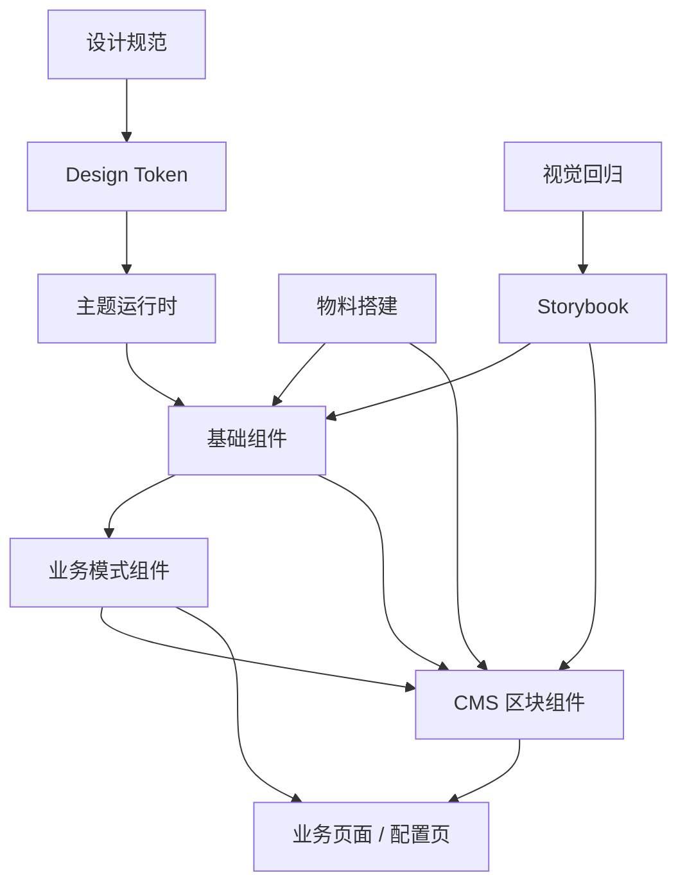
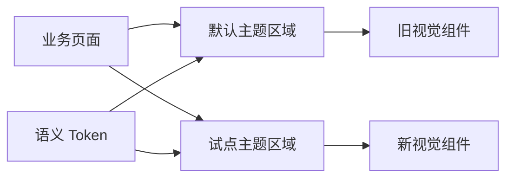
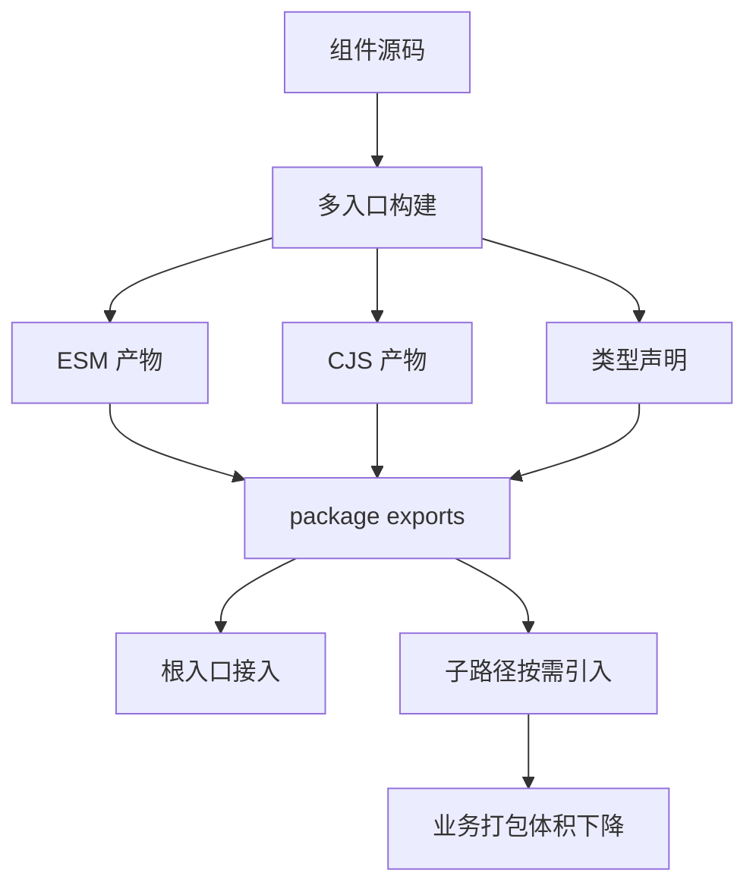
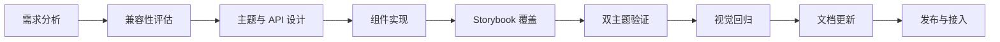

# 前言

这篇文章是我对一次大型电商前端体系里组件库建设的复盘笔记。

当时整个平台正在做架构重构——消费者端、门店端代码耦合严重，多端 UI 无法复用，七年迭代积累的设计债务已经影响到交付效率和性能指标。组件库不是孤立存在的，它是这套新架构里「可维护、可配置、可快速交付」目标的基础设施之一。

所以这件事从一开始就不是「把 Button 补齐」，而是一次围绕设计系统、组件治理、视觉回归、主题演进、构建发布和性能治理的工程化改造。我负责整体技术方案设计和落地推进。

## 问题背景

在长期迭代的电商系统里，不同业务应用会各自维护 `Button、Input、Modal、Card、Form` 等基础组件。Cart 里的 Card 和 Payment 里的 Card 间距不一样，移动端表现也不一样——短期能快，长期一定散。

具体痛点：

- 同一类组件在不同页面出现不同的间距、圆角、字号和交互反馈
- 设计稿更新后，工程侧没有统一入口同步视觉变化
- 组件行为分散在业务页面里，复用时需要复制样式和交互逻辑
- UI 走查发生在提测后，发现问题时返工成本已经很高
- 新旧视觉体系并存时，缺少主题隔离、兼容策略和回滚抓手
- 平台重构需要 CMS 页面、投放页、核心业务页共用一套视觉语言，但各走各的路

真正要解决的，是建立一套可以持续演进的前端设计系统基础设施。

## 设计系统在整体架构中的位置

在平台架构方案里，我把设计系统拆成三个协作层，而不是一个单独的 npm 包：

| 层级 | 职责 | 典型消费方 |
| --- | --- | --- |
| 基础组件库 | Token、Theme、Primitive、Pattern | 所有业务应用 |
| CMS 组件库 | 页面搭建用的区块组件，偏 Low-Code | 运营配置页、投放页 |
| 物料体系 | 设计稿 → 组件化 → 代码 + 设计稿对齐 | 设计、前端协作 |

基础组件库提供「原子能力」，CMS 组件库提供「页面拼装能力」，物料体系解决「设计到代码」的流转。三者共用同一套 Token 和 Theme，否则视觉一致性会在 CMS 层再次断裂。



## 组件分层模型

我把组件库拆成四层：**Token → Theme → Primitive → Pattern**。

- **Token 层**：颜色、字体、间距、圆角、阴影、动效节奏等最小变量。内部方案是 JSON 定义 → 构建时生成 → 运行时切换主题。
- **Theme 层**：把 Token 组合成具体视觉体系，提供运行时注入能力。
- **Primitive 层**：无业务语义的基础组件，只负责状态、可访问性、主题适配和 API 稳定性。
- **Pattern 层**：电商场景中复用频率高的交互模式（商品卡片、价格展示、促销标签等），只做场景组合，不反向污染基础组件。

主题变化优先落在 Token 和 Theme 层，而不是让每个业务页面手动改样式。

## CDD：组件驱动开发流程

内部文档里把 Storybook 定位为「文档系统」，Chromatic 定位为「协作系统」。我的理解是：这不是两个独立工具，而是一条 **Component Driven Development（CDD）** 流水线——组件先于页面存在，页面是组件的组合。

### Storybook 是研发环境，不是文档站

每个组件进入组件库前，必须在 Storybook 中覆盖关键状态：

- 默认、悬停、聚焦、禁用、加载、错误等基础状态
- 空数据、长文本、极端数量、异步加载等边缘场景
- 键盘操作、焦点顺序、弹层关闭等交互行为
- 不同视口下的响应式表现
- 不同主题下的视觉表现

组件的「文档」不再是额外维护的说明，而是随源码一起演进的可交互用例。开发、设计、QA 在同一个环境里讨论问题，避免只靠截图沟通。

### 视觉回归前移到 PR 阶段

传统 UI 走查太晚——等业务页面开发完成后再发现基础组件间距不一致，修复范围往往已经扩大到多个页面。

我基于 Storybook + Chromatic 搭建视觉回归流程，让每个组件变更在 PR 阶段就生成视觉对比：


价值不在于「截图自动化」，而在于改变评审时机：设计验收从业务提测后提前到组件开发阶段。

### 测试金字塔里的组件测试

平台测试策略里，组件测试是承上启下的关键层。我为组件库建立了四类覆盖：

| 类型 | 工具 | 覆盖目标 |
| --- | --- | --- |
| 视觉测试 | Storybook + Chromatic | 多主题、多视口下的像素级一致性 |
| 可访问性测试 | Storybook a11y addon | 键盘导航、ARIA、对比度 |
| 交互测试 | Storybook interaction testing | 用户操作流程、状态切换 |
| 快照测试 | Storybook snapshot | 结构变更的回归告警 |

单元测试覆盖纯逻辑（Token 转换、兼容层映射），E2E 留给核心链路。组件库本身不需要跑全站 E2E，但每个 Primitive 和 Pattern 都必须在 Storybook 层自证。

## 组件约束策略

组件库真正开始稳定，是从「写组件」转向「约束组件应该怎么被写」。

核心规则：

- 组件库只沉淀基础组件，不把业务特例直接塞进底层
- Storybook 必须覆盖设计稿中的关键变体和典型用例，而不是只写 happy path
- 组件实现、样式定义、类型声明和测试用例要明确分层
- 基于已有 UI 基座做扩展时，优先走主题扩展和变体扩展，不鼓励业务页面局部打补丁

### 例子：新增变体，而不是在页面上写死样式

最容易失控的场景：设计临时提了一个样式变化，业务页面直接加一段 CSS 覆盖。

更稳妥的做法是把变化提升为受控的组件能力。比如 Tooltip 需要新增 `editorial` 变体：

1. 在主题类型里声明新的 `variant`
2. 在主题层补充默认视觉映射
3. 在具体组件上接入该变体的样式覆盖

```ts
type TooltipVariant = "solid" | "soft" | "editorial";

declare module "@mui/joy/Tooltip" {
  interface TooltipPropsVariantOverrides {
    editorial: true;
  }
}

const tooltipVariants = {
  editorial: {
    backgroundColor: "var(--palette-surface-elevated)",
    color: "var(--palette-text-primary)",
    border: "1px solid var(--palette-border-subtle)",
  },
};
```

看似比「页面里多写几行 CSS」更慢，但新的视觉能力是可复用、可测试、可文档化的。

## 主题架构：不能依赖全局覆盖

品牌视觉升级或多品牌业务中，最容易出问题的是主题泄漏。如果主题只是全局 CSS 变量覆盖，局部试点、A/B 实验或渐进式迁移都很难做。

我定了三个原则：

- 同一个应用里可以同时渲染新旧主题
- 主题作用域绑定到组件子树，而不是全局页面
- 组件内部只读取语义 Token，不直接写死颜色、字号和阴影



### RSC 场景下的 Theme Provider

新 Web 应用采用 RSC + Client Component 混合架构后，主题注入遇到了一个结构性约束：**React Context 不能在 Server Component 里使用**。

我的处理方式是把 Theme Provider 抽成独立的 Client Component，在 Server Layout 里以 `children` 插槽形式包裹：

```tsx
// theme-provider.tsx — Client Component
"use client";

import { ThemeProvider as BaseThemeProvider } from "@company/design-system";

export default function ThemeProvider({
  children,
}: {
  children: React.ReactNode;
}) {
  return <BaseThemeProvider>{children}</BaseThemeProvider>;
}
```

```tsx
// layout.tsx — Server Component
import ThemeProvider from "./theme-provider";

export default function RootLayout({ children }) {
  return (
    <html>
      <body>
        <ThemeProvider>{children}</ThemeProvider>
      </body>
    </html>
  );
}
```

这样 Server Component 子树仍然可以在 Provider 内部正常渲染，主题边界清晰，也不会把整个页面拖进客户端 bundle。

第三方组件如果缺少 `'use client'` 指令，同样用薄 Client Wrapper 包一层——这是组件库消费侧的标配模式。

## 新旧主题兼容

兼容策略分三类，我在落地时按优先级依次判断：

### 第一类：同构组件，主题覆盖

结构不变、只是视觉映射变化的组件，优先通过 `styleOverrides` 或语义变量映射做兼容。旧用法不需要改动，主题层负责映射。

```ts
const legacyThemeBridge = {
  Button: {
    styleOverrides: {
      root: ({ ownerState, theme }) => ({
        ...(ownerState.color === "primary" &&
          ownerState.variant === "solid" && {
            backgroundColor: theme.vars.palette.surface.accent,
            color: theme.vars.palette.text.primary,
          }),
      }),
    },
  },
};
```

落地链路：


### 第二类：变量体系不同，受控回退

新旧主题并存时，很多问题出在 CSS 变量体系不同。所有新变量必须有明确回退链：

```ts
const styles = {
  backgroundColor:
    "var(--variant-solidBg, var(--palette-primary-500, #0B6BCB))",
  color: "var(--variant-solidColor, var(--palette-common-white, #fff))",
};
```

### 第三类：组件语义变了，属性兼容层

有些组件的能力抽象本身变了——旧版用一种 props 组合表达状态，新版拆成 `variant + color + size`。我加一层很薄的兼容层，把旧属性翻译成新属性：

- 兼容层只做过渡，不成为长期主路径
- 兼容规则必须显式、可测试、可删除
- 文档里明确标识弃用时间和升级路径

## 构建与发布

组件库如果只解决「本地能跑」，消费侧很快就会出问题。构建出口和发布模型直接影响体积、按需加载、SSR 兼容和升级成本。

### 多入口构建 + npm 包发布

组件库设计成根入口加子路径入口并存，通过私有 npm registry 发布，供 monorepo 内多个应用消费：

```json
{
  "exports": {
    ".": {
      "import": "./dist/index.js",
      "types": "./dist/index.d.ts"
    },
    "./Button": {
      "import": "./dist/Button/index.js",
      "types": "./dist/Button/index.d.ts"
    }
  }
}
```



### 保留 `'use client'` 指令

组件库里存在客户端组件。如果构建产物把 `'use client'` 吞掉，进入 Next.js App Router 的 RSC 环境时就会出现边界错误。构建链路里需要专门处理指令保留。

### 双产物验证清单

CJS 与 ESM 不是「顺手都打一下」就够了。我总结的交付标准是：

- 根入口和子入口都能被正确解析
- 类型声明能跟着子路径导出走
- SSR / RSC、普通 CSR 和 Storybook 环境都能消费
- 构建成功 ≠ 可以交付，必须在三种消费场景下各验一遍

## 性能与 SSR

后期最有意思的一部分，不是组件 API，而是组件库本身对 SSR 的负担。

一次性能诊断里观察到：

- 首屏 FCP 一度在 2.5 秒左右
- 页面注入的 CSS 变量超过 2000 个
- 首屏涉及二十多种组件类型
- 服务端输出的 HTML 一度接近 1MB

单个组件看不出异常，但主题变量、样式系统、字体、图标和多组件组合一起进入 SSR 时，累计成本会突然放大。

### 拆问题的方式

我把问题拆成四块，分别治理：

| 维度 | 动作 |
| --- | --- |
| 包体积 | 多入口构建 + 子路径导入 + 体积基线 |
| 样式注入 | 收紧 Token 输出范围，按主题按需注入 |
| 字体资源 | 子集化、`unicode-range`、`font-display: swap` |
| 消费方式 | lint + codemod 推动从根入口迁移到子路径 |

字体优化看起来是视觉问题，实际上是性能问题——减少首屏必须立即承担的资源，比事后压缩更有效。

Tree Shaking 也不是一句 `sideEffects: false` 就行。真正影响摇树效果的往往是：是否只有单一 barrel 导出、副作用代码是否跟着根入口加载、子路径导出是否足够明确、消费侧是否继续大而全地从根入口引入。

## 开发闭环

组件库能不能长期稳定，最后看的是闭环：



任何一个组件能力都必须同时回答四个问题：

- 它怎么被设计系统表达？
- 它怎么在主题里落地？
- 它怎么被 Storybook 和视觉回归覆盖？
- 它怎么在旧系统里兼容和迁移？

只回答前两个，组件会变成「局部可用」；四个都回答清楚，组件才能进入长期维护状态。

## 成果

- **设计一致性工程化**：颜色、字体、间距、状态和主题通过 Token、Theme 和组件 API 统一表达，不再散落在业务代码里
- **UI 走查前移**：大量视觉问题在 PR 阶段就被发现，不再等到业务页面提测后才集中返工
- **开发效率更稳定**：新页面不需要从零处理基础组件状态和样式，开发者可以把精力放在业务逻辑上
- **视觉升级成本降低**：遵守 Token 和主题约束后，很多品牌层面的调整可以通过主题层完成
- **CMS 页面与业务页面视觉统一**：区块组件和基础组件共用 Token，运营配置页不再「另起炉灶」

## 复盘

组件库不是组件集合，而是一套协作机制。

如果只看代码，它可能只是 Button、Input、Modal、Form；但从工程管理角度看，它解决的是更大的问题：设计如何被代码准确表达，组件如何被稳定复用，视觉变化如何被自动验证，业务系统如何在不停止迭代的情况下完成渐进迁移。

真正体现技术负责人的地方，不是写出几个好看的组件，而是能不能把这些细节串成一个可执行的系统——从变体扩展、样式变量回退、兼容层设计，到构建出口、RSC 边界、SSR 负担和体积治理，每一层都要考虑边界、迁移成本和长期维护。

设计系统项目最难的从来不是「做出来」，而是「让它在复杂业务里长期成立」。
