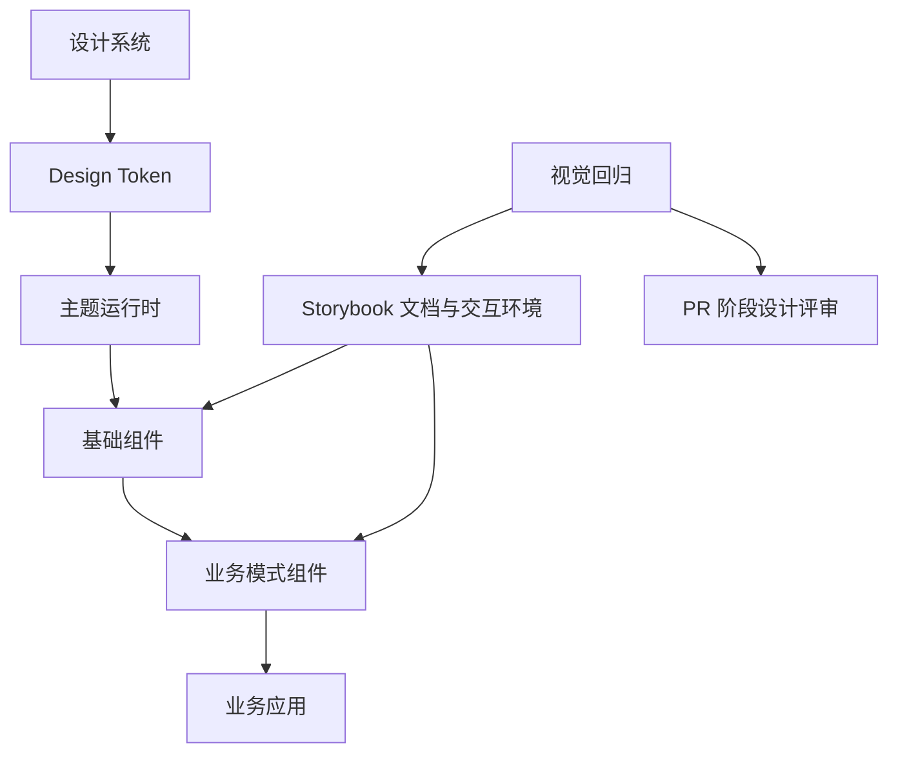
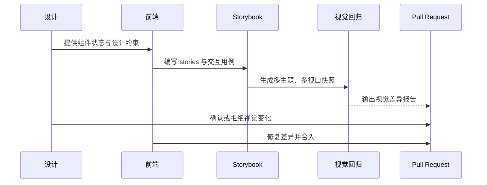
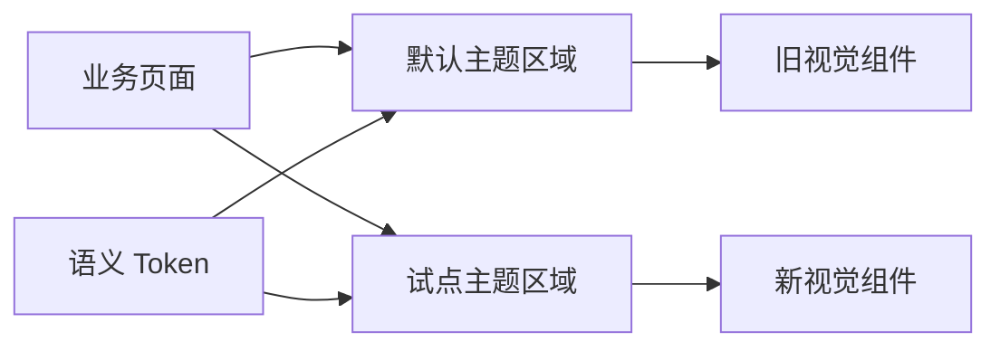
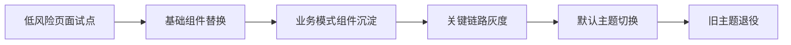

# 企业级电商组件库建设实践：从设计系统到工程化交付

这篇文章复盘的是我在一个企业级电商前端体系中主导推进的组件库建设。它不是一次单纯的 UI 组件重写，而是一次围绕设计系统、组件治理、视觉回归、主题演进和跨团队协作的工程化改造。

项目的核心目标很明确：把散落在多个业务应用中的 UI 实现收敛为一套可版本管理、可自动化验证、可渐进演进的组件系统，让设计语言不再依赖人工记忆和页面走查，而是成为代码层面的稳定契约。

## 问题背景

在长期迭代的电商系统里，UI 腐化通常不是突然发生的，而是日积月累形成的。

多个业务应用会分别维护自己的 Button、Input、Modal、Card、Form 等基础组件。短期看，这种方式能让业务快速上线；长期看，它会带来几个问题：

- 同一类组件在不同页面出现不同的间距、圆角、字号和交互反馈。
- 设计稿更新后，工程侧没有统一入口可以同步视觉变化。
- 组件行为分散在业务页面里，复用时需要复制样式和交互逻辑。
- UI 走查发生在提测后，发现问题时返工成本已经很高。
- 新旧视觉体系并存时，缺少主题隔离和灰度切换能力。

我接手时，真正需要解决的不是“再做一套组件”，而是建立一套可以持续演进的前端设计系统基础设施。

## 我的角色

我在这个项目中主要负责整体技术方案设计和落地推进，包括：

- 设计组件库的分层模型和边界，明确基础组件、组合组件和业务模式组件各自承担什么职责。
- 推进设计 Token、主题运行时和组件 API 的统一，避免样式继续散落在业务代码中。
- 引入 Storybook 作为组件开发、文档和设计评审的统一入口。
- 引入视觉回归流程，把设计验收前移到 PR 阶段。
- 设计新旧主题并存方案，支持业务应用渐进式迁移。
- 制定组件准入标准、review 清单和发布策略，保证组件库不是“一次性重构”，而是可维护的长期工程资产。

## 架构设计

我把组件库拆成四层：Token、Theme、Primitive、Pattern。

Token 层负责承载设计系统的最小变量，例如颜色、字体、间距、圆角、阴影和动效节奏。Theme 层把 Token 组合成具体视觉体系，并提供运行时注入能力。Primitive 层提供无业务语义的基础组件。Pattern 层则沉淀电商场景中复用频率高的业务交互模式。

这个分层的好处是职责清晰。

基础组件只关心可访问性、状态覆盖、主题适配和 API 稳定性；业务模式组件可以封装特定交互，例如表单组合、商品信息展示、流程状态反馈等；业务应用只消费稳定接口，不再直接维护底层视觉细节。

## 关键技术决策

### 1. Storybook 不是文档站，而是组件研发环境

过去的组件文档通常是静态说明：展示一段用法、列出 Props 表格，再放几张截图。但这种方式无法验证组件在真实交互中的表现。

我选择把 Storybook 定位为组件研发环境，而不是单纯的文档站。每个组件进入组件库前，都必须在 Storybook 中覆盖关键状态：

- 默认、悬停、聚焦、禁用、加载、错误等基础状态。
- 空数据、长文本、极端数量、异步加载等边缘场景。
- 键盘操作、焦点顺序、弹层关闭等交互行为。
- 不同视口下的响应式表现。
- 不同主题下的视觉表现。

这样做之后，组件的“文档”不再是额外维护的说明，而是随源码一起演进的可交互用例。开发、设计、QA 都可以在同一个环境里讨论问题，避免只靠截图沟通。

### 2. 视觉回归前移到 PR 阶段

传统 UI 走查的问题是太晚。等业务页面开发完成后再发现基础组件间距、颜色或状态不一致，修复范围往往已经扩大到多个页面。

我引入基于 Storybook 的视觉回归流程，让每个组件变更在 PR 阶段就生成视觉对比。评审不再只看代码 diff，还要看组件在多主题、多视口、多状态下的视觉 diff。

这套流程的价值不在于“截图自动化”，而在于改变评审时机：设计验收从业务提测后提前到组件开发阶段。

### 3. 主题切换不能依赖全局覆盖

在品牌视觉升级或多品牌业务中，最容易出问题的是主题泄漏。如果主题只是全局 CSS 变量覆盖，那么一个页面里的局部试点、A/B 实验或渐进式迁移都很难做。

我设计的主题方案遵循三个原则：

- 同一个应用里可以同时渲染新旧主题。
- 主题作用域必须绑定到组件子树，而不是全局页面。
- 组件内部只读取语义 Token，不直接写死颜色、字号和阴影。

这个设计让迁移可以按页面、模块甚至组件粒度推进。新主题上线时，不需要整站一次性切换，也不需要在组件里写大量 `if theme === new` 的条件分支。

### 4. API 设计优先稳定，其次才是灵活

组件库最容易走偏的地方，是为了满足所有业务诉求而暴露过多样式入口。短期看很灵活，长期看会让组件库退化成“带默认样式的 div”。

我在 API 设计上坚持几个原则：

- 业务方优先通过语义化 props 表达意图，而不是直接传颜色、间距和 CSS。
- 常用组合沉淀为 variant，而不是让每个调用方手写样式。
- 对可访问性有影响的交互由组件内部处理，不交给业务重复实现。
- 对确实需要扩展的场景提供有限插槽，而不是完全开放内部结构。

例如按钮组件不应该允许业务随意传入任意十六进制色值，而应该通过 `variant`、`color`、`size`、`loading`、`disabled` 等语义字段表达状态。真正的视觉映射由主题层决定。

## 难点与解决方案

### 难点一：设计系统与代码实现容易脱节

设计系统如果只存在于设计稿和文档里，很快会和真实代码脱节。我的做法是把设计约束转化为工程约束。

首先，Token 分为三层：

- Global Token：颜色、字号、间距等基础变量。
- Semantic Token：文本色、边框色、背景色、危险态、成功态等语义变量。
- Component Token：某个组件内部的局部视觉映射。

其次，组件代码只消费语义 Token。这样即使底层品牌色发生变化，组件 API 和业务调用方式也不需要跟着变化。

最后，Storybook 中的 stories 覆盖设计稿里的所有关键状态。设计评审不再依赖静态标注，而是直接评审可交互实现。

### 难点二：视觉回归容易产生噪音

视觉回归刚接入时，最常见的问题不是漏报，而是误报。字体加载、动画、时间戳、随机数据、异步状态都可能导致截图差异。

我从三个方向降低噪音：

- 数据确定性：stories 使用固定 mock 数据，避免随机头像、随机日期、随机数量。
- 渲染确定性：对动画和加载态做稳定处理，确保截图发生在组件稳定状态。
- 覆盖有边界：只对核心组件、关键状态和关键视口做强约束，避免无意义的全量截图。

这让视觉回归从“让人疲惫的截图报警”变成真正可用的质量门禁。

### 难点三：新旧视觉体系需要长期并存

品牌升级通常不是一次开关，而是一个持续数周甚至数月的渐进过程。核心交易链路不能为了视觉升级承担不可控风险。

我采用的迁移策略是：

先从低风险页面验证主题和组件，再逐步推进到核心链路。每一步都保留回滚空间，避免“一次性重写”带来的交付风险。

### 难点四：组件库治理比组件开发更难

组件写出来只是第一步，真正难的是长期治理。没有治理机制的组件库很快会再次失控。

我推动建立了几个规则：

- 新组件必须有 stories、交互状态、可访问性检查和视觉回归覆盖。
- 破坏性变更必须提供迁移说明，必要时提供兼容层。
- Props 命名遵循统一语义，避免同类能力出现多个名字。
- 组件进入稳定版本前，需要经过设计和前端共同评审。
- 业务专属逻辑不能下沉到基础组件层，只能沉淀到 Pattern 层。

这些规则看起来像流程，但本质上是降低未来维护成本的工程边界。

## 项目亮点

### 设计系统产品化

我没有把组件库当成内部工具包，而是当成一个产品来设计。它有清晰的目标用户：业务前端、设计师、QA 和未来维护者。

对前端来说，它提供稳定 API 和可复制的组件模式。对设计师来说，它提供可交互的真实实现和视觉回归结果。对 QA 来说，它把很多视觉和交互问题提前暴露在组件阶段。对维护者来说，它提供明确的分层和治理标准。

### 组件驱动开发落地

组件开发顺序从“先写业务页面，再抽组件”变为“先定义组件契约，再接入业务页面”。

这种方式让很多设计缺口在业务开发前就暴露出来，例如超长文本如何截断、错误态是否需要图标、弹层关闭是否支持键盘、移动端是否需要不同布局等。问题越早暴露，修复成本越低。

### 多主题能力可复用

多主题能力不是为了某一次视觉升级临时加的逻辑，而是作为长期能力沉淀下来。后续如果出现品牌微调、区域化视觉差异、活动主题或设计系统升级，都可以复用同一套主题运行时。

### 质量门禁自动化

组件库的质量不再只靠人工 review。类型检查、交互测试、可访问性检查和视觉回归共同构成了质量门禁。

这使得每次组件变化都有明确证据：代码是否正确、交互是否可用、视觉是否符合预期、是否影响旧主题。

## 成果

这次组件库建设带来的变化主要体现在四个方面。

第一，设计一致性从“人工约定”变成了“工程约束”。颜色、字体、间距、状态和主题不再散落在业务代码里，而是通过 Token、Theme 和组件 API 统一表达。

第二，UI 走查显著前移。大量视觉问题在 PR 阶段就被发现，不再等到业务页面提测后才集中返工。

第三，业务开发效率更稳定。新页面不需要从零处理基础组件状态和样式，开发者可以把精力放在业务数据流和交互逻辑上。

第四，后续视觉升级的成本降低。只要组件层遵守 Token 和主题约束，很多品牌层面的调整可以通过主题层完成，而不是逐个页面手工修改。

## 复盘

我对这个项目最大的感受是：组件库不是组件集合，而是一套协作机制。

如果只看代码，它可能只是 Button、Input、Modal、Form、Tabs、Toast 等组件；但从工程管理角度看，它解决的是更大的问题：设计如何被代码准确表达，组件如何被稳定复用，视觉变化如何被自动验证，业务系统如何在不停止迭代的情况下完成渐进迁移。

这类项目真正考验的不是某个组件写得多精致，而是能否在复杂业务、长期迭代和多人协作中持续保持边界清晰。我在这个项目中的主要价值，也不只是完成实现，而是把组件库从“可用”推进到“可治理、可验证、可演进”。
