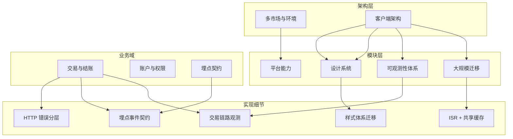

## 前言

资料分散时，真正拖慢理解速度的往往不是“没有文档”，而是**不知道先建立什么心智模型**。

这页不再把资料当作一串目录，而是重新组织成一张可浏览的入口图。核心思路只有一条：

1. 先看**四层结构**，建立总览
2. 再按**主题域**收束到具体方向
3. 最后沿**推荐路线**进入对应工程笔记

页面上方是可交互视图，下方保留一份静态备份，方便快速扫读或离线查阅。

---

## 这页解决什么问题

| 常见问题                           | 这页给出的入口                     |
| ---------------------------------- | ---------------------------------- |
| 文档很多，不知道从哪开始           | 先看「分层全景」                   |
| 只想聚焦单一方向                   | 切到「域关系」，按主题域筛选       |
| 想快速进入某类问题                 | 切到「阅读路径」，按角色直接走路线 |
| 看到一个名词，不知道它和上下游关系 | 点开节点看摘要、关联节点和已有笔记 |

---

## 建议阅读顺序

### 1. 第一次看：先补全整体结构

- 从 **架构层** 开始，只看“多市场与环境”“客户端架构”两个节点
- 目标不是记细节，而是先分清什么属于全局边界、什么属于模块能力
- 看完后再下钻到迁移、设计系统、交易链路，不容易迷路

### 2. 第二次看：按主题域收束

如果已经知道要查什么问题，可以直接按主题域进入：

- **设计系统**：组件库、Token、样式迁移
- **迁移**：灰度切换、节奏拆分、兼容策略
- **交易支付**：Checkout、支付编排、回调闭环
- **可观测性**：日志、告警、交易链路追踪
- **错误治理**：HTTP 分层、鉴权刷新、幂等重试

### 3. 第三次看：沿阅读路线进入笔记

页面内置了三条推荐路线：

- **前端基础**：适合先补架构、组件体系和样式演进
- **迁移专项**：适合处理遗留系统替换和灰度切换
- **业务链路**：适合快速进入 Checkout、支付、埋点和异常处理

---

## 四层结构怎么理解

| 层级     | 看什么                             | 读完后应该得到什么           |
| -------- | ---------------------------------- | ---------------------------- |
| 架构层   | 全局边界、多市场、客户端分层       | 知道系统为什么这样拆         |
| 模块层   | 迁移、平台能力、可观测性、设计系统 | 知道跨域基础设施如何支撑业务 |
| 业务域   | 交易、账户、埋点、错误治理         | 知道问题发生在哪条业务链路   |
| 实现细节 | 缓存、埋点、错误处理、样式迁移     | 知道具体工程方案怎么落地     |

---

## 静态备份：分层结构

---

## 配套阅读

- [工程实践札记索引](/posts/engineering-practice-hub/)：文字版总目录，适合顺着主题继续深入阅读
- [企业级电商前端平台架构重构](/posts/ecommerce-architecture-redesign/)：适合作为整张地图的起点
- [设计系统与组件库建设复盘](/posts/design-system-cdd-practice/)：适合补全设计系统侧的实现视角
- [交易链路可观测性技术方案](/posts/transaction-observability-tech-plan/)：适合补全交易域和监控闭环
