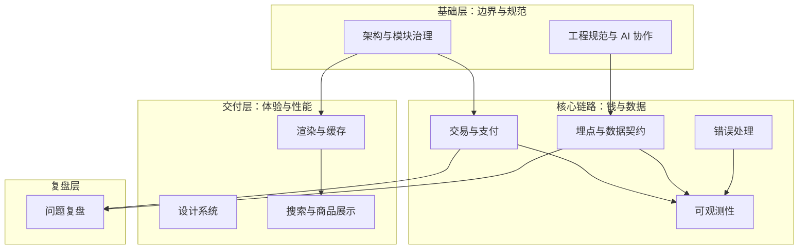

# 前言

这份索引不是「技术栈清单」，而是我整理工程实践时的**思考地图**。

过去几年，我主要在做一件事：把一个迭代了七年的跨境电商前端系统，从高度耦合的 legacy，逐步改造成可复用、可观测、可渐进迁移的多端平台。过程中踩过很多坑——模块边界失控、埋点口径不一致、支付回调难追踪、ISR 缓存在多实例下失效——也沉淀了不少可复用的方案。

我把原始资料（架构文档、ADR、SKILL、问题复盘）拷贝到了本地仓库的 `docs/joyboy/`，并通过 `docs/engineering-notes/` 下的软链做了分类索引。这篇博文是在线版的导航目录：**已整理成个人笔记的，直接点文章链接；还在整理中的，先链到本地资料源。**

> 这是一份**持续更新**的索引，不是一次写完的总结。每迁移一篇笔记，我会回来更新对应条目的状态。

---

## 怎么用这份索引

| 标记 | 含义 |
| --- | --- |
| ✅ 已发布 | 已去企业化、可对外阅读的个人笔记 |
| 📝 草稿 | 笔记主体已写，还在打磨 |
| 📂 资料源 | 原始方案文档，待在本地阅读后迁移 |

本地资料统一入口：[docs/engineering-notes/](https://github.com/Lee-NG915/cBlog/tree/main/docs/engineering-notes)（仓库内软链索引，IDE 中可直接跳转原始文档）

**交互式知识地图**：[电商前端工程知识图谱](/posts/joyboy-knowledge-map/) — 分层全景 / 域关系 / 阅读路径，点击节点跳转工程笔记。

---

## 全景图



我的核心判断：**先把边界和规范立住，再谈性能和业务功能。** 没有模块约束和事件契约，后面的缓存、埋点、监控都会变成补丁摞补丁。

---

## 一、架构与边界治理

**我为什么看重这一层：** 七年 legacy 最大的痛，不是某个框架旧了，而是「改一处牵全局」。Clean Architecture 分层 + Nx 依赖约束，本质是在代码审查之前就把错误依赖挡住。

| 主题 | 我的判断 | 笔记状态 | 链接 |
| --- | --- | --- | --- |
| 整体架构重构复盘 | Monorepo 按业务域拆分，Component → Service → Domain 单向依赖；多端复用靠域模块而不是复制页面 | ✅ 已发布 | [企业级电商前端平台架构重构](/posts/ecommerce-architecture-redesign/) |
| 大规模迁移节奏 | 全量切换风险太高，用 Feature Flag + 分批迁移把「上线」拆成可回滚的小步 | 📝 草稿 | [消费者端迁移计划](/posts/ecommerce-migration-plan/) |
| 架构审查与演进路线 | 定期做架构 review，把「现在能跑」和「以后能扩展」分开评估 | 📂 资料源 | [architecture-review.md](https://github.com/Lee-NG915/cBlog/blob/main/docs/joyboy/docs/architecture-review.md) |
| Shared → Composite 迁移 | 跨域组合场景单独建 composite 层，避免 shared 模块变成「万能垃圾场」 | 📂 资料源 | [shared-to-composite-migration.md](https://github.com/Lee-NG915/cBlog/blob/main/docs/joyboy/docs/SHARED_TO_COMPOSITE_MIGRATION.md) |
| Redux Listener 事件模式 | 副作用（埋点、日志、跨模块联动）走 listener，UI 只 dispatch 领域事件 | 📂 资料源 | [redux-listener-event-pattern.md](https://github.com/Lee-NG915/cBlog/blob/main/docs/joyboy/docs/redux-listener-event-design-pattern.md) |
| 项目规范（AGENTS） | 把命名、分层、埋点红线写进 AI 可读规范，减少「每次口头对齐」 | 📂 资料源 | [project-agents-spec.md](https://github.com/Lee-NG915/cBlog/blob/main/docs/joyboy/AGENTS.md) |

---

## 二、渲染与性能

**我为什么分开看渲染策略：** 电商站不是所有页面都该 SSR。投放页要 ISR + 缓存扛流量，结账页要 RSC 保首屏和数据一致性，门店 POS 要 CSR 快速迭代——一刀切只会牺牲某一类场景。

| 主题 | 我的判断 | 笔记状态 | 链接 |
| --- | --- | --- | --- |
| ISR + Redis 共享缓存 | 多实例部署下，仅靠 Next.js 本地缓存会不一致；Redis 做跨实例共享是性价比最高的方案 | ✅ 已发布 | [Next.js ISR + Redis 共享缓存](/posts/nextjs-isr-redis-shared-cache/) |
| PLP 技术方案 | 搜索列表页是流量入口，SearchKit + InstantSearch 的组合在定制性和交付速度之间比较平衡 | 📂 资料源 | [plp-tech-solution.md](https://github.com/Lee-NG915/cBlog/blob/main/docs/joyboy/docs/PLP技术方案.md) |
| PLP 优先于 CLP | 分类页和列表页的 SEO / 投放价值不同，资源分配要有优先级而不是平行推进 | 📂 资料源 | [plp-priority-over-clp.md](https://github.com/Lee-NG915/cBlog/blob/main/docs/joyboy/docs/PRD-PLP-Priority-Over-CLP.md) |
| PDP 数据分桶优化 | 商品详情页接口太重时，按展示区块分桶请求，比一次性拉全量更容易控 LCP | 📂 资料源 | [pdp-data-bucket-optimization.md](https://github.com/Lee-NG915/cBlog/blob/main/docs/joyboy/docs/prd-pdp-data-bucket-optimization.md) |
| 搜索结果缓存 | 热门搜索词缓存可以显著降 ES 压力，但要处理好失效和个性化冲突 | 📂 资料源 | [search-result-cache.md](https://github.com/Lee-NG915/cBlog/blob/main/docs/joyboy/docs/search-result-cache.md) |
| 本地开发性能 | 大 Monorepo 本地慢会直接影响迭代意愿，值得单独做一轮优化计划 | 📂 资料源 | [local-dev-performance-plan.md](https://github.com/Lee-NG915/cBlog/blob/main/docs/joyboy/docs/LOCAL_DEV_PERFORMANCE_PLAN.md) |

---

## 三、设计系统

**我为什么主导组件库建设：** UI 不一致不只是「不好看」，而是会拖慢每个业务需求——同一个按钮五种写法，评审和测试成本都会翻倍。

| 主题 | 我的判断 | 笔记状态 | 链接 |
| --- | --- | --- | --- |
| 组件库 CDD 实践 | 从设计 token 到 Storybook 到视觉回归，组件库要当产品做而不是当工具库堆 | ✅ 已发布 | [企业级电商组件库建设实践](/posts/design-system-cdd-practice/) |
| Joy UI → Tailwind 迁移 ADR | 运行时 CSS-in-JS 对 SSR 性能和包体积不友好；Tailwind 让我们更接近「样式即契约」 | ✅ 已发布 | [Joy UI 迁移 ADR](/posts/joyui-to-tailwind-migration-adr/) |
| 代码格式化规范 | Prettier + ESLint 统一格式，比靠 code review 抓风格便宜得多 | 📂 资料源 | [code-formatting-guide.md](https://github.com/Lee-NG915/cBlog/blob/main/docs/joyboy/docs/代码格式化指南.md) |

---

## 四、交易与支付

**我为什么把支付单独成章：** 支付是电商里「出错成本最高」的链路——不只是用户体验，还涉及资金、对账和合规。架构上必须可追踪、可回滚、可替换渠道。

| 主题 | 我的判断 | 笔记状态 | 链接 |
| --- | --- | --- | --- |
| 支付链路架构 | 策略模式 + Server Action 编排，UI 只响应 ActionSchema 指令 | ✅ 已发布 | [电商支付链路架构](/posts/payment-pipeline-architecture/) |
| 支付架构重构 ADR | 把 initiate / confirm / callback 拆清楚，比在一个 hook 里写完所有逻辑更易测试 | 📂 资料源 | [payment-architecture-adr.md](https://github.com/Lee-NG915/cBlog/blob/main/docs/joyboy/docs/adr/2026-03-payment-architecture-refactoring.md) |
| Stripe Payment Element | 卡支付走 Payment Element，Express 支付单独 slot，避免重复入口 | 📂 资料源 | [stripe-payment-element.md](https://github.com/Lee-NG915/cBlog/blob/main/docs/joyboy/docs/payment-integration-solutions/payment-stripe-payment-element-integration.md) |
| Stripe Express Checkout | Apple Pay / Google Pay / Link 用独立 Element，和卡支付共用后端 pipeline | 📂 资料源 | [stripe-express-checkout.md](https://github.com/Lee-NG915/cBlog/blob/main/docs/joyboy/docs/payment-integration-solutions/payment-stripe-express-checkout-element-integration.md) |
| Stripe Link UI 约束 | 第三方组件的样式定制有硬边界，提前写进方案比上线后才发现省事 | 📂 资料源 | [stripe-link-ui-constraints.md](https://github.com/Lee-NG915/cBlog/blob/main/docs/joyboy/docs/payment-integration-solutions/stripe-link-ui-customization-constraints.md) |
| SPL 分期支付 | 区域性支付方式要隔离在 checkout 模块内，不能污染通用支付流程 | 📂 资料源 | [web-checkout-spl-payment.md](https://github.com/Lee-NG915/cBlog/blob/main/docs/joyboy/docs/web-checkout-spl-payment-tech-design.md) |
| 延保（Warranty） | 附加售卖是独立业务域，有自己的校验规则和架构边界 | 📂 资料源 | [warranty-architecture.md](https://github.com/Lee-NG915/cBlog/blob/main/docs/joyboy/docs/warranty/architecture-design.md) |

---

## 五、可观测性

**我为什么推动交易链路可观测：** 支付出问题的时候，「用户说扣了款但订单没生成」这种 case，靠 grep 日志基本查不动。需要 traceId 把 Sentry、日志、Grafana 串起来。

| 主题 | 我的判断 | 笔记状态 | 链接 |
| --- | --- | --- | --- |
| 交易链路可观测性总方案 | 从被动排障升级到主动预警，SLO + Runbook 比堆 dashboard 更重要 | ✅ 已发布 | [交易链路可观测性建设](/posts/transaction-observability-tech-plan/) |
| 平台实施计划 | 分阶段落地：先统一 traceId，再做告警路由，最后补 SLO | 📂 资料源 | [transaction-observability-implementation.md](https://github.com/Lee-NG915/cBlog/blob/main/docs/joyboy/docs/transaction-related/transaction-observability/platform-implementation-plan.md) |
| 第三方回调追踪 | Redirect 类支付最难排障，回调入口必须带可关联的 trace 上下文 | 📂 资料源 | [redirect-provider-callback.md](https://github.com/Lee-NG915/cBlog/blob/main/docs/joyboy/docs/transaction-related/transaction-observability/redirect-provider-callback-design.md) |
| Sentry 分桶与路由 | error_bucket 自动分类 + ownership 规则，让 on-call 不用先看 200 条未分类 issue | 📂 资料源 | [sentry-issue-routing.md](https://github.com/Lee-NG915/cBlog/blob/main/docs/joyboy/docs/observability/sentry-issue-routing-guide.md) |
| 场景化接入 Skill | 不同场景（Layout / Server Action / Listener）走不同 API，避免 copy-paste 集成 | 📂 资料源 | [observability-skill.md](https://github.com/Lee-NG915/cBlog/blob/main/docs/joyboy/.agents/skills/observability/SKILL.md) |
| Runbook | 告警触发后第一步做什么，比告警规则本身更容易被忽略 | 📂 资料源 | [transaction-observability-runbook.md](https://github.com/Lee-NG915/cBlog/blob/main/docs/joyboy/docs/transaction-related/transaction-observability/runbook.md) |

---

## 六、埋点与数据契约

**我为什么坚持 Events Book：** 埋点出问题，80% 不是代码写错，而是 PM、研发、数据分析对「什么时候算触发」理解不一致。需要一层人也能读懂的事件契约。

| 主题 | 我的判断 | 笔记状态 | 链接 |
| --- | --- | --- | --- |
| 追踪事件模型总览 | UI dispatch 领域事件 → listener 编排 → trigger 发渠道，单向链路不可绕过 | ✅ 已发布 | [埋点事件契约（Events Book）](/posts/tracking-events-book-contract/) |
| 事件页模板 | 每个重要事件一份契约：含义、触发时机、字段、测试方案 | 📂 资料源 | [event-model-template.md](https://github.com/Lee-NG915/cBlog/blob/main/docs/joyboy/docs/tracking-event-model/event-model.template.md) |
| Checkout 埋点 | 结账漏斗事件最容易「过早触发」，契约里要写清楚非目标场景 | 📂 资料源 | [tracking-checkout.md](https://github.com/Lee-NG915/cBlog/blob/main/docs/joyboy/docs/tracking-event-model/checkout.md) |
| 交易类埋点 | 支付成功 / 失败 / 取消要区分系统行为与用户行为 | 📂 资料源 | [tracking-transaction.md](https://github.com/Lee-NG915/cBlog/blob/main/docs/joyboy/docs/tracking-event-model/transaction.md) |
| 多渠道映射 | GA / Meta CAPI / Klaviyo 等各有 payload 差异，trigger 层做转换 | 📂 资料源 | [tracking-facebook-capi.md](https://github.com/Lee-NG915/cBlog/blob/main/docs/joyboy/docs/tracking-event-model/facebook-capi.md) 等 |
| 埋点变更操作规范 | 新增 / 修改 / 删除事件要走 Diff Report，避免 silent break | 📂 资料源 | [tracking-event-ops-skill.md](https://github.com/Lee-NG915/cBlog/blob/main/docs/joyboy/.agents/skills/tracking-event-ops/SKILL.md) |

---

## 七、错误处理

**我为什么单独写错误策略：** 前端错误处理最容易做成「所有 catch 都 toast 一下」。电商场景里，业务错误、网络超时、第三方脚本失败，用户该看到的反馈和研发该收到的告警完全不同。

| 主题 | 我的判断 | 笔记状态 | 链接 |
| --- | --- | --- | --- |
| HTTP 错误处理策略 | 按错误类型分层：用户可恢复 / 需重试 / 需上报，不要混在一个 handler 里 | ✅ 已发布 | [电商前端 HTTP 错误处理](/posts/http-error-handling-strategy/) |
| API 错误码使用 | 业务错误码要和 UI 文案、埋点、Sentry tag 对齐，避免三方各写各的 | 📂 资料源 | [api-error-code-usage.md](https://github.com/Lee-NG915/cBlog/blob/main/docs/joyboy/docs/error-handling/api-error-code-usage.md) |
| 回退购物车错误 | 结账失败后的回退路径是高频客诉点，错误提示要 actionable | 📂 资料源 | [back-to-cart-errors.md](https://github.com/Lee-NG915/cBlog/blob/main/docs/joyboy/docs/error-handling/back-to-cart-errors.md) |

---

## 八、搜索与商品展示

**我为什么把它和渲染分开：** 搜索不只是 PLP 页面的 UI 问题，还涉及排序策略、点击反馈闭环、和三方推荐系统的协作。

| 主题 | 我的判断 | 笔记状态 | 链接 |
| --- | --- | --- | --- |
| PLP 排序与点击反馈 | 排序策略变更要能通过埋点验证效果，不能只看 CTR 单指标 | 📂 资料源 | [plp-ranking-click-engagement.md](https://github.com/Lee-NG915/cBlog/blob/main/docs/joyboy/docs/PRD-DY-PLP-Ranking-Click-Engagement.md) |
| Sale Page 方案 | 促销页是运营高频场景，模板化比每次开发新页面划算 | 📂 资料源 | [salepage-prd.md](https://github.com/Lee-NG915/cBlog/blob/main/docs/joyboy/docs/salepage-prd.md) |
| 三方服务集成总览 | 先画清楚依赖关系，再决定哪些走 BFF、哪些走客户端 SDK | 📂 资料源 | [third-party-integrations.md](https://github.com/Lee-NG915/cBlog/blob/main/docs/joyboy/docs/third-party-services-integrations-overview.md) |

---

## 九、工程规范与 AI 协作

**我为什么开始写 Agent Skills：** 大团队里重复对齐的成本很高。把「怎么做对」写进 SKILL，让 AI 协作者和新人有同一份操作手册，比每次 PR 里口头解释可持续。

| 主题 | 我的判断 | 笔记状态 | 链接 |
| --- | --- | --- | --- |
| Skills 体系 | 社区 skill 优先，团队专属规范才自建；源文件 + 软链双轨兼容 Cursor 和 Claude Code | 📂 资料源 | [skills-readme.md](https://github.com/Lee-NG915/cBlog/blob/main/docs/joyboy/.agents/skills/README.md) |
| React 最佳实践 Skill | Vercel 的 50+ 条规则按场景分类，适合 code review 和 AI 生成代码时做约束 | 📂 资料源 | [vercel-react-best-practices-skill.md](https://github.com/Lee-NG915/cBlog/blob/main/docs/joyboy/.agents/skills/vercel-react-best-practices/SKILL.md) |
| Sentry Issue 修复 Skill | 线上 issue 处理有固定流程：复现 → 分桶 → 修复 → 验证 | 📂 资料源 | [sentry-fix-issues-skill.md](https://github.com/Lee-NG915/cBlog/blob/main/docs/joyboy/.agents/skills/sentry-fix-issues/SKILL.md) |
| PR 提交规范 | 分支名关联任务、PR 模板固定章节，减少 reviewer 的信息搜集成本 | 📂 资料源 | [submit-pr-skill.md](https://github.com/Lee-NG915/cBlog/blob/main/docs/joyboy/.agents/skills/submit-pr/SKILL.md) |
| 本地 HTTPS 开发 | CMS 预览、支付回调等场景必须要 HTTPS 本地环境 | 📂 资料源 | [local-https-setup.md](https://github.com/Lee-NG915/cBlog/blob/main/docs/joyboy/docs/local-https-setup.md) |

---

## 十、问题复盘

**我为什么保留这一章：** 方案文档写的是「应该怎么做」，问题复盘写的是「实际出了什么岔子」。面试聊项目，后者往往更有说服力。

| 主题 | 场景 | 笔记状态 | 链接 |
| --- | --- | --- | --- |
| 购物车埋点边界重构 | listener 越界读取 store 补字段，导致埋点逻辑和业务逻辑耦合 | 📂 资料源 | [cart-tracking-listener-refactor.md](https://github.com/Lee-NG915/cBlog/blob/main/docs/joyboy/docs/issues/cart-tracking-listener-boundary-refactor.md) |
| 价格展示 Server Function 报错 | RSC 边界下服务端函数渲染异常 | 📂 资料源 | [price-display-render-error.md](https://github.com/Lee-NG915/cBlog/blob/main/docs/joyboy/docs/issues/fix-price-display-server-function-render-error.md) |
| 错误码清理 | 历史遗留错误码冗余，影响告警和用户体验 | 📂 资料源 | [ec-error-codes-cleanup.md](https://github.com/Lee-NG915/cBlog/blob/main/docs/joyboy/docs/issues/ec-error-codes-cleanup.md) |
| Web 1WF 修复报告 | 一次线上故障的完整修复记录 | 📂 资料源 | [web-1wf-fix-report.md](https://github.com/Lee-NG915/cBlog/blob/main/docs/joyboy/docs/JOYBOY-WEB-1WF-fix-report.md) |

---

## 后续整理计划

按优先级，我打算这样推进：

1. ~~**先收尾已有草稿**~~：ISR 缓存、交易可观测性、Joy UI 迁移 ADR——✅ 已完成。
2. ~~**高频面试题方向**~~：埋点契约、支付链路、HTTP 错误处理——✅ 已完成。
3. **下一轮（P2）**：迁移计划定稿、PLP 重构、多市场 Feature Flag、API 错误码规范。
4. **长尾资料**：延保、Sale Page、时区管理等偏业务向文档，迁移时做场景泛化。

每完成一篇，我会回到这里更新状态列。如果你在看某条 📂 资料源，也可以直接告诉我优先整理哪一块。

---

## 本地资料目录

完整的软链索引在仓库内：

```text
docs/engineering-notes/
├── 01-architecture/
├── 02-rendering-performance/
├── 03-design-system/
├── 04-transaction-payment/
├── 05-observability/
├── 06-tracking-data/
├── 07-error-handling/
├── 08-search-product/
├── 09-engineering-ai/
└── 10-issue-retrospective/
```

在 IDE 中打开 [docs/engineering-notes/README.md](https://github.com/Lee-NG915/cBlog/blob/main/docs/engineering-notes/README.md) 即可从本地跳转到所有原始资料。
