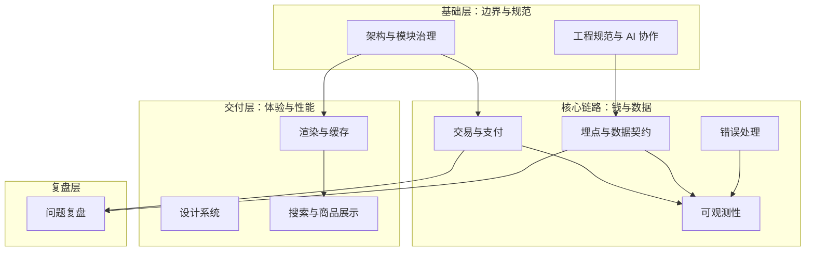

# 前言

这份索引不是「技术栈清单」，而是我整理工程实践时的**思考地图**。

过去几年，我主要在做一件事：把一个迭代了七年的跨境电商前端系统，从高度耦合的 legacy，逐步改造成可复用、可观测、可渐进迁移的多端平台。过程中踩过很多坑——模块边界失控、埋点口径不一致、支付回调难追踪、ISR 缓存在多实例下失效——也沉淀了不少可复用的方案。

这篇博文是在线版的导航目录：只保留我已经整理过、可以展开讲清楚的工程主题。还在打磨的资料不会放进公开入口，避免读者顺着索引进入尚未完整复盘的内容。

---

## 怎么用这份索引

| 标记      | 含义                             |
| --------- | -------------------------------- | ------------------------------------ | --- |
| ✅ 已发布 | 已去企业化、可对外阅读的个人笔记 |
| <!--      | 🔒 未公开                        | 有内部沉淀或草稿，但暂不放入公开入口 | --> |

<!-- **交互式知识地图**：[电商前端工程知识图谱](/posts/ecommerce-knowledge-map/) — 分层全景 / 域关系 / 阅读路径，点击节点跳转工程笔记。 -->

---

## 全景图

我的核心判断：**先把边界和规范立住，再谈性能和业务功能。** 没有模块约束和事件契约，后面的缓存、埋点、监控都会变成补丁摞补丁。

---

## 一、架构与边界治理

**我为什么看重这一层：** 七年 legacy 最大的痛，不是某个框架旧了，而是「改一处牵全局」。Clean Architecture 分层 + Nx 依赖约束，本质是在代码审查之前就把错误依赖挡住。

| 主题                    | 我的判断                                                                                     | 笔记状态  | 链接                                                                  |
| ----------------------- | -------------------------------------------------------------------------------------------- | --------- | --------------------------------------------------------------------- |
| 整体架构重构复盘        | Monorepo 按业务域拆分，Component → Service → Domain 单向依赖；多端复用靠域模块而不是复制页面 | ✅ 已发布 | [企业级电商前端平台架构重构](/posts/ecommerce-architecture-redesign/) |
| 大规模迁移节奏          | 全量切换风险太高，用路由级灰度 + 分批迁移把「上线」拆成可回滚的小步                          | ✅ 已发布 | [大型电商前端迁移](/posts/ecommerce-migration-plan/)                  |
| Redux Listener 事件模式 | 副作用（埋点、日志、跨模块联动）走 listener，UI 只 dispatch 领域事件                         | ✅ 已发布 | [埋点事件契约](/posts/tracking-events-book-contract/)                 |

---

## 二、渲染与性能

**我为什么分开看渲染策略：** 电商站不是所有页面都该 SSR。投放页要 ISR + 缓存扛流量，结账页要 RSC 保首屏和数据一致性，门店 POS 要 CSR 快速迭代——一刀切只会牺牲某一类场景。

| 主题                 | 我的判断                                                                          | 笔记状态  | 链接                                                                  |
| -------------------- | --------------------------------------------------------------------------------- | --------- | --------------------------------------------------------------------- |
| ISR + Redis 共享缓存 | 多实例部署下，仅靠 Next.js 本地缓存会不一致；Redis 做跨实例共享是性价比最高的方案 | ✅ 已发布 | [Next.js ISR + Redis 共享缓存](/posts/nextjs-isr-redis-shared-cache/) |
| RSC 与样式运行时     | CSS-in-JS 在服务端组件体系下会扩大客户端边界，样式体系需要和渲染架构一起设计      | ✅ 已发布 | [Joy UI 迁移 ADR](/posts/joyui-to-tailwind-migration-adr/)            |

---

## 三、设计系统

**我为什么主导组件库建设：** UI 不一致不只是「不好看」，而是会拖慢每个业务需求——同一个按钮五种写法，评审和测试成本都会翻倍。

| 主题                       | 我的判断                                                                        | 笔记状态  | 链接                                                           |
| -------------------------- | ------------------------------------------------------------------------------- | --------- | -------------------------------------------------------------- |
| 组件库 CDD 实践            | 从设计 token 到 Storybook 到视觉回归，组件库要当产品做而不是当工具库堆          | ✅ 已发布 | [企业级电商组件库建设实践](/posts/design-system-cdd-practice/) |
| Joy UI → Tailwind 迁移 ADR | 运行时 CSS-in-JS 对 SSR 性能和包体积不友好；Tailwind 让我们更接近「样式即契约」 | ✅ 已发布 | [Joy UI 迁移 ADR](/posts/joyui-to-tailwind-migration-adr/)     |

---

## 四、交易与支付

**我为什么把支付单独成章：** 支付是电商里「出错成本最高」的链路——不只是用户体验，还涉及资金、对账和合规。架构上必须可追踪、可回滚、可替换渠道。

| 主题         | 我的判断                                                   | 笔记状态  | 链接                                                      |
| ------------ | ---------------------------------------------------------- | --------- | --------------------------------------------------------- |
| 支付链路架构 | 策略模式 + Server Action 编排，UI 只响应 ActionSchema 指令 | ✅ 已发布 | [电商支付链路架构](/posts/payment-pipeline-architecture/) |

---

## 五、可观测性

**我为什么推动交易链路可观测：** 支付出问题的时候，「用户说扣了款但订单没生成」这种 case，靠 grep 日志基本查不动。需要 traceId 把 Sentry、日志、Grafana 串起来。

| 主题                   | 我的判断                                                      | 笔记状态  | 链接                                                                |
| ---------------------- | ------------------------------------------------------------- | --------- | ------------------------------------------------------------------- |
| 交易链路可观测性总方案 | 从被动排障升级到主动预警，SLO + Runbook 比堆 dashboard 更重要 | ✅ 已发布 | [交易链路可观测性建设](/posts/transaction-observability-tech-plan/) |
| 可观测性平台 Harness   | 分桶、ESLint 门禁、八组件范式——让报错能找对人                 | ✅ 已发布 | [前端可观测性平台](/posts/observability-platform-harness/)          |
| Edge Middleware 鉴权   | 登录守卫从客户端迁到服务端预判，消除首屏闪烁                  | ✅ 已发布 | [Edge Middleware 登录鉴权](/posts/edge-middleware-auth-design/)     |
| Runbook 与 Ownership   | 告警触发后第一步做什么，比告警规则本身更容易被忽略            | ✅ 已发布 | [前端可观测性平台](/posts/observability-platform-harness/)          |

---

## 六、埋点与数据契约

**我为什么坚持 Events Book：** 埋点出问题，80% 不是代码写错，而是 PM、研发、数据分析对「什么时候算触发」理解不一致。需要一层人也能读懂的事件契约。

| 主题             | 我的判断                                                                | 笔记状态  | 链接                                                                 |
| ---------------- | ----------------------------------------------------------------------- | --------- | -------------------------------------------------------------------- |
| 追踪事件模型总览 | UI dispatch 领域事件 → listener 编排 → trigger 发渠道，单向链路不可绕过 | ✅ 已发布 | [埋点事件契约（Events Book）](/posts/tracking-events-book-contract/) |

---

## 七、错误处理

**我为什么单独写错误策略：** 前端错误处理最容易做成「所有 catch 都 toast 一下」。电商场景里，业务错误、网络超时、第三方脚本失败，用户该看到的反馈和研发该收到的告警完全不同。

| 主题              | 我的判断                                                              | 笔记状态  | 链接                                                           |
| ----------------- | --------------------------------------------------------------------- | --------- | -------------------------------------------------------------- |
| HTTP 错误处理策略 | 按错误类型分层：用户可恢复 / 需重试 / 需上报，不要混在一个 handler 里 | ✅ 已发布 | [电商前端 HTTP 错误处理](/posts/http-error-handling-strategy/) |

---

## 八、工程规范与 AI 协作

未完待续

<!-- **我为什么开始写 Agent Skills：** 大团队里重复对齐的成本很高。把「怎么做对」写进 SKILL，让 AI 协作者和新人有同一份操作手册，比每次 PR 里口头解释可持续。

| 主题              | 我的判断                                                          | 笔记状态  | 链接 |
| ----------------- | ----------------------------------------------------------------- | --------- | ---- |
| AI 工程化体系总览 | 规范进 Git、硬约束下沉 ESLint/Hook，AI 只负责生成可 review 的建议 | 🔒 未公开 | —    | -->

---

## 后续整理计划

按优先级，我打算这样推进：

1. ~~**先收尾已有草稿**~~：ISR 缓存、交易可观测性、Joy UI 迁移 ADR——✅ 已完成。
2. ~~**高频工程主题**~~：埋点契约、支付链路、HTTP 错误处理——✅ 已完成。
3. **下一轮（P2）**：多市场 Feature Flag、API 错误码规范、AI 工程化定稿。
4. **长尾资料**：商品展示、促销页、时区管理等偏业务向文档，迁移时先做场景泛化，再决定是否公开。

每完成一篇，我会回到这里更新状态列。
