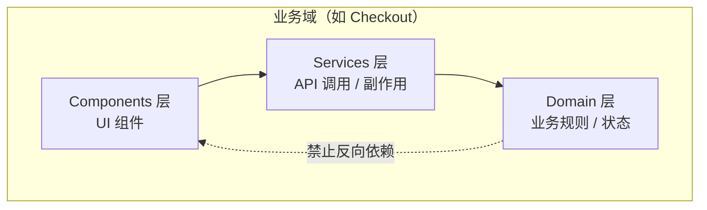
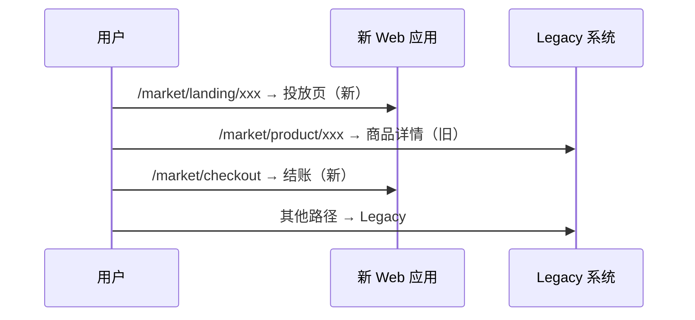

# 前言

这篇文章是我对一次大型电商前端平台架构重构的复盘笔记。

当时面临的不是「换框架」这么简单。消费者端 Web 和门店端 POS 已经迭代了七年，代码高度耦合，业务逻辑过度膨胀在前端，多端 UI 和业务逻辑完全无法复用。测试覆盖率几乎为零，需求和设计文档也严重缺失——重构风险很高，不重构又无法支撑性能目标和业务扩张。

我主导了整体架构方案的设计与落地推进。这篇是**总览**：模块边界、App Router 渲染策略、多市场特性分层、迁移节奏。ISR 缓存、支付编排、交易可观测性等子系统各有独立笔记，文末链过去。

---

## 问题诊断

原系统的困境可以归纳成八条：

- 消费者端与门店端代码高度耦合，维护成本极高
- 前端承载了过多本应在服务端的业务逻辑
- 系统持续迭代七年，技术债务严重
- 门店端逐步复用消费者端能力，但架构不支持 O2O 复用
- 多端 UI 组件与业务逻辑完全无法复用
- 没有测试代码，重构上线缺少质量保障
- 需求文档与设计文档双重缺失，沟通效率低
- 多海外市场各自维护，路由和部署模型混乱

### 核心矛盾

表面上是技术栈老旧，实质上是三个结构性问题：

1. **边界不清**：业务逻辑、UI 组件、平台适配混在一起，改一处牵全局
2. **复用不可行**：消费者端和门店端看似相似，实际上无法共享模块
3. **演进不可控**：没有 Feature Flag、没有缓存策略、没有渐进迁移路径，任何大改都是「全量切换」

---

## 重构目标

我定了四个维度的目标：

| 维度     | 目标                                                  |
| -------- | ----------------------------------------------------- |
| 性能     | 核心投放页 Core Web Vitals 达到「良好」，逐步推广全站 |
| 可配置   | SEO 页、促销页、A/B 页运营可自助配置，减少研发介入    |
| 可维护   | Clean Architecture + Nx 边界约束 + 统一组件库         |
| 快速交付 | 不同场景匹配不同渲染策略，不一刀切 SSR                |

---

## 模块拆分：Clean Architecture + Monorepo

我没有按「应用 → 页面 → 组件」拆分，而是按**业务域 + 分层**。每个业务域（Product、Cart、Checkout、Search、Auth 等）内部分三层：



依赖规则：

- Domain 层不能依赖 Services 或 Components
- Services 层不能依赖 Components
- 跨层通信通过**依赖注入**，而不是直接 import

在 Nx monorepo 里，用 tag 配合 `@nx/enforce-module-boundaries` 在 CI 阶段强制约束——模块边界不是「约定」，而是「编译期报错」。

### 多应用 / 多市场

旧架构是每个市场独立部署一套服务。新架构把**代码复用**和**运行时隔离**分开：共享 monorepo 里的 domain/services/components，每个市场保留独立服务实例和缓存空间，避免跨区域内容干扰。

---

## App Router：路由分层与渲染边界

Legacy 从 React Router CSR 迁到 App Router 时，最难的是重新定义**渲染边界**和**路由语义**。

### 路由模型

采用 `[locale]/[region]/...` 双层前缀，把「语言」和「市场」解耦：

```text
app/
├── [locale]/
│   └── [region]/
│       ├── (marketing)/     # 投放页分组
│       ├── (shop)/          # 商品链路
│       ├── (auth)/          # 登录注册
│       ├── layout.tsx       # 市场级服务端布局
│       └── client-layout.tsx # Provider 注入（客户端）
├── api/                     # Route Handlers
├── middleware.ts            # 鉴权、区域跳转
└── i18n/
```

Route Group 只影响布局组织，不出现在 URL。市场级 `client-layout` 统一挂载 Redux、主题、埋点初始化，避免每个页面重复 Provider。

### 渲染模式选型

| 渲染模式 | 适用场景            | 典型页面       |
| -------- | ------------------- | -------------- |
| CSR      | 强交互、低 SEO      | 门店端 POS     |
| ISR      | 内容驱动、CDN 加速  | CMS 页、投放页 |
| SSR      | 个性化、实时数据    | 结账、购物车   |
| RSC      | 静态内容 + 局部交互 | 商品详情、首页 |

### RSC 与 Client Component 切分

| 放服务端 (RSC)               | 放客户端 (CC)            |
| ---------------------------- | ------------------------ |
| 首屏数据 fetch、SEO metadata | 表单交互、动画、即时搜索 |
| 价格/库存等服务端可信数据    | Redux 订阅、浏览器 API   |
| 静态结构、骨架屏边界         | 第三方 SDK（支付、地图） |

几个关键实践：

- **Provider 必须是 Client Component**，在 Server Layout 里以 `children` 插槽包裹
- **Client Component 沿组件树向下推**，页面主体保持 RSC
- **Redux Store 按请求隔离**，RSC 不读写 Store

### 数据层：Server Action + 领域模块

Monorepo 内按 DDD 切分模块：`domain/` 放业务规则，`services/` 编排用例，`actions/` 作为 Server Action 入口。

Server Action 作为 BFF(Backend-for-Frontend 中间层) 薄层：校验输入 → 调 domain service → 返回序列化 DTO。Redux 保留给客户端跨页状态，服务端首屏数据通过 RSC props 注入，避免「双份数据源」。

鉴权在 [Edge Middleware](/posts/edge-middleware-auth-design/) 预判，比客户端 `useEffect` 守卫更早执行，消除首屏闪烁。

---

## 多市场特性管理

多市场电商最大的挑战不是翻译，而是**同一套代码如何承载不同市场的业务规则**——税率、支付方式、物流选项各不相同。

我设计了两层机制，避免业务代码里散落 `switch (country)`：

| 层级            | 解决什么           | 典型手段                             |
| --------------- | ------------------ | ------------------------------------ |
| Feature Flag    | 某功能开不开       | 基础设施层 SDK，按市场/渠道/环境判定 |
| Market Strategy | 开了之后行为是什么 | 领域层工厂模式，按市场注入规则       |

**原则**：核心业务规则进 MarketStrategy，灰度和实验走 Feature Flag。领域层通过适配层查询开关，不直接依赖基础设施包。

更细的三层特性模型和 DDD 落位，见草稿 [多市场 Feature Flag](/posts/multi-market-feature-flag/)。

---

## ISR + Redis 缓存（摘要）

CMS 页和投放页走 **ISR + Redis 共享缓存 + Webhook 精准刷新**。核心设计：

- **三层隔离**：区域、环境、版本（`env + buildId`）各自独立
- **cache-handler** 桥接 Next.js 页面缓存与 Redis，跨 Pod 共享
- **Webhook** 触发 `revalidatePath` / `revalidateTag`，内容发布后秒级生效

完整拓扑、请求链路和监控策略见独立笔记：[Next.js ISR + Redis 共享缓存](/posts/nextjs-isr-redis-shared-cache/)。

---

## 渐进式迁移

消费者端 Web 必须走渐进式迁移，不能全量切换。我推动的是**路由级灰度**：Ingress 按 URL 把流量分到新系统和 Legacy，先接管投放页和结账等独立模块，核心 PDP 后续批次迁移。

回滚策略、质量兜底和多服务协同的完整复盘，见 [大型电商前端迁移节奏](/posts/ecommerce-migration-plan/)。



迁移期间的质量保障：Storybook + Chromatic 视觉回归、Playwright 核心链路 E2E、线上错误追踪与埋点兜底——Legacy 几乎没有历史测试，只能先守住用户看得见的路径。

---

## 业务逻辑组织

不同复杂度的页面用不同模式：

- **简单页面**：Transaction Script — RTK Query 请求 + 渲染
- **复杂页面**：Domain Model — Event Modeling → Aggregate → Redux Slice

领域事件通过 Redux Listener Middleware 消费，Mutation 后自动触发关联 Query 的 cache invalidation。CQRS / Event Sourcing 只在需要 time-travel debugging 的场景局部采用，没有全站推广。

---

## 阶段性成果

- **模块边界可编译期约束**：Nx tag + ESLint 在 CI 拦截错误依赖
- **多市场差异收敛到两层**：Feature Flag 管开关，MarketStrategy 管规则
- **CMS 页面响应提速**：ISR + Redis 命中后，响应从秒级降到毫秒级
- **渐进式迁移可控**：按路由批次切换，Legacy 随时可回退
- **核心投放页 CWV 达到「良好」**

---

## 复盘

前端架构重构最难的不是选框架，而是**把边界划清楚**。

Clean Architecture 分层、Feature Flag 与市场策略的分离、RSC 与 Client Component 的边界、路由级灰度迁移——本质上都在回答同一个问题：变化的维度是什么，边界应该画在哪里。

七年 legacy 的教训是：技术债务的复利效应远超预期。越早建立模块边界、特性管理和缓存策略，后面省下的重构成本就越多。

---

## 关联阅读

| 主题             | 链接                                                                  |
| ---------------- | --------------------------------------------------------------------- |
| ISR + Redis 缓存 | [Next.js ISR + Redis 共享缓存](/posts/nextjs-isr-redis-shared-cache/) |
| 支付编排         | [电商支付链路架构](/posts/payment-pipeline-architecture/)             |
| 交易可观测性     | [交易链路可观测性建设](/posts/transaction-observability-tech-plan/)   |
| Edge 鉴权        | [Edge Middleware 登录鉴权](/posts/edge-middleware-auth-design/)       |
| 迁移节奏         | [大型电商前端迁移](/posts/ecommerce-migration-plan/)                  |
| 组件库           | [企业级电商组件库建设实践](/posts/design-system-cdd-practice/)        |
| 工程索引         | [工程实践札记索引](/posts/engineering-practice-hub/)                  |
