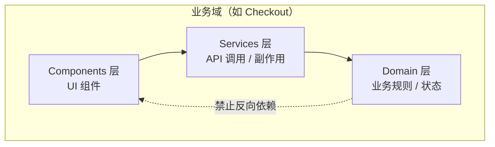
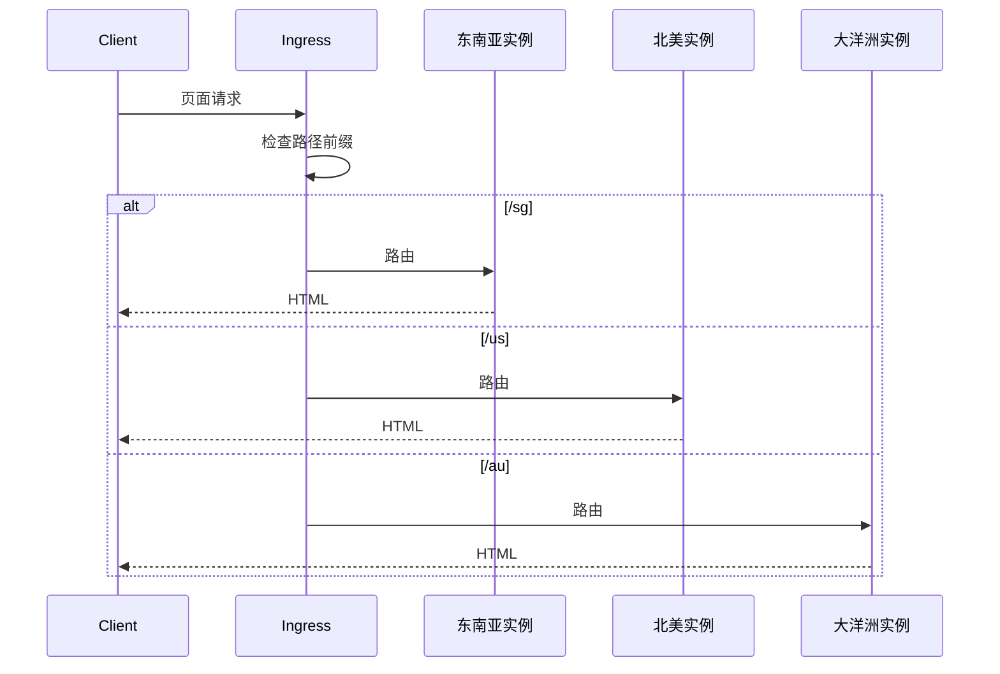
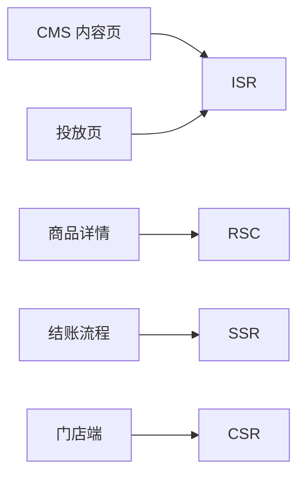
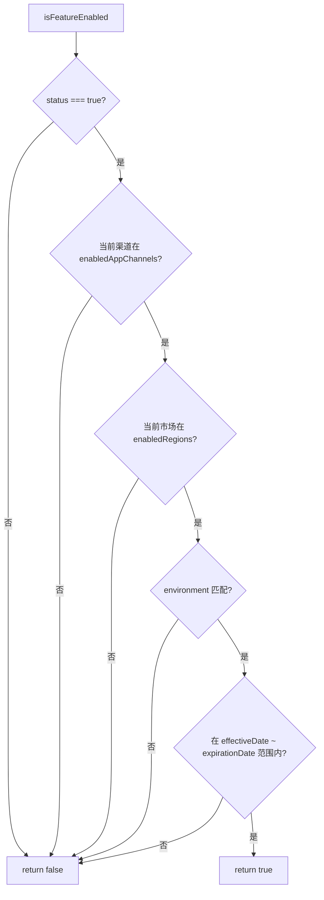
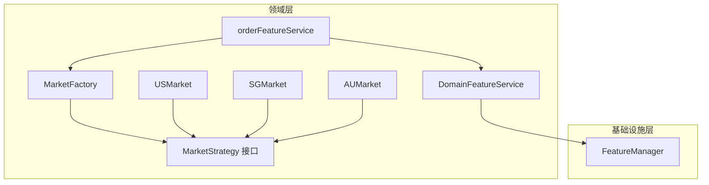
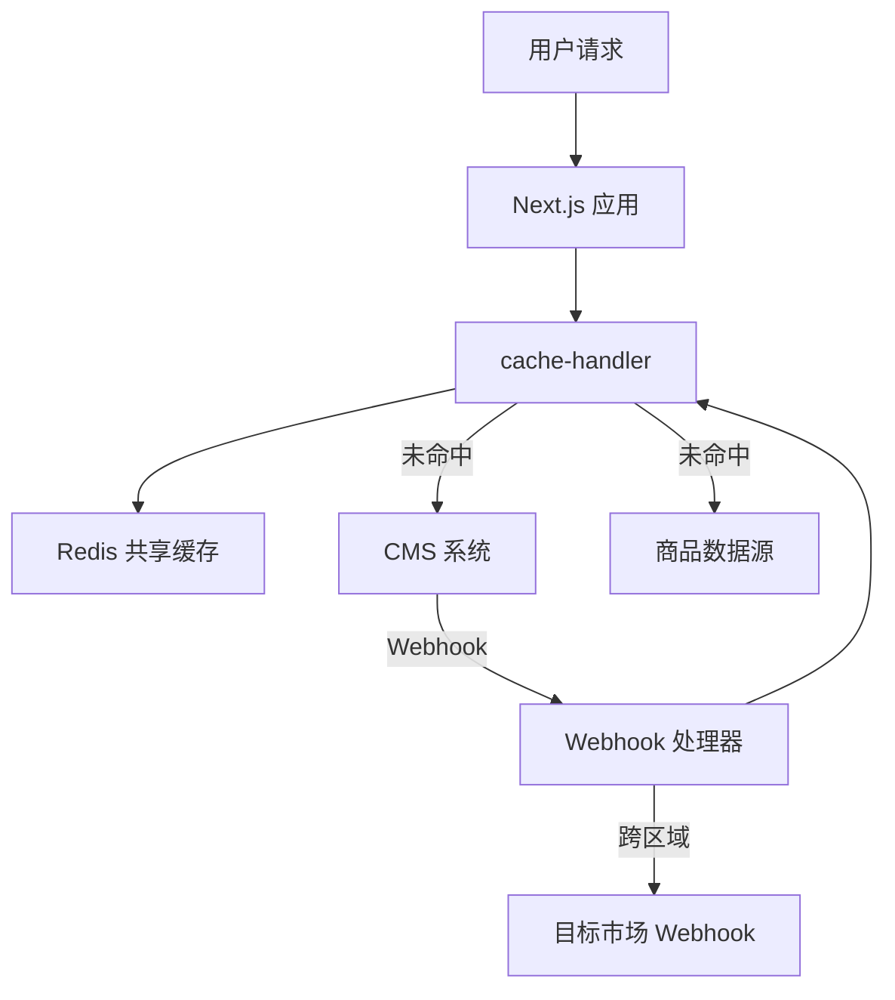
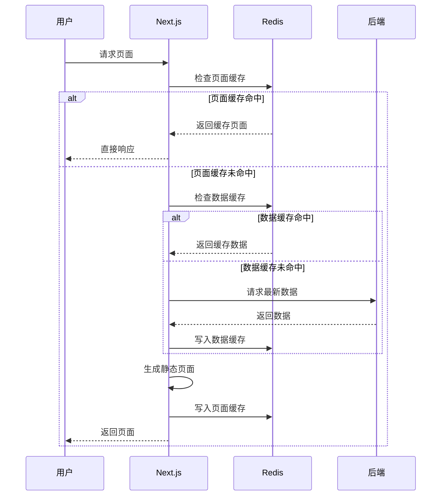
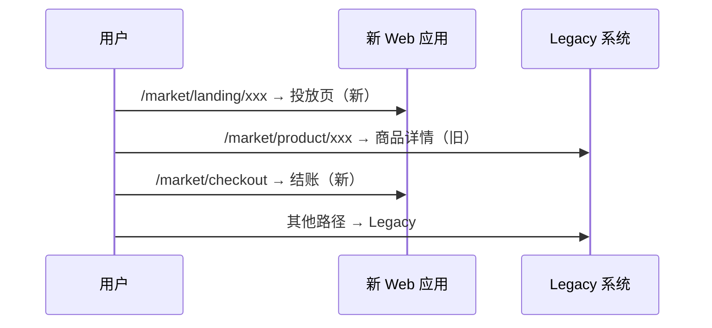

# 前言

这篇文章是我对一次大型电商前端平台架构重构的复盘笔记。

当时面临的不是「换框架」这么简单。消费者端 Web 和门店端 POS 已经迭代了七年，代码高度耦合，业务逻辑过度膨胀在前端，多端 UI 和业务逻辑完全无法复用。门店业务又在逐步复用消费者端能力（O2O 场景），但底层架构不支持。测试覆盖率几乎为零，需求和设计文档也严重缺失——重构风险很高，不重构又无法支撑性能目标和业务扩张。

我主导了整体架构方案的设计与落地推进。这篇笔记把几个关键子系统串起来：模块分层、渲染模式选型、多市场特性管理、缓存架构，以及渐进式迁移。

## 问题诊断

原系统的困境可以归纳成八条：

- 消费者端与门店端代码高度耦合，维护成本极高
- 前端承载了过多本应在服务端的业务逻辑
- 系统持续迭代七年，技术债务严重
- 门店端逐步复用消费者端能力，但架构不支持 O2O 复用
- 多端 UI 组件与业务逻辑完全无法复用
- 没有测试代码，重构上线缺少质量保障
- 需求文档与设计文档双重缺失，沟通效率低
- 多海外市场（东南亚、北美、大洋洲等）各自维护，路由和部署模型混乱

### 核心矛盾

表面上是技术栈老旧，实质上是三个结构性问题：

1. **边界不清**：业务逻辑、UI 组件、平台适配混在一起，改一处牵全局
2. **复用不可行**：消费者端和门店端看似相似，实际上无法共享模块
3. **演进不可控**：没有 Feature Flag、没有缓存策略、没有渐进迁移路径，任何大改都是「全量切换」

## 重构目标

我定了四个维度的目标，每个维度都有可量化的验收标准。

### 性能

2024 年 6 月的 PageSpeed Insights 基线显示，移动端 Core Web Vitals 多项未达标。目标分三阶段推进：

| 阶段     | 范围       | 目标                   |
| -------- | ---------- | ---------------------- |
| 第一阶段 | 核心投放页 | CWV 全部达到「良好」   |
| 第二阶段 | 全站页面   | CWV 全部达到「良好」   |
| 第三阶段 | 核心页面   | FCP → 1.5s，LCP → 1.5s |

### 可配置

运营侧大量 SEO 页面、A/B Test 页面、促销页每次都需要前端介入。目标是把这些非核心页面的改动实现配置化，零研发介入。

### 可维护

通过 Clean Architecture 模块边界、Nx 依赖约束和统一组件库，让业务模块可以独立演进。

### 快速交付

CMS 页面、投放页走 ISR + 缓存；核心业务页走 RSC 混合渲染；门店端走 CSR 快速迭代——不同场景匹配不同渲染策略，而不是一刀切。

## 总体架构

### 模块拆分：Clean Architecture + Monorepo

我没有按「应用 → 页面 → 组件」的传统方式拆分，而是按**业务域 + 分层**拆分。每个业务域（Product、Cart、Checkout、Search、Auth 等）内部再分三层：



依赖规则：

- Domain 层不能依赖 Services 或 Components
- Services 层不能依赖 Components
- 跨层通信通过**依赖注入**，而不是直接 import

在 Nx monorepo 里，我用 `type:domain`、`type:services`、`type:components` 和 `scope:checkout` 等 tag 配合 `@nx/enforce-module-boundaries` 在 CI 阶段强制约束：

```json
{
  "sourceTag": "type:domain",
  "onlyDependOnLibsWithTags": ["type:domain"]
},
{
  "sourceTag": "type:services",
  "onlyDependOnLibsWithTags": ["type:services", "type:domain"]
},
{
  "sourceTag": "type:components",
  "onlyDependOnLibsWithTags": ["type:components", "type:services", "type:domain"]
}
```

这套约束的价值在于：模块边界不是「约定」，而是「编译期报错」。

### 多应用 / 多市场 / 多品牌

平台需要同时支撑消费者端 Web、门店端 POS，以及多个海外市场。旧架构是每个市场独立部署一套服务，Ingress 按路径分发到不同 Pod：



新架构的目标是把**代码复用**和**运行时隔离**分开：共享 monorepo 里的 domain/services/components，但每个市场保留独立的服务实例和缓存空间，避免跨区域内容干扰。

## 渲染模式选型

不同业务场景对渲染的要求完全不同。我在架构方案里为四类渲染模式明确了适用边界：

| 渲染模式 | 适用场景                | 典型页面         |
| -------- | ----------------------- | ---------------- |
| CSR      | 强交互、低 SEO 要求     | 门店端 POS       |
| ISR      | 内容驱动、需要 CDN 加速 | CMS 页面、投放页 |
| SSR      | 个性化、实时数据        | 结账、购物车     |
| RSC      | 静态内容 + 局部交互     | 商品详情、首页   |



### RSC + Client Component 混合开发

新 Web 应用基于 Next.js App Router，默认 Server Component，交互部分通过 `'use client'` 标记边界。几个关键实践：

**Theme / Context Provider 必须是 Client Component。** React Context 在 RSC 中不可用，Provider 需要抽成独立 Client Component，在 Server Layout 里以 `children` 插槽包裹。

**Client Component 沿组件树向下推。** 页面主体保持 Server Component，只有需要交互的子树（SearchBar、CartIcon）才标记 Client，减少客户端 bundle 体积。

**Server Component 不能 import Client Component，但可以接收 children。** 正确模式是把 Server Component 作为 Client Component 的 children 传入，而不是在 Client 内部 import Server。

**状态管理按请求隔离。** Redux Store 不能是全局变量——每个请求创建独立 Store，RSC 不应读写 Store。客户端组件通过 `useRef` 初始化 Store 状态，实现 SSR 与客户端的水合同步。

## 多市场特性管理

多市场电商最大的工程挑战之一，不是「多语言翻译」，而是**同一套代码如何承载不同市场的业务规则差异**——税率、支付方式、物流选项、第三方登录渠道各不相同。

我设计了两层机制：**Feature Flag（功能开关）** 和 **Market Strategy（市场策略）**。

### Feature Flag：基础设施层

Feature Flag 放在 monorepo 的基础设施层，供 Web、POS 等多个应用复用。V1 阶段采用本地 JSON 维护 + 前端 SDK，V2 预留远程 Feature Management Service 接口。

#### 数据模型

每个 Feature 包含以下维度：

```ts
interface Feature {
  featureName: string;
  description: string;
  status: boolean;
  enabledAppChannels: ApplicationChannel[]; // Web / POS
  enabledRegions: Region[]; // 市场区域
  environment?: ApplicationEnv[]; // dev / test / prod
  effectiveDate?: number; // 生效时间
  expirationDate?: number; // 失效时间
  payload?: Record<string, unknown>; // 功能参数
}
```

#### 生效判定逻辑

`isFeatureEnabled` 按优先级链式校验：



SDK 对外暴露三个核心 API：

- `isFeatureEnabled(featureName)` — 检查功能是否启用
- `getFeaturePayload(featureName)` — 获取启用时的配置参数
- `onFeatureFlags(callback)` — 监听 Feature 加载完成（预留远程拉取）

#### SDK 模块结构

```
feature-flag/
├── adapters/     # 外部依赖适配（环境变量、运行时上下文）
├── config/       # Feature 枚举与类型定义
├── features/     # 各 Feature 的具体配置
├── helpers/      # 业务相关的 Feature 工具方法
└── scripts/      # FeatureManager 单例与生效校验
```

`features/` 目录禁止直接访问外部资源，所有外部依赖通过 `adapters/` 注入——这和 Domain 层的依赖注入是同一思路。

### Business Features：领域层

Feature Flag 解决的是「某个功能开不开」，Market Strategy 解决的是「开了之后行为是什么」。领域层通过工厂模式管理市场差异，避免业务代码里散落 `switch (country)`。



**MarketStrategy 接口**定义市场特有的业务规则：

```ts
interface MarketStrategy {
  getDefaultZipcode: () => { state: string; city: string; zip: string };
  getZipcodeRule: () => RegExp;
}
```

**MarketFactory** 用对象映射替代 switch-case：

```ts
const MARKET_MAP: Record<string, new () => MarketStrategy> = {
  SG: SGMarket,
  US: USMarket,
  AU: AUMarket,
  CA: CAMarket,
};

class MarketFactory {
  static getMarket(market: string): MarketStrategy {
    const MarketClass = MARKET_MAP[market];
    if (!MarketClass) throw new Error("Invalid market");
    return new MarketClass();
  }
}
```

**DomainFeatureService** 作为适配层，避免领域层直接依赖基础设施层的 `featureManager`：

```ts
class DomainFeatureService {
  static isFeatureEnabled(feature: string): boolean {
    return featureManager.isFeatureEnabled(feature);
  }
}
```

**业务统一入口**把市场策略和 Feature Flag 合并，业务组件不需要感知市场差异：

```ts
export const orderFeatureService = {
  ...MarketFactory.getMarket(currentRegion),
  enabledStripe: () =>
    DomainFeatureService.isFeatureEnabled(FeatureName.STRIPE),
};
```

```tsx
function CheckoutForm() {
  const defaultZipcode = orderFeatureService.getDefaultZipcode();
  const showStripe = orderFeatureService.enabledStripe();
  // 业务代码不需要 if (country === 'US') ...
}
```

## ISR + Redis 共享缓存

CMS 页面和投放页是性能优化的主战场。纯 SSR 每次请求都走完整渲染链路，后端压力大、响应慢。我设计了 **ISR + Redis 共享缓存 + Webhook 精准刷新** 三层缓存架构。

### 系统拓扑



### 三层隔离

1. **区域隔离**：每个海外市场有独立的 Next.js 服务和 Redis 实例，缓存完全独立
2. **环境隔离**：test / uat / prod 环境的 Redis 分离，测试不影响生产
3. **版本隔离**：缓存 Key 使用 `env + buildId` 标识，部署新版本时通过 Webhook 批量刷新

### cache-handler：ISR 与 Redis 的桥梁

每个 Next.js 实例内置 cache-handler，负责：

- 检查页面缓存和数据缓存是否命中
- 数据缓存过期时强制刷新页面缓存
- 将新生成的页面和数据写入 Redis

页面缓存和数据缓存设置不同的 TTL，数据更新会触发关联页面缓存失效。

### 请求链路



### Webhook 精准刷新

CMS 内容更新时，通过 Webhook 触发缓存失效，而不是等 TTL 自然过期：

1. **签名验证**：HMAC-SHA1 校验请求来源
2. **路径匹配**：从 CMS slug 中提取目标市场和布局类型
3. **缓存更新**：`revalidatePath` 清理页面缓存，`revalidateTag` 更新关联数据标签
4. **跨区域转发**：如果 Webhook 涉及其他市场，转发到目标市场的 Webhook 端点
5. **错误兜底**：刷新失败时继续展示上次成功生成的页面，异常上报监控

```ts
// 签名验证
const signature = createHmac("sha1", webhookSecret).update(body).digest("hex");

// 路径匹配 → 缓存刷新
revalidatePath(`/${region}/(landing)/[slug]/${layout}`);
relatedTags.forEach((tag) => revalidateTag(tag));
```

### 缓存监控

通过 APM 工具监控 Redis 命中率、内存使用量、过期清理频率。配合 `env + buildId` 版本标识，部署新版本时可以批量失效旧缓存，避免版本冲突。

## 渐进式迁移

全量迁移只适合容错高的非 ToC 系统（比如 POS 新老共存，出问题可以切回旧系统）。消费者端 Web 必须走渐进式迁移。

### 路由级灰度

Ingress 按 URL 路径将流量分发到新系统和 legacy 系统：



新系统先接管投放页、结账等独立模块，商品详情等核心页面后续批次迁移。Legacy 系统持续运行，直到对应模块全部切换完成。

### 协作方式

- 新系统和 Legacy 并行开发，Ingress 路由隔离
- 组件库和 Feature Flag 在新系统中先行落地，Legacy 逐步接入
- 视觉回归测试覆盖新旧系统的关键页面对比

### 质量保障

Legacy 系统几乎没有测试代码，迁移期间的质量保障策略：

| 层级     | 手段                           | 覆盖         |
| -------- | ------------------------------ | ------------ |
| 组件测试 | Storybook + Chromatic 视觉回归 | UI 一致性    |
| 集成测试 | Storybook interaction testing  | 组件交互     |
| E2E      | Playwright + Gherkin 场景      | 核心购买链路 |
| 监控     | 错误追踪 + 性能指标 + 行为埋点 | 线上兜底     |

## 业务逻辑组织

不同复杂度的页面采用不同的业务逻辑模式：

- **简单页面**：Transaction Script — 直接 RTK Query 请求 + 渲染，不走 DDD 流程
- **复杂页面**：Domain Model — Event Modeling 梳理用户行为 → Aggregate 设计 → Redux Slice 映射

领域事件通过 Redux Listener Middleware 消费，Mutation 后自动触发关联 Query 的 cache invalidation，避免手动同步状态。

CQRS 和 Event Sourcing 在方案中做了评估，最终只在需要 time-travel debugging 和乐观更新的场景局部采用，没有全站推广——架构复杂度与收益需要平衡。

## 阶段性成果

- **模块边界可编译期约束**：Nx tag + ESLint 规则让跨层依赖在 CI 阶段就被拦截
- **多市场差异收敛到两层**：Feature Flag 管开关，MarketStrategy 管规则，业务代码零分支
- **CMS 页面响应速度提升**：ISR + Redis 缓存命中后，页面响应从秒级降到毫秒级
- **Webhook 精准刷新**：CMS 内容发布后秒级生效，不再依赖固定 revalidate 周期
- **渐进式迁移可控**：按路由批次切换，Legacy 系统随时可回退
- **Core Web Vitals 持续改善**：核心投放页 CWV 达到「良好」水位

## 复盘

这次重构让我再次确认：前端架构重构最难的不是选框架，而是**把边界划清楚**。

Clean Architecture 的分层、Feature Flag 与市场策略的分离、ISR 缓存的三层隔离、RSC 与 Client Component 的边界——本质上都在回答同一个问题：变化的维度是什么，边界应该画在哪里。

如果边界画对了，新增一个市场只需要实现一个 `MarketStrategy`；新增一个功能只需要配一条 Feature 记录；CMS 发一篇内容只需要一条 Webhook 触发缓存刷新。如果边界画错了，每个需求都是全局改动。

七年 legacy 系统的教训是：技术债务的复利效应远超预期。越早建立模块边界、特性管理和缓存策略，后面省下的重构成本就越多。

架构重构项目最难的从来不是「做出来」，而是「在 Legacy 不停服的前提下，让它逐步被替换掉」。
