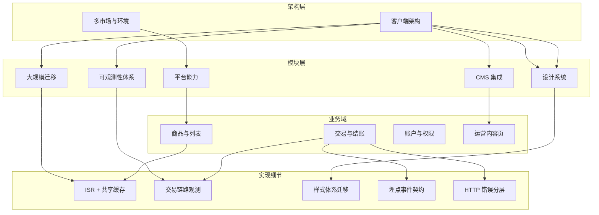

# 前言

整理 Confluence 设计文档和本地工程资料时，我发现「文档很多」不是最大的问题，**不知道从哪看起**才是。

这份交互地图把资料按四个层级归纳——**架构 → 模块 → 业务域 → 实现细节**，并标出已迁移到个人笔记的主题。你可以：

- 在**分层全景**里按层级浏览整体结构，点击节点看摘要和关联
- 在**域关系**里理解 architecture、migration、transaction 等方向如何串联
- 在**阅读路径**里按角色（前端基础 / 迁移专项 / 业务链路）走推荐顺序

下方嵌入的是可交互组件（非静态截图）。如果加载较慢，文末附有 Mermaid 静态备份图。

---

## 怎么用这张地图

1. **先点「分层全景」** — 建立整体心智模型，从架构层节点开始浏览
2. **用顶部 Domain 筛选** — 缩小到 payment、observability 等单一方向
3. **下方详情面板** — 有「已有笔记」标签的节点可跳到对应工程札记
4. **入职同学习路径** — 切换到「阅读路径」Tab，按角色选路线

> 完整文档索引在仓库 `docs/confluence-export/INDEX.md`（本地查阅，不公开发布企业链接）。

---

## 静态备份：分层结构

---

## 关联阅读

- [工程实践札记索引](/posts/engineering-practice-hub/) — 全方向文字版目录
- [企业级电商前端平台架构重构](/posts/ecommerce-architecture-redesign/) — 地图起点
