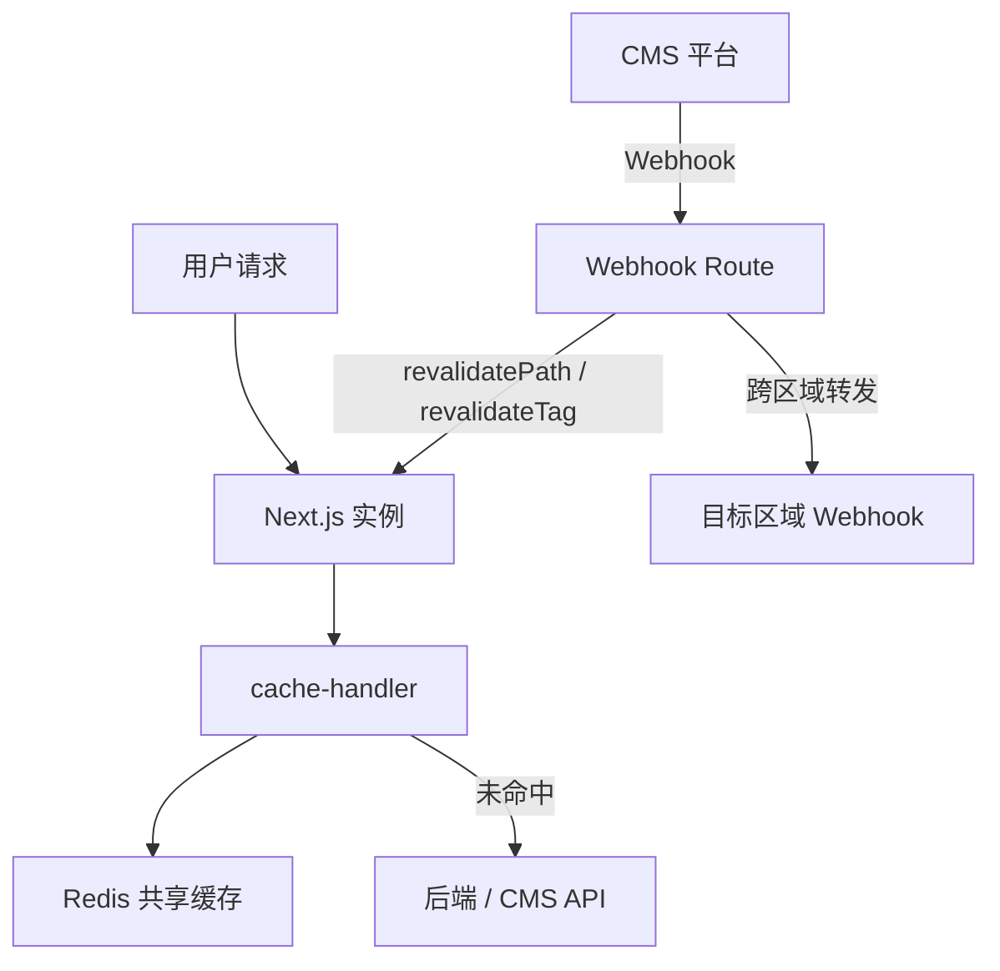
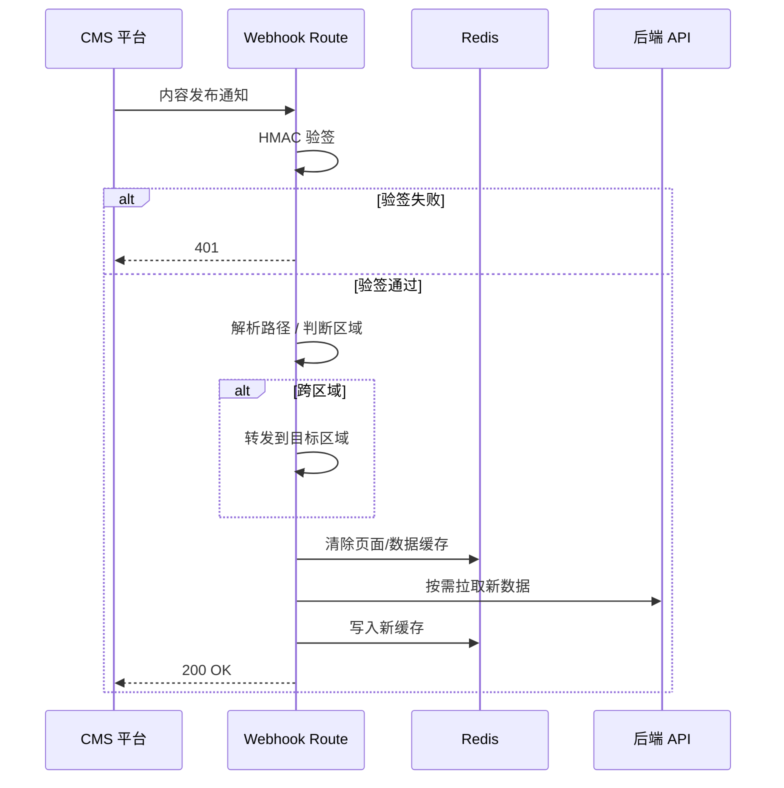

# 前言

这篇文章是我对一次电商前端缓存架构升级的复盘。

当时平台已经切到 Next.js App Router，投放页和 CMS 页面走 ISR 静态化。单机开发时一切正常，但上线多实例部署后，问题很快暴露：每个 Pod 各自维护内存缓存，同一 URL 在不同实例上可能返回不同版本；CMS 内容更新后，部分用户仍看到旧页面；后端接口也被重复请求拖慢。

我没有选择「全站 SSR」这种退守方案——那会直接牺牲已经拿到的 Core Web Vitals 收益。最终方案是 **ISR + Redis 共享缓存 + Webhook 精准刷新**，把页面缓存和数据缓存拆开管理，并在多区域、多环境之间做好隔离。

---

## 阅读主线

这篇对应 Next.js SSR/SSG/ISR、Redis、缓存击穿和降级问题。阅读时先看 Next.js 默认 ISR 在多实例下的问题，再看 Redis 共享缓存、Webhook 精准刷新、请求级去重和本地 LRU 降级，避免把它理解成单纯「加了一层缓存」。

## 问题背景

### 多实例下的缓存不一致

Next.js 默认在单进程内存里缓存 ISR 产物。K8s 滚动部署后，集群里有 N 个 Pod，每个 Pod 各自有一份缓存：

- 用户 A 打到 Pod-1，看到新版本
- 用户 B 打到 Pod-2，缓存还没过期，看到旧版本
- CMS 同一条内容发布，刷新效果取决于「谁碰巧被命中」

### 数据缓存和页面缓存纠缠

投放页（PLA）的渲染依赖两类数据：

1. **CMS 内容**：布局结构、文案、图片
2. **商品数据源**：价格、库存、促销标签

如果只缓存最终 HTML，数据源变更时整页失效成本太高；如果只缓存接口数据，布局变更又可能漏刷。需要两层缓存，且数据层变更要能触发页面层失效。

### 多区域运营的额外复杂度

跨境电商在东南亚、北美、大洋洲等多区域独立部署。各区域内容、币种、商品池不同，缓存必须区域隔离，但 CMS 的 Webhook 可能从总部统一发出，需要识别目标区域并转发。

---

## 核心设计思路

我定了三条原则：

1. **页面缓存和数据缓存分离**——不同 TTL、不同失效策略
2. **Redis 做跨实例共享层**——所有 Pod 读写同一份缓存
3. **Webhook 做精准失效**——按路径和 tag 刷新，避免全站 purge



---

## 系统架构

### 组件职责

| 组件 | 职责 |
| --- | --- |
| Next.js ISR | 页面级静态再生，`revalidate` 控制兜底刷新周期 |
| cache-handler | ISR 与 Redis 的桥梁：读/写页面缓存和数据缓存 |
| Redis | 跨 Pod 共享存储，支持集群高可用 |
| Webhook Route | 接收 CMS 变更，验签后触发精准刷新 |
| 监控 | 缓存命中率、内存用量、过期清理告警 |

### 区域与环境隔离

这是我坚持做的设计，后来证明省去了很多排查时间：

| 维度 | 策略 |
| --- | --- |
| 区域 | 每个海外市场独立 Next.js 集群 + 独立 Redis，缓存 Key 带区域前缀 |
| 环境 | test / uat / prod 使用不同 Redis 实例，test 刷新不影响生产 |
| 版本 | 缓存 Key 包含 `env + buildId`，发版后旧版本缓存自然淘汰 |

---

## cache-handler：ISR 与 Redis 的桥梁

Next.js 14 支持自定义 `cacheHandler`。我在生产环境接入 Redis handler，开发环境仍走默认内存缓存，避免本地依赖 Redis。

handler 的核心逻辑：

1. **读请求**：先查 Redis 页面缓存 → 命中则直接返回
2. **页面未命中**：查数据缓存 → 有数据则渲染页面并回写
3. **数据也未命中**：请求后端 API，同时写入数据缓存和页面缓存
4. **数据缓存过期**：即使页面缓存还在，也强制重新渲染——这是保证数据新鲜度的关键

```typescript
// 概念示意：数据层变更触发页面层失效
async function getPageData(slug: string) {
  const dataCache = await redis.get(dataKey(slug));
  if (dataCache && !isExpired(dataCache)) {
    return JSON.parse(dataCache);
  }
  const fresh = await fetchFromApi(slug);
  await redis.set(dataKey(slug), JSON.stringify(fresh), 'EX', DATA_TTL);
  // 标记关联页面缓存需要重建
  await invalidatePageCacheByTag(slug);
  return fresh;
}
```

### 为什么不用纯 ISR revalidate

`revalidate: 60` 可以做兜底，但有两个问题：

- 最长 60 秒内用户可能看到旧内容（促销页接受不了）
- 时间到了就全量重建，不管数据有没有变

Webhook + tag 刷新解决的是「**变更驱动**」的精准更新；`revalidate` 解决的是「**兜底保鲜**」。两者配合，而不是互斥。

---

## Webhook 精准刷新

CMS 内容发布时，通过 Webhook 通知前端。我设计了四步处理流程：

### 1. 签名验证

Webhook 请求携带 `webhook-signature`，用 HMAC-SHA1 对 payload 验签。验签失败直接 401，避免恶意刷缓存。

### 2. 路径解析

两类路径匹配规则：

- **布局路径**：`/{region}/pla/pla-layout-{variant}` → `revalidatePath` 清页面缓存
- **数据桶路径**：`pla-data-bucket/{slug}` → `revalidateTag` 清关联数据缓存

### 3. 跨区域转发

Webhook payload 里的 `full_slug` 可能属于其他区域。当前区域不匹配时，转发到目标区域的 Webhook endpoint，而不是在本区域无效刷新。

### 4. 错误处理

刷新失败时上报错误监控，但**继续展示上次成功生成的页面**——缓存系统的底线是「宁可旧，不可挂」。



---

## 投放页（PLA）的缓存策略

投放页是这套方案的第一个落地场景，也是收益最明显的：

| 布局 | 缓存策略 | 说明 |
| --- | --- | --- |
| Layout A | 独立 TTL + 独立 tag | 多版本 A/B 投放互不影响 |
| Layout B | 独立 TTL + 独立 tag | 同上 |
| Error Page | 短 TTL | 布局数据异常时降级展示 |

**数据隔离原则**：CMS 布局数据和商品数据源分开缓存。商品池变更只刷数据 tag，不触发全布局重建；布局结构变更只刷布局路径。

---

## 效果与监控

上线后关注三类指标：

| 指标 | 观察方式 | 预期 |
| --- | --- | --- |
| 缓存命中率 | Redis + APM 面板 | 热门投放页 > 85% |
| 页面 TTFB | RUM 分区域对比 | 命中时 < 100ms |
| 后端 QPS | API 网关监控 | 高峰时段下降 40%+ |
| Webhook 刷新延迟 | 发布到可见的 P95 | < 5s |

同时配置了 Redis 内存用量和逐出率告警，避免缓存撑爆。

---

## 踩坑记录

### 1. buildId 变更后旧缓存污染

发版后如果不清缓存，旧 buildId 的页面可能继续被服务。解决方案：Key 里带 `buildId`，发版时 Webhook 批量触发 tag 刷新。

### 2. 数据缓存和页面缓存 TTL 配反

曾经给页面缓存设了长 TTL、数据缓存设了短 TTL，结果页面一直用旧数据渲染。后来改为：**数据 TTL ≤ 页面 TTL**，且数据过期必触发页面重建。

### 3. 跨区域 Webhook 漏转发

早期只在当前区域 `revalidatePath`，总部 CMS 一次发布只刷新了 SG，US 区域用户等了整整一个 revalidate 周期才看到更新。加了 slug 区域前缀解析和转发后解决。

---

## 总结

这套方案的核心不是「上了 Redis」，而是想清楚了三件事：

1. **缓存什么**：页面 HTML 和接口数据分开，失效策略不同
2. **什么时候失效**：变更驱动（Webhook）+ 时间兜底（revalidate）
3. **怎么隔离**：区域、环境、版本三道边界

对电商投放页来说，这套组合在性能和时效之间找到了可接受的平衡点。核心业务页（Checkout、PDP）我走了另一条路——RSC 混合渲染 + 更短的数据新鲜度要求——这是另一篇笔记的话题。

---

## 关联阅读

- [工程实践札记索引](/posts/engineering-practice-hub/) — 全方向导航
- [企业级电商前端平台架构重构](/posts/ecommerce-architecture-redesign/) — 渲染策略选型背景
