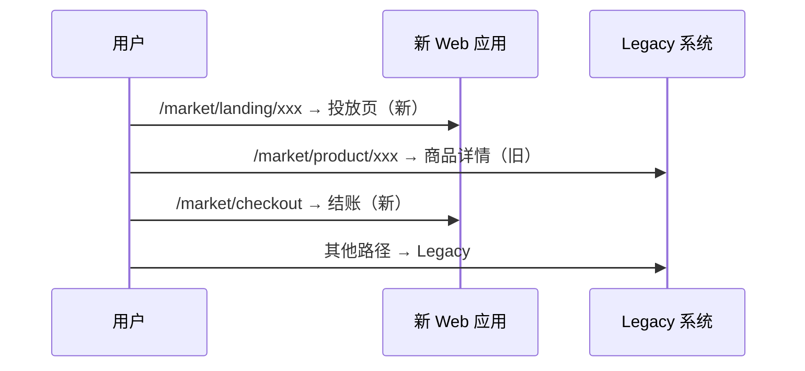

# 前言

消费者端电商平台重构，最难的不是技术方案，而是**怎么在 Legacy 不停服的前提下逐步替换**。我参与制定了整体迁移节奏——这篇只复盘我负责推动的「节奏与风险控制」部分，不展开完整模块清单或排期表。

核心判断：**全量切换只适合容错高的系统**；面向 C 端流量的核心链路，必须拆成可回滚的小批次。

---

## 阅读主线

这篇适合回答「重构过程中如何避免业务停摆」。重点不是排期表，而是如何按用户可见性和业务风险拆批次，如何用路由级灰度、Feature Flag、回滚窗口和验收标准控制迁移风险。

## 我怎么划分迁移阶段

不按「第几个月迁哪个服务」排表，而是按两个维度切：

| 维度 | 分层方式 | 目的 |
| --- | --- | --- |
| 用户可见性 | 前台页面 / 中台能力 | 先迁独立页面，后动核心交易 |
| 业务风险 | 内容展示 / 核心交易 | 投放页先行，结账与支付谨慎推进 |

**第一批**通常选投放页、法务页、内容页——和结账链路耦合低，回滚成本低。  
**第二批**接入结账、账户等强依赖模块。  
**最后**才是商品详情等高频、SEO 敏感、变体逻辑重的页面。

每批上线前必须明确：**交付物、验收标准、回滚触发条件**——三件事写不清楚就不该切流量。

---

## 路由级灰度：我用的切换方式

Ingress 按 URL 路径把流量分到新系统和 Legacy，而不是按用户百分比做蓝绿：

这样做的好处：

- **故障隔离**：某一类页面出问题，只回滚对应路由，不必全站切回
- **并行开发**：新旧系统长期共存，团队不必等「大爆炸日」
- **验证聚焦**：每批只验证新接管的路径，回归范围可控

我踩过的坑：过早迁移 PDP 会把 SKU 变体、SEO、缓存失效全部拉进第一批——风险过高。先把独立模块跑通，再动核心页。

---

## 回滚策略

每批迁移预留**回滚窗口**：上线后 24–48 小时观察核心指标（错误率、转化率、支付成功率），异常即切回 Legacy 路由。

回滚触发条件我坚持写进方案，不靠口头约定：

- 支付成功率低于基线 X%（按渠道分别看）
- 核心页面 5xx / 白屏率突增
- 客服工单集中爆发（通常是深链或登录回跳坏了）

组件库和 Feature Flag 在新系统先行落地，Legacy 按需接入——避免「新系统好了但旧系统还在用老组件」的双轨维护地狱。

---

## 质量兜底：Legacy 几乎没测试怎么办

旧系统测试覆盖率接近零，迁移期间我推动的保障组合：

| 层级 | 手段 | 覆盖 |
| --- | --- | --- |
| 组件 | Storybook + Chromatic 视觉回归 | UI 一致性 |
| 集成 | Storybook interaction testing | 组件交互 |
| E2E | Playwright + 场景化用例 | 核心购买链路 |
| 线上 | 错误追踪 + 性能指标 + 埋点 | 发布后兜底 |

没有历史测试资产时，**视觉回归 + 核心链路 E2E** 比补单元测试性价比更高——先守住用户看得见的路径。

---

## 多服务协同：我只盯依赖时序

跨团队迁移最容易死在「上游还没切，下游先上了」。我用的原则：

- 画清**服务依赖拓扑**，标出切换顺序
- 下游消费方必须有**兼容期**——新旧 API 双读或字段向后兼容
- 共性问题（鉴权、埋点、错误处理）抽成统一抽象，避免每个服务各写一版

细节不展开成服务清单；这里真正要说明的是：**我怎么判断 A 必须在 B 之前切**。

---

## 阶段性成果

- 投放页、结账等模块按批次上线，Legacy 全程可回退
- 路由级灰度让故障影响面可控，未出现全站回滚
- 组件库与 Feature Flag 在新系统先行验证，再向旧系统渗透
- 核心购买链路 E2E 覆盖后，迁移期的线上事故显著减少

---

## 复盘

迁移计划写成「月计划表」对执行帮助有限，真正有用的是三件事：

1. **按风险分批**，而不是按组织架构分批
2. **路由级灰度**，而不是大爆炸切换
3. **回滚条件前置**，而不是上线后临时商量

技术方案可以写得很漂亮，但七年 legacy 的替换，最终靠的是**节奏纪律**。这也是我在 [架构重构总览](/posts/ecommerce-architecture-redesign/) 里把「渐进式迁移」单列为独立章节的原因。

---

## 关联阅读

- [企业级电商前端平台架构重构](/posts/ecommerce-architecture-redesign/)
- [Next.js Edge Middleware 登录鉴权](/posts/edge-middleware-auth-design/)
- [ISR + Redis 共享缓存](/posts/nextjs-isr-redis-shared-cache/)
