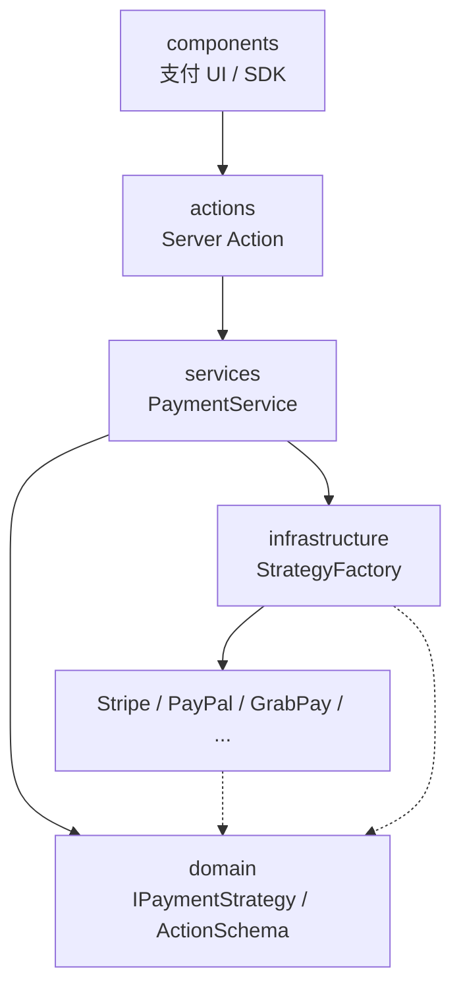

# 前言

这篇文章是我对电商支付模块架构重构的复盘。

当时前端支持 6+ 种支付渠道——Stripe 卡支付、Apple Pay、PayPal 弹窗、GrabPay 跳转、分期支付等。每种渠道的交互模型完全不同，但代码都堆在一个 500 行的支付页组件里：创建订单、初始化支付、调 SDK、处理回调、错误回滚全混在一起。新增一个支付商，要理解并改动核心 UI，回归成本越来越高。

我主导了支付模块的整洁架构重构，目标是建立**可扩展、可观测、可维护**的支付底座，而不是围绕某个渠道做局部补丁。

---

## 要解决的三个结构性问题

| 问题 | 表现 | 后果 |
| --- | --- | --- |
| 渠道差异大 | SDK 确认型、整页跳转型、弹窗回调型并存 | `if provider === xxx` 遍布组件 |
| 结算链路风险高 | 订单创建 → 库存校验 → 支付初始化 → 确认 → 回滚 | 任一步失败都直接影响转化 |
| UI 承载业务逻辑 | 支付页组件 500+ 行 | 难测试、难复用、难观测 |

支付模块的设计对象不是「接入 Stripe」，而是**多市场、多支付商、强约束的交易子系统**。

---

## 五层架构：依赖方向朝内

```text
payment 模块
├── domain/          类型契约、策略接口、ActionSchema
├── infrastructure/  各支付商 Strategy 实现
├── services/        PaymentService 编排主流程
├── actions/         Server Action（BFF 入口）
└── components/      支付 UI + SDK 交互
```



**依赖规则**：高层依赖抽象（`IPaymentStrategy`），低层提供实现；`actions` 作为组合根完成装配，业务编排层不感知具体渠道。

---

## 策略模式：新增渠道不改主流程

每个支付商实现统一接口，差异封装在独立 Strategy 里：

| 能力 | 说明 |
| --- | --- |
| `initiatePaymentIntent` | 创建支付意图，调后端统一 API |
| `capturePayment` | 确认扣款——**所有渠道的必经步骤** |
| `removeInitiatedPayment` | 取消/清理未完成的支付 |

部分渠道额外实现 Trait：

- `ISubmitInformation`：Stripe 客户端表单提交
- `IConfirmPayment`：返回下一步 UI 指令

服务层通过工厂获取策略，不写 `if provider === 'stripe'` 分支。**新增支付商 = 新增一个 Strategy 文件**，而不是改 PaymentService 主流程。

---

## ActionSchema：UI 与业务的指令协议

不同渠道初始化后，UI 下一步完全不同。我用 `ActionSchema` 标准化这个「接力」：

| action | 含义 | 典型渠道 |
| --- | --- | --- |
| `SDK_CONFIRM` | 客户端调 SDK confirm | Stripe 卡支付 |
| `REDIRECT` | 跳转第三方页面 | GrabPay、ZipPay |
| `SDK_POPUP` | 弹窗 SDK | PayPal、Affirm |
| `SUCCESS` | 直接成功 | 部分零金额场景 |

```typescript
type ActionSchema =
  | { action: 'SDK_CONFIRM'; clientSecret: string; paymentId: string }
  | { action: 'REDIRECT'; redirectUrl: string; paymentId: string; returnUrl: string }
  | { action: 'SDK_POPUP'; sdkToken: string; paymentId: string }
  | { action: 'SUCCESS'; paymentId: string };
```

UI 组件只做一件事：**读 ActionSchema，渲染对应交互**。业务编排和渠道适配在服务端完成。

### 为什么 capture 是所有渠道的必经步骤

无论 SDK 内确认还是跳转回来，最终都要调后端 `confirm` API 完成扣款。区别只在触发时机：

- **SDK 型**：SDK 回调后同步触发 capture
- **跳转型**：用户从第三方页面返回，callback route 检测 URL 参数后触发 capture

这保证了后端始终是资金闭环的权威来源，前端不「假装支付成功」。

---

## Server Action 作为 BFF 入口

支付相关的敏感 API 从客户端 RTK Query 迁到 Server Action：

| 收益 | 说明 |
| --- | --- |
| 安全边界 | 密钥和 session 不暴露给浏览器 |
| traceId 注入 | 从 Action 入口透传到 Strategy 和后端 API |
| 环境隔离 | 支付商 SDK 配置在服务端读取 |

`actions` 层是**组合根**：创建 `PaymentStrategyFactory`，注入 `PaymentService`，不把依赖创建散落在组件里。

### 订单创建为什么留在客户端

这是一个刻意的取舍：`create_order` 通过客户端直调 API，Server Action 接收已创建的 `orderId` 作为必填参数。

原因：下单调用频繁、延迟敏感，前端需要直接控制 loading 和重试态；把 initiate/capture 两个关键节点放在 Server Action，链路更清晰，也更易观测。

---

## 支付 UI 瘦身：组件只驱动交互

重构后支付页组件职责大幅收窄：

1. 展示支付方式和金额
2. 调用 `initiatePaymentAction`
3. 根据返回的 `ActionSchema` 渲染 SDK / 跳转 / 弹窗
4. 在回调时机调用 `capturePaymentAction`

订单创建、渠道适配、错误分类、日志上报——全部下沉到 Service 和 Strategy。UI 代码从 500+ 行降到可维护的规模。

### Stripe 双 Element 拆分

卡支付走 Payment Element，Apple Pay / Google Pay / Link 走 Express Checkout Element，放在独立 slot 里。Payment Element 里关闭钱包入口，避免重复——这是产品体验问题，也是架构问题（两个入口 = 两套状态机）。

---

## 与可观测性的衔接

支付重构和交易可观测性建设同步推进。每个 Strategy 的 API 调用前后记录 `traceId`、`duration`、`errorCode`；15 阶段交易模型里的 `payment_initiate`、`payment_capture`、`payment_callback_receive` 都挂靠到这套编排链路上。

没有架构分层，可观测性只能贴在 UI 组件上——而 UI 组件恰恰是最不该承担观测逻辑的地方。

---

## 重构收益

| 维度 | 重构前 | 重构后 |
| --- | --- | --- |
| 新增支付商 | 改核心 UI + helper | 新增 Strategy 文件 |
| 故障定位 | 小时级（MMTD） | 分钟级（traceId 串联） |
| 组件可测性 | 500 行集成测试 | Service/Strategy 单测 + UI 交互测 |
| 回调闭环 | 跳转型支付是黑盒 | 独立 callback route + 观测 |

---

## 我的思考

### 为什么不把支付逻辑放 BFF 全托管

考虑过把所有支付流程放服务端编排，但 SDK 类支付（Stripe Elements、PayPal Popup）必须在浏览器执行。前端不可能变成纯展示层——合理的目标是**编排在内、交互在外**。

### ActionSchema 值不值得

初期觉得多一层协议繁琐，但第三个跳转型渠道接入时就值了：UI 不用新增分支逻辑，只要多一个 Strategy 返回 `REDIRECT`。

### 整洁架构会不会 over-engineering

如果只有 1-2 个支付渠道，五层拆分确实偏重。6+ 渠道、多市场、还要接可观测性和埋点契约时，分层是唯一能让团队并行开发的方式。

---

## 总结

支付链路架构的核心判断：

1. **支付页不是万能组件**——编排下沉，UI 只响应指令
2. **策略模式隔离渠道差异**——新增实现，不改主流程
3. **capture 是统一闭环**——SDK 型和跳转型只是触发时机不同
4. **Server Action 做 BFF**——安全、追踪、组合根装配
5. **和可观测性一起设计**——不是贴完功能再补日志

如果你在做多渠道支付接入，建议先画一张「每个渠道走哪种 ActionSchema」的表，再决定代码结构——比直接从 Stripe 文档 copy 示例省事得多。

---

## 关联阅读

- [工程实践札记索引](/posts/engineering-practice-hub/)
- [交易链路可观测性建设](/posts/transaction-observability-tech-plan/)
- [HTTP 错误处理策略](/posts/http-error-handling-strategy/)
- [企业级电商前端平台架构重构](/posts/ecommerce-architecture-redesign/)
