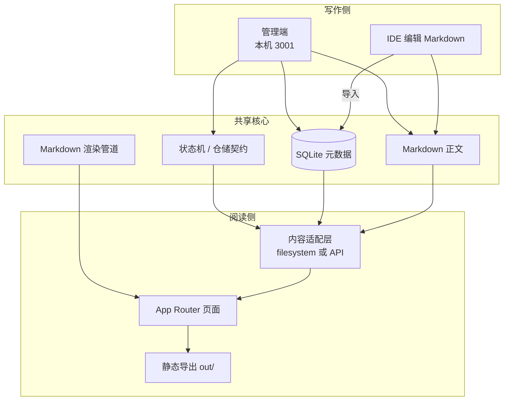
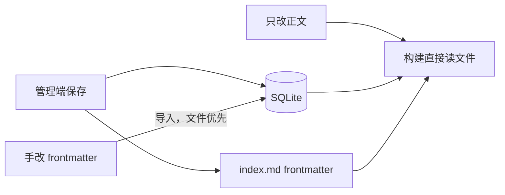
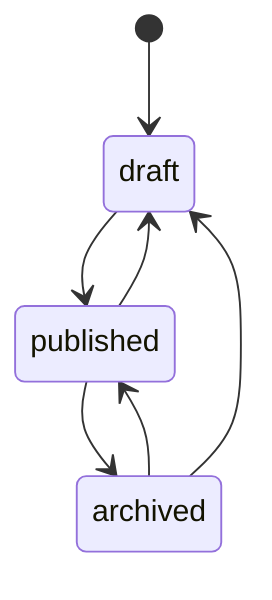
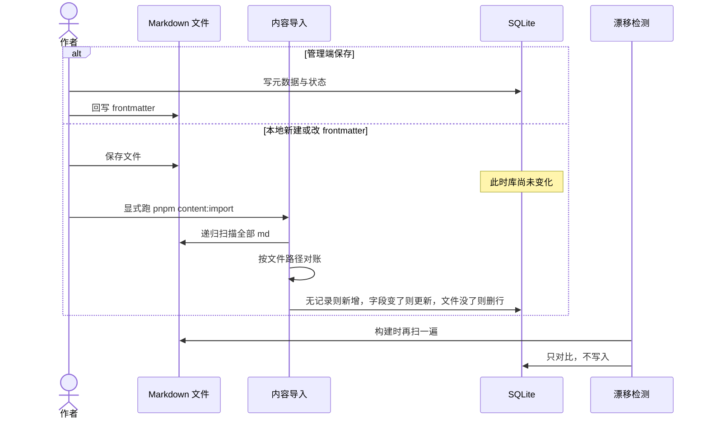
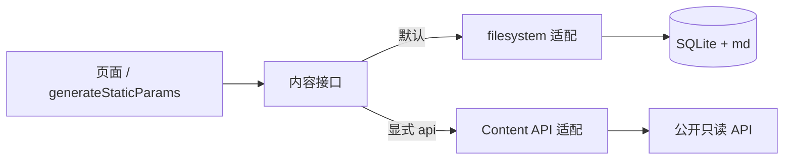
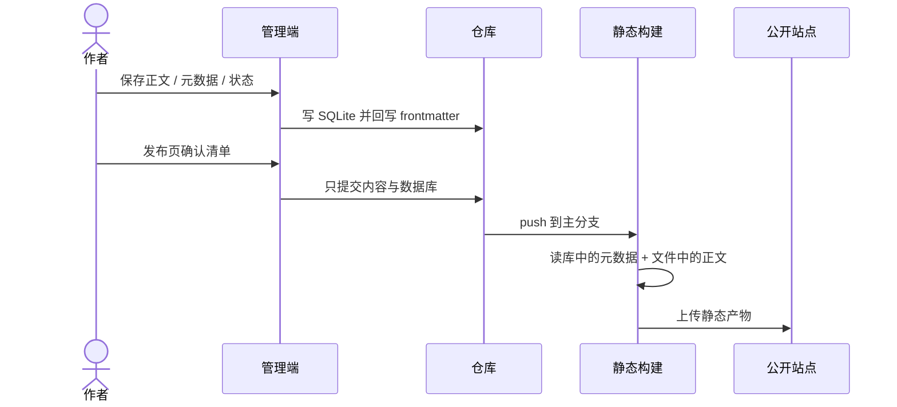
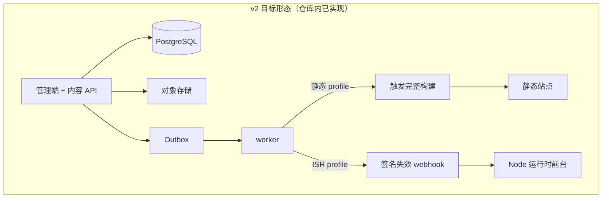

# 从静态站到可切换部署：个人博客的架构与日常运维

个人博客最容易写成两种极端：要么是一堆 Markdown 加静态生成器，写着方便、管着费劲；要么一上来就上数据库、鉴权、对象存储，日常发一篇笔记也要先唤醒一整套后端。

我现在的选择是中间态。**日常仍然是「本地写、Git 推、Pages 出静态站」**；仓库里已经把下一阶段需要的数据库、内容 API 和按需失效都实现并演练过，但公开流量还没切过去。这篇按「现在怎么跑」来写，并交代为什么要预留那条还没启用的路。

## 1. 要解决的问题

更早的版本是单包 Next.js：文章 Markdown 直接被页面读取，分类写死在站点配置里，图片习惯放进 `public/`。它能上线，但有几个会随时间变疼的点：

- 元数据（标题、标签、状态）和正文混在 frontmatter 里，没有一篇「现在是否对线上可见」的单一真源。
- 没有本地管理端，改状态、排序专栏、粘贴图片都要手改文件。
- 构建与内容耦合在同一个 Next 应用里，以后若想把前台换到带运行时的托管，内容层几乎要重写。
- 草稿和已发布文章缺少明确的状态机，容易误把未完成的内容打进生产构建。

所以重构分成两层，而不是一次换栈：

1. **先收成可维护的 v1**：monorepo、本地 CMS、SQLite 管元数据、Markdown 管正文、GitHub Pages 继续静态托管。
2. **再把部署形态做成可切换的 v2**：同一套页面既可以静态全量构建，也可以在 Node 运行时里按内容粒度失效；后台可以独立部署。这一层已经在仓库里跑通演练，**生产默认仍指向 v1**。

## 2. 总体结构

仓库是三个包：前台、管理端、共享核心。页面不直接碰文件系统或数据库。



| 部分 | 实际职责 |
|------|----------|
| 前台应用 | 首页、分类、文章、专栏、关于、品牌页；生产默认静态导出 |
| 管理端 | 仪表盘、文章、分类、专栏、发布；只监听本机 loopback |
| 共享核心 | slug 与路径、内容状态机、SQLite / Postgres 仓储、frontmatter 读写、导入导出、Markdown → HTML |

前台和管理端共用同一套渲染管道，避免「预览里的 Mermaid / 标题锚点和线上不一致」。

公开路由保持稳定：文章在 `/posts/<slug>/`，专栏在 `/<collection>/<slug>/`，分类从数据库读，新建分类不必改页面代码。

## 3. 内容模型：双载体，而不是「文件即站点」

v1 的关键决定是：**正文永远在 Markdown 里，标题、日期、标签、分类、状态以数据库为准。** 管理端每次保存会把元数据回写进 frontmatter，所以文件仍然可以脱离数据库被搬走；反过来，若在编辑器里改了 frontmatter 或新增了文件，需要跑一次以文件为准的导入，重建数据库。



文章在仓库里是「文章包」，不是扁平的一篇 `.md`：

```text
content/posts/<分类slug>/<年份>/<文章slug>/
├── index.md
└── assets/
```

这样分类在目录上可见，年份保留归档，配图跟文章走，静态导出时也能按文档相对路径重写 URL。存量放在站点 `public/images` 下的绝对路径仍然能用，新图统一进 `assets/`。

状态机很短，但必须显式：



| 状态 | 本地前台 | 生产构建 |
|------|----------|----------|
| draft | 可见，带草稿标识 | 不输出 |
| published | 可见 | 可见 |
| archived | 不可见 | 不可见 |

删除是软删除，文件进回收目录、不进 git。手写新文件时必须写上 `status: draft`，否则导入会按已发布处理——这是我实际踩过的坑。

专栏是另一类内容：独立一级路由、文档可排序、默认可对搜索引擎隐藏。适合「只想自己打开、不想进首页信息流」的笔记集。它和文章走同一套状态与同步规则，只是列表页的语义不同。

## 4. 两条写作路径：保存即入库，手写必须导入

创建和更新都可以走两条路，它们不是互斥的，但**写库的时机完全不同**。

| 你怎么改 | 数据库何时更新 | 还要做什么 |
|----------|----------------|------------|
| 管理端新建 / 保存 / 改状态 | 当时就写。一次事务里写 SQLite，并回写 md 的 frontmatter | 不用导入 |
| IDE 只改 md **正文** | 不写库。正文构建时直接读文件 | 不用导入 |
| IDE **新建** md、改 frontmatter、删文件 | **不会自动写库** | 必须跑 `pnpm content:import` |

这一点是刻意的：没有文件监听，`next dev` 和 `next build` 都不会在看到新文件时偷偷 INSERT。构建前会跑 `pnpm content:check`，发现「文件在、库里没有」只打告警，**不收录、不改库**。漏掉 `pnpm content:import` 的结果很明确——站点和管理端都看不见这篇新文章。



导入是全量对账，不是「监视某一个文件」。它递归扫描文章目录和专栏目录里所有 Markdown，解析 frontmatter，用**文件路径**当对账键：

- 库里没有这条路径 → 新增记录
- 路径已在、标题 / 状态 / 标签等变了 → 更新
- 库有记录、磁盘上文件没了 → 删除该行
- slug 在两篇文章里重复 → 直接报错并列出文件，而不是默默覆盖

正文仍然只活在文件里，导入不把整篇 Markdown 塞进 SQLite。命令可重复跑，第二次应当是「扫描 N、新增 0」。

手写新文件有一条容易忘的规则：frontmatter 必须显式写草稿状态。解析时如果没写状态，会按已发布处理——导入成功的下一秒，它就已经具备进入生产构建的资格。

我日常更常用混合流：管理端点「新建」生成目录和草稿行，长文在 IDE 里写（只动正文，不必导入），元数据和发布按钮再回到管理端。只有从零手建文件、或在 IDE 里改了标题 / 日期 / 标签时，才需要跑一次 `pnpm content:import`。

## 5. 前台：静态优先，读取路径可替换

生产构建仍然是 Next.js 的静态导出：一次 `next build` 生成完整 HTML，丢给 GitHub Pages。对个人站点这几乎是最优解——没有运行时账单、没有冷启动、搜索引擎看到的就是最终页面。

为了不把「读 SQLite」写死在页面里，前台收了一个异步内容接口。构建期用环境变量选择实现：

- 默认 `filesystem`：读仓库内 SQLite 与 Markdown，行为与重构前的静态站一致。
- `api`：构建机向内容服务拉已发布 DTO。浏览器不直连数据库，图片用绝对 URL。



这一点看起来像过度设计，但它解决的是半年后的问题：如果有一天 Pages 不够用，想把前台放到带 Node 运行时的机器上做按路径失效，**页面组件不用改**，只换适配器和发布驱动。

渲染模式也做成显式配置，而不是在同一个 `page.tsx` 里用环境变量切换 `dynamicParams`（Next 要求这些是静态可分析的）：

| 模式 | 典型托管 | 发布动作 |
|------|----------|----------|
| static-export（当前生产） | GitHub Pages、纯静态 Nginx | 触发一次完整构建 |
| runtime-isr（已实现，未切流） | 单机 Node 等 | 带签名的失效请求，按内容 tag/path 失效 |

两种模式和发布驱动的组合在配置层直接校验：静态导出不能配运行时 webhook，ISR 不能配「只打一次构建钩子」。配错就让构建失败，而不是上线后静默降级。ISR 目前强制单副本——没有共享缓存处理器之前，多实例会各记各的缓存。

## 6. 管理端：本机 CMS，发布有白名单

管理端只在本机开，地址绑在 loopback。没有公网、没有登录，是因为 v1 假设作者就是这台电脑的使用者。能力按写作闭环排：

- 文章列表筛选、新建脚手架、分栏编辑与预览、元数据、状态流转
- 粘贴或拖拽图片，自动进当前文章的 `assets/`
- 分类增删（有文章的分类不能删）
- 专栏创建（校验保留路由）、文档拖拽排序
- 发布页：展示将要提交的文件，一键 commit + push

发布不是 `git add .`。白名单只有内容目录和数据库文件，避免一次「发文章」把半成品代码推上 `main`。若工作区里已经暂存了白名单以外的文件，发布会直接拒绝。



GitHub Actions 在主分支推送时构建。构建环境默认仍读仓库里的文件和 SQLite，不需要外部数据库或密钥。仓库里已经接好「内容发布事件触发构建、构建结束再回调管理端」的入口，那是 v2 的 Outbox 路径，日常发文用不到。

## 7. 日常怎么发一篇

我实际用的是混合流：管理端负责结构，IDE 负责长文。

1. 管理端新建文章，生成分类 / 年份 / slug 目录和一条草稿记录。
2. 打开 `index.md` 写正文；图放进旁边的 `assets/`，或在管理端粘贴。
3. 需要改标签、摘要、封面时回到管理端保存（会回写 frontmatter）。
4. 本地打开前台看草稿标识、目录、Mermaid。
5. 状态改为已发布。
6. 发布页看一眼 diff，确认只有内容和数据库，推送。
7. 等 Actions 变绿，用线上 URL 点开终检。

IDE 里如果只改了正文，不必导入。一旦改了 frontmatter、或是完全手建的 Markdown，必须跑上一节说的文件优先导入。构建不会帮忙收录，它只会在日志里写「文件存在但数据库无记录」。

专栏笔记同样：先在管理端建专栏（避免 slug 撞上已有一级路由），再写文档、拖排序、按需发布。

## 8. 日常维护比写作少，但更不能省

维护清单很短，短是因为状态机和漂移检测把「文件和库各说各话」变成了可观察的事。

**每次手改 frontmatter 之后**跑导入。导入是幂等的；真正会停下来的是重复 slug，这时它会列出冲突文件而不是默默覆盖。

**每次准备上线**看发布清单。代码改动走单独提交。把功能和文章混在一次推送里，回滚会变成「连正文一起回」。

**大改渲染或路由之后**跑生产构建并本地预览产物，而不是只看 `next dev`。静态导出对动态路由、图片优化、base path 的约束，开发服务器不会全部暴露。

**观察期（也就是现在）**至少用当前链路完整走一轮：写 → 发 → 构建成功 → 线上可打开。在这之前把生产变量切到数据库或 API，等于在没有回滚证据的时候拆掉旧路。

构建时的漂移检测只告警、不阻断，是有意的：CI 不应该因为作者在 IDE 里多改了一行摘要就整站发不出；但它必须把差异打到日志里，否则「文件是真源还是库是真源」会在半年后变成口口相传。

## 9. 已经就绪、但故意没切的那一层

v2 不是「换一个托管商」的脚本，而是把内容服务和前台拆开：

- PostgreSQL 存元数据与正文，对象存储存图片
- 管理端可独立部署，单用户 GitHub 登录
- 保存写库并写 Outbox 事件；独立 worker 按配置触发全量静态构建或 ISR
- 静态构建「dispatch 被接受」不等于「已上线」，要等部署回调成功才标完成
- 前台仍可继续静态全站生成，也可以改成运行时按 tag 失效



我把它做完却不切流，是因为个人博客的失败模式很无聊、但很致命：DNS、构建、图片 URL、草稿泄漏，任何一项在切换窗口出问题，公开站点会空一段时间，而读者和搜索引擎都不会等你。所以约束是：

- 生产默认仍是文件存储、Git 发布、SQLite
- 演练用独立的库和对象存储，禁止对着生产库做恢复或清空
- 观察至少一个完整发布周期，再单独开变更退役旧路径

对读者来说，这个阶段应该是无感的：URL、栏目、文章包结构都不变。变的是我这边发完一篇之后，站点如何得知「该更新了」。

## 10. 几个值得留下来的取舍

**静态导出继续当生产默认。** 个人博客没有「库存变更要 30 秒内出现在全站」的需求。全量构建换来的是简单的回滚（旧 artifact 还在）和零运行时。

**管理端先本机、再谈部署。** 没有鉴权的 CMS 一旦进公网就是在给草稿开窗口。loopback 是 v1 的安全模型；要部署管理端，必须先有 allowlist 登录，这已经在 v2 代码里，只是不和当前流量绑在一起。

**页面依赖适配器，不依赖存储。** 这是整个重构里对未来最值钱的一条。换 GitHub Pages、换一台 Node、甚至换内容 API 的域名，都不应该迫使文章页重写数据获取。

**发布白名单。** 「一键发布」如果等于「把工作区全部推上去」，它就不是发布工具，是事故生成器。

**双写 frontmatter。** 纯数据库真源更干净，但个人知识库经常需要「把仓库拷走还能读」。在 v1 里用回写换可迁移性；v2 把 Markdown 降成异步备份，那是切流之后的事。

**手写不监听，导入必须显式。** 保存 md 不等于更新数据库。没有 watch，构建也不帮忙收录；本地新建文件后漏跑 `pnpm content:import`，文章就不会出现。这比「保存即同步」少一层魔法，但对账规则更清楚。

## 11. 小结

我把博客收成一个小平台，但日常仍按静态站来用：本机管理端写稿会当场双写库和文件；本地手建 Markdown 则必须显式导入，构建只负责发现两边不一致。SQLite 记住状态，Markdown 保住正文，推到主分支后整站重建。仓库里另一条路——数据库作为运行时真源、前台可静态可 ISR——已经可以在本地复现，只是还没获得「拆掉旧路」的资格。

若你也在维护一个会活很多年的个人站点，值得先问两个问题：发一篇新文章需要动几处文件？如果明天换托管方式，页面代码要不要跟着改？我现在的答案分别是「管理端一次保存」和「只换适配器」。后面那个答案，要等观察期结束、真正切过一次流，才算被证实。
