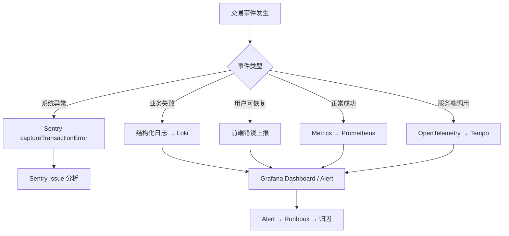
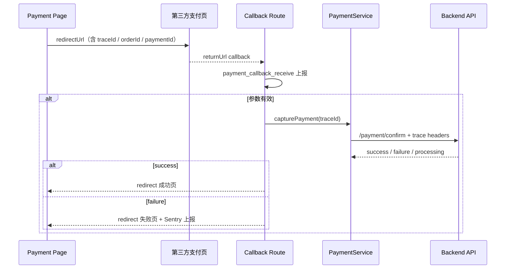

# 前言

这篇文章是我对电商交易链路可观测性建设的复盘。

Checkout 和 Payment 是电商最核心的业务闭环——这里的故障直接等于营收损失。当时 Sentry 和监控平台已经接入了，但出问题时依然是「打开 Sentry 搜一圈 → 翻日志 → 问后端 → 猜是哪个支付渠道」。

我推动的不是重建监控体系，而是在现有平台之上，为交易链路建立**统一的事件模型和标准观测协议**。目标是：拿到一个 `traceId`，就能串起前端操作、Server Action、支付服务调用和第三方回调；发布上线后 30 分钟内判断有没有交易回归。

---

## 阅读主线

这篇对应 Checkout/Payment、Sentry、Datadog、traceId、SLO 和支付状态机。阅读时不要只看「接入监控」，而要看清楚交易链路为什么需要业务语义、15 阶段模型怎么定位故障、Redirect 支付回调为什么是盲区，以及告警如何配合 Runbook。

## 痛点：有监控，但没有交易语义

### 平台级监控 ≠ 业务级可观测

Sentry 能告诉我「某个组件抛了 TypeError」，但回答不了：

- 这笔失败是 Stripe 超时还是库存不足？
- 同一订单的第 2 次支付尝试和第 1 次有什么关系？
- 某次发版后，某跳转支付渠道成功率掉了 15%，是代码问题还是渠道波动？

### 跨端追踪断裂

交易链路横跨浏览器、Server Action、支付域服务、后端 API、第三方回调页。各层各自打日志，字段名不统一，关联键缺失。排查一笔失败交易平均要 30-60 分钟。

### Redirect 支付的盲区

Stripe 卡支付是页面内闭环，但东南亚市场大量用钱包类跳转支付。用户被带到第三方页面，付完跳回来——这段路径在普通错误监控里几乎是黑的。

---

## 方案目标

| 目标 | 具体含义 |
| --- | --- |
| 链路串联 | 同一笔交易用 `traceId` 在 Sentry、Loki、Tempo、Grafana 中互相关联 |
| 问题分层 | 系统故障、业务失败、用户可恢复错误、第三方波动——四条分诊路径 |
| 成功率告警 | 下单、支付发起、支付捕获三步有 SLO 和 Burn Rate 告警 |
| 发布回归感知 | 发布后 30 分钟从 Dashboard 判断成功率是否下降 |
| Provider 钻取 | 按支付商、市场、版本下钻影响面 |

---

## 整体架构

### 平台分工原则

一句话：**Sentry 看「为什么失败」，Grafana 看「影响有多大」。**

| 问题类型 | 优先平台 | 典型场景 |
| --- | --- | --- |
| 代码异常 / Root Cause | Sentry | capture 抛错、SDK 初始化失败 |
| 业务成功率下降 | Grafana + Prometheus | 某渠道成功率从 96% 降到 72% |
| 日志回溯 | Grafana + Loki | 按 `trace_id` 查结构化日志 |
| 服务端调用链 | Grafana + Tempo | Server Action → PaymentService → Backend |
| 发布回归 | Grafana | 某版本上线后 P95 延迟翻倍 |



### 统一封装层

我没有让业务代码直接调 Sentry 或 Grafana API，而是建了 `transaction-observability` 模块统一封装：

- 前端页面、Server Action、PaymentService、Provider Strategy 都通过同一套 API 上报
- 字段字典集中定义在 `types.ts`，避免各层各写各的
- 屏蔽平台差异，后续换监控后端时业务代码不动

---

## 15 阶段交易模型

这是整个方案的锚点。所有埋点、日志、告警都挂靠到标准阶段，而不是随意的函数名。

| 阶段 | 说明 | 执行侧 |
| --- | --- | --- |
| `checkout_init` | 进入结账页 | 客户端 |
| `checkout_info_fetch` | 拉取结账信息 | 客户端 |
| `address_validate` | 地址校验 | 客户端 |
| `inventory_reserve` | 库存预占 | 服务端 |
| `promotion_apply` | 促销计算 | 服务端 |
| `create_order` | 创建订单 | 客户端直调 API |
| `payment_method_select` | 选择支付方式 | 客户端 |
| `payment_initiate` | 创建 payment intent | Server Action |
| `payment_sdk_ready` | 第三方 SDK 就绪 | 客户端 |
| `payment_sdk_confirm` | SDK confirm | 客户端 + Server Action |
| `payment_redirect` | 跳转支付开始 | 客户端 |
| `payment_popup` | 弹窗支付开始 | 客户端 |
| `payment_callback_receive` | Redirect 回调到达 | Callback Route |
| `payment_capture` | 确认扣款 | Server Action |
| `payment_result_render` | 成功/失败页渲染 | 客户端 |

**为什么拆 15 步而不是 3 步？**

「下单 → 支付 → 完成」对 PM 够用，但对排障不够。支付发起成功但 capture 失败，和 initiate 就失败了，根因完全不同。标准阶段让 Dashboard 漏斗、告警规则、Runbook 都有统一的挂靠点。

---

## 关联键体系

| 关联键 | 生成时机 | 用途 |
| --- | --- | --- |
| `traceId` | 进入支付页时生成 | 串联一次交易的所有事件 |
| `attemptId` | 每次发起支付时生成 | 区分同一订单的多次尝试 |
| `orderId` | 下单成功后写入 | 关联订单与支付 |
| `paymentId` | initiate 成功后写入 | 关联 initiate / capture / callback |

### Header 传播

```text
Browser (traceId + sentry-trace + baggage + traceparent)
  → Server Action (x-trace-id + sentry-trace + baggage)
    → Payment Backend API
      → Tempo trace
      → Sentry trace
```

我在前端生成 `traceId` 后，通过 Server Action 参数和 HTTP Header 逐层透传。后端 APM Agent 自动采集 span，不需要业务代码手动拼链路。

### 必备上报字段

| 字段 | 说明 |
| --- | --- |
| `domain` | `checkout` 或 `payment` |
| `step` | 当前交易阶段 |
| `result` | `success` / `failure` / `timeout` / `processing` / `cancelled` |
| `provider` | 支付渠道 |
| `region` | 市场 |
| `errorCategory` | `system_error` / `provider_error` / `timeout_error` 等 |
| `env` / `service` / `version` | 统一标签 |

---

## Redirect 支付的 Callback 闭环

钱包类跳转支付的排障难度最高。我单独设计了 callback route 的观测闭环：



关键点：callback URL 里携带 `traceId`，这样第三方页面跳回来后，整条链路没有断裂。

---

## 告警与 SLO

### 核心 SLO

我为交易链路定义了三步 SLO，分别覆盖下单、支付发起、支付捕获。每一步都用「成功数 / 总数」衡量，窗口期 30 天——口径和 15 阶段模型对齐，避免 Dashboard 和告警各说各话。

### 告警设计原则

- **按阶段设阈值**：capture 失败比 initiate 失败更紧急，阈值分开设
- **双窗口 Burn Rate**：短窗口抓突发，长窗口抓持续恶化，减少误报和漏报
- **按支付商下钻**：同一告警能区分是代码问题还是渠道波动

Dashboard 我规划了四个视角：交易总览、支付商钻取、发布回归对比、市场健康度。发布后 30 分钟看回归对比，是上线流程的固定动作。

平台级分桶、ESLint 门禁和 Harness 范式见 [前端可观测性平台](/posts/observability-platform-harness/)。

---

## 我的思考

### 为什么不从零自建监控平台

交易可观测性的敌人不是「没有工具」，而是「工具之间没有共同语言」。在已有 Sentry + Grafana 的基础上建语义层，投入产出比远高于换一个全新的 APM。

### 为什么 `create_order` 不走 Server Action

这是一个有争议但刻意的决定。下单 API 调用频繁、延迟敏感，且需要在前端直接控制重试和 loading 态。把它留在客户端直调，Server Action 只处理 initiate/capture 两个关键节点——链路更简单，trace 也更清晰。

### 15 阶段模型要不要继续拆

目前 15 步对 Dashboard 和告警已经够用。后续如果加 BNPL、分期等新模式，优先在现有阶段下加 `provider` 维度，而不是新增顶层阶段——避免漏斗口径漂移。

---

## 总结

交易可观测性建设的核心，是把「能看日志」升级为「能回答业务问题」：

1. **标准阶段**让漏斗、告警、Runbook 说同一种语言
2. **关联键**让跨端追踪从人肉拼日志变成一键串联
3. **平台分工**让 Sentry 和 Grafana 各做擅长的事
4. **Callback 闭环**补上跳转支付的黑盒

主链路上线后，有 `traceId` 的 case 排查时间从 30–60 分钟降到 10 分钟以内。从「能查」到「能预警」，靠的是 SLO 和 Burn Rate 告警与 Runbook 配套——这和平台层门禁是同一套 Harness 思路。

---

## 关联阅读

- [前端可观测性平台](/posts/observability-platform-harness/)
- [工程实践札记索引](/posts/engineering-practice-hub/)
- [企业级电商前端平台架构重构](/posts/ecommerce-architecture-redesign/)
