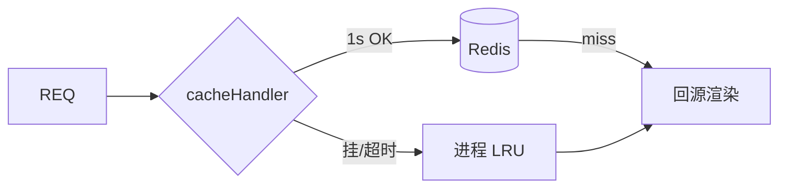

# 04 · 性能与缓存

> 权威：Joyboy `cache-handler.js`、`search-client.ts`、`next.config.js`。  
> 详记：[24.ISR+Redis缓存.md](../rightCapital/24.ISR+Redis缓存.md)  
> ⚠️ `docs/search-result-cache.md` 过时；勿背 5min / −30%。

**一句话**：多 Pod 用 Redis 共享 Full Route Cache（1s 超时→LRU）；搜索用内存 `responsesCache`（2min/100）去重；两套系统别混。

---

## 速记对照

| | ISR + Redis | 搜索 responsesCache |
| --- | --- | --- |
| 存哪 | Redis（失败→进程 LRU） | 页签内存 Map |
| 缓存啥 | 页面 / Data Cache | InstantSearch `search()` Promise |
| 超时 | **timeoutMs=1000** | HTTP **10s** |
| TTL | revalidate 多为 **600s**；Redis expire 估 **3600s** | **2min** |
| PLP | **force-dynamic，不走 ISR** | 客户端去重 + SSR hydrate |

---

## ISR + Redis（要点）

- 问题：默认 Full Route Cache 单机；多 Pod 重复生成、命中率差。
- 配置：`cacheHandler`（仅 production）+ `cacheMaxMemorySize: 0`。
- keyPrefix：`${APPLICATION_ENV}-${buildId}:` → 环境 + 发版隔离。
- **timeoutMs=1000**：旁路读失败要快，不拖 TTFB（≠ 缓存 TTL）。
- 故障：连不上→`createLruHandler()`；运行超时→当 miss。承认跨 Pod 不一致。
- 物理 TTL 估 **3600** > 业务 stale **600** → 先 stale 再再生，防硬 miss 击穿。
- 失效（CMS）：Storyblok webhook → `revalidateTag(full_slug)` → 只删**当前 build** 前缀下带该 tag 的 Redis key；旧 build 不靠 webhook 清，靠 `buildId` 隔离 + TTL 自灭。TTL / `revalidate` 是兜底。
- CMS **不直写 Redis**：`unstable_cache` / `fetch.next.tags` → Next Data Cache → cache-handler 落 Redis。
- 已知限制：`client.connect()` **无超时**，可能阻塞启动。
- 不进共享页缓存：用户态 / 会员价；PLP/search/checkout/cart。

---

## 搜索 responsesCache（要点）

- 代码：`search-client.ts`（非旧 `search-view-client`）。
- **两层 = 同一 Map**：结果 TTL 复用 + in-flight Promise 合并。
- 参数：TTL **2min** / 容量 **100** FIFO / 请求超时 **10s**。
- 动机：第三方 client 不被 hydrate → 二次 POST → 闪烁；routing bridge 同参双发。
- 规则：失败/artificial **驱逐**；`page=0` 与省略 page 视为同 key。
- 不写 Redis。SSR 失败 resolve 空结果；Client **reject** 进 error UI。

---

## CWV（要点）

- 方法：RUM → 归因 → 改 → 同页面类型对比。
- LCP：TTFB（ISR/Redis）+ hero priority + 减阻塞。
- INP：attribution tags `inpPhase` / `inpBottleneck`；拆长任务、延后 3P。
- CLS：尺寸预留、字体、骨架。
- Bundle：`web:analyze`；`optimizePackageImports`；Joy **仍在**。

---

## 追问 → 只答这句

| 问 | 答 |
| --- | --- |
| 自带缓存不够？ | 单机；多 Pod 重复生成。 |
| Redis timeout？ | **1s**，操作超时，防拖死渲染。 |
| 为何 expire 3600？ | > revalidate 600，留 stale 防击穿。 |
| Redis 挂了？ | 1s 失败 + LRU；可用性优先。 |
| CMS 改完怎么立刻失效？ | webhook → `revalidateTag(full_slug)`；只打当前 `${env}-${buildId}:`。 |
| 旧 build 的 Redis 谁清？ | webhook 不管；新版本不读旧前缀，靠 TTL/淘汰自灭。 |
| CMS 和 Redis 关系？ | 不直写；Data Cache + tags → handler 落 Redis。 |
| 搜索两层？ | TTL 结果 + in-flight Promise。 |
| 为何 2min？ | 盖住双发/后退；价库存不宜过长。 |
| PLP 为何不用 ISR？ | `force-dynamic`，组合爆炸+实时。 |
| 旧文档数字？ | 以 `search-client.ts` 为准。 |
| INP 怎么定位？ | attribution tags + 长任务/3P。 |
