# 10 · 面试问答复盘（2026-07-27）

> 使用方式：每题先看「速记句」，再脱稿口述 1–3 分钟。  
> 内容范围：本轮面试练习的最终推荐答案；不保留练习过程和原始回答。  
> 表述原则：项目事实与通用原理结合，不在面试中背函数名或具体文件路径。

---

## 0. 2–3 分钟自我介绍

面试官您好，我叫李东海，有接近四年的前端开发经验，目前在 Castlery 担任高级前端工程师，主要参与面向全球多市场的电商 Web 和门店 POS 系统建设。

我的第一段正式前端经历是在比心直播，主要负责移动端 H5 营收活动、运营后台和公共组件库。这段经历让我积累了高并发 C 端活动、移动端性能优化以及快速业务交付方面的经验。

加入 Castlery 之后，我的工作逐渐从业务需求开发扩展到了平台架构、交易稳定性、设计系统和工程治理。我们需要把迭代了七年的 Legacy 系统逐步重构为基于 Next.js、TypeScript 和 Nx 的 Monorepo。我参与了按 Product、Cart、Checkout、Payment 等业务域拆分模块，并通过 Components、Services、Domain 分层以及 Nx Tag 约束依赖。跨域流程主要由 Service、Redux Listener 和 Composite 层编排，避免业务模块互相直接耦合。

交易链路方面，我主要参与 Checkout、Payment 和 POS Order V2 的渐进式迁移，包括 Stripe Terminal 支付、支付状态管理、失败补偿、重复请求和异步清理等问题。因为交易模块风险比较高，我们使用 Feature Flag 按市场灰度发布，并保留快速回滚能力。

在性能方面，我参与了 ISR 加 Redis 的共享缓存方案。当 Redis 不可用时会降级到本地 LRU，保证服务仍然可用；同时也做过搜索结果缓存和进行中请求去重。另外还推动过 Fortress 组件库的 Tree Shaking、字体子集化和 Bundle Analyzer 治理。

我也参与建设了前端可观测性体系。我们统一主动错误上报入口，通过 `beforeSend` 对所有错误补充上下文、降噪和分类，再结合 Sentry 告警、Ownership、Runbook 和 AI Agent 形成问题发现到修复的闭环。

我认为自己与全球化 Web 岗位比较匹配的地方，是既有 React、Next.js 和工程化经验，也真正处理过多市场交付、性能、组件复用和交易稳定性问题。相比只完成单一页面，我更擅长从需求、架构和风险控制一直推进到上线验证。

---

## 1. Joyboy 中的 DDD 解决了什么问题？

### 推荐回答

Joyboy 引入 DDD，主要是为了解决 Legacy 项目中业务代码混在一起、模块边界不清晰，以及一个需求修改后影响范围难以控制的问题。

我们首先按照 Product、Cart、Checkout、Payment、Promotion 等业务域横向拆分，再在每个业务域内部按照 Components、Services、Domain 做技术分层。

- Components：负责 UI、用户交互和事件派发，不承担复杂业务编排。
- Services：负责业务流程编排，包含 Command、Helper 和 Redux Listener。
- Domain：负责状态、实体、类型、RTK Query API 和业务事件定义。

依赖方向保持单向：Components 可以依赖 Services 和 Domain，Services 可以依赖 Domain，但 Domain 不能反向依赖 Services 或 Components。这些规则通过 Nx Tag 和 ESLint Module Boundary 执行，而不只是团队口头约定。

典型跨域流程是：Component 派发业务事件，Service Listener 订阅事件并编排，再调用相应 Domain API 或更新状态。需要组合多个业务域时进入 Composite；Shared 只承载真正通用、不能依赖具体业务域的能力。

它的收益是边界清晰、修改影响范围可控、Ownership 更明确。代价是学习成本提高、一次业务流程可能分散在多个文件中，并且必须防止 Listener、Shared 和 Composite 变成新的上帝模块。

### 架构图

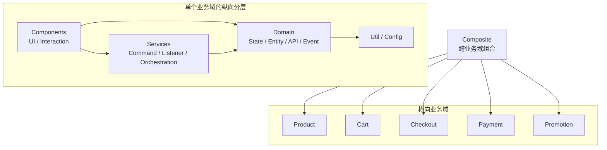

### 速记句

> DDD 不是调整文件夹，而是通过业务边界、单向依赖和跨域编排规则控制复杂度。

---

## 2. Cart 使用 Promotion 能力时，如何避免跨域强耦合？

### 推荐回答

首先明确能力归属：优惠券规则和操作属于 Promotion，Cart 只负责表达“用户希望对购物车使用某张优惠券”。

如果只是简单调用，页面可以通过 Promotion 暴露的稳定 Command 或 Domain Action 发起操作，但传入的 Payload 必须包含 Promotion 完成业务所需的数据，Promotion 不应该反向读取 Cart State。

如果中间涉及 Cart 与 Checkout 两套数据源选择、字段转换或不同场景逻辑，则把适配放到 Composite Adapter。Composite 可以同时依赖 Cart、Checkout 和 Promotion，负责把不同业务域适配成 Promotion 接受的统一契约。

Promotion 不兼容 Cart 的内部模型；Cart 也不理解 Promotion 的具体实现。成功后由 Promotion 派发领域事件，其他 Listener 再处理刷新、通知或埋点。

### 调用图

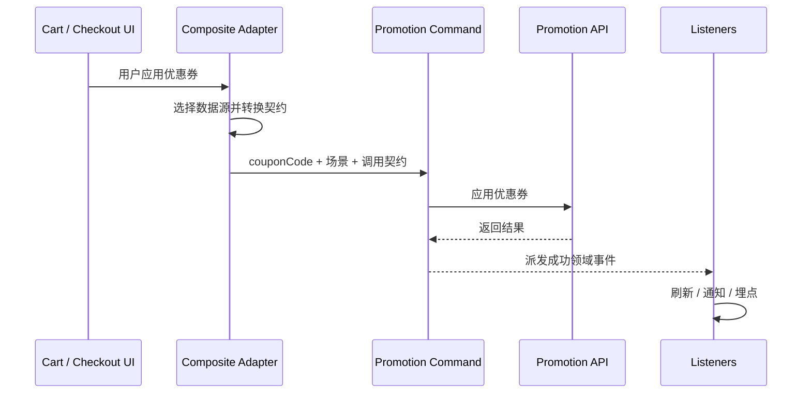

### 速记句

> 能力归所属领域，跨域适配放 Composite，调用方传完整契约，提供方不反向读取调用方状态。

---

## 3. POS Stripe Terminal 新支付链路如何工作？

### 推荐回答

支付开始前订单已经创建，并且拥有 Order ID 和 Order Number。

用户选择 Stripe Terminal 后，前端首先检查 Reader 是否连接，然后调用 Initiate 接口创建内部支付记录和 Stripe PaymentIntent。后端返回内部 `paymentId` 以及 Stripe `clientSecret`。

前端使用 `clientSecret` 调用 Stripe Terminal SDK：

1. `collectPaymentMethod`：让终端读取银行卡。
2. `processPayment`：处理 Stripe 支付。
3. 成功后获得 Stripe `paymentIntentId` 和 External Reference。

随后前端调用 Confirm Payment，提交内部 `paymentId`、Stripe `paymentIntentId` 和 External Reference，让后端确认并保存支付结果。确认成功后刷新 Payment Method List。

需要区分：

- `paymentId`：内部 POS Payment 记录。
- `paymentIntentId`：Stripe 侧 PaymentIntent。
- Confirm Payment：确认当前支付方式。
- Complete Payment：后续完成整个订单，不能与 Confirm 混为一谈。

Initiate 和 Confirm 都需要幂等键。对于同一个逻辑请求的重试，应复用相同幂等键，而不是每次生成新键。

### 支付时序

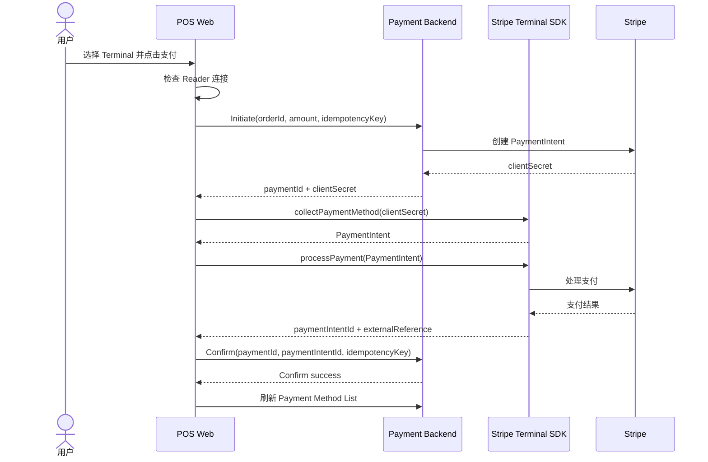

### 速记句

> 内部 `paymentId` 管业务记录，Stripe `paymentIntentId` 管渠道支付，幂等键管重复请求，失败补偿管中间状态。

---

## 4. 如何避免异步支付清理被执行多次？

### 推荐回答

每次 Initiate 都生成独立 `paymentId`，取消和删除必须携带该 ID，确保清理范围只落在当前支付记录。

UI 的 Loading 或 Disabled 可以防止用户连续点击，但不能解决用户取消、SDK 失败回调、超时处理同时发生的异步并发问题。

前端还需要把支付过程设计为单向状态机。第一个清理流程开始时，立即把状态从 Pending 原子地切换到 Cancelling，并消费当前待清理标识；后续回调发现它已经被消费，就不再重复执行。不能等异步取消完成后才修改状态。

服务端删除接口也要幂等。同一 `paymentId` 被重复清理时，应返回相同最终结果，而不是产生新的副作用。

### 状态图

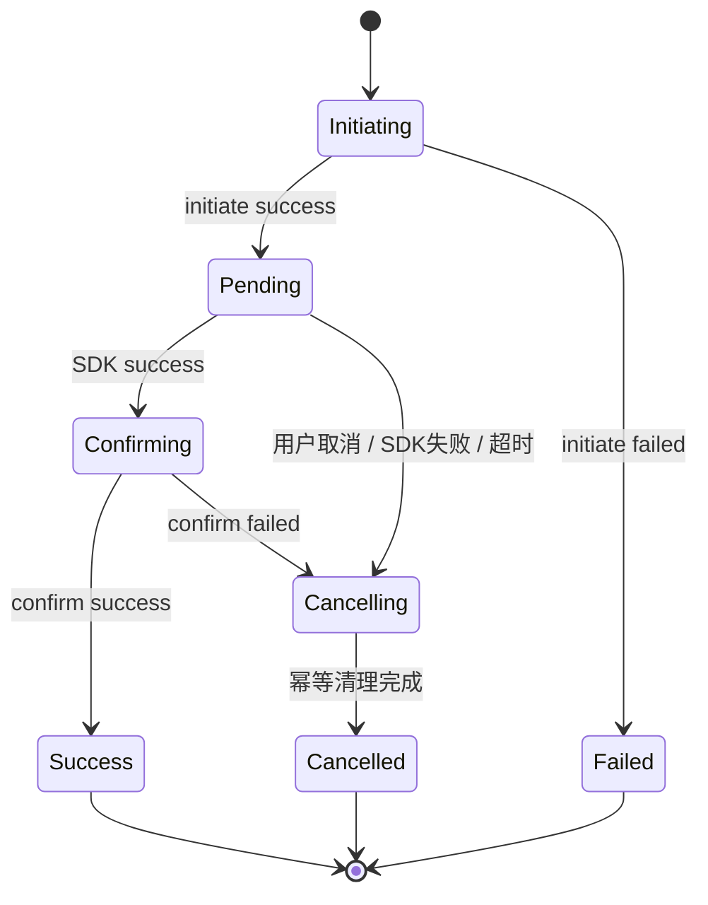

### 速记句

> Loading 防重复点击，状态机防前端并发，接口幂等保证最终一致性。

---

## 5. 为什么统一封装 Sentry 错误上报？

### 推荐回答

统一封装的目标，是把错误上报从“各业务模块自由发挥”变成可治理的工程标准。

业务主动上报统一走结构化入口，完成错误标准化、PII 过滤、日志记录，并补充 Domain、Page Type、Priority、Severity 和业务 Tags。

但并非所有错误都会经过主动上报入口。运行时异常、Promise 异常和第三方脚本错误仍可能被 SDK 自动捕获，因此还需要在 `beforeSend` 对所有进入 Sentry 的错误做第二层治理：

- 降噪和第三方过滤。
- 上下文补充。
- `error_bucket` 互斥分类。
- Ownership 和告警路由。

结构化字段不仅服务人工排查，也给 AI 自动修复提供稳定输入。AI 可以根据 Domain、Page Type、Error Bucket、Priority 和堆栈判断问题归属、风险等级和允许修改范围，再决定自动创建 PR 还是升级人工处理。

### 治理链路

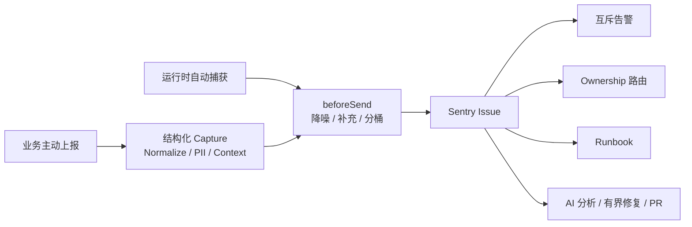

### 速记句

> 主动上报入口保证数据标准化，`beforeSend` 治理全部错误，结构化标签驱动告警、Ownership 和修复闭环。

---

## 6. 如何设计互斥的 Error Bucket？

### 推荐回答

错误分类不是给一个错误同时添加多个类别，而是建立一条有明确优先级的单向决策链。每个错误按照固定顺序判断，命中一个类别后立即返回。

顺序要优先考虑语义明确程度和告警价值。例如第三方请求即使返回 500，也应该优先归入 Third Party，否则会污染自己的 API 5xx 告警；主动上报的请求如果明确发生超时，也应先归入 Timeout，而不是宽泛的 App Error。

客户端顺序：

```text
Hydration → Third Party → Network → API 5xx → API Timeout
→ App Error → JS Fatal → Unclassified
```

服务端顺序：

```text
Upstream 5xx → Upstream Timeout → JS Fatal
→ App Error → Unclassified
```

还应记录 Bucket Confidence。状态码等强证据标记高置信度，依赖错误名称或字符串推断的分类降低置信度。

### 客户端决策树

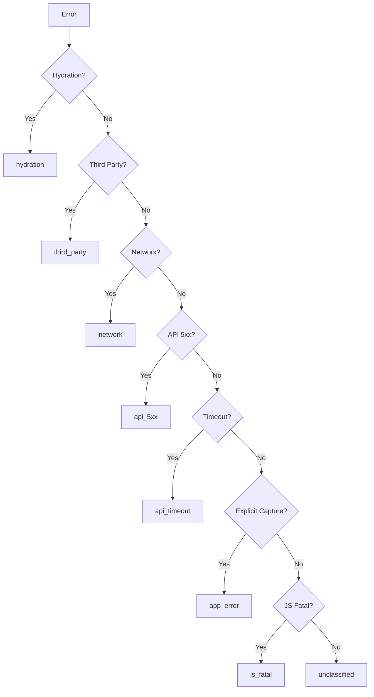

### 速记句

> Error Bucket 是按照业务语义和告警价值排序的互斥决策树，不是并列标签。

---

## 7. 多 Pod 为什么需要 Redis 共享 ISR 缓存？

### 推荐回答

如果每个 Pod 只使用本地 ISR 缓存，同一页面会在不同实例中拥有不同缓存。负载均衡把用户请求分发到不同 Pod 时，可能返回不同版本的数据；多个 Pod 也可能同时回源和重新生成相同页面。

因此使用 Redis 作为共享 Full Route Cache，让所有实例读取同一份缓存结果。

Redis Key 必须进行环境和版本隔离。加入部署环境与 Build ID，可以避免测试、生产和不同构建版本互相污染。多市场也必须通过独立环境、命名空间或业务 Key 隔离，尤其不能错误共享价格、语言和 CMS 内容。

缓存失效采用 Tag 和 Path 两种粒度。CMS 发布 Webhook 到达后，应用根据 Content Type 或 Slug 调用 `revalidateTag`；路由结构强相关时调用 `revalidatePath`。底层 Cache Handler 根据关联关系失效缓存。

Redis 故障时降级到进程内 LRU，保障服务继续可用。但 LRU 不再跨 Pod 共享，会重新出现短暂不一致和重复回源，因此还要监控 Redis 状态、降级次数、命中率和上游请求量。

### 缓存架构

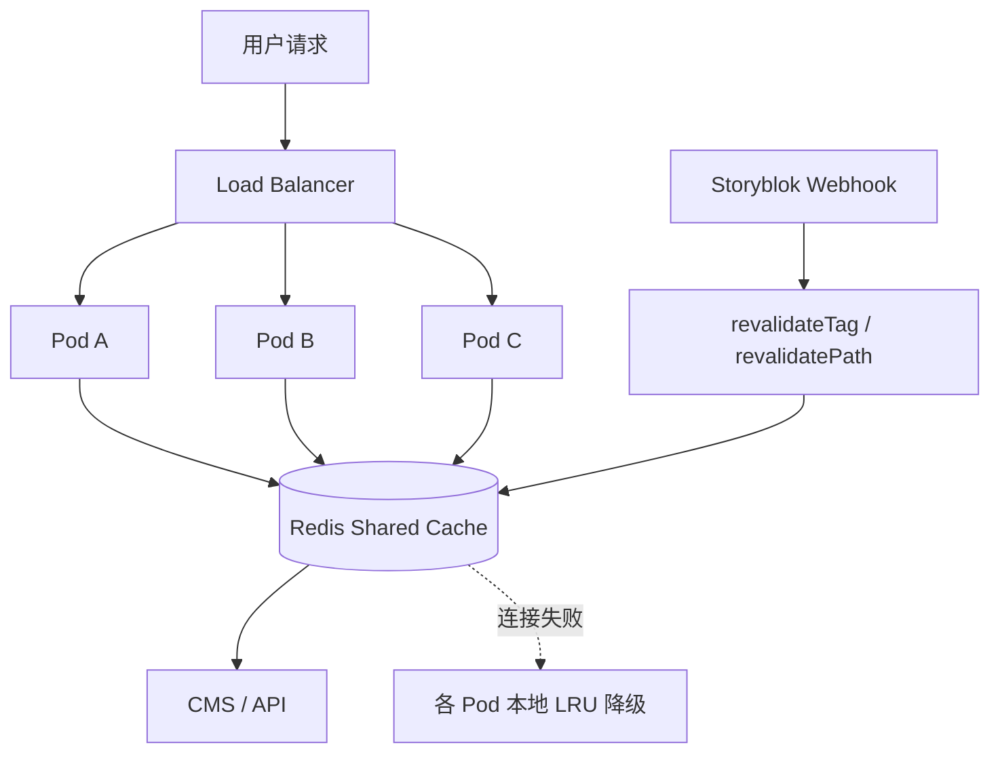

### 速记句

> Redis 解决跨实例一致性和命中率，Tag 解决新鲜度，LRU 解决 Redis 故障时的可用性。

---

## 8. 为什么搜索还要缓存进行中的 Promise？

### 推荐回答

缓存已经完成的响应，只能解决先后发生的重复请求。当前一个请求尚未返回时，响应缓存里还没有结果，并发到达的相同请求仍会重复访问后端。

解决方式是 Request Coalescing / Single Flight：

1. 第一个请求创建网络 Promise。
2. 按完整查询参数把 Promise 放入缓存。
3. 后续相同请求直接等待同一个 Promise。
4. 成功后结果在 TTL 内继续复用。
5. 失败后删除缓存，避免永久复用 Rejected Promise。

缓存 Key 必须包含 Query、Filter、Facet、Page 等完整条件，防止不同搜索错误共享结果。

这与 Stale-While-Revalidate 不同：前者让并发请求等待同一个新结果；后者可以先返回旧数据，再后台更新。

### 请求合并图

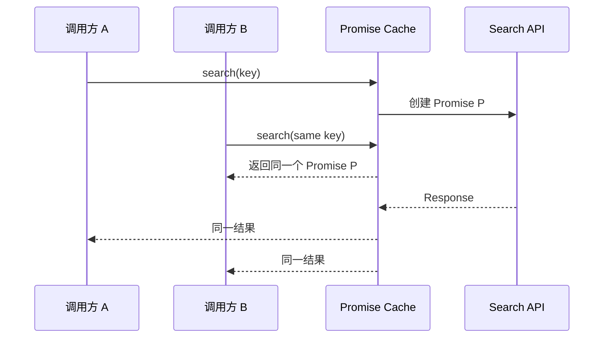

### 术语纠偏

- 单个热点 Key 失效并引发并发回源：缓存击穿 / Stampede。
- 大量 Key 同时失效：缓存雪崩。
- 多个相同请求共享一个 Promise：Single Flight / Request Coalescing。

### 速记句

> 响应缓存解决连续重复，Promise 缓存解决并发重复。

---

## 9. 只有一个海外市场变慢，如何排查并验证？

### 推荐回答

第一步不是直接看某台服务器，而是通过 RUM 按国家、页面、设备、浏览器、版本、ISP 和网络类型拆分数据，确认影响范围。

然后根据指标定位层次：

- TTFB 上升：检查 Pod CPU、内存、Event Loop、请求排队、Redis 命中率、LRU 降级和上游 API Trace。
- TTFB 正常但 LCP 变差：检查 CDN、DNS、静态资源、图片、字体、首屏资源优先级和市场专属 CMS Payload。
- INP 变差：检查 Long Task、Hydration、重复渲染、第三方脚本和首屏 JavaScript。
- Sentry 异常增加：检查页面是否进入降级、重试或重复请求逻辑。

如果与发布高度相关，优先关闭 Feature Flag 或按市场回滚。如果没有发布，更应该检查配置、数据量、流量、第三方服务、CDN 和后端变化，不能直接认定为代码问题。

修复后在相同市场、页面、设备维度对比 TTFB、LCP、INP、缓存命中率和错误率，关注 p75、p95，并结合 RUM 与合成测试确认改善持续存在。

### 排查决策图

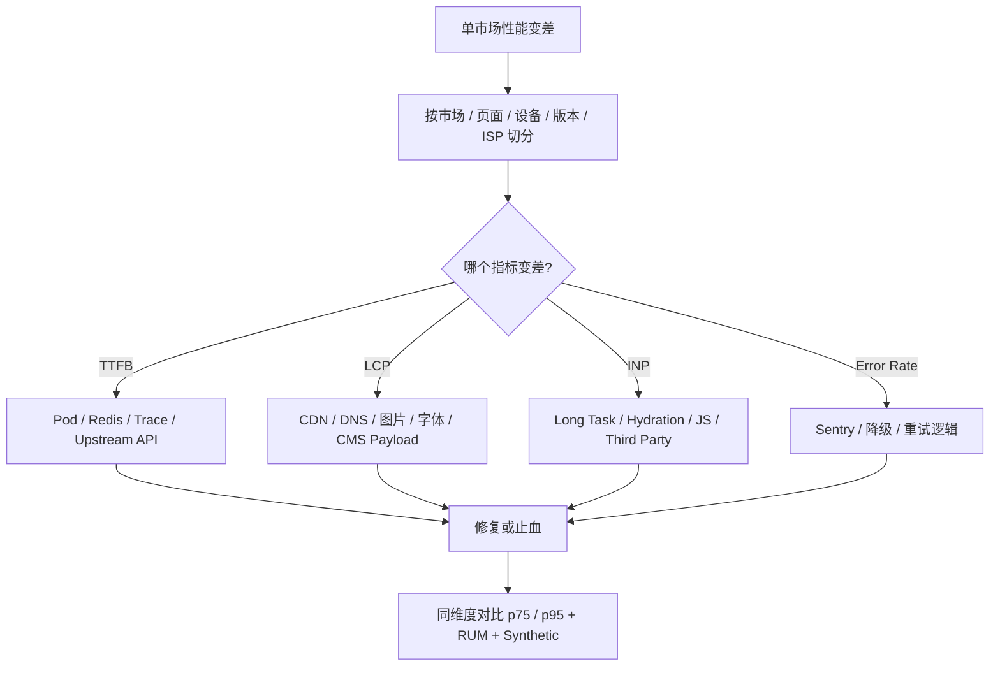

### 速记句

> 先切分影响范围，再用 TTFB、LCP、INP 判断网络、服务端、资源还是客户端，最后在同一维度量化验证。

---

## 10. 基础组件、业务组件和页面组件如何划分？

### 推荐回答

判断维度包括业务语义、依赖关系、复用范围和需求稳定性。

基础组件是设计系统中的通用原子能力，例如 Button、Input、Drawer。它不包含业务概念，也不能依赖业务 Domain 或 Service，主要封装视觉、交互、响应式、主题和无障碍规范。

业务组件包含明确业务语义，例如 Add to Cart Button、Payment Button。它会根据商品、订单或支付状态判断 Disabled、Loading 和操作结果，可以依赖所属业务域的状态与服务。

如果一段 UI 只在一个页面使用、需求频繁变化或高度依赖当前页面上下文，则先保留在页面内部。等出现真实的第二个使用场景，并能识别稳定部分和差异点后再抽象。

不以“拆得越小越好”为目标，而是看组件是否拥有独立职责和独立变化原因。过早抽象会产生一次性组件、复杂 Props、过多条件分支和万能组件。

### 决策树

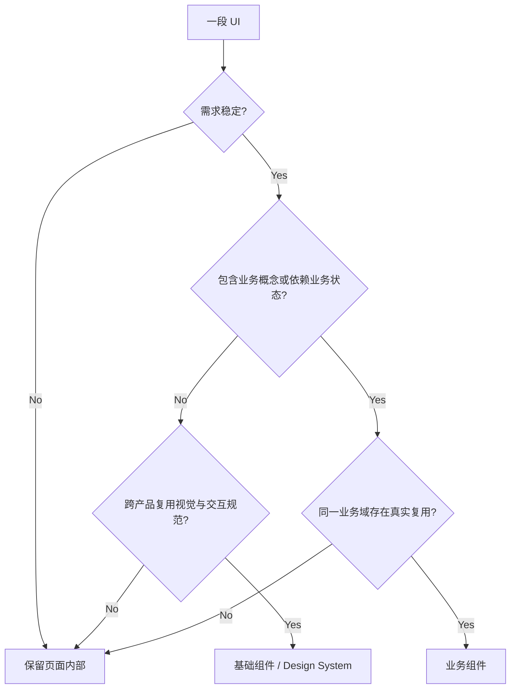

### 速记句

> 基础组件复用视觉规范，业务组件复用稳定业务能力，需求不稳定时优先局部实现。

---

## 11. 共享基础组件如何发布并避免大范围回归？

### 推荐回答

先做影响评估，确认改动属于局部样式、公共 Design Token、交互逻辑还是组件 API。公共 Token、默认 Props 和交互行为的风险明显高于局部样式。

在 Storybook 中覆盖主要 Variant、Size、状态、响应式和多主题。视觉修改通过 Chromatic 审核 Diff：目标不是要求没有 Diff，而是确认所有 Diff 都符合预期，且没有影响无关状态和组件。

涉及点击、Loading、Disabled、Focus 或键盘操作时，增加 Interaction Test 或 Testing Library 测试。API 或类型变化还需要执行受影响项目的类型检查和构建，验证 Web、POS、CMS 调用方兼容。

低风险改动可以缩小测试范围，但不能完全跳过验证。即使只是 Hover 颜色，也应至少验证对应 Story、主题、Focus/Active 状态和对比度。

高风险改动先在单一页面或市场验证，再逐步扩大范围；上线后继续关注前端错误、交互指标和视觉反馈。

### 发布流程

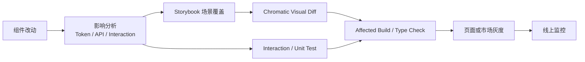

### 速记句

> 低风险改动可以缩小回归范围，但共享基础组件不能因为改动看起来简单就完全跳过验证。

---

## 12. 从需求分析到灰度上线的完整交付经历

> 本轮跳过，后续需要补充一个完整 STAR 案例。

建议优先准备以下任意一个案例：

1. POS Stripe Terminal 新支付链路。
2. ISR + Redis 共享缓存。
3. Sentry Error Bucket 与告警治理。
4. 搜索响应缓存和请求去重。

回答结构：

```text
背景与问题 → 约束 → 方案选择 → 关键风险 → 测试与灰度
→ 线上指标 → 复盘与后续改进
```

---

## 13. Feature Flag 如何支持多市场渐进式迁移？

### 推荐回答

旧链路和新链路在迁移期并存，通过 Feature Flag 按市场逐步切换。

开关尽量集中在少数边界，例如页面入口、核心 Action 和 API Adapter，避免散落在大量业务代码中。这样可以清楚知道流量从哪里进入新链路，也方便关闭开关后完整返回旧流程。

发布时先让新代码进入生产，但保持开关关闭，线上继续走旧逻辑。这样既能验证合入没有破坏旧链路，又能保持主干持续更新，避免长期重构分支。

UAT 打开目标市场开关进行完整回归；生产先选择单一市场或小流量范围，观察交易成功率、接口错误、支付异常和用户反馈，再逐步扩大。

必须区分：

- 远程运行时开关：可以不重新构建直接切换。
- `NEXT_PUBLIC_*` 构建时配置：修改后必须重新构建部署。

严重问题优先关闭 Feature Flag；如果共享代码导致旧链路也不可用，再回滚稳定版本。迁移期间新旧链路必须保持 API 和数据兼容，并同时测试 Flag On、Flag Off 和切换过程。迁移完成后及时删除旧代码和废弃开关。

### 灰度流程

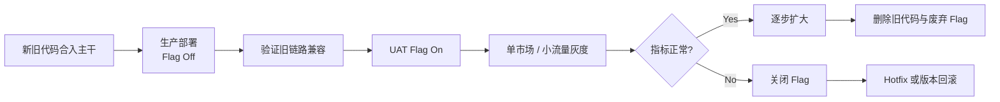

### 速记句

> 先让新代码安全进入生产，再通过开关控制流量；关闭开关是业务回滚，版本回滚是最后兜底。

---

## 14. 新系统写入旧系统不兼容数据时，如何迁移和回滚？

### 推荐回答

重大数据库切换选择当地低流量时段，并开启维护模式，停止新的用户交易。但维护页面只是前端入口控制，服务端还必须真正关闭写入并等待进行中请求完成。

支付 Webhook、消息队列和后台任务需要暂停消费或暂存消息，避免迁移期间继续改变数据。

写入停止后创建数据快照并执行迁移。迁移完成不能只看脚本成功，还要校验订单数量、金额、支付状态和关键字段，并与支付平台对账。暂存事件在新系统启动后通过幂等机制安全重放。

数据模型优先采用 Expand-Contract：

1. 先增加新字段或新表，旧代码可以忽略。
2. 新旧系统在兼容窗口内都能读取。
3. 完成切换并稳定运行。
4. 最后移除旧字段和旧逻辑。

如果新系统已经产生大量新交易，不直接恢复旧快照，否则会丢失发布后的数据。此时应保持兼容并优先向前修复。

### 迁移流程

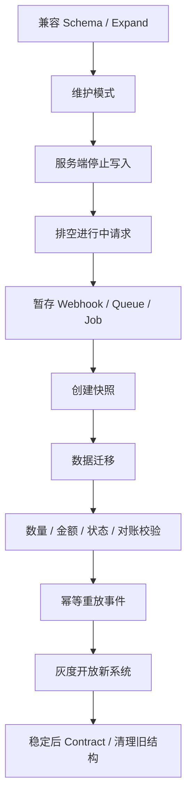

### 速记句

> 维护页面控制用户流量，服务端写保护和事件排空控制数据变化，兼容 Schema 保证能够回退。

---

## 15. 如何排查 React 重复渲染？

### 推荐回答

先区分重复 Render、重复 Commit、重复 Effect 和重复网络请求。组件函数中的 Console 重复打印只说明 Render，不代表 DOM 一定更新，也不代表用户可感知。

开发环境的 Strict Mode 会额外执行 Render、Effect Setup/Cleanup 和 Ref Callback，用来检查组件纯度和副作用清理。可以通过生产构建对比确认是否只发生在开发环境。

但 Strict Mode 暴露的问题不能直接忽略。Effect 重复执行导致重复请求，说明请求可能缺少取消、缓存或幂等保护；组件在生产中重新挂载时仍可能出现。

如果不是 Strict Mode，则检查更新来源：

- 自身 State。
- 父组件 Render。
- Props 引用变化。
- Context 或 Redux Selector。
- `key` 变化导致重新挂载。
- Suspense、Hydration 或路由切换。

最终使用 React DevTools Profiler 查看 Commit 耗时和更新来源，并结合 Long Task、INP 和用户可见变化判断。Render 次数多但成本低，可能完全正常。

### 排查图

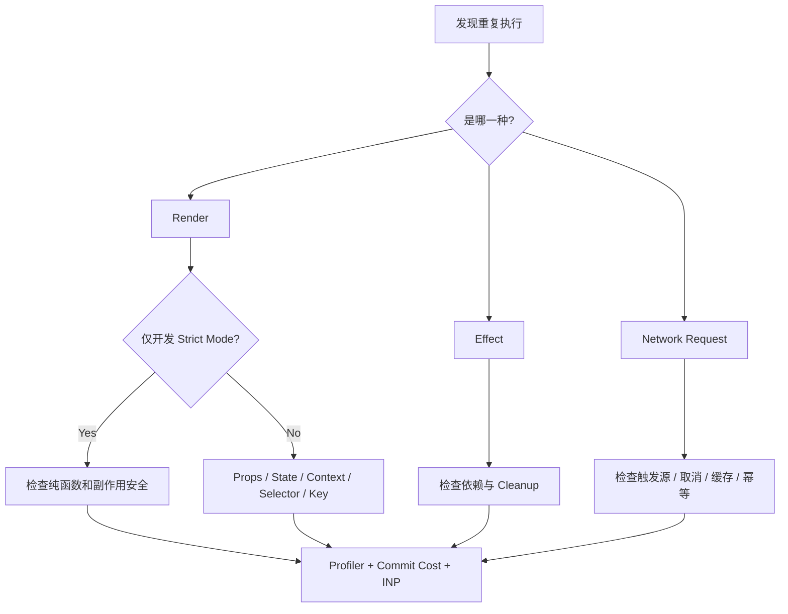

### 速记句

> 先区分 Render、Commit、Effect 和请求，再判断 Strict Mode、更新来源和真实成本。

---

## 16. React.memo、useMemo、useCallback 如何选择？

### 推荐回答

- `React.memo`：组件层优化。当父组件频繁更新、子组件渲染成本较高且 Props 大多数时候不变时，通过浅比较允许 React 跳过重新渲染。
- `useMemo`：缓存计算结果。适合昂贵的数据转换、过滤、排序，或需要保持对象与数组引用稳定的场景。
- `useCallback`：缓存函数引用，不缓存函数执行结果。适合把回调传给 Memo 子组件，或函数作为其他 Hook 依赖的场景。

不能全部默认添加，因为缓存也有依赖比较、内存和理解成本。如果组件渲染很轻，缓存成本可能高于重新渲染；只要一个关键 Prop 每次都是新引用，`React.memo` 也可能失效。错误依赖还会产生 Stale Closure。

使用前先通过 Profiler 确认更新来源和渲染成本。

### 关系图

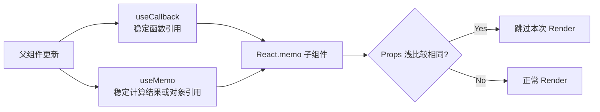

### 速记句

> `React.memo` 跳过组件渲染，`useMemo` 稳定结果，`useCallback` 稳定函数引用；只优化真实热点。

---

## 17. Promise、setTimeout 与页面渲染如何调度？

### 推荐回答

JavaScript 主线程只有一个调用栈。浏览器从 Task Queue 中取出一个任务执行，例如定时器回调、用户事件或消息事件。

当前任务结束后，浏览器进入 Microtask Checkpoint，清空 Promise、`queueMicrotask` 等微任务。微任务执行过程中新增的微任务也会继续执行，直到队列为空。

微任务清空后，浏览器才有机会进行样式计算、Layout 和 Paint，再进入下一轮任务。`requestAnimationFrame` 通常在下一次绘制前执行。

如果代码持续递归创建 Promise 微任务，浏览器会一直清空微任务队列，无法进入下一次渲染，也不能及时处理用户输入和定时器，造成掉帧和卡顿。

`setTimeout` 的延迟只表示最早进入队列的时间，不保证立即执行。网络下载通常不占用主线程，但回调处理、DOM 更新和绘制仍需等待主线程空闲。

### Event Loop

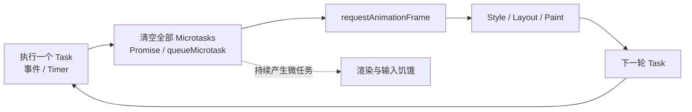

### 速记句

> 每个 Task 后先清空微任务，再获得渲染机会；持续产生微任务会饿死渲染。

---

## 18. TypeScript：any、unknown 和类型断言

> 本轮跳过，但属于需要补齐的基础题。

### 推荐回答

`any` 会关闭类型检查。它可以赋值给任何类型，也可以直接访问任意属性，适合迁移期的临时逃生口，但会把不安全继续传播到下游。

`unknown` 表示当前值的类型未知。任何值都可以赋给它，但在读取属性、调用方法或赋给具体类型前，必须先进行类型收窄，因此更适合 API、第三方数据和 `catch` Error。

类型断言表示“开发者告诉编译器这个值是什么类型”，它不会在运行时验证数据，也不会转换数据。只有当开发者掌握编译器无法推断的信息时才使用，不能把它当成修复类型错误的工具。

API 返回值属于运行时外部输入，仅写 TypeScript Interface 并不安全。推荐先接收为 `unknown`，再通过 Zod、Type Guard 或 Schema 校验后转换为领域类型。

`catch` 中的 Error 也应按 `unknown` 处理：

```ts
try {
  await request();
} catch (error: unknown) {
  if (error instanceof Error) {
    console.error(error.message);
  } else {
    console.error(String(error));
  }
}
```

### 对比表

| 类型 | 编译期安全 | 运行时校验 | 推荐场景 |
| --- | --- | --- | --- |
| `any` | 无 | 无 | Legacy 临时迁移、明确隔离的边界 |
| `unknown` | 有，必须收窄 | 无 | API、第三方数据、Catch Error |
| `as Type` | 由开发者承担 | 无 | 已掌握额外事实且无法自动推断 |
| Schema Parse | 有 | 有 | 外部数据进入业务域的正式边界 |

### 速记句

> `any` 放弃检查，`unknown` 延迟判断，类型断言只影响编译器，外部数据必须做运行时校验。

---

## 19. RSC、SSR、ISR 和 CSR 如何选择？

### 推荐回答

在 Next.js App Router 中先区分两个维度：

1. RSC / Client Component：代码在哪里运行。
2. SSR / ISR：内容什么时候生成以及如何缓存。

RSC 是默认选择，运行在服务端，不把组件 JavaScript 全部发送到浏览器，适合数据获取、内容组合以及需要访问数据库、内部服务和密钥的场景。它可以结合 Suspense 与 Streaming 分区块返回页面。

需要 `useState`、`useEffect`、事件、浏览器 API 或客户端 SDK 时，才设置 Client Component 边界。Client Component 不代表必须在客户端请求所有数据，初始数据仍可由 RSC 获取并通过 Props 传入。

SSR 表示页面在用户请求时动态生成，适合个性化、依赖 Cookie、实时性高或不适合共享缓存的数据。它不仅用于 SEO，代价是增加服务端与上游压力。

ISR 适合 Blog、CMS 落地页和部分分类页。页面先从缓存快速返回，到达 Revalidate 时间或收到 Webhook 后，再按 Tag 或 Path 重新生成。

CSR 适合强交互、浏览器环境和用户停留期间持续刷新的数据。价格、库存等可以由服务端返回初始值，再由客户端 Revalidate，不必把整个页面都变成 CSR。

实际项目通常采用混合方案。

### 决策图

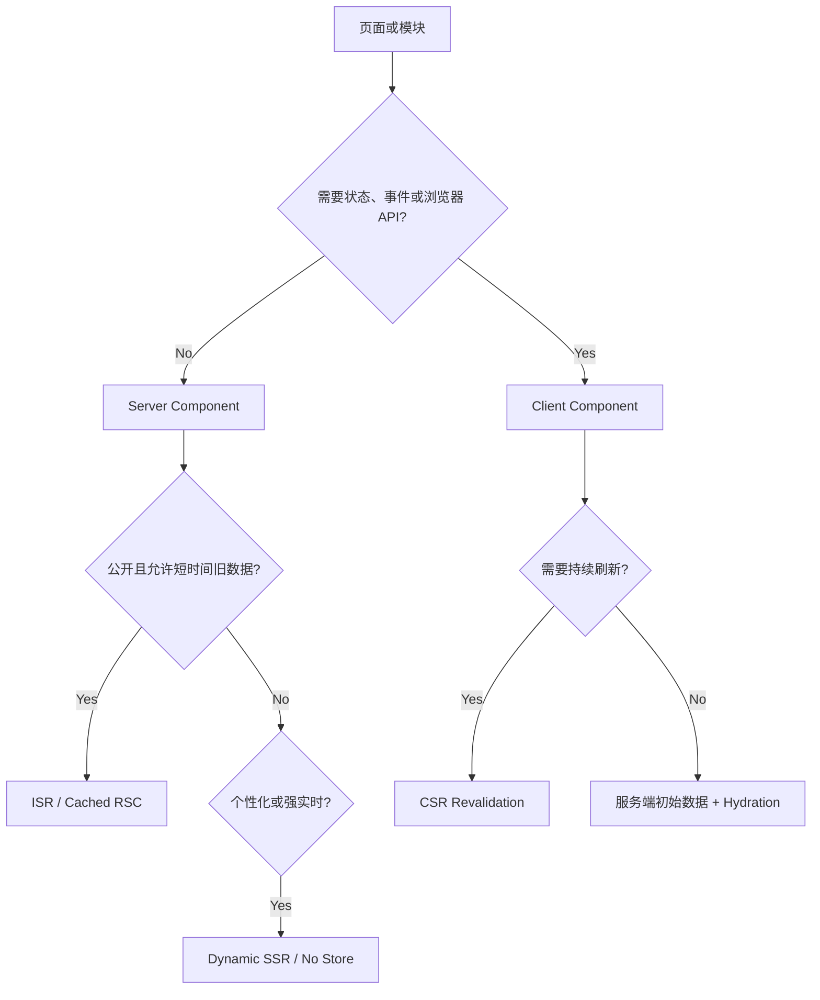

### 速记句

> RSC/Client Component 决定代码在哪里运行，SSR/ISR 决定内容什么时候生成，CSR 负责交互和持续更新。

---

## 20. 待回答：PDP 如何组合多种渲染策略？

### 问题

一个 PDP 同时包含 CMS 内容、商品基础信息、实时价格与库存、用户 Wishlist 状态和评论模块，应该如何组合 RSC、SSR、ISR 和 CSR？

### 推荐回答提纲

- 页面框架、SEO Metadata、稳定 CMS 内容：RSC + ISR，通过 Webhook 按 Tag 失效。
- 商品标题、描述、媒体等公开基础信息：RSC；根据新鲜度使用 ISR 或短 TTL。
- 价格和库存：首屏由服务端获取，避免闪烁；客户端再验证，公共缓存必须包含市场、币种等维度。
- Wishlist：依赖登录态，不进入公共页面缓存；使用动态 RSC 或客户端请求。
- 评论摘要：可以 RSC + 缓存；分页、筛选和提交评论使用 Client Component。
- 推荐、埋点、支付 SDK 等第三方能力：放在尽可能小的 Client Boundary 中，避免扩大 Hydration 范围。
- 用 Suspense 把非关键区块分开，商品主信息优先返回，评论与推荐延后流式加载。

### 页面组合图

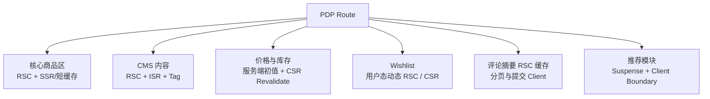

---

## 最终高频速记

1. DDD：业务域横向拆，技术层纵向拆，依赖单向，跨域上提 Composite。
2. Payment：内部 ID、渠道 ID、幂等键和失败补偿各解决不同问题。
3. Sentry：主动入口标准化，`beforeSend` 治理全部错误。
4. Error Bucket：互斥决策树，顺序决定告警归属。
5. Redis ISR：共享一致性；Tag 保证新鲜；LRU 保障可用。
6. Search Cache：已完成响应解决连续重复，Promise 解决并发重复。
7. 性能排查：先切分市场，再看 TTFB、LCP、INP，最后同维度验证。
8. 组件抽象：稳定职责和真实复用优先，不为假想场景提前抽象。
9. Feature Flag：代码先上线、开关后放量，关闭开关优先于版本回滚。
10. React 优化：先找真实成本，再决定 Memo。
11. Event Loop：一个 Task 后清空 Microtask，随后才有渲染机会。
12. Rendering：RSC/Client 决定执行位置，SSR/ISR 决定生成时机。

