# AI 编排测试技术设计文档（专业复核版）

> AI-Orchestrated Testing: From Design to Evidence

| 项目     | 内容                                                                                                     |
| -------- | -------------------------------------------------------------------------------------------------------- |
| 文档版本 | v3.0 - 专业复核版                                                                                        |
| 整理日期 | 2026-08-14                                                                                               |
| 目标读者 | 开发工程师、测试工程师、产品经理、质量平台建设者                                                         |
| 业务范围 | Promotion 模块的跨系统 Agent 测试：ClickUp、Cowbot、Web、POS、测试数据/配置系统                          |
| 主要来源 | Alan《agent 深度分享&探讨会》会议转录；《AI-Orchestrated Testing: From Design to Evidence》15 页会议 PDF |
| 辅助来源 | 既有《AI 编排测试-技术设计文档-详细版》；仅用于查漏，结论均以会议与 PDF 复核                             |
| 不包含   | Joyboy 代码审计、具体前端实现评审、可直接部署的平台代码                                                  |

## 摘要

这套方案不是把传统 UI 自动化简单替换成 LLM，而是把 Agent 放入一个受控的质量工程闭环：

1. 以 ClickUp 中的人工测试用例为原始范围，不直接改写原用例；
2. 用 PRD、UAT 验收标准和业务规则明确“什么是正确结果”；
3. 将业务意图增强为可执行、可观察、可判定的测试流程；
4. 按 Web、POS、Cowbot 三个执行界面路由专用 Skill；
5. 通过 CSV 固化批次，每条用例使用隔离会话执行，单条失败不终止整批；
6. 保存视频、trace、截图、API/订单事实等证据；
7. 对 FAIL/BLOCKED 运行 `test-checker` 二次复盘，先排除 fixture、环境和用例自身问题，再提交 Bug；
8. 将有效经验回流到用例、数据精选清单和知识库，但共享记忆的更新仍由人工批准。

最终效果是把“Agent 说它测过了”提升为“有范围、有执行清单、有事实证据、有复核门禁、有恢复路径”的工程流程。会议展示证明了该方案已经具备可运行原型，但团队化配置、稳定评估、云端身份认证、证据生命周期和全自动自我进化仍是待解决问题。

### 目录

1. [文档依据与复核原则](#1-文档依据与复核原则)
2. [背景、问题与设计目标](#2-背景问题与设计目标)
3. [核心原则：ALIGN、CONTROL、PROVE](#3-核心原则aligncontrolprove)
4. [总体架构](#4-总体架构)
5. [判定权威与四层测试记忆](#5-判定权威与四层测试记忆)
6. [`test-enhance`：从业务意图到可执行测试](#6-test-enhance从业务意图到可执行测试)
7. [`test-module`：批次计划、路由和执行](#7-test-module批次计划路由和执行)
8. [Surface 执行、fixture 与确定性脚本](#8-surface-执行fixture-与确定性脚本)
9. [并发、多 Agent 与模型策略](#9-并发多-agent-与模型策略)
10. [证据模型与结果判定](#10-证据模型与结果判定)
11. [Bug 输出与开发协作](#11-bug-输出与开发协作)
12. [安全、可靠性与运营治理](#12-安全可靠性与运营治理)
13. [学习闭环与评估](#13-学习闭环与评估)
14. [面向开发者的一次完整运行](#14-面向开发者的一次完整运行)
15. [最终效果与验收标准](#15-最终效果与验收标准)
16. [建议路线图](#16-建议路线图)
17. [会议问答整理](#17-会议问答整理)

---

## 1. 文档依据与复核原则

### 1.1 信息来源优先级

本文按以下顺序判断事实：

1. **会议实际讲解与问答**：用于确认真实流程、当前限制和 Alan 的设计取舍；
2. **会议 PDF**：用于确认架构名称、正式原则、流程图和 Unique Checker 案例；
3. **既有总结文档**：只用于查漏，不作为独立事实来源。

由于会议转录存在语音识别错误，本文对术语做了统一处理：

- 用户指定的后台系统名称统一写作 **Cowbot**；PDF 中现有 Skill 标识 `test-cowboy-promotion` 按原名保留；
- 将转录中的 `CAC/CSB` 统一还原为 **CSV**；
- 将 `PID` 结合上下文还原为 **PRD**；
- 将 `jump post/jump house` 统一写作 **Jump House**；
- 将 `curation` 解释为测试数据精选清单；
- 将 `ground fact` 规范为 **ground truth / 判定真值**；
- 将 `pass with COVID` 按语义还原为 **PASS with caveat**。

### 1.2 能力状态标记

为避免把会议中的设想误写为现状，全文采用四种成熟度标记：

| 标记              | 含义                                                          |
| ----------------- | ------------------------------------------------------------- |
| **已展示/已使用** | 会议中展示了运行过程，或 Alan 明确说明已在 CA/US 等测试中使用 |
| **部分实现**      | 已有局部机制，但仍依赖人工、存在明显缺口或尚未固化为团队规范  |
| **讨论方案**      | 会上提出并认可方向，但没有证据表明已经落地                    |
| **开放问题**      | Alan 明确表示没有成熟答案，或需要额外平台、IT/安全与评估能力  |

### 1.3 对既有总结的主要修正

- 本文不引用或推断 Joyboy 代码；会议提到的“源码”仅作为 Agent 构建执行地图的一类上下文，不代表本次已完成源码核验。
- Web、POS、Cowbot 是三个被测 surface；其中 Cowbot 是用户给定的系统名称，`test-cowboy-promotion` 只是 PDF 中的历史 Skill 名。
- CSV、Skill、checker、证据目录等属于已展示的运行原型；Key Vault、云端运行、按 surface 分配 sub-agent、周期性回归与 `test-evo` 全自动闭环仍是讨论方向。
- “首轮约 40% BLOCKED”“US 比 CA 阻塞率下降”等来自 Alan 的经验性描述，不是受控基准测试，不能直接作为平台 SLA。
- 会议没有给出正式的数据表结构、API 契约、权限模型或证据保留周期。本文提出的目标字段与治理规则会明确标注为“建议固化”，不冒充现状。

### 1.4 来源追踪索引

| 主题                              | PDF     | 会议转录                             |
| --------------------------------- | ------- | ------------------------------------ |
| Skill Family                      | P2      | 00:01:07-00:04:02                    |
| Scope、Route、Confirm             | P3      | 00:04:13-00:05:05；00:08:34-00:09:17 |
| CSV 循环与故障隔离                | P4      | 00:14:50-00:16:20；01:03:41-01:08:26 |
| 四层测试记忆                      | P5      | 00:05:57-00:08:26；01:20:06-01:26:09 |
| 证据、判定与学习闭环              | P6      | 00:19:53-00:22:10                    |
| Unique Checker 三 Flow            | P7-P10  | 00:09:20-00:19:37                    |
| 运营风险                          | P12     | 00:44:04-01:26:09 的问答补充         |
| ALIGN、CONTROL、PROVE             | P13     | 00:21:50-00:22:10                    |
| `test-enhance` 五步与 Oracle 权威 | P14-P15 | 00:22:10-00:25:36                    |
| 多 Agent、模型、团队化与评估      | -       | 00:26:19-01:01:02                    |

---

## 2. 背景、问题与设计目标

### 2.1 业务背景

公司测试人员已经在 ClickUp 中维护 Promotion 测试用例。外包测试人员 Alan 的工作不是重新编写整套测试，而是让 Agent 根据这些用例完成跨系统验证。单个测试可能同时涉及：

- ClickUp：测试范围、父/子用例、结果与 Bug；
- Cowbot：Promotion 配置、Coupon、订单详情或配置状态核验；
- Web：消费者商城下单与优惠应用；
- POS：门店订单与促销行为；
- Jump House 或其他脚本/API：创建 Promotion、Coupon、用户及测试前置数据；
- VPN、Microsoft SSO、测试账号与浏览器会话；
- 视频、trace、截图、网络请求、订单记录等证据。

因此，核心难点不是“让模型点击页面”，而是如何在多个系统、动态数据和不稳定测试环境中，仍然得到可复核的结论。

### 2.2 原始用例的结构性不足

ClickUp 中的人工用例通常能表达业务意图，但不一定能直接被 Agent 稳定执行。会议把问题归纳为三类：

1. **前置条件不完整**：例如“用户已经使用过该 Coupon”没有说明如何构造、何时算已消费；
2. **操作不够具体**：没有定位到真实界面、控件、接口、身份和状态；
3. **预期不可观察**：只写“应报错”，没有定义用哪些事实证明发生了正确拒绝。

直接执行会产生四种典型风险：

- Agent 根据过期文案机械判 FAIL，形成假阳性；
- 创建出来的 Promotion 与请求参数不一致，导致无效 fixture 被误判为产品缺陷；
- 长链路上下文串扰或压缩，Agent 忘记前置身份和关键状态；
- 只有 Agent 自述，没有足够证据证明实际完成了对应操作。

### 2.3 设计目标

| 目标         | 说明                                             | 预期效果                                     |
| ------------ | ------------------------------------------------ | -------------------------------------------- |
| 范围可审阅   | 执行前明确本批用例、市场和 surface               | 人能在高成本运行前发现错用例、错市场、错路由 |
| 判定有权威   | PRD/UAT 定义 PASS/FAIL，源码或 UI 只定义如何执行 | 避免“当前实现覆盖需求”的循环论证             |
| 执行可隔离   | 每条用例独立会话、独立运行目录                   | 降低跨用例状态污染和上下文污染               |
| 故障可包含   | 单行失败不停止整批，支持只重跑失败项             | 环境噪音不再摧毁整批结果                     |
| 结论可证明   | UI、API、订单、视频、trace 共同支撑              | 开发可复现，checker 可复盘                   |
| 知识可演进   | checker 反馈用例、数据和规则问题                 | 多轮运行后用例逐步稳定                       |
| 人工边界明确 | 高风险判定、共享记忆、Bug 提交保留门禁           | 防止 Agent 自动放大错误规则                  |

### 2.4 非目标

- 不以本方案替代产品验收标准或测试人员的最终责任；
- 不承诺所有 Promotion 用例都能无人值守执行；
- 不在现阶段追求大规模并发；
- 不把 Agent 的自然语言解释视为事实证据；
- 不把群聊中的临时决定自动写入共享规则；
- 不声明 `test-evo` 已能安全地全自动修改测试资产。

---

## 3. 核心原则：ALIGN、CONTROL、PROVE

会议 PDF 将整体模型概括为三个词：

| 原则               | 工程含义                                            | 主要机制                                                               |
| ------------------ | --------------------------------------------------- | ---------------------------------------------------------------------- |
| **ALIGN / 对齐**   | 让 Agent 理解本次测试范围和正确结果                 | 原始父用例、PRD、UAT、业务规则、`test-enhance`                         |
| **CONTROL / 管控** | 把 Agent 的自由探索限制在可审阅、可恢复的执行单元内 | surface 路由、CSV 批次、每行独立 session、preflight、超时和 checkpoint |
| **PROVE / 取证**   | 用实际事实证明结论，而非接受 Agent 的叙述           | 视频、trace、截图、API/订单证据、`test-checker`                        |

这三项原则可进一步表达为：

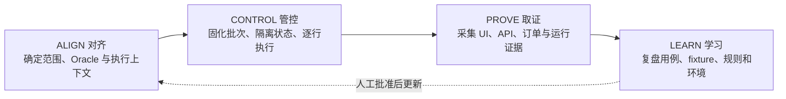

核心思想不是消灭 Agent 的不确定性，而是让不确定性在系统内可见、可定位、可复核、可回滚。

---

## 4. 总体架构

### 4.1 三类 Skill Family

PDF 将 Skill 分为三类：

| Skill Family  | Skill                       | 职责                                           | 成熟度                      |
| ------------- | --------------------------- | ---------------------------------------------- | --------------------------- |
| RUN / 执行    | `test-storefront-promotion` | 在 Web 执行 Promotion 用例                     | 已展示/已使用               |
| RUN / 执行    | `test-pos-promotion`        | 在 POS 执行 Promotion 用例                     | 已展示/已使用               |
| RUN / 执行    | `test-cowboy-promotion`     | 在 Cowbot 执行 Promotion 配置或后台核验        | 已展示/已使用；名称沿用 PDF |
| ASSURE / 保障 | `test-module`               | 选择用例、路由 surface、生成 CSV、组织批次执行 | 已展示/已使用               |
| ASSURE / 保障 | `test-enhance`              | 把业务意图增强为可执行用例                     | 已展示/已使用               |
| ASSURE / 保障 | `test-checker`              | 对 FAIL/BLOCKED 做二次复盘和假阳性甄别         | 已展示/已使用               |
| LEARN / 学习  | `test-prd-update`           | PRD 大变更后刷新中央规则                       | 部分实现                    |
| LEARN / 学习  | `test-curation-refresh`     | 维护特殊商品、活动和前置数据清单               | 部分实现                    |
| LEARN / 学习  | `test-evo`                  | 从历史结果中自动优化 Skill/用例                | 实验中，评估机制未解决      |

### 4.2 逻辑分层

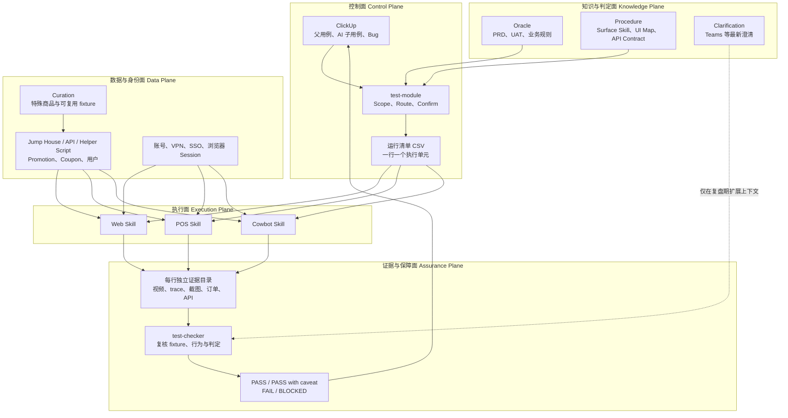

### 4.3 关键边界

- **ClickUp 定义测试范围，不直接定义所有执行细节**；
- **PRD/UAT 定义正确结果，源码/UI/API 仅帮助找到执行路径和证据点**；
- **Jump House/API 返回“成功”不等于 fixture 一定正确**；
- **每个 surface 有自己的导航和 harness，不应假定一个通用 UI Agent 能稳定覆盖全部系统**；
- **复盘可以读取更宽、更实时的上下文，但不能自动污染执行期共享记忆**。

---

## 5. 判定权威与四层测试记忆

### 5.1 Oracle 权威层级

PDF 明确给出不同上下文的职责：

| 优先级 | 上下文                        | 决定什么                               | 不允许做什么                         |
| ------ | ----------------------------- | -------------------------------------- | ------------------------------------ |
| 1      | PRD + UAT acceptance criteria | 产品应当如何表现；PASS/FAIL 的最高权威 | 不得被当前实现静默覆盖               |
| 2      | 原始父用例                    | 本次测试的场景、触发条件与业务断言     | 增强过程不得改变测试范围             |
| 3      | 源码、UI Map、API Contract    | 如何找到控件、请求、状态和证据点       | 不得反向定义“当前行为就是正确行为”   |
| 4      | 市场、账号、fixture、session  | 是否具备触达 Oracle 的条件             | 就绪不足时不得修改预期，应判 BLOCKED |

判定底线是：

> 在 fixture 已验证有效的前提下，如果实际行为与 PRD/UAT 冲突，则结果为 FAIL。

### 5.2 四层测试记忆

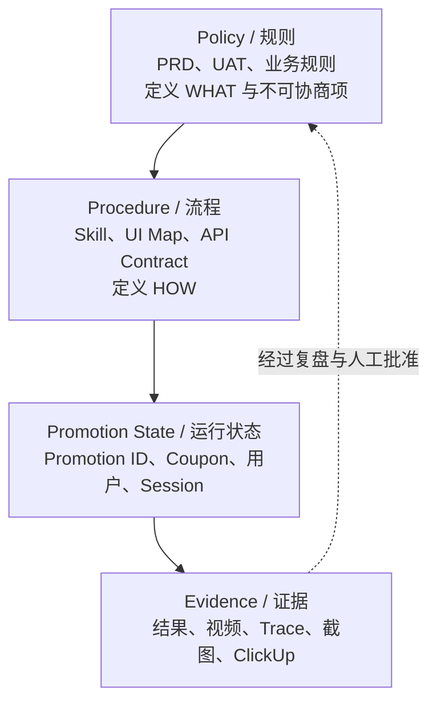

| 层              | 内容                                    | 生命周期                  | 典型风险                   |
| --------------- | --------------------------------------- | ------------------------- | -------------------------- |
| Policy          | PRD、UAT、业务规则                      | 跨批次共享、需版本治理    | 过期规则导致 runtime drift |
| Procedure       | Web/POS/Cowbot 的执行路径和脚本         | 随界面与接口变化更新      | UI Map 漂移、定位失效      |
| Promotion State | 当前用例真实生成的 ID、Code、用户和会话 | 单批次或单用例            | 状态串扰、脏数据           |
| Evidence        | 视频、trace、截图、请求、订单、结果     | 长期保存并供 checker 使用 | 归档无限增长、敏感数据泄露 |

### 5.3 为什么不把 RAG 作为判定路径

Alan 说明当前设计没有用 RAG 来匹配业务规则，原因是 Promotion 测试需要精确命中具体规则；模糊语义匹配容易把相近但不同的限制混在一起，进而产生错误 Oracle。

因此当前策略是结构化、分层和精确读取。若未来引入语义检索，建议只用于“发现候选资料”，最终进入 PASS/FAIL 判定前必须解析到有版本、有标识的 PRD/UAT 条款。这一条是本文的工程固化建议，不代表会议已实现。

### 5.4 执行期信任，复盘期怀疑

为了吞吐，执行阶段采用乐观假设：

- 当前加载的 PRD/UAT 和 curation 是最新的；
- Jump House/API 生成的 fixture 基本可信；
- session 和账号处于可用状态。

只要用例 FAIL 或 BLOCKED，checker 就推翻这些假设：

- PRD 是否没有更新；
- Teams 是否有更新的 clarification；
- curation 是否选错商品；
- API 参数是否与 Cowbot 实际配置一致；
- UI 是否只展示了旧错误或残留状态。

这样避免对每一条 PASS 用例都执行高成本的跨系统二次核验，同时把较昂贵的验证集中到异常样本。

### 5.5 共享记忆的人工门禁

复盘发现的新信息不会直接写入 centralized memory。原因是聊天中可能包含：

- 暂时接受但以后仍需修复的问题；
- 尚未做出决定的 edge case；
- 只适用于某市场、某迭代或某次运行的例外；
- 会议噪音和非正式意见。

推荐的治理模型是：

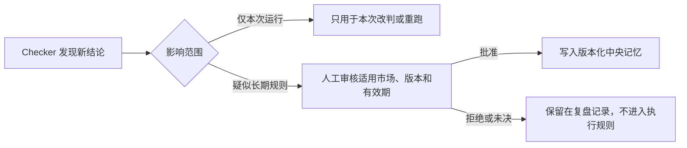

---

## 6. `test-enhance`：从业务意图到可执行测试

### 6.1 输入与产物

**输入**：原始 ClickUp 父用例、模块层级、PRD/UAT、业务规则、surface 执行资料、市场/账号/fixture 上下文。

**产物**：挂在父用例下的 AI 增强子用例。父用例继续保留原文和原始范围，子用例补充：

- 明确的前置状态；
- 可解析的操作步骤；
- 身份、数据和 surface；
- 可观测证据点；
- PASS/FAIL/BLOCKED 判定规则；
- 必要的基线、目标与对照 flow。

### 6.2 五步增强流水线

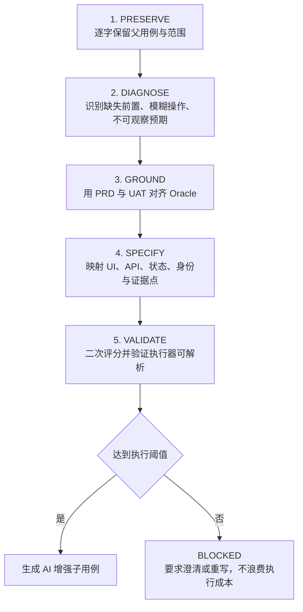

设计原因：

- **先保留再增强**：增强用例可能经过三到四轮修改；保留父用例才能安全回滚并追踪范围变化；
- **先诊断再补写**：防止 Agent 无限制扩展原始测试意图；
- **Oracle 与执行地图分离**：PRD/UAT 说“应该怎样”，实现资料说“如何测到”；
- **低置信度直接 BLOCKED**：过期、越界或互相矛盾的用例不值得消耗浏览器和模型成本。

### 6.3 Score 1、Score 2 与局限

- **Score 1**：增强前后检查是否包含前置条件、明确动作和可观察断言；
- **Score 2**：检查增强结果是否足够具体，执行器能否解析；低于阈值不执行；
- **运行期 harness**：进一步检查 Promotion/Coupon/fixture 是否可用。

Alan 明确指出，当前评分主要基于 BDD 格式和字段完整性启发式规则。在复杂业务下，“格式完整”不等于“测试设计正确”。因此这些分数只能作为 readiness gate，不能替代 UAT 真值或真实执行证据。

### 6.4 为什么 enhance 按模块批处理

当前做法是：整个模块先在同一分析会话中增强，再批量执行，最后批量 checker。原因是：

- 同模块用例共享业务规则和数据模式，可以互相补充；
- US、CA 等市场差异可以在同一上下文中比较；
- 如果每条用例在增强阶段完全隔离，会丢失跨用例一致性；
- 真正必须隔离的是执行期状态，而不是所有分析活动。

这不等于允许不同用例在执行时共享状态。分析期共享上下文，执行期保持隔离，是会议中较明确的设计取舍。

### 6.5 Unique Checker 案例

原始用例只表达：身份已经使用过 Coupon，再次应用应被拒绝。增强后形成三个受控 flow：

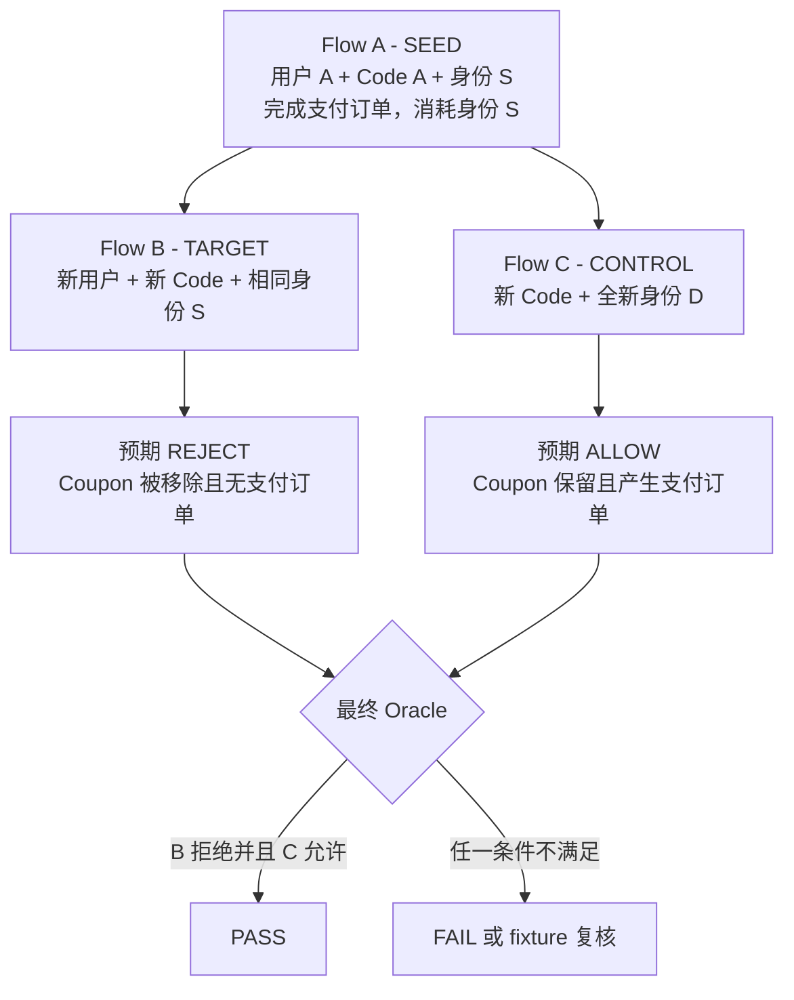

三条 flow 的意义：

| Flow        | 控制变量                        | 证明什么                                                  |
| ----------- | ------------------------------- | --------------------------------------------------------- |
| A - SEED    | 确定性完成订单                  | “已使用”前置条件真实成立，并定位使用次数的消耗时点        |
| B - TARGET  | 换用户和 Code，仅复用目标身份 S | 拒绝来自 Unique Checker，而非单纯重复使用同一个 Code      |
| C - CONTROL | 身份属性全部换成 D              | 系统不是无差别拒绝；若仍被拒，说明 fixture 无效或规则过宽 |

必要证据包括：Coupon apply 请求、地址验证请求、订单创建请求、手机号/地址/ZIP payload、usage counter、拒绝状态、旧错误是否清理，以及 A/C 有订单而 B 无订单的持久化事实。

---

## 7. `test-module`：批次计划、路由和执行

### 7.1 Scope、Route、Confirm

执行不是立即开始，而是先生成可审阅计划：

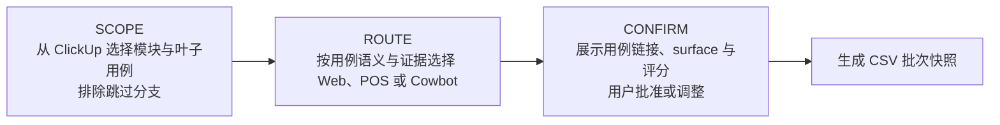

同一用例可能能在 Web 和 POS 执行。路由器提供默认 surface，但人可以强制指定。执行前确认的价值在于：运行通常是长时间、批量、低交互的，一旦开始后再发现路由错误，浪费的不只是模型成本，还包括 fixture 和环境状态。

### 7.2 当前 CSV 契约

会议展示的 CSV 每行是一条用例，包含：

| 列               | 含义                              |
| ---------------- | --------------------------------- |
| `case_id`        | ClickUp 测试用例 ID               |
| `skill_name`     | 本行使用的 surface Skill          |
| `market`         | US、CA 等市场                     |
| `special_prompt` | 可选特殊提示，Alan 表示通常不使用 |

CSV 的作用不是存储全部测试步骤，而是把“这一批要执行哪些用例、由哪个执行器、在哪个市场运行”固化成可恢复清单。

### 7.3 建议固化为正式 Run Manifest

当前四列足以完成原型，但团队化后容易出现用例 ID 映射错误、重跑关系不清、规则版本不可追踪。建议将 CSV 或其旁路 manifest 扩展为以下契约。该表是本文建议，不代表会议已实现：

| 字段                                         | 用途                                       |
| -------------------------------------------- | ------------------------------------------ |
| `batch_id` / `row_id`                        | 唯一标识批次和执行单元                     |
| `source_case_id` / `enhanced_case_id`        | 显式绑定父用例与 AI 子用例，防止执行错任务 |
| `case_version` / `oracle_version`            | 记录执行时使用的用例、PRD/UAT 版本         |
| `market` / `surface` / `skill_version`       | 明确运行边界                               |
| `fixture_ref` / `account_ref`                | 只存引用，不存密钥；支持复盘               |
| `status` / `retry_of` / `attempt`            | 支持断点恢复和只重跑异常项                 |
| `evidence_dir`                               | 将结果与实际证据目录绑定                   |
| `created_by` / `approved_by` / `approved_at` | 保存人工确认链路                           |

### 7.4 Preflight

每个批次执行前应完成：

1. 打开本批涉及的 Web、POS、Cowbot surface；
2. 验证 VPN、Microsoft SSO 和浏览器 session；
3. 需要时由人完成首次登录或过期重新认证；
4. 检查市场、账号和基础 fixture 是否可用；
5. 锁定本批的运行清单与规则版本。

当前 session 在批次内可复用，从而避免每条用例重复登录。但复用的是认证上下文，不应复用可能污染断言的购物车、Promotion 使用次数或用户业务状态。

### 7.5 逐行循环与故障隔离

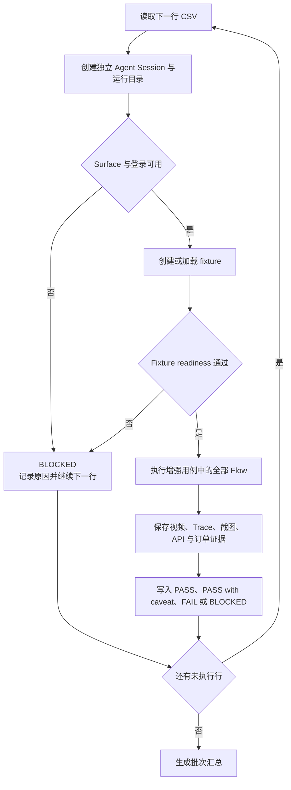

运行纪律是：**单行 FAIL 或 BLOCKED 不终止整批**。这项设计优先保护批次吞吐和可恢复性，因为测试环境中的单点噪音很常见。

### 7.6 重跑与恢复

批次完成后可以用自然语言要求：

- 只重跑 BLOCKED；
- 复盘指定 FAIL；
- 不重跑已经 PASS 的用例；
- 生成新一版 CSV，并建立与原行的 retry 关系。

当前实现通过新 CSV 完成恢复。建议未来基于显式 checkpoint 生成差量清单，避免只依赖会话理解“哪些行已完成”。

### 7.7 人机交互边界

典型交互发生在三个时点：

1. **批次前**：确认范围、surface、市场和必要登录；
2. **批次中**：通常无需持续对话；只有认证过期或无法自动处理的环境状态才介入；
3. **批次后**：查看汇总，要求 checker 解释 FAIL/BLOCKED，确认 Bug 或重跑。

Alan 的类比是：这更像把一个模块交给测试人员，等他完成后再追问异常，而不是在每一步远程指挥。

---

## 8. Surface 执行、fixture 与确定性脚本

### 8.1 三个 Surface 的差异

| Surface | 主要用途                            | 特殊依赖                     | 设计要求                            |
| ------- | ----------------------------------- | ---------------------------- | ----------------------------------- |
| Web     | 商城 Coupon、购物车、Checkout、订单 | 浏览器状态、商品和地址       | 关注 UI 与网络请求的一致性          |
| POS     | 门店端 Promotion 与订单             | POS 账号、门店上下文         | 独立 UI Map 和业务路径              |
| Cowbot  | 后台 Promotion 配置、订单/分配核验  | VPN、Microsoft SSO、内部权限 | 不应让所有 Web 用例都依赖 Cowbot UI |

三个 Skill 都经过 surface 定制。会议不支持“一个通用浏览器提示词覆盖所有系统”的结论。

### 8.2 Fixture 与 Data Seeding

Promotion 测试依赖动态状态，包括：

- Promotion/Coupon；
- 新用户或特定身份；
- 已经使用过的手机号、地址、ZIP；
- multi-shipment 商品；
- 特定 SPU/SKU 组合；
- 可以完成订单的市场和账号。

优先级建议为：

1. **API/脚本直接 seed**：速度快、可重复、较少依赖 UI；
2. **curation 缓存**：对难以动态发现的特殊商品，提前人工筛选并复用；
3. **运行期 UI 搜索**：只作为缺少 API/脚本时的兜底。

会议特别强调应避免不必要的跨 surface UI 依赖。例如为了测试 Web，每次都先登录 Cowbot 查商品，会让 Cowbot SSO 成为所有 Web 用例的单点阻塞。

### 8.3 Runtime Harness

在真正执行长链路前，运行期 harness 应至少检查：

- Promotion/Coupon 是否创建成功；
- 市场与适用条件是否匹配；
- 测试商品是否可购买、可加车；
- 测试账号是否可用；
- 必要 session 是否仍有效。

预检失败时返回 BLOCKED，不继续消耗 token 和浏览器时间。但会议也暴露出一个限制：仅信任 API 返回仍可能得到错误 fixture，因此异常用例还需要 checker 的反向验证。

### 8.4 Helper JavaScript

对于高确定性、敏感或模型容易失误的动作，Skill 使用固定脚本执行，模型只负责识别何时调用：

- Stripe 测试卡输入；
- 复杂抽屉或嵌套 UI 的确定性点击；
- Promotion/用户创建；
- 可能的 API 取证和数据清理。

这解决两类问题：

- 避免模型直接接触敏感值或因安全策略拒绝填写；
- 降低低成本模型在复杂 UI 中点错元素的概率。

代价是脚本与 UI/接口强绑定，必须有版本、失败日志和维护责任人。

---

## 9. 并发、多 Agent 与模型策略

### 9.1 当前策略

- 每条 CSV 行是独立 Agent session；
- 逻辑上可以并行；
- Promotion 用例当前倾向串行或小并发；
- enhance、execute、checker 按模块分为三个阶段，而不是每条用例内部固定编排三个 sub-agent。

### 9.2 为什么不直接大并发

Promotion 测试的并发限制主要来自环境，而不是 Agent 平台：

- 多用例可能共享用户、购物车、Coupon 用量和 Promotion 状态；
- 某些前置用户不能随意动态创建；
- 测试环境数据不完整，随机商品可能污染会话；
- 同时创建大量数据会放大噪音，且依赖关系难以自动分析。

纯 UI、无共享数据依赖的用例更适合并行。Promotion 用例只有在明确资源锁、身份池和数据清理策略后，才适合扩大并发。

### 9.3 会上讨论的两种多 Agent 方案

| 方案                                                   | 优点                                 | 风险                         | 状态               |
| ------------------------------------------------------ | ------------------------------------ | ---------------------------- | ------------------ |
| 每条用例：澄清 Agent -> 执行 Agent -> Review Agent     | 每个上下文更小、职责更纯             | 丢失跨用例学习，编排开销增大 | Chris 提议，未落地 |
| 按批次：整模块 Enhance -> 每行隔离执行 -> 整批 Checker | 保留跨用例规则，执行仍隔离，效率更高 | checker 需正确关联每行证据   | Alan 当前做法      |

按 surface 分配 sub-agent 是另一个候选，但许多用例会从 Web/POS 跳到 Cowbot 做后台核验，因此边界并不总是干净。

### 9.4 模型分层与降本

会议建议编排与模型解耦：

- Enhance/复杂复盘使用更强模型；
- 稳定、确定的浏览器执行使用成本较低的模型；
- 低成本模型的不足由更明确的 Skill、helper script 和更小上下文补偿。

这是经验性策略，不应把具体模型版本差异写成长期结论。模型能力会变化，应该用团队自己的回归基准决定模型，而不是永久绑定分享当天的版本判断。

---

## 10. 证据模型与结果判定

### 10.1 证据不是 Agent 自述

建议将证据按强度分层：

| 层级 | 证据                                          | 用途                                     |
| ---- | --------------------------------------------- | ---------------------------------------- |
| A    | 订单、usage counter、持久化配置、API/日志事实 | 证明业务状态真实发生                     |
| B    | 网络 trace、请求/响应、页面状态和截图         | 证明操作路径和即时反馈                   |
| C    | 视频                                          | 还原执行时序，发现点错、旧状态和环境异常 |
| D    | Agent 摘要                                    | 帮助阅读，不得单独支持 PASS/FAIL         |

该分层是基于会议问题整理出的工程建议。尤其当 Agent 结论与 API/日志不一致时，应以可复现事实为准，Agent 文本只作为调查线索。

### 10.2 四种结果

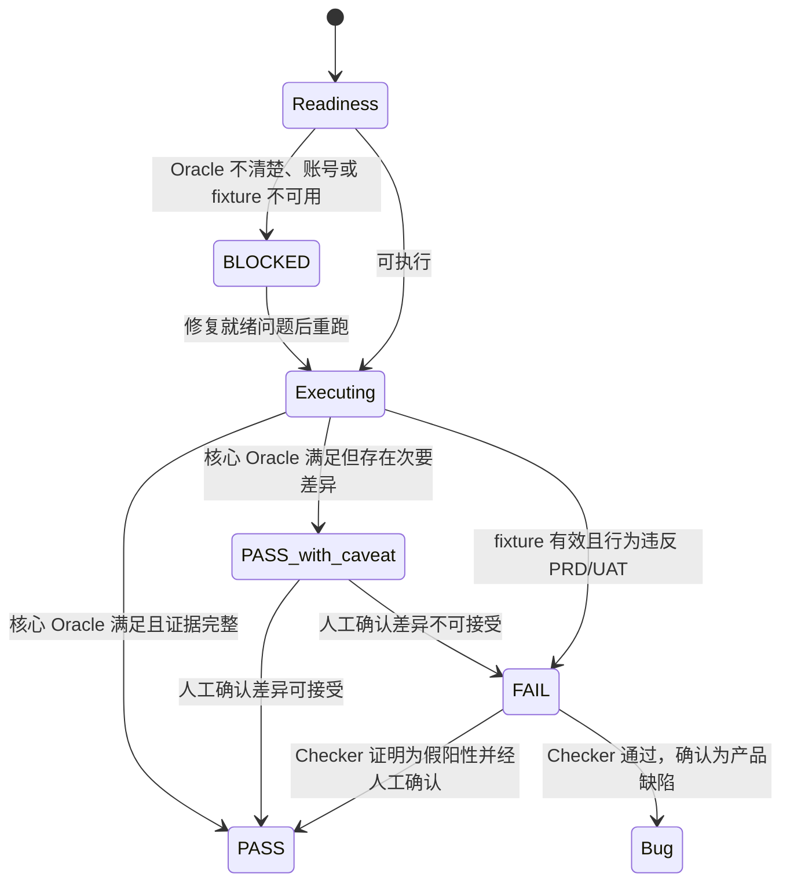

| 状态             | 语义                               | 禁止事项                   |
| ---------------- | ---------------------------------- | -------------------------- |
| PASS             | 核心 Oracle 满足且证据充分         | 不能只依据 Agent 口述      |
| PASS with caveat | 主流程通过，存在可讨论的非关键差异 | 必须列出 caveat 并由人确认 |
| FAIL             | 前置有效，真实行为与 PRD/UAT 冲突  | 提 Bug 前需通过 checker    |
| BLOCKED          | 无法可靠触达或判断 Oracle          | 不得为了“跑通”而改写预期   |

### 10.3 `test-checker` 复盘流程

`test-checker` 的输入是异常用例及其独立证据目录。它需要区分：

1. **环境问题**：VPN/SSO 过期、浏览器中断、测试系统不稳定；
2. **fixture 问题**：Promotion 参数与实际配置不同，商品/用户状态不正确；
3. **用例问题**：旧市场用例、过期文案、缺失 flow、错误范围；
4. **产品缺陷**：fixture 有效且行为违反 Oracle；
5. **假阳性**：Agent 点错、看错、沿用旧状态或把可协商差异当失败。

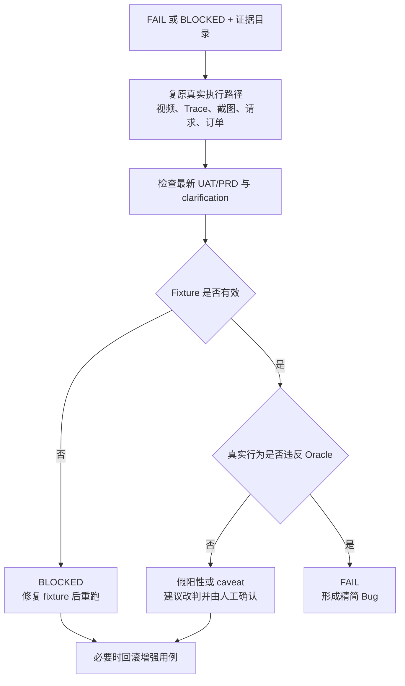

### 10.4 API 与 Cowbot 实际状态不一致

会议确认 Jump House/API 可能返回成功，但 Cowbot 中实际配置与传参不一致。当前设计为了效率，不对每次 fixture 创建都做 Cowbot UI 全量验证；只有异常时再复核。

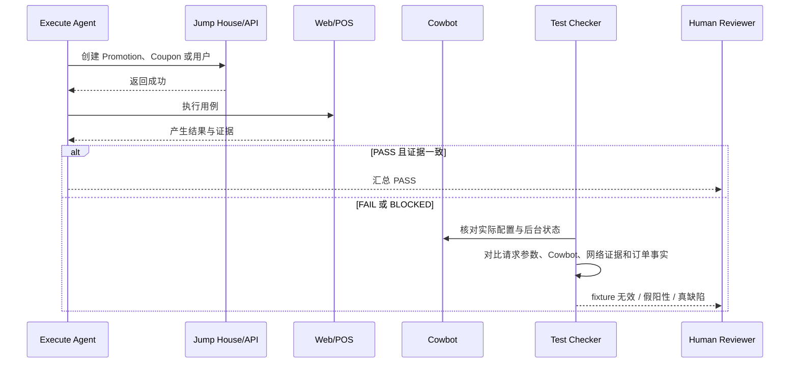

这是性能与可信度之间的风险分层：正常样本走快速路径，异常样本走昂贵复核路径。若某类 API 的偏差率升高，应把它提升为强制 preflight，而不是继续只在失败后核对。

### 10.5 Evidence Manifest 建议

为了让开发和 checker 不依赖文件名猜测，建议每行生成一个机器可读 manifest。以下为目标设计，不代表当前已实现：

| 字段                                               | 内容                                    |
| -------------------------------------------------- | --------------------------------------- |
| `batch_id`、`row_id`、`attempt`                    | 运行关联                                |
| `case_id`、`enhanced_case_id`、`market`、`surface` | 测试身份                                |
| `oracle_refs`                                      | 本次使用的 PRD/UAT 条款与版本           |
| `fixture_refs`                                     | Promotion/Coupon/用户引用及创建参数摘要 |
| `actions`                                          | 结构化步骤、开始/结束时间、实际结果     |
| `network_artifacts`                                | trace、关键 request/response 路径       |
| `business_artifacts`                               | 订单号、usage counter、后台配置截图     |
| `verdict`、`reason_code`、`caveats`                | 统一结果与原因分类                      |
| `checker_verdict`、`reviewed_by`                   | 二次复核与人工门禁                      |

---

## 11. Bug 输出与开发协作

### 11.1 会议暴露的问题

Agent 生成的 Bug 容易把探索过程、思考、证据和最终结论全部写在正文中，导致开发很难快速定位问题。这个问题不是“信息不足”，而是不同读者的信息需求没有分层。

### 11.2 建议的双层输出

**开发可见的主 Bug**：

- 简短标题；
- 市场、surface、环境；
- 最小复现步骤；
- 预期结果与实际结果；
- 核心证据链接；
- 订单号、Promotion/Coupon 标识；
- checker 结论；
- 影响范围与严重度。

**Agent/QA 复盘附件或子任务**：

- 完整视频和 trace；
- 所有探索路径；
- fixture 创建参数与复核过程；
- 被排除的假设；
- 长篇分析与历史尝试。

Alan 认可把复杂分析放到子用例/子 Bug、主 Bug 只保留重点的方向，但会议没有证明这一规范已全面落地。

### 11.3 Bug 提交门禁

1. 本行结果为 FAIL；
2. checker 已检查 fixture、环境和用例质量；
3. 有至少一项业务事实证据，而非只有 UI 文案；
4. 人工查看关键证据并确认；
5. 主 Bug 已按开发阅读需要压缩；
6. 完整证据仍可通过附件或子任务追踪。

---

## 12. 安全、可靠性与运营治理

### 12.1 凭据与敏感数据

当前实践：

- 凭据保存在未入库的 `.env`；
- 首次使用时由 Skill 提示用户在 terminal 运行初始化脚本并逐项输入；
- 模型只触发 helper script，不应读取明文密码或支付数据；
- 登录首次建立或 session 过期时仍需人介入。

团队化目标：

- 迁移到集中式 Secret Manager/Key Vault；
- 通过引用和短期 token 注入执行环境；
- 对不同市场、surface 和角色做最小权限；
- 记录密钥使用审计，不把 secret 写入视频、trace、日志或 Bug。

Key Vault 属于讨论方案，当前不能当作已完成能力。

### 12.2 测试环境噪音

会议列出的典型噪音包括：

- VPN/SSO 过期；
- 问题商品进入购物车后无法清除，污染后续用例；
- 测试环境从生产同步的数据缺失；
- Promotion 残留或用量未清理；
- 客户端升级、电脑断电或浏览器中断，留下半完成状态；
- 依赖系统故障导致 UI/API 行为异常。

现有主要缓解是隔离运行目录、单行失败不停批、批后 checker 与人工介入。尚未看到自动清理、资源租约、幂等 fixture 或环境健康度平台的完整实现。

### 12.3 建议的可靠性控制

| 控制                                   | 目的                     | 状态               |
| -------------------------------------- | ------------------------ | ------------------ |
| 每行唯一用户/购物车/Promotion 命名空间 | 降低并发和残留污染       | 建议固化           |
| Fixture 创建幂等键                     | 避免重试重复创建         | 建议固化           |
| 前后置清理与清理结果证据               | 避免半完成状态进入下一轮 | 开放问题           |
| Surface 健康检查                       | 批次前识别系统不可用     | 建议固化           |
| 明确超时与 reason code                 | 区分业务拒绝和技术超时   | 部分实现，需规范化 |
| 失败不终止批次                         | 提高吞吐和恢复能力       | 已展示/已使用      |
| 异常样本二次 checker                   | 降低假阳性               | 已展示/已使用      |

### 12.4 证据生命周期

PDF 将 archive growth 列为剩余运营风险。视频和 trace 长期累积后会产生存储、检索、隐私和合规问题。建议制定：

- PASS 证据短期保留；
- FAIL/BLOCKED 和已提交 Bug 的证据延长保留；
- 按 batch/case/attempt 建索引；
- 对账号、地址、支付和 token 做脱敏；
- Bug 关闭后按规则归档或删除；
- 记录证据哈希和删除审计。

会议没有给出具体保留天数，应由 QA、开发、安全与合规共同决定。

### 12.5 云端执行

云端执行的潜在收益是共享配置、长期任务和更稳定的运行资源；会上讨论了云端 Agent 环境、环境变量和初始化脚本。但存在三个未解决条件：

1. 云端是否可以访问 VPN/内网；
2. Microsoft SSO 如何完成首次认证和定期刷新；
3. 如何实时观察浏览器执行和人工接管。

在身份与网络方案确认前，云端运行仍是探索项，不能直接替代本地可见执行。

---

## 13. 学习闭环与评估

### 13.1 三类学习

- `test-prd-update`：把正式 PRD/UAT 变化同步到中央规则；
- `test-curation-refresh`：更新特殊商品、活动和可复用 fixture；
- `test-evo`：从结果中自动修改用例或 Skill。

前两类是内容刷新问题；第三类是“修改后是否真的更好”的评估问题。

### 13.2 为什么不能直接全自动进化

Agent 很容易通过放宽断言、跳过困难步骤或把已知缺陷写成“可接受”来降低失败率。表面上 block rate 下降，实际测试能力可能退化。

因此，评价不能只看：

- PASS 率更高；
- BLOCKED 更少；
- 用例格式更完整；
- Agent 自己认为已改进。

### 13.3 推荐的评估框架

该框架是根据会议开放问题整理的目标方案：

| 维度          | 指标示例                                            |
| ------------- | --------------------------------------------------- |
| Oracle 一致性 | 对人工审核 ground truth 的 PASS/FAIL/BLOCKED 准确率 |
| 假阳性        | checker 或人工推翻的 FAIL 比例                      |
| 假阴性        | 人工发现而 Agent 未报告的缺陷比例                   |
| 可执行性      | 首次运行得到有效结论的比例，需按原因拆分 BLOCKED    |
| 证据完整性    | 每个结论是否具备要求的 A/B/C 级证据                 |
| 稳定性        | 相同版本、相同 fixture 重跑的一致率                 |
| 成本          | 每个有效结论的模型、浏览器和人工时间                |
| 漂移          | PRD/UI/API 变化后旧 Skill 的失败率和更新时间        |

建议建立一组人工审核过的黄金用例，覆盖 Web/POS/Cowbot、不同市场、正负向、环境阻塞和已知假阳性。任何 `test-enhance`、Skill 或模型变更都对这组基准回归。LLM-as-judge 可以作为辅助信号，但不应是唯一门禁。

### 13.4 会议中的经验数据如何解读

- Alan 提到 US 初次运行约有 40% BLOCKED；这是问题分类的案例，不是平台稳定性基线；
- 加入 UAT acceptance criteria 后，US 相比 CA 的 block rate 明显下降；会议没有提供样本量和完整数据；
- 增强用例可能需要三到四轮才达到可重复执行；这说明闭环有效，也说明自动化仍需要建设成本。

这些信息可作为后续测量假设，不能直接作为 ROI 结论。

---

## 14. 面向开发者的一次完整运行

以下流程展示开发最关心的“数据从哪里来、Agent 做了什么、为什么能信”：

1. **测试人员维护真值**：在 ClickUp 中保留原始父用例；产品/QA 提供 PRD 和 UAT acceptance criteria。
2. **Agent 增强测试设计**：`test-enhance` 识别缺失前置、歧义和不可观察断言，生成 AI 子用例；原文不改。
3. **形成可审阅批次**：`test-module` 选择当前模块叶子用例，为每条匹配 Web/POS/Cowbot，并展示链接和评分。
4. **人工批准**：确认没有选错用例、市场和 surface。
5. **固化运行清单**：生成 CSV；建议同时锁定用例与 Oracle 版本。
6. **Preflight**：打开所有必要 surface，完成 VPN/SSO，检查账号和基础 fixture。
7. **逐行隔离执行**：每条用例建立独立 session 与证据目录；创建 Promotion/Coupon/用户；执行所有 flow。
8. **事实取证**：保存页面、网络、订单和视频证据；结果只作用于本行。
9. **继续整批**：某一行 FAIL/BLOCKED 也继续下一行。
10. **批后复盘**：checker 只对异常项拉取更宽上下文，复核最新澄清、fixture 和 Cowbot 实际状态。
11. **人工决策**：
    - 环境/fixture 问题 -> BLOCKED，修复后只重跑相关行；
    - 用例问题 -> 回滚并更新 AI 子用例；
    - 假阳性 -> 改判或记录 caveat；
    - 真缺陷 -> 生成精简 Bug，完整证据进入附件/子任务。
12. **受控学习**：长期有效的规则经人审核后写入中央记忆；临时聊天只保留在复盘记录。

对开发而言，最重要的交付不只是 Bug，而是可以回答以下问题：

- 测的是哪个原始用例和哪个增强版本？
- 用的是什么市场、surface、账号和 fixture？
- 预期依据是哪条 PRD/UAT？
- Agent 实际执行了哪些动作？
- 哪些 API、订单或后台状态证明结论？
- checker 排除了哪些环境和测试设计问题？
- 如何最小化复现？

---

## 15. 最终效果与验收标准

### 15.1 预期效果

| 参与者   | 变化                                                            |
| -------- | --------------------------------------------------------------- |
| 测试人员 | 从逐步操作转向维护 Oracle、审批计划、复核异常和治理测试数据     |
| 开发人员 | 收到经过 checker 的精简 Bug，并能沿证据定位请求、订单和配置状态 |
| 产品经理 | 通过 UAT acceptance criteria 明确可协商与不可协商的行为         |
| Agent    | 在明确范围、隔离状态和证据门禁中执行，而不是自由探索后自我判定  |
| 团队     | 获得可重复、可恢复、可审计的 Promotion 回归资产                 |

### 15.2 技术验收建议

若要把原型升级为团队级能力，建议至少满足：

1. 每个批次有唯一 ID、审批记录和不可变 run manifest；
2. 父用例、增强子用例、执行行和证据目录可双向追踪；
3. 每个结果使用统一 reason code，FAIL 与 BLOCKED 严格分离；
4. 每个 FAIL 在提交 Bug 前经过 checker 和人工确认；
5. Agent 摘要不能成为唯一证据；
6. Secret 不进入模型上下文、Git、截图、trace 或 Bug；
7. 失败行可单独重跑，PASS 行不会被无意重复执行；
8. 共享记忆更新有版本、适用市场、审批人和回滚；
9. 有黄金用例基准验证 Skill/模型更新没有退化；
10. 有证据保留、脱敏和清理策略。

### 15.3 当前成熟度结论

这套方案已经超出“提示词实验”，属于可运行的工程原型：有专用 Skill、批次清单、隔离执行、证据保存、checker 和多轮用例改进。但它仍未成为完全平台化、可规模复制的测试服务，主要缺口是：

- 团队共享账号与配置；
- CSV/用例映射透明度；
- fixture 幂等与环境清理；
- 定量评估与防退化；
- SSO/VPN 下的云端运行；
- 证据生命周期；
- 自我进化的人工门禁与回滚。

---

## 16. 建议路线图

### Phase 0：先固化可信链路

- 统一 Cowbot/Web/POS 命名与 Skill 边界；
- 给 CSV 增加父/子用例映射、版本、运行 ID 和证据路径；
- 定义 PASS、PASS with caveat、FAIL、BLOCKED reason code；
- 统一主 Bug 模板和证据附件结构；
- 记录 checker 与人工审批结果。

### Phase 1：解决团队化与环境问题

- 抽离账号、市场、API 地址和测试数据配置；
- 接入 Secret Manager/Key Vault；
- 为常见 fixture 建 API/data seeding；
- 建立可复用身份池、购物车清理和 Promotion 回收；
- 建立 surface 健康检查与失败分类看板。

### Phase 2：建立评估与安全演进

- 建立人工审核的黄金用例集；
- 对 Enhance、Execute、Checker 分别测准确率和成本；
- 用基准结果决定模型分层和并发度；
- 为记忆更新增加版本、审批、灰度和回滚；
- 在有可靠评估后再扩大 `test-evo` 自动化范围。

### Phase 3：云端与周期性回归

- 解决云端 VPN、SSO、token 刷新和实时接管；
- 建立队列、资源锁、小并发策略和运行预算；
- 将稳定模块转为周期性回归；
- 对异常自动进入 checker，但 Bug 和共享记忆仍保留人工门禁。

---

## 17. 会议问答整理

> 本节为会议问答的专业化归纳，不复制口语。`[CN-SZ] West Lake` 是转录中的会议室/设备标识，无法仅凭录音确认具体提问者，因此不擅自署个人姓名。

### Q1 - Chris Han：长期建设在 Claude Code/Codex 上是否受限，是否需要自建 Agent 平台？

**Alan 的回答**（约 00:26:19-00:28:47）：

现阶段优先使用成熟 coding agent runtime。Claude Code/Codex 已提供文件读取、工具调用、上下文管理和长任务 compacting 等基础设施；完全基于模型 API 自建会重新承担这些底层工程。若未来需要替换，更现实的是迁移到其他成熟或开源 coding agent，而不是从零开发 runtime。Promotion 长链路尤其依赖稳定的上下文管理。

### Q2 - Chris Han：当前是单 Agent 还是多 Agent？CSV 行能否并行？

**Alan 的回答**（约 00:28:52-00:30:36）：

当前每一行 CSV 都在独立 Codex CLI session 中执行，因此技术上可以并行。但 Promotion 用例共享用户、数据和环境状态，测试环境并不适合无约束并发；过度并行会产生数据污染和噪音。有些用户前置还需要人工准备。纯 UI、无 data seeding 依赖的用例更适合并行。

### Q3 - Chris Han：CSV 的结构是什么，一个 CSV 是否包含整个模块？

**Alan 的回答**（约 00:30:44-00:31:35）：

一个模块的多个用例会被拉取到同一 CSV，每行是一条用例。当前主要列为用例 ID、Skill 名、市场和可选特殊提示。特殊提示相当于保留的扩展入口，日常通常不使用。

### Q4 - Chris Han：是否应把每条用例拆成澄清、执行、Review 三个 sub-agent？

**Alan 的回答**（约 00:31:57-00:37:09）：

该思路可行，但当前没有按每条用例固定编排 sub-agent。现行方法是按批次分三阶段：先在同一会话增强整个模块，再由独立会话逐条执行，最后用另一个会话批量 checker。增强阶段共享上下文有助于同模块用例互相学习和比较市场差异；执行阶段则必须按用例隔离。按 surface 分 sub-agent 也是候选，但跨 surface 用例会使边界复杂。

### Q5 - Chris Han：上下文 compacting 是否会影响长用例，过度拆分是否仍值得？

**Alan 的回答**（约 00:37:17-00:38:31）：

每条用例独立 session 已显著降低 compacting 概率，除非单条用例本身过长。还需要注意模型上下文能力持续提升，过度复杂的上下文拆分工程可能很快贬值；不过更小上下文仍有成本优势。因此应以真实基准决定拆分程度，而不是把拆分本身当目标。

### Q6 - Chris Han：能否混合模型并降低批量执行成本？

**Alan 的回答**（约 00:38:31-00:43:39）：

可以按阶段混用模型：增强和复盘使用更强模型，稳定执行使用较低成本模型。对于低成本模型容易失败的 Stripe 表单或复杂抽屉交互，可以使用固定 JavaScript helper，模型只负责触发，不直接处理敏感数据或复杂点击。模型越弱，通常需要更多确定性脚本来补偿。

### Q7 - `[CN-SZ] West Lake`：换测试人员后，写死账号和脚本如何维护？当前过程是否过于黑盒？

**Alan 的回答**（约 00:44:04-00:47:27）：

当前凭据使用不入库的 `.env`，首次运行时由 Skill 引导用户在 terminal 执行脚本并输入账户，避免把密码直接交给模型。fixture 和新用户由 Skill 自动调用脚本创建，不要求使用者逐行写命令。Alan 同意团队化后应抽离公共配置，并考虑集中式 Key Vault 或统一配置源，使一次更新能供所有 Agent 使用。CSV 映射和内部执行过程也需要提高可见性。

### Q8 - Chris Han：能否迁移到云端 Agent 环境？

**Alan 的回答**（约 00:47:32-00:51:16）：

云端环境可以提供初始化脚本、环境变量和长期任务，也可能实时展示后台执行。但当前仍需研究 VPN、Microsoft SSO、首次认证和 token 过期刷新。Alan 的本地流程会先打开所有 surface，等待人工完成登录后再开始批次；云端必须解决等价的认证和人工接管问题。

### Q9 - Chris Han：整套质量是否高度依赖原始用例？如何形成执行后的闭环？

**Alan 的回答**（约 00:51:21-00:55:23）：

原始用例质量确实重要，但 checker 会把 BLOCKED 分为环境、fixture 和用例自身问题。Alan 举例，US 首次运行中约 40% 被阻塞，原因包括 VPN、特殊 fixture 和不适用于该市场的旧用例。增强用例通常经过三到四轮修改才稳定；原始父用例保留，AI 子用例持续回滚改进。目前很多修改仍需要人工决定，尚未形成安全的全自动进化。

### Q10 - Shimin Gu：是否有人工审核的 ground truth、固定基准或 LLM-as-judge 来评价改进？

**Alan 的回答**（约 00:55:28-00:59:36）：

目前最有效的 ground truth 是与产品经理共同形成的 UAT acceptance criteria，它提供高层验收契约，并同时用于 test-enhance 和最终判定。现有评分主要检查 BDD 格式、前置条件等特征，对复杂用例不够可靠。固定黄金用例和更量化的评估值得建设；如何证明修改是进化而不是通过放宽测试来退化，仍是未解决的难题。会议没有确认 LLM-as-judge 已落地。

### Q11 - Shimin Gu：UAT acceptance criteria 如何形成，群聊澄清是否有价值？

**Alan 的回答**（约 00:59:45-01:01:02）：

UAT acceptance criteria 来源于与产品经理的持续对话，不是简单短文，而是较完整的验收契约。Teams 群聊中的 clarification 能补足 PRD 没写清的 edge case，也可以明确“暂缓”或“尚未决定”的事项。但这些记录带有噪音，适合增强和复盘，不应未经审核直接进入共享执行规则。

### Q12 - `[CN-SZ] West Lake`：Agent 提交的 Bug 太长，开发难以 Debug，如何处理？

**Alan 的回答**（约 01:01:22-01:03:31）：

完整分析不应直接丢弃，因为未来 checker 复盘仍需要它；但开发可见内容必须压缩。Alan 建议把长分析放到子用例或子 Bug，父 Bug/主评论只保留关键复现、结论和证据。这一方向在 US 有过类似尝试，但仍需固化为团队 Bug 模板。

### Q13 - `[CN-SZ] West Lake`：批次执行到一半需要重跑时，是否要重新生成全部 CSV？

**Alan 的回答**（约 01:03:41-01:05:10）：

不需要重新运行已 PASS 的全部用例。可以用自然语言要求只重跑 BLOCKED，Agent 会生成另一版 CSV；也可以先让 checker 复盘指定 FAIL，再决定提交 Bug、修改用例或重跑。

### Q14 - `[CN-SZ] West Lake`：运行长批次时是否要持续与 Agent 交互？

**Alan 的回答**（约 01:07:24-01:08:26）：

通常不需要。主要交互发生在批次前确认/登录和批次后追问结果；中间只有遇到无法自动处理的认证或环境问题才介入。Agent 应在单条超时或失败后继续下一条，保证整批完成。

### Q15 - `[CN-SZ] West Lake`：特殊商品和前置条件如何长期维护，是否应通过 API 准备？

**Alan 的回答**（约 01:10:26-01:13:21）：

当前量较小时，会提前通过 UI 查找并写入 curation 清单。长期更理想的是通过 API/脚本完成 data seeding。运行中为每个 Web 用例动态登录 Cowbot 查商品，会引入高成本跨 surface 依赖，并把 Cowbot SSO 变成单点阻塞，因此应优先使用脚本或缓存。

### Q16 - `[CN-SZ] West Lake`：为什么 Agent 结果可能与实际 API/日志不一致，如何控制假阳性？

**Alan 的回答**（约 01:13:28-01:19:52）：

早期没有 UAT acceptance criteria 时，Agent 会把旧用例中的 UI 文案当成硬约束，导致许多后来被关闭的假阳性。加入 acceptance criteria 后，可以区分核心行为与可协商文案差异，并使用 PASS with caveat 或 BLOCKED。另一个原因是 Jump House/API 本身可能没有真实生成请求中的配置。当前策略是执行期先信任 API，提高效率；一旦 FAIL/BLOCKED，再由 checker 去 Cowbot 核对实际状态并结合 trace、API 和订单事实复盘。Alan 的结论是 Agent 幻觉不可完全避免，必须有独立复盘与回滚机制。

### Q17 - `[CN-SZ] West Lake`：如何判断记忆真正命中并提升准确率？记忆是否会过期？

**Alan 的回答**（约 01:20:06-01:26:09）：

记忆分为 centralized 业务/PRD 记忆和 surface-specific Skill 记忆，后者优先级更高，并通过 surface matching 限定作用范围。执行期为了速度默认记忆是最新的；复盘期则主动怀疑记忆，读取最新 Teams clarification 并检查 PRD/curation 是否过期。复盘可以据此修正当次结论，但共享记忆更新仍由人工控制版本和合并，避免把临时妥协或噪音传播给所有 Agent。
