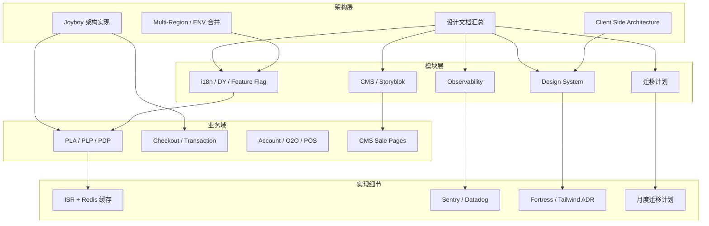
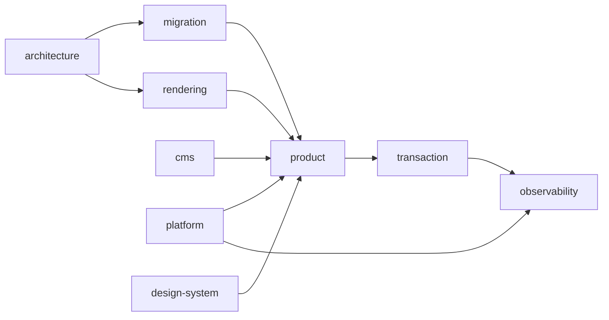
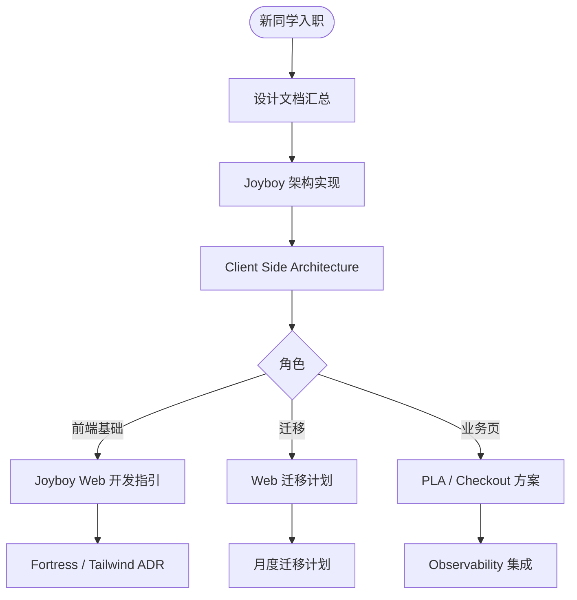

# Knowledge Graph

## Graph 1: Architecture Layers

```mermaid
flowchart TB
  subgraph L1["架构层"]
    A1[设计文档汇总]
    A2[Joyboy 架构实现]
    A3[Client Side Architecture]
    A4[Multi-Region / ENV 合并]
  end
  subgraph L2["模块层"]
    M1[迁移计划]
    M2[CMS / Storyblok]
    M3[i18n / DY / Feature Flag]
    M4[Observability]
    M5[Design System]
  end
  subgraph L3["业务域"]
    B1[PLA / PLP / PDP]
    B2[Checkout / Transaction]
    B3[Account / O2O / POS]
    B4[CMS Sale Pages]
  end
  subgraph L4["实现细节"]
    I1[ISR + Redis 缓存]
    I2[Sentry / Datadog]
    I3[Fortress / Tailwind ADR]
    I4[月度迁移计划]
  end
  A1 --> M1 & M2 & M3 & M4 & M5
  A2 --> B1 & B2
  A3 --> M5
  A4 --> M3
  M1 --> I4
  M2 --> B4
  M3 --> B1
  M4 --> I2
  M5 --> I3
  B1 --> I1
```

## Graph 2: Domain Module Relationships

```mermaid
flowchart LR
  architecture --> migration
  architecture --> rendering
  migration --> product
  cms --> product
  platform --> product
  design-system --> product
  rendering --> product
  transaction --> observability
  product --> transaction
  platform --> observability
```

## Graph 3: Onboarding Reading Path

```mermaid
flowchart TD
  Start([新同学入职]) --> R1[设计文档汇总]
  R1 --> R2[Joyboy 架构实现]
  R2 --> R3[Client Side Architecture]
  R3 --> R4{角色}
  R4 -->|前端基础| R5[Joyboy Web 开发指引]
  R4 -->|迁移| R6[Web 迁移计划]
  R4 -->|业务页| R7[PLA / Checkout 方案]
  R5 --> R8[Fortress / Tailwind ADR]
  R6 --> R9[月度迁移计划]
  R7 --> R10[Observability 集成]
```
