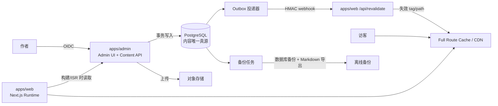
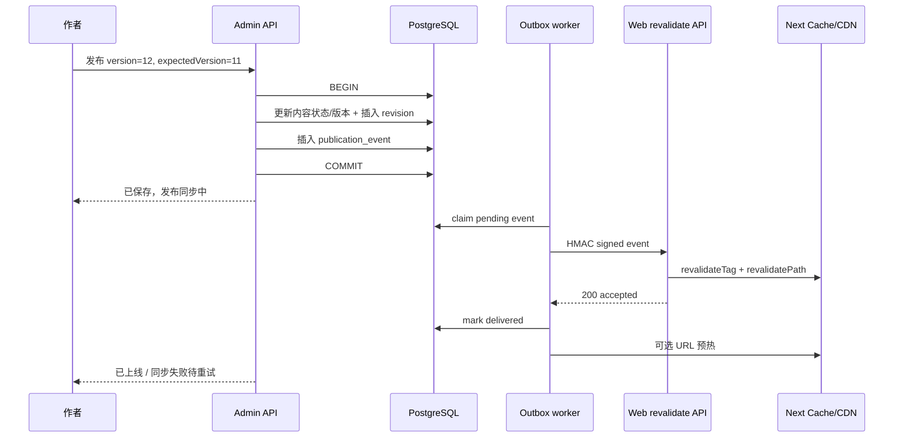

# cBlog 部署态 v2 技术方案

- 版本：v0.2（2026-08-17）
- 状态：Reviewed Draft，作为实施评审基线
- 关联文档：[开发方案](./02-implementation-plan.md) · [测试方案](./03-test-plan.md)
- 官方约束：[Next.js 14 Static Exports](https://nextjs.org/docs/14/app/building-your-application/deploying/static-exports) · [Caching and Revalidating](https://nextjs.org/docs/14/app/building-your-application/data-fetching/fetching-caching-and-revalidating) · [revalidatePath](https://nextjs.org/docs/14/app/api-reference/functions/revalidatePath)

## 1. 结论

目标架构采用“数据库单一内容源 + 前台静态优先 + 发布后按需 ISR”：

- PostgreSQL 保存文章、专栏文档、元数据、Markdown 正文、修订历史和发布事件。
- 对象存储保存图片等二进制资产；数据库只保存对象键、URL 和元数据。
- Admin 作为部署后的轻量内容服务，提供受鉴权保护的写接口和只返回已发布内容的只读接口。
- Web 在初次构建时通过 HTTP API 预生成已有页面；构建后新增或修改的内容通过 On-demand ISR 增量生成。
- Admin 完成发布事务后写入 Outbox 事件，由投递器调用 Web 的签名 revalidation webhook。
- 仓库内 Markdown 不再参与运行时读取和同步双写，只允许由数据库定期导出为离线备份。

纯静态导出不支持 ISR，因此 Web 必须移除 `output: "export"`，部署到支持 Next.js Node.js Runtime 和持久化增量缓存的环境。页面仍然是静态缓存结果，而不是每个请求都查询数据库。

## 2. 背景与当前约束

当前实现已经具备清晰的领域模型和 Admin CRUD，但不适合直接暴露到公网：

- `apps/web/next.config.js` 使用 `output: "export"`，运行时没有 Next.js 服务端，无法处理 `revalidatePath`、`revalidateTag` 和构建后新增路由。
- `apps/web/lib/posts.ts` 从 SQLite 读取元数据，再按 `filePath` 读取 Markdown 正文；数据库并不是完整内容源。
- `apps/admin` 的 Route Handler 直接调用本地文件和 SQLite 仓储层，当前没有线上身份认证。
- 当前发布行为是提交 `content/` 和 `data/blog.db` 后 push；部署态不应再依赖 Git 作为发布总线。
- 文章详情页会读取全部分类和文章摘要来生成侧栏，因此“文章变更”不仅可能影响详情页，也可能影响首页、分类、统计、侧栏与 sitemap。

v2 保留现有 URL、Markdown 渲染能力、文章状态机和 UI，替换存储、发布、缓存与部署边界。

## 3. 目标与非目标

### 3.1 目标

1. 数据库是线上内容的唯一真源，不存在同步文件双写。
2. 已有公开页面在首次部署时静态预生成，日常访问命中 CDN/Full Route Cache。
3. Admin 发布后只让受影响的数据和路由失效，不触发全站构建。
4. 构建后新文章可在首次访问时生成并缓存。
5. 草稿、归档和历史修订永远不通过公开 API 或公开缓存泄漏。
6. 发布通知丢失、接口短暂失败或重复投递时可以自动恢复。
7. 支持数据库备份、Markdown 离线导出和可验证回滚。

### 3.2 非目标

- 不在 v2 首期实现多人协作、复杂 RBAC、评论或全文搜索。
- 不做浏览器端直接请求数据库或直接持有数据库凭证。
- 不把 ISR 当作备份机制；数据备份与页面缓存是两个独立问题。
- 不尝试对 `next build` 的 `out/` 产物做 HTML 文件级拼接部署。
- 首期不开放 slug 修改；避免同时引入永久重定向与旧缓存清理问题。
- 首期不保留公开 Web 的草稿 URL 预览；作者在已鉴权的 Admin 编辑器中使用同一 Markdown 渲染管线预览，完整前台 Draft Mode 另列后续需求。

## 4. 架构决策

| ID | 决策 | 结论与原因 |
|---|---|---|
| ADR-201 | 内容真源 | PostgreSQL 单一真源。部署后本地 SQLite 和 Markdown 不参与读写。 |
| ADR-202 | 正文格式 | 数据库存 Markdown 原文；渲染仍复用 `@cblog/core/markdown`。 |
| ADR-203 | 二进制资产 | 使用 S3 兼容对象存储；数据库保存对象键、MIME、尺寸、hash 和公开 URL。 |
| ADR-204 | 服务边界 | 首期复用 `apps/admin` 作为 Admin UI + Content API，避免新建独立微服务；公开、管理、内部接口分区。 |
| ADR-205 | 前台形态 | Next.js App Router 静态优先，移除 `output: "export"`，使用 Node.js Runtime ISR。 |
| ADR-206 | 缓存控制 | Web 的 Next Data Cache/Full Route Cache 是页面缓存主控；Content API 不再叠加长期 CDN 缓存。 |
| ADR-207 | 发布通知 | 数据库事务内写 Outbox，事务外签名投递，至少一次交付；Web 端幂等处理。 |
| ADR-208 | 身份认证 | Admin 使用 OIDC 登录并校验固定用户 ID；具体 provider 是实施前置决策。 |
| ADR-209 | 备份 | PostgreSQL 自动备份 + 定期 Markdown 导出；导出不参与线上发布。 |
| ADR-210 | 部署一致性 | 单实例自托管可使用默认文件缓存；多实例必须使用平台共享 ISR 缓存或自定义共享 Cache Handler。 |

为什么首期不新增 `apps/api`：当前规模是单作者博客，Admin UI 与内容写 API 同生命周期。通过路由分区、鉴权中间件和仓储接口即可形成安全边界；当 API 需要独立扩缩容或开放第三方客户端时，再把相同接口抽到独立服务。

## 5. 目标架构



### 5.1 部署单元

| 单元 | 职责 | 网络暴露 |
|---|---|---|
| `apps/web` | 静态预生成、ISR、SEO、公开页面 | 公网 |
| `apps/admin` | Admin UI、内容 API、鉴权、Outbox 投递入口 | 公网；管理路由必须认证 |
| PostgreSQL | 内容、修订、发布事件 | 仅服务端私网/受控连接 |
| 对象存储 | 文章图片和封面 | 公开读或 CDN 读；写入必须签名 |
| Outbox worker | 重试发布事件 | 可与 Admin 同进程的定时任务启动，生产建议独立 cron/worker |

Web 不直连数据库。这样构建环境和 ISR 运行时只需要内容 API 地址，不需要数据库驱动、数据库网络权限或管理端写权限。

## 6. 数据模型

### 6.1 文章与专栏正文

在保持现有业务字段的基础上调整：

```text
posts
  id                 uuid/bigint primary key
  slug               unique, immutable in v2 phase 1
  title
  excerpt
  content_markdown   text, not null
  content_hash       sha256(content_markdown)
  status             draft | published | archived
  category_id
  cover_asset_id     nullable
  reading_minutes
  editorial_date     原 frontmatter date，控制展示和业务排序
  published_at       首次进入 published 的系统时间，用于审计
  updated_at
  created_at
  version            integer, optimistic concurrency token

collection_items
  ...existing metadata
  content_markdown
  content_hash
  reading_minutes
  version
```

删除运行时字段 `file_path`。迁移期可临时保留 `legacy_file_path` 仅用于校验和追踪，切换稳定后再移除。

### 6.2 修订历史

```text
content_revisions
  id
  entity_type        post | collection_item
  entity_id
  version
  snapshot_json      当次元数据 + Markdown 正文
  actor_id
  created_at
  unique(entity_type, entity_id, version)
```

每次保存先校验客户端提交的 `expectedVersion`，再在一个事务中更新实体并插入修订。版本不一致返回 `409 VERSION_CONFLICT`，避免两个标签页静默覆盖。

### 6.3 资产

```text
assets
  id
  object_key         unique，不接受用户提供的任意路径
  original_name
  mime_type
  byte_size
  width / height
  sha256
  created_at
```

Markdown 正文在数据库中保存 `asset://<asset-id>` 形式的内部资源标识，不绑定对象存储域名。渲染前通过 Markdown AST 把资源标识解析为 CDN URL；离线导出时下载对应对象，并改写为 `./assets/<safe-name>`。上传接口只根据服务端生成的 object key 写入，不提供“传入路径后读取文件”的能力。

存量 `./assets/...` 和 `/images/...` 迁移必须经过 AST 扫描、上传、引用改写和 hash 校验，不能用无上下文的字符串替换。远程第三方 URL 默认保持原样，并在迁移报告中单独列出。

### 6.4 发布 Outbox

```text
publication_events
  id                 uuid，作为幂等键
  entity_type        post | category | tag | collection | collection_item | site
  entity_id
  operation          publish | update | unpublish | archive | delete
  payload_json       slug、旧/新分类、旧/新专栏、contentVersion
  status             pending | delivering | delivered | failed
  attempt_count
  next_attempt_at
  delivered_at
  last_error
  created_at
```

只有影响公开视图的事务才创建事件：

- 修改草稿但状态仍为 draft：不创建。
- draft → published：创建 `publish`。
- 修改已发布内容/元数据：创建 `update`。
- published → draft/archived 或删除：创建 `unpublish/archive/delete`。

业务更新和 Outbox 插入必须在同一数据库事务内完成。

事件 payload 使用按 `schemaVersion + entityType` 区分的判别联合：

| entityType | payload 最小字段 | 失效意图 |
|---|---|---|
| post | slug、categorySlug、previousCategorySlug、contentVersion | 详情、列表、分类、统计、sitemap |
| category | slug、previousSlug、version | 分类页、导航和所有使用根布局导航的页面 |
| tag | name、previousName、version | 首页/统计/文章摘要 |
| collection | slug、previousSlug、version | 专栏页、导航和根布局 |
| collection_item | collectionSlug、slug、contentVersion | 文档页和专栏落地页 |
| site | version | 全局站点配置和根布局 |

slug 在首期不可修改，因此 `previousSlug` 正常为空；保留字段是为了事件 schema 向前兼容。分类、专栏或全局导航发生变化时，允许执行低频的 `revalidatePath("/", "layout")`，让整个站点在后续访问中懒重建；它不是同步全站构建。

## 7. API 设计

统一前缀 `/api/v1`，错误结构：

```json
{
  "error": {
    "code": "POST_NOT_FOUND",
    "message": "文章不存在",
    "requestId": "..."
  }
}
```

### 7.1 公开只读 API

只返回 published 内容，服务端再次强制状态过滤，不能由 query 参数绕过。

| Method | Path | 用途 |
|---|---|---|
| GET | `/api/v1/public/site` | 分类、站点统计、导航和最新文章摘要 |
| GET | `/api/v1/public/posts` | 已发布文章摘要；支持 category/limit |
| GET | `/api/v1/public/posts/:slug` | 单篇正文与 SEO 元数据 |
| GET | `/api/v1/public/categories` | 分类和公开文章数 |
| GET | `/api/v1/public/collections` | 公开专栏摘要 |
| GET | `/api/v1/public/collections/:slug` | 专栏与公开文档摘要 |
| GET | `/api/v1/public/collections/:slug/items/:itemSlug` | 专栏文档正文 |
| GET | `/api/v1/public/sitemap` | sitemap 所需的最小数据 |

不存在、draft、archived 一律返回相同的 `404`，避免状态枚举。公开接口响应使用 `Cache-Control: private, no-store` 或等效策略，让 Web 的 Next Data Cache 成为唯一可编程缓存层；如果未来给 Content API 增加 CDN，必须把其 purge 纳入同一个发布事件，否则 ISR 会重新拉到旧数据。

### 7.2 管理 API

现有 CRUD 路由迁到 `/api/v1/admin/**`，全部经过 OIDC session、固定用户 ID 校验、CSRF/Origin 校验和速率限制。写接口接收 `expectedVersion`。

“保存”和“发布”拆开：保存草稿只创建修订；发布负责状态变更和 Outbox。原 Git commit/push 发布接口在切换完成后下线。

### 7.3 Web revalidation webhook

```http
POST /api/revalidate
X-CBlog-Event-Id: <uuid>
X-CBlog-Timestamp: <unix-seconds>
X-CBlog-Key-Id: <active-key-id>
X-CBlog-Signature: sha256=<hex-hmac>
Content-Type: application/json
```

```json
{
  "schemaVersion": 1,
  "eventId": "uuid",
  "entityType": "post",
  "operation": "update",
  "slug": "example",
  "categorySlug": "technical",
  "previousCategorySlug": "notes",
  "contentVersion": 12,
  "occurredAt": "2026-08-17T10:00:00.000Z"
}
```

验签规则：HMAC-SHA256 覆盖原始请求体、时间戳和 key ID；时间偏差不超过 5 分钟；事件 ID 建立短期幂等记录；使用常量时间比较。轮换期 Web 同时接受 active/previous 两个 key ID，worker 只用 active key 签名，上一密钥在最长重试窗口结束后删除。接口不接受调用方直接传任意 path 或 tag，只接受领域事件，由 Web 内部映射允许失效的目标，防止滥用成全站 cache purge。

## 8. Web 数据访问与 ISR

### 8.1 数据访问层

将 `apps/web/lib/posts.ts` 和 `collections.ts` 改为异步 API adapter，页面组件不直接拼 URL：

```ts
getPost(slug)        tag: post:<slug>
getPostIndex()       tag: post-index
getCategories()      tag: categories
getCategory(slug)    tag: category:<slug>, post-index
getCollections()     tag: collections
getCollection(slug)  tag: collection:<slug>
getCollectionItem()  tag: collection-item:<collection>:<slug>
getSitemapData()     tag: sitemap
```

每个 `fetch` 显式使用 `cache: "force-cache"` 和 `next.tags`。所有依赖内容的静态页面显式导出 `export const revalidate = 86400`，作为丢事件后的 24 小时页面级最终兜底；正常内容更新仍由发布事件立即失效。TTL 到期只会在下一次访问时懒重建，不会同步重建全站，也不能代替 Outbox。

Next.js 14 也允许单个 fetch 的较低 `next.revalidate` 影响静态路由的刷新周期，但本项目不混用两套 TTL：时间兜底统一声明在 route segment，fetch 只负责标签，降低各页面取最低值时产生的隐式行为。

`generateMetadata` 和页面主体必须复用同一个 `getPost()`，依赖 Next/React 请求记忆化，避免一次渲染读到两个版本。

### 8.2 构建与动态参数

- `generateStaticParams()` 在构建时从公开 API 获取全部已发布 slug，预生成存量路由。
- 显式保留 `dynamicParams = true`，构建后新 slug 第一次访问时生成并进入 Full Route Cache。
- 页面数据不存在或非 published 时调用 `notFound()`。
- `generateStaticParams` 在 ISR 中不会重新执行；新增内容依赖 `dynamicParams`，不是依赖重新枚举 slug。
- 本地 ISR 验证必须使用 `next build && next start`，不能用 `next dev` 代替。

### 8.3 缓存标签与路由影响

| 事件 | 数据标签 | 路径 |
|---|---|---|
| 修改已发布文章 | `post:<slug>`, `post-index`, `sitemap` | `/posts/<slug>`, `/`, `/about`, `/categories`, `/categories/<category>`, `/sitemap.xml` |
| 文章移动分类 | 上述 + `category:<old>`, `category:<new>` | 再失效旧、新分类页 |
| 新发布文章 | `post:<slug>`, `post-index`, `categories`, `sitemap` | 文章页、首页、分类相关页、about、sitemap |
| 下线/归档文章 | 与新发布相同 | 原文章页下一次访问应变成 404 |
| 修改专栏文档 | `collection-item:*`, `collection:<slug>` | 文档页和专栏落地页 |
| 修改分类/专栏/全局导航 | 对应实体标签 + 导航标签 | 该落地页 + `revalidatePath("/", "layout")`，全站按访问懒更新 |

优先使用标签表达共享数据依赖，使用精确 `revalidatePath` 保证核心 URL 失效。`revalidatePath` 在 Route Handler 中是按需失效，页面通常在下一次访问时重新生成；如果要求“Admin 显示发布成功时页面已经变新”，Outbox worker 在收到成功响应后可 best-effort 请求文章 URL预热。预热失败不回滚已提交内容，只保留事件状态并重试。

当前文章详情页的侧栏依赖全量文章列表。实施时应改为只请求“侧栏摘要”并标记 `post-index`，不要让每个详情页加载所有正文。列表变化后，这些详情页会在各自下一次访问时懒更新，不会同时进行全站重建。

## 9. 发布时序与一致性



一致性语义：数据库发布是强一致提交；页面上线是最终一致。UI 必须区分“内容已保存”“发布同步中”“已上线”“同步失败待重试”，不能在数据库提交后立刻无条件显示上线成功。

Outbox 重试建议为指数退避加抖动，例如 5s、30s、2m、10m、30m，超过阈值进入 failed 并在 Admin 显示“重新投递”。事件处理必须幂等，重复 `revalidateTag/path` 不产生副作用。

## 10. 构建、部署与运行

### 10.1 初次构建

1. CI 获取 `CONTENT_API_BASE_URL`。
2. `next build` 访问公开 API，并预生成已有公开路由。
3. API 不可用、响应结构不兼容或出现 draft 数据时构建失败。
4. 部署平台保留上一成功版本，不用空页面覆盖线上。

公开已发布内容不需要管理凭证。若希望构建接口不公开，可使用只读 build token，但它不得拥有管理权限。

### 10.2 多实例缓存

- Vercel 等原生平台：使用平台提供的共享 ISR 缓存和失效传播。
- 单机 `next start`：默认文件缓存可作为首期方案，必须使用持久卷并备份。
- 多副本自托管：必须实现共享 Cache Handler/Redis 和跨实例失效；未完成前限制 Web 为单副本，否则不同实例会长期展示不同版本。

### 10.3 域名与 basePath

当前 GitHub Project Pages 可能使用 `/cBlog` basePath。迁移前必须二选一：

1. 新平台继续保留 `/cBlog`，URL 完全不变；或
2. 使用根域名，并让旧 GitHub Pages 地址对每个已发布 URL 返回 301。

域名、canonical、sitemap、robots、OG URL 和对象存储 CORS 必须作为同一个发布批次验证。

## 11. 安全设计

1. Admin 页面和 `/api/v1/admin/**` 默认拒绝匿名访问；只允许固定 OIDC subject/user ID。
2. Web revalidation 只接受 HMAC 签名事件，不接受登录 cookie 或浏览器跨域调用。
3. 数据库凭证只存在于 Admin 服务；Web 只有 Content API 地址和 revalidation secret。
4. 公开 API 查询层硬编码 `status = published`，并用集成测试防止 draft/archived 泄漏。
5. 上传校验 MIME、magic bytes、大小和扩展名；对象键由服务端生成；禁止 SVG 主动内容或做净化处理。
6. 删除现有可按相对路径读取本地内容的资产接口；线上不读取调用方指定的文件路径。
7. 所有写操作包含审计字段、requestId、actorId 和结构化日志；日志不记录 Markdown 全文、cookie、token 或签名 secret。
8. revalidation webhook 限制 body 大小、事件 schema、时钟窗口和调用频率。
9. Admin、worker 和 Web 主机必须启用可靠时钟同步；时钟偏差告警阈值小于 webhook 允许窗口。

## 12. 可观测性与运维

最小指标：

- `content_publish_total{operation,result}`
- `outbox_pending_total`、`outbox_delivery_attempts`、最老 pending age
- `revalidate_requests_total{result}`、验签失败数、处理耗时
- Content API 请求量、P95、5xx
- Web ISR 生成失败和路由 404 异常增长
- 数据库连接池使用率与慢查询

每个发布事件在 Admin API、Outbox 和 Web 日志中复用 `eventId/requestId`。Admin 发布页展示最近一次投递状态和错误摘要。

备份至少包括：PostgreSQL 每日备份与恢复演练、对象存储版本控制/生命周期、每周 Markdown 导出。恢复验收以记录数、内容 hash、资产 hash 和抽样页面渲染为准。

## 13. 故障与降级

| 故障 | 行为 | 恢复 |
|---|---|---|
| Content API 构建时不可用 | 构建失败，线上保持上一版本 | API 恢复后重跑部署 |
| 发布后 Web webhook 不可用 | DB 已提交；事件 pending/failed | Outbox 自动或手动重试 |
| ISR 拉取新内容失败 | 保留最后成功缓存，不发布半成品 | 下一次访问/重试继续生成 |
| 对象存储上传失败 | 内容事务不引用未完成资产 | 重传后再保存/发布 |
| 数据库不可用 | Admin 进入只读/错误态；缓存页面继续服务 | 数据库恢复，不清空页面缓存 |
| 新版本应用异常 | 平台回滚应用；数据库迁移必须向后兼容 | 回滚代码，必要时按 runbook 恢复数据 |

## 14. 被否决方案

### 14.1 数据库和仓库文件同步双写

否决。它会重新引入跨介质事务、漂移、删除顺序和合并冲突问题。Markdown 导出只能是异步备份，不能决定线上页面。

### 14.2 保留 GitHub Pages 并实现 ISR

不可行。GitHub Pages 只能服务构建产物；可在 Admin 发布后触发完整 Actions 构建，但这不是 ISR，可作为迁移期间的临时模式。

### 14.3 只上传某一篇文章的静态 HTML

否决。Next.js 构建包含 HTML、RSC payload、manifest、build ID 和哈希资源，跨构建复制单页容易出现版本错配。需要局部更新时应由 Next.js ISR 缓存处理。

## 15. 实施前置决策

以下项目未确认前不进入生产切换：

- Web/Admin 部署平台及是否原生支持共享 ISR。
- PostgreSQL 与对象存储供应商、区域、备份和费用上限。
- Admin OIDC provider 和唯一允许登录的 subject/user ID。
- 正式域名是否保留 `/cBlog` basePath，以及旧地址 301 方案。
- Outbox worker 运行方式（平台 cron、独立 worker 或单实例内置任务）。
