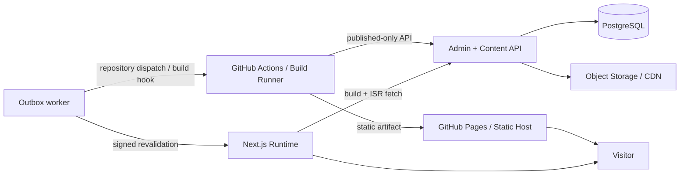

# Web 独立部署配置方案

- 版本：v0.1（2026-08-17）
- 目标：后端固定部署为内容服务，公开 Web 可在 GitHub Pages、其他静态托管或支持 Next.js Runtime 的平台之间切换

## 1. 结论

后端和 Web 不要求同域、同服务器或同供应商。两者只通过稳定的 Content API 和发布事件连接：

- Web 构建环境通过 `CONTENT_API_BASE_URL` 拉取已发布数据；浏览器不直连数据库。
- 图片使用对象存储/CDN 的绝对公开 URL，不依赖 Web 与 Admin 的相对路径。
- Admin 发布事务始终写 Outbox；worker 根据配置选择“触发静态构建”或“触发 ISR”。
- 页面组件只依赖统一 content adapter，不感知 GitHub Pages、Vercel 或自托管 Node。

GitHub Pages 是静态托管，不能运行 ISR。选择 GitHub Pages 时，每次公开内容变更都要触发一次完整、原子的新静态站构建；不能安全地只上传某篇文章的 HTML。选择 Next.js Node Runtime 时，才可以用 `revalidateTag`/`revalidatePath` 按内容增量失效。

## 2. 两种受支持的运行模式

| 能力 | `static-export` | `runtime-isr` |
|---|---|---|
| 典型平台 | GitHub Pages、S3、纯静态 Nginx | Vercel、单机 Node、支持 Next Runtime 的平台 |
| Next 配置 | `output: "export"` | Node Runtime，不设置 `output: "export"` |
| 数据读取 | 只在 `next build` 拉 Content API | 构建时拉取；ISR 时再次拉取 |
| 发布动作 | 触发完整 CI build/deploy | HMAC webhook 失效精确 tag/path |
| 新文章上线 | 下一次部署完成后 | webhook 后首次访问生成，或预热生成 |
| 后端临时不可用 | 新构建失败，旧站继续服务 | 旧缓存继续服务，后续重试 |
| 前端运行服务器 | 不需要 | 需要 |
| 页面级 ISR | 不支持 | 支持 |

默认开发和迁移验证同时保留两条构建路径。生产环境必须明确选择一种，禁止把 `static-export` 与 `revalidation-webhook` 组合。

## 3. 配置契约

### 3.1 Web 构建配置

```text
WEB_RENDER_MODE=static-export|runtime-isr
WEB_CONTENT_SOURCE=filesystem|api
CONTENT_API_BASE_URL=https://admin-api.example.com
CONTENT_API_READ_TOKEN=optional-read-only-build-token
SITE_URL=https://example.github.io/cBlog
BASE_PATH=/cBlog
```

- `CONTENT_API_BASE_URL` 只在构建服务器或 Next Runtime 使用，不以 `NEXT_PUBLIC_` 前缀暴露给浏览器。
- GitHub Actions 必须能通过公网 HTTPS 访问 Content API。若接口使用只读 token，token 存在 Actions Secret，只能读取 published DTO。
- `BASE_PATH` 为空表示根域名；GitHub Project Pages 通常为 `/<repository>`。canonical、sitemap、robots、内部链接和静态资源都从同一配置生成。
- 构建输出不得包含数据库 URL、Admin session 或发布密钥。

### 3.2 发布驱动配置

```text
PUBLICATION_DRIVER=github-dispatch|generic-build-hook|revalidation-webhook
```

| `WEB_RENDER_MODE` | 允许的 `PUBLICATION_DRIVER` |
|---|---|
| `static-export` | `github-dispatch`、`generic-build-hook` |
| `runtime-isr` | `revalidation-webhook` |

应用启动时校验组合，配置不匹配直接失败，不允许静默降级。

GitHub Pages 附加变量：

```text
GITHUB_REPOSITORY=owner/repository
GITHUB_DISPATCH_EVENT=cblog-content-published
GITHUB_DISPATCH_TOKEN=
DEPLOY_CALLBACK_URL=https://admin.example.com/api/v1/internal/deployments/callback
DEPLOY_CALLBACK_SECRET=
```

- worker 调用 GitHub `repository_dispatch`；优先使用 GitHub App installation token，个人部署可先使用最小权限 fine-grained token。
- 连续事件在短时间窗口内合并为一次 build，但每个 Outbox event 都保留关联的 deployment id。
- “dispatch 已接受”不等于“已上线”。Actions 在 Pages 部署成功/失败后调用 Admin 的签名 callback，UI 才显示“已上线”或“部署失败”。
- callback 重复调用必须幂等；超时由 worker 查询或重试，不回滚已提交内容。

`generic-build-hook` 固定使用 POST JSON；可选通过 `Authorization: Bearer <token>` 鉴权。只支持“能回调 `DEPLOY_CALLBACK_URL` 或能查询任务状态”的托管平台，不把仅返回 2xx 的裸 build hook 当作“已上线”证据。

### 3.3 Route segment 约束

Next.js 的 route segment config 必须是静态可分析值，不能用 `process.env` 三元表达式在同一个 `page.tsx` 中切换 `dynamicParams`/`revalidate`。本项目采取以下兼容策略：

- 所有动态公开路由都实现完整 `generateStaticParams()`；
- 不显式导出 `dynamicParams`，Runtime 使用默认 `true`，Static Export 只生成枚举路由；
- Runtime 的 24 小时兜底 TTL 放在统一 Content API fetch adapter 的 `next.revalidate`，Static 构建不传该选项；
- Phase 5 对两种 profile 分别执行真实 production build，防止 Next.js 升级改变边界。

## 4. 跨域与网络边界

正常访客访问静态页面时不调用 Content API，因此 GitHub Pages 场景不需要为读接口开放浏览器 CORS。只有构建 runner 和 Next Runtime 访问公开读取端点。

如果未来增加浏览器端搜索或预览，再单独为明确的 `SITE_URL` origin 开放只读 CORS；不得使用 `*` 搭配 cookie/credentials。Admin 管理 API 不向公开 Web origin 开放。



## 5. 切换托管平台

### GitHub Pages → Node ISR

1. 用 `runtime-isr` 运行同一份 Web 代码并执行影子构建。
2. 配置 `revalidation-webhook` 和 HMAC 密钥，跑 ISR 用例。
3. 切换域名/流量后再改变生产 publication driver。
4. 保留最后一次 Pages 产物作为回滚版本。

### Node ISR → GitHub Pages

1. 以 `static-export` 构建全站，确认所有动态路由均由 `generateStaticParams` 枚举。
2. 配置 GitHub dispatch/build hook 和部署回调。
3. 首次静态部署成功后切换流量与 publication driver。
4. 停止 ISR webhook 前先清空或迁移 pending Outbox 事件。

两种切换都不迁移内容数据，也不恢复仓库 Markdown 双写。

## 6. 推荐选择

- 内容量小、发布频率低、希望零运行时前端成本：优先 `static-export` + GitHub Pages。
- 希望文章发布后秒级上线、只更新受影响路由、未来内容量增长：优先 `runtime-isr`。
- 当前实现同时交付两种 profile；本地默认继续使用 `static-export` 保持现有站点可用，ISR 作为可启用的生产 profile 独立验收。

## 7. 官方能力依据

- [GitHub Pages 是静态站点托管服务](https://docs.github.com/en/pages/getting-started-with-github-pages/what-is-github-pages)
- [GitHub `repository_dispatch` 可由外部系统触发 Actions](https://docs.github.com/en/actions/reference/workflows-and-actions/events-that-trigger-workflows#repository_dispatch)
- [Next.js Static Export 的能力与限制](https://nextjs.org/docs/app/guides/static-exports)
- [Next.js ISR 不支持 Static Export](https://nextjs.org/docs/app/guides/incremental-static-regeneration)
- [Next.js `revalidatePath` 可精确失效路径](https://nextjs.org/docs/app/api-reference/functions/revalidatePath)
