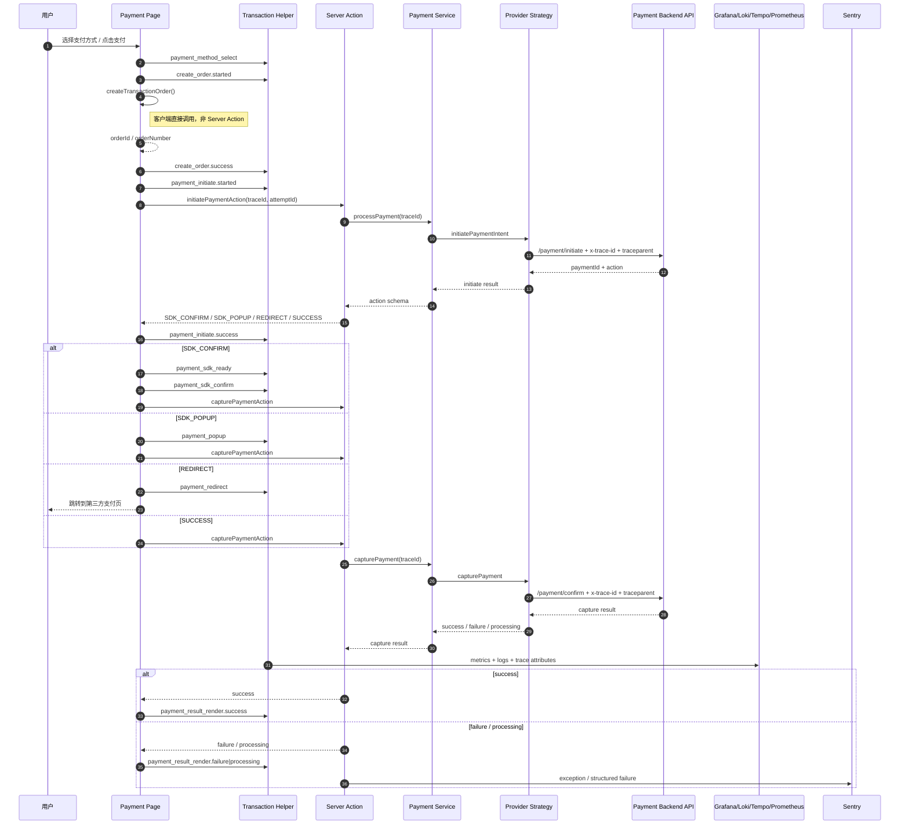
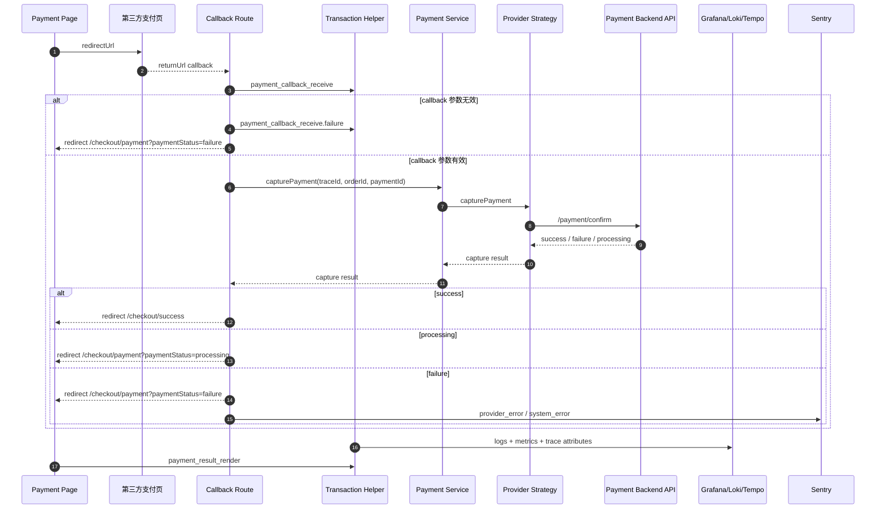
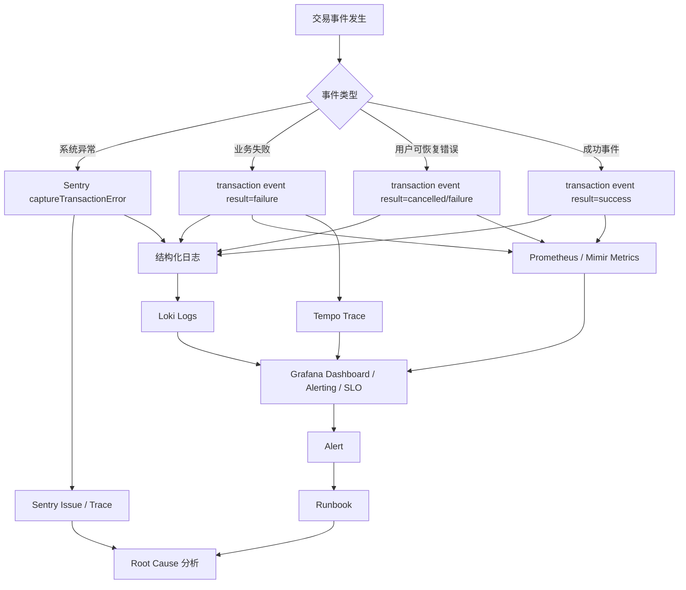
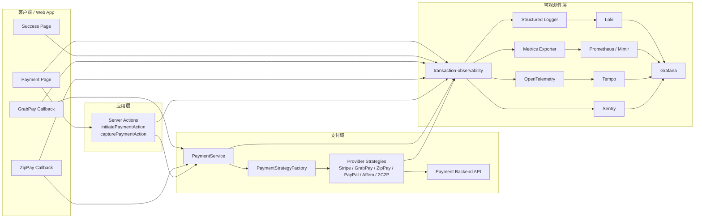

# 交易可观测性图示（Confluence 版）

- 作者：Codex
- 日期：2026-05-25
- 适用范围：`checkout` + `payment`
- 适用场景：Confluence / 飞书文档 / 方案评审页面
- 目标平台：Sentry + Grafana

---

## 一、文档目标

这份文档用于在方案评审、跨团队同步和 incident 复盘时，快速说明交易链路、错误监控流转和整体架构。

建议在 Confluence 中按以下顺序展示：

1. 支付主链路时序图
2. Redirect provider callback 时序图
3. 错误监控流转图
4. 整体架构图

## 二、支付主链路时序图

说明：

- 适用于 `Stripe`、`2C2P`、`PayPal popup`、`Affirm popup`、`GrabPay`、`ZipPay`
- 覆盖从 payment page 到 backend confirm 的完整链路
- 包含 transaction helper、Grafana stack 与 Sentry 的关键上报点
- 不再依赖 Datadog RUM action

## 三、Redirect Provider Callback 时序图

说明：

- 当前已落地：`GrabPay`、`ZipPay`
- 后续新增 redirect provider 可以复用同一模式
- callback route 是服务端控制页，不承载用户可见 UI

## 四、错误监控流转图

说明：

- 展示同一个错误如何进入 Sentry、Loki、Prometheus/Mimir、Tempo 和 Grafana Alerting
- 强调“根因看 Sentry，影响面看 Grafana”

## 五、整体架构图

说明：

- 从前端页面、应用层、支付域到 observability 平台的整体关系
- 适合放在方案首页或评审 PPT 中

## 六、汇报时建议怎么讲

如果你要在 Confluence 页面里讲这套方案，建议按下面顺序：

1. 先用“整体架构图”说明边界和职责。
2. 再用“支付主链路时序图”说明正常流程。
3. 再用“redirect callback 时序图”说明 GrabPay / ZipPay 特殊闭环。
4. 最后用“错误监控流转图”说明为什么 Sentry 和 Grafana 要同时建设。

一句话总结：

> Sentry 回答为什么失败，Grafana 回答影响有多大，以及从哪个日志、trace、dashboard 继续查。

## 七、当前边界说明

1. `GrabPay` 和 `ZipPay` callback 已按图落地。
2. `Affirm` 还没有画 callback 闭环，因为当前仓库里仍存在 `SDK_POPUP` / `REDIRECT` 分叉。
3. `PayPal` 当前更接近 popup 模式，所以没有单独展开 callback controller 图。
4. 前端体验侧 telemetry 不纳入本次交易核心监控验收，后续可作为独立 Web Experience 方案补充。
