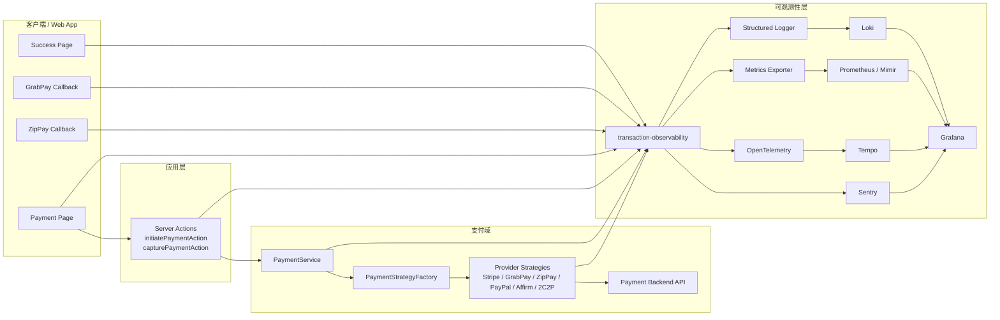
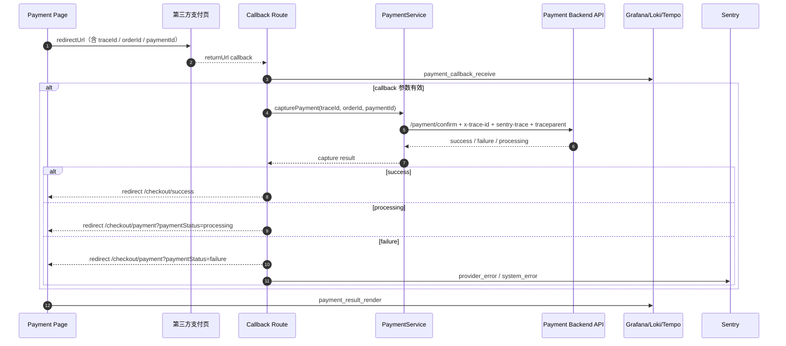

# 交易可观测性技术方案摘要

- 作者：Abby Wang / Codex
- 日期：2026-05
- 适用范围：`checkout` + `payment`
- 文档性质：方案评审
- 目标平台：Sentry + Grafana

---

## 1. 背景

交易链路是 Joyboy 核心的业务闭环。新方案将原 Datadog Logs / Datadog RUM 的职责迁移到 Grafana 体系：

- Sentry：错误聚合、root cause、stack trace、错误分桶。
- Grafana：交易指标、dashboard、alerting、SLO、日志查询、trace 入口。
- Loki：结构化日志检索。
- Tempo / OpenTelemetry：服务端调用链追踪。
- Prometheus / Mimir：交易成功率、失败率、耗时、重试等 metrics。

目标是建立统一的交易观测模型，使团队能够按 `traceId`、`orderId`、`paymentId` 串联 checkout/payment 全链路，并在发布或 provider 波动时快速判断影响面。

## 2. 方案目标

| 目标 | 描述 |
| --- | --- |
| 链路串联 | 同一笔交易可用 `traceId`、`orderId`、`paymentId` 在 Sentry、Loki、Tempo、Grafana Dashboard 中相互定位 |
| 问题分层 | 系统故障、业务失败、用户可恢复错误、第三方波动四类问题有明确分诊路径 |
| 成功率告警 | 核心步骤（下单、支付发起、支付捕获）有基于成功率的 Grafana Alert 与 SLO |
| 发布回归感知 | 发布后 30 分钟内可通过 Grafana Dashboard 判断交易成功率是否下降 |
| Provider 钻取 | 可按支付商、市场、版本下钻查看故障影响面 |

## 3. 整体架构



## 4. 支付链路阶段模型

方案将支付主链路统一拆分为 15 个标准阶段，所有埋点、日志、告警均挂靠到某一标准阶段：

| 阶段 | 说明 | 执行侧 |
| --- | --- | --- |
| `checkout_init` | 进入 checkout 页面 | 客户端 |
| `checkout_info_fetch` | 拉取 checkout / quote 信息 | 客户端 |
| `address_validate` | 地址校验 | 客户端 |
| `inventory_reserve` | 库存预占 | 服务端 |
| `promotion_apply` | 优惠券 / 促销计算 | 服务端 |
| `create_order` | 创建交易订单 | 客户端直接调用 |
| `payment_method_select` | 用户选择支付方式 | 客户端 |
| `payment_initiate` | 创建 payment intent | Server Action → 支付域 |
| `payment_sdk_ready` | 第三方 SDK 初始化完成 | 客户端 |
| `payment_sdk_confirm` | SDK confirm / authorize | 客户端 + Server Action |
| `payment_redirect` | 跳转型支付开始 | 客户端 |
| `payment_popup` | Popup 型支付开始 | 客户端 |
| `payment_callback_receive` | Redirect callback 到达 | Callback Route |
| `payment_capture` | Capture / finalize payment | Server Action → 支付域 |
| `payment_result_render` | 成功 / 失败页渲染 | 客户端 |

## 5. 平台职责分工

> Sentry 看“为什么失败”，Grafana 看“影响有多大，以及从哪里继续查”。

| 问题类型 | 优先平台 | 典型场景 |
| --- | --- | --- |
| 代码异常 / Root Cause | Sentry | payment capture 抛错、SDK 初始化失败 |
| 业务成功率下降 | Grafana + Prometheus/Mimir | 某 provider 成功率从 96% 降至 72% |
| 日志回溯 | Grafana + Loki | 按 `trace_id` / `order_id` 查询结构化日志 |
| 服务端调用链追踪 | Grafana + Tempo | Server Action → PaymentService → Backend 全链路 span |
| 发布回归 | Grafana | 某版本上线后 p95 latency 翻倍 |
| 跨版本趋势分析 | Grafana | 多版本成功率对比 |

## 6. 统一追踪与字段模型

### 6.1 关联键体系

| 关联键 | 生成时机 | 用途 |
| --- | --- | --- |
| `traceId` | 进入 payment 页面时生成 | 串联一次交易的所有前后端事件 |
| `attemptId` | 每次发起支付时生成 | 区分同一订单的多次支付尝试 |
| `orderId` | 下单成功后写入 | 关联订单与支付 |
| `paymentId` | payment initiate 成功后写入 | 关联 initiate / capture / callback |

### 6.2 Header 传播链路

```text
Browser (traceId + sentry-trace + baggage + traceparent)
  -> Server Action (x-trace-id + sentry-trace + baggage + traceparent)
    -> Payment Backend API
      -> Tempo trace
      -> Sentry trace
```

### 6.3 必备上报字段

| 字段 | 说明 |
| --- | --- |
| `domain` | `checkout` 或 `payment` |
| `step` | 当前交易阶段 |
| `result` | `success` / `failure` / `timeout` / `processing` / `cancelled` |
| `provider` | 支付商 |
| `region` | 市场 |
| `traceId` / `attemptId` / `orderId` / `paymentId` | 关联键 |
| `env` / `service` / `version` | 平台统一标签 |
| `errorCategory` | 错误分类（`system_error` / `provider_error` / `timeout_error` 等） |

## 7. 告警与 SLO 体系

### 7.1 核心 SLO

| SLO 名称 | 定义 | 目标 |
| --- | --- | --- |
| Checkout Submit Success Rate | `create_order result:success` / `create_order all` | `>= 99.5% / 30d` |
| Payment Initiate Success Rate | `payment_initiate result:success` / `payment_initiate all` | `>= 99.0% / 30d` |
| Payment Capture Success Rate | `payment_capture result:success` / `payment_capture all` | `>= 98.5% / 30d` |

### 7.2 核心 Grafana Alerts

| Alert | 触发条件 | 告警级别 |
| --- | --- | --- |
| `payment_capture_failure_rate` | 5 分钟 failure rate > 8% | Critical |
| `payment_capture_failure_rate` | 5 分钟 failure rate > 5% | Warning |
| `payment_initiate_failure_rate` | 5 分钟 failure rate > 5% | Critical |
| `create_order_failure_rate` | 5 分钟 failure rate > 2% | Warning |
| `provider_timeout_spike` | 15 分钟 timeout rate > 3% | Warning |

### 7.3 Burn Rate Alert

基于 SLO 的双窗口 Burn Rate Alert（以 Payment Capture 为例）：

| 级别 | 短窗口（1h） | 长窗口（6h） |
| --- | --- | --- |
| Critical | burn rate > 14 | burn rate > 7 |
| Warning | burn rate > 6 | burn rate > 3 |

### 7.4 推荐 Dashboard 体系

| Dashboard | 用途 |
| --- | --- |
| `Transaction Overview` | 整体 KPI、漏斗趋势、错误分布、延迟 |
| `Transaction Provider Drilldown` | 按支付商查 initiate / capture / timeout |
| `Transaction Release Regression` | 版本对比，发布后 30 分钟判断回归 |
| `Transaction Region Health` | 按市场看 provider 差异与成功率 |

## 8. Redirect Provider 特殊闭环

`GrabPay`、`ZipPay` 采用 redirect 跳转模式，需要独立的 callback route 处理返回后的 capture 流程。



**当前落地情况：**

- `GrabPay` callback route：已落地
- `ZipPay` callback route：已落地
- `Affirm` callback route：待确认支付模式

## 9. 落地现状

### 已完成

| 模块 | 状态 |
| --- | --- |
| 删除旧版 `transaction-monitoring`，新建 `transaction-observability` | 完成 |
| 统一交易字段字典（types.ts） | 完成 |
| Sentry 交易 helper（`captureTransactionError`、`setTransactionScope`） | 完成 |
| `traceId` / `attemptId` 生成与透传（前端 → Server Action → Service → Strategy） | 完成 |
| Sentry 规则采样（交易链路高采样，失败全量保留） | 完成 |
| payment action / service / strategy 主链路接入 | 完成 |
| `payment_method_select`、`payment_initiate`、`payment_capture`、`payment_result_render` 埋点 | 完成 |
| GrabPay redirect callback 闭环 | 完成 |
| ZipPay redirect callback 闭环 | 完成 |

### 需要按新方案调整

| 模块 | 状态 |
| --- | --- |
| 将 Datadog RUM helper 重构为通用 transaction event helper | 待调整 |
| Grafana Dashboard 建立 | 未开始 |
| Grafana Alert Rules 配置 | 未开始 |
| SLO 配置 | 未开始 |
| Burn Rate Alert 配置 | 未开始 |
| Loki / Tempo / Prometheus 字段接入验证 | 待完成 |
| UAT 验证（traceId 关联 Sentry / Loki / Tempo / Grafana） | 待完成 |
| Runbook 演练 | 待完成 |

## 10. 待完成事项

### P0（平台侧 + FE Platform）

1. 确认 Grafana 体系中以下字段已可检索：
   `trace_id`、`step`、`result`、`provider`、`region`、`error_category`、`order_id`、`payment_id`
2. 建立 `Transaction Overview` Dashboard（KPI + 漏斗 + 错误分布 + 延迟）
3. 建立 3 条核心 Alert：`payment_capture_failure_rate`、`payment_initiate_failure_rate`、`create_order_failure_rate`
4. 将交易事件输出从 Datadog RUM helper 迁移到通用 helper / metrics / logs / traces

### P1（平台侧 + 业务侧协作）

1. 建立 `Provider Drilldown`、`Release Regression`、`Region Health` Dashboard
2. 配置 `Payment Capture` 与 `Payment Initiate` SLO
3. 配置 Burn Rate Alert（双窗口 warning / critical）
4. Affirm callback route 确认并接入

### P2（完善与演练）

1. UAT 场景全覆盖验证（下单失败、支付失败、redirect 失败、超时重试）
2. Runbook 桌面演练（按 traceId 回溯、provider 故障分诊）
3. 前端体验 telemetry 是否需要独立方案

## 11. 待对齐问题

1. Grafana 具体数据栈是否为 Loki + Tempo + Prometheus/Mimir，还是公司已有兼容数据源。
2. 交易 metrics 由应用直接暴露，还是通过日志转 metrics / OpenTelemetry collector 转换。
3. 是否需要替换现有 `datadog-init.tsx`，以及替换时间点是否纳入本 milestone。

## 12. 配套文档索引

| 文档 | 内容 |
| --- | --- |
| `README.md` | 完整技术方案，含设计目标、字段规范、Sentry / Grafana 设计 |
| `diagrams.md` | 支付链路时序图、错误监控流转图、整体架构图 |
| `confluence-diagrams.md` | 适合 Confluence / 评审展示的简化版图示 |
| `execution-checklist.md` | 逐项执行清单，含完成状态 |
| `grafana-dashboard-spec.md` | Grafana Dashboard 结构、指标口径、查询建议 |
| `grafana-alerting-slo-spec.md` | Grafana Alerting、SLI、SLO、Burn Rate Alert 配置 |
| `runbook.md` | 告警排查路径、traceId 回溯、provider 故障分诊 |
| `redirect-provider-callback-design.md` | Redirect provider 闭环设计（GrabPay / ZipPay / Affirm） |
| `platform-implementation-plan.md` | 平台侧任务拆分、owner 分工、建议执行顺序 |
