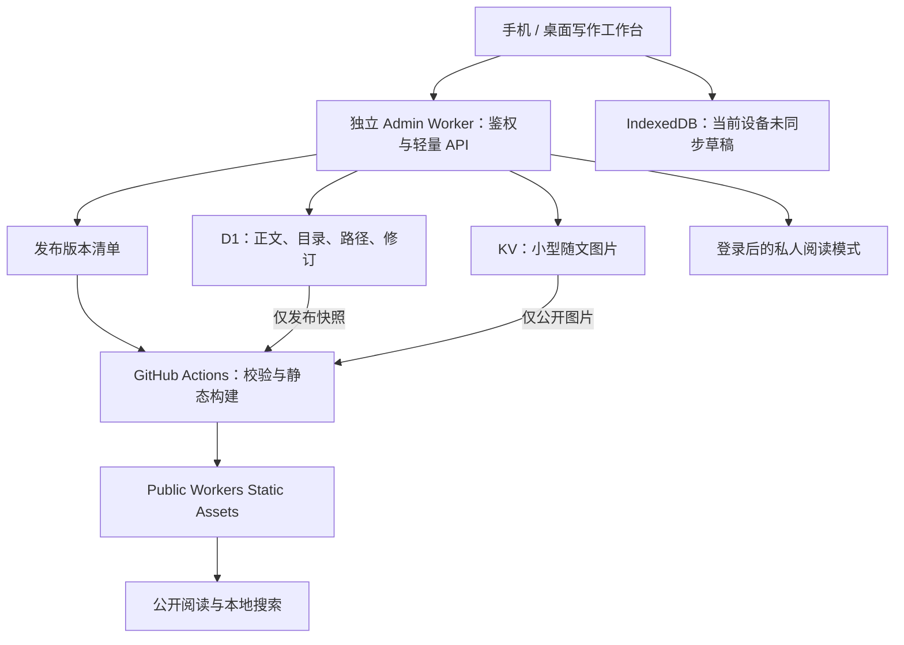

# Color 手记：免费个人知识库改造方案

日期：2026-09-23。性质：调研与产品/技术方案，尚未实施。

后续实施契约见[详细技术设计](./knowledge-platform/01-technical-design.md)与[验收计划](./knowledge-platform/02-acceptance-plan.md)；接口、状态机、权限与验收标准以详细文档为准。

已确认约束：个人学习笔记；手机与桌面都能写、整理、阅读；跨技术、商业、营销等领域；不绑卡、不启用付费产品，超额允许暂停。此次不创建云资源、不改变线上内容和可见性。

## 1. 推荐结论

将产品从「时间倒序博客 + 管理表单」升级成「个人知识库 + 学习路径 + 写作工作台」。

推荐技术组合：

- 公开阅读：Next.js 静态导出 + Fumadocs 阅读与导航基础，部署 Workers Static Assets。
- 管理与私人阅读：React + Vite + shadcn/ui（统一采用 Base UI 版本）静态应用，部署独立 Worker；同源 `/api/*` 使用 Hono。
- 正文、目录、路径、修订：Cloudflare D1 Free，正文仍为可导出的 Markdown。
- 小型随文图片：Workers KV Free，公开版本在构建时复制到静态产物；首版不启用 R2。
- 编辑器：Milkdown Crepe 做可视化 Markdown，保留 CodeMirror 源码模式；先通过中文输入与格式往返验证再定版。
- 构建与发布：GitHub Actions 标准 Linux runner；手动批量发布，日常自动保存不触发构建。

关键取舍：接受公开更新等待一次构建，换取公开阅读不依赖数据库和动态 Worker 配额。私人笔记在登录后的阅读模式中实时可见。

不推荐当前把 Next Admin、better-sqlite3、文件双写、simple-git、Postgres/ISR 全部搬到云上。保留内容契约、Markdown、品牌和测试经验；重做 Admin 外壳与存储适配器。旧部署保留到迁移验收完成。

## 2. 对现有学习方式的理解

阅读样本：

- `content/posts/technical/2026/engineering-practice-hub/index.md`：先建架构/交付/交易/复盘全景，再逐项展开。
- `content/collections/addx-ai/复习索引.md`：按主题、优先级、推荐顺序组织学习。
- `content/posts/notes/2026/dtc-marketing-team-breakdown/index.md`：围绕渠道、职责、指标、工具和方法建立业务结构。
- `content/posts/learning/2026/growth-strategy-basics/index.md`：从目标分解到行为，再连接指标和动作。

据此作出的产品判断：你需要同时回答「这份知识属于哪里」「为了完成某个目标先读什么」「某次实践用了哪些知识」。单层分类和标签不足以表达这三个问题。

不把公司名称作为永久的一级知识分类。通用知识按学科/能力归档，公司或阶段性任务用项目集合承载，换公司后知识仍然能继续使用。

## 3. 免费额度与真实边界

以下为调研时官方公开规则，不是已核实的账户剩余额度；额度通常为账户级，其他应用也会消耗。

| 服务 | 免费额度/限制 | 本项目用途 |
|---|---|---|
| Workers Static Assets | 静态请求免费且不限请求量；Free 每版本 20,000 文件，单文件 25 MiB | 公开 HTML、CSS、JS、图片、搜索索引 |
| Workers Free | 动态请求 100,000/天；HTTP 请求 CPU 时间 10 ms | 登录、自动保存、目录与发布 API |
| D1 Free | 读 500 万行/天，写 10 万行/天；账户总存储 5 GB；单库 500 MB | 文本、目录、关系、受限历史版本 |
| Workers KV Free | 读 100,000 key/天；写 1,000 key/天；存储 1 GB | 小型、不可变随文图片 |
| GitHub Free 私有仓库 Actions | 标准 runner 每月 2,000 分钟，artifact 存储 500 MB | 构建、校验和部署；实际取决于账户计划 |

来源：[静态资源计费](https://developers.cloudflare.com/workers/static-assets/billing-and-limitations/)、[Workers 限额](https://developers.cloudflare.com/workers/platform/limits/)、[D1 计费](https://developers.cloudflare.com/d1/platform/pricing/)、[D1 限制](https://developers.cloudflare.com/d1/platform/limits/)、[KV 计费](https://developers.cloudflare.com/kv/platform/pricing/)、[GitHub Actions 计费](https://docs.github.com/en/billing/concepts/product-billing/github-actions)。

GitHub 没有有效支付方式时超出免费配额会阻止使用。Cloudflare 的免费配额也不能理解为无限资源；D1/KV 超额按官方规则报错，等待配额恢复或清理容量。用户已明确接受这种降级方式。

### 为什么首版不用 R2

R2 Standard 虽有每月 10 GB-month 存储、100 万 Class A、1,000 万 Class B 免费额度，但官方要求开通订阅并经过 checkout，按月用量计费；它不是本方案要求的纯免费硬边界。首版不启用，也不把账单提醒当作自动停费保障。[R2 开通说明](https://developers.cloudflare.com/r2/get-started/)、[R2 价格](https://developers.cloudflare.com/r2/pricing/)。

### 当前体量与容量规划

本地读取结果：`content/` 约 1.10 MiB，`apps/web/public/` 约 7.90 MiB，SQLite 约 0.11 MiB。内容目录字节数不是迁移后数据库大小，静态目录也不是构建后完整产物大小。

容量估算示例，非流量预测：1,000 篇 × 平均 20 KB 约 20 MB；每篇保留 10 份同等大小版本，文本约 200 MB，另加索引、元数据和空间开销。不能把每次击键都永久保存成一份完整版本。

初始产品预算建议：

- D1 接近 300 MB 提醒、400 MB 暂停新增历史快照，保留正文编辑空间；具体阈值留出索引与迁移余量。
- KV 使用量到 700 MB 提醒，800 MB 暂停新图片上传，允许继续纯文本写作与导出。
- 图片目标 100–300 KB，通常上限 1 MB；复杂截图可调整压缩参数，不能为压小图片牺牲图中文字可读性。
- 不上传视频、大型 PDF、设计源文件。保存来源链接或摘要，避免把笔记站做成网盘。
- 示例每天 300 次保存，每次假设 4 行写入，约 1,200 行/天；实际包含索引写入，应看 D1 metrics，而不是只按 HTTP 请求数计算。
- 示例每天 5 次发布、每次构建 3 分钟，约 450 分钟/月；构建耗时必须实测，代码 CI 与其他仓库也占账户额度。

预算提醒只帮助提前收敛使用；不启用付费产品才是此方案的费用边界。默认使用平台免费子域名，自定义域名购买费用不包含在零费用方案中。

## 4. 推荐部署架构



### 内容真源

D1 是云端文字与组织关系的唯一写入真源，KV 只保存附件字节；Markdown 导出和 Git 备份是快照，不作为第二个自动双向同步来源。未来手动改 Markdown，必须通过明确的导入预览/差异合并进入 D1，避免再次出现文件和数据库互相覆盖。

### 为什么 Admin 要调整

现有 Admin 的持久化依赖本地 Markdown、SQLite native 驱动和本机 Git。Workers 即使支持部分 Node API，文件系统也是内存 VFS 与临时目录，不能作为持久内容盘。[Workers 文件系统](https://developers.cloudflare.com/workers/runtime-apis/nodejs/fs/)。

改成静态前端 + 小 API 后，不需要每次访问后台都做 Next SSR。Hono 有官方 Workers 接入路径；D1 适配器仍需重写，不能把 SQLite 文件直接当作运行时数据库挂载。[Hono Workers 指南](https://hono.dev/docs/getting-started/cloudflare-workers)。

10 ms CPU 预算需要原型验证。Markdown 渲染、代码高亮、图片压缩和完整导出打包放浏览器或构建 runner；Worker 只做有界验证、鉴权、数据库访问和小请求转发。不能仅凭「API 很小」就承诺永不超限。

### 图片如何在不启用 R2 时工作

KV 是受限小附件方案，不是通用对象存储替代品。Cloudflare 官方提供 KV 静态资产示例，适用于当前小体量；本项目将资产接口独立，以便未来需求变化时替换。[官方 KV 示例目录](https://developers.cloudflare.com/kv/examples/)。

手机选图 → 浏览器压缩 → Worker 校验大小/类型 → 以内容哈希写入新 key → D1 保存附件元数据。新图片先在本机显示 Blob 预览。KV 存在最终一致性，异地读取可能延迟；图片使用不可变 key，避免覆盖同一 key，发布构建遇到未就绪资产要重试，不能把缺图版本部署出去。[KV 一致性](https://developers.cloudflare.com/kv/concepts/how-kv-works/)。

公开图随静态构建一起分发，正常阅读不经过 Worker/KV；私人图只能由鉴权 API 读取，不使用公开静态 URL。附件引用计数和清理在 D1 中跟踪，回收前保留一段时间，避免删除仍被历史公开快照引用的图片。

### 发布链路

1. 自动保存只更新工作稿；保存状态与公开状态分开。
2. 点击发布，固定本次文档修订号、目录版本和图片引用，生成有界发布清单。
3. 触发构建，用范围受限的构建凭证读取本次公开快照。
4. 校验站内链接、目录排序、资源存在性、私有内容排除和 Markdown 格式，再生成静态页/搜索索引。
5. 部署成功后回报 deployed revision；失败时继续服务旧版本，后台提供重试。

构建按版本隔离，多个发布合并/排队，防止较旧任务覆盖较新版本。不引入常驻 Outbox worker 或复杂队列；保留一张发布记录表、明确状态和幂等键即可。

公开转私有要等待旧静态页面和相关搜索索引完成撤下，界面必须显示「撤回中」，不能保存一成功就宣称已私密。已经公开的内容也无法保证从第三方副本中收回。

### 免费故障降级

数据库/动态请求额度不足：静态公开站继续读，后台保留本机草稿并暂停云同步。构建额度不足：旧公开版本继续提供服务，待发布内容保留。附件额度不足：允许继续纯文本写作。云同步失败不能提示「已保存到云端」。

本机 IndexedDB 是恢复缓冲，不是跨设备同步和永久备份。备份应独立导出 Markdown、组织关系 JSON、附件清单与图片，定期下载到本地；有需要再写入私有仓库，并实际做恢复演练。

## 5. 信息架构：归属、顺序、实践分别表达

核心模型：**领域 → 主题 → 笔记**，再用**学习路径**与**项目集合**引用同一份笔记。

| 对象 | 回答的问题 | 例子 |
|---|---|---|
| 领域 | 这属于哪块长期知识？ | 技术与工程、商业与增长 |
| 主题 | 具体研究什么？ | 广告投放、前端架构、用户研究 |
| 笔记 | 当前这份知识是什么？ | UTM 规范、归因窗口、缓存失效 |
| 学习路径 | 为了一个目标，按什么顺序学？ | 从零完成一次广告投放 |
| 项目集合 | 这次实践涉及什么资料？ | 公司商业化调研、某次大促复盘 |
| 标签/别名 | 如何跨领域找到相关材料？ | GA4、归因、实验、Meta |

一篇笔记只有一个主归属，可以被多条路径和多个项目引用；不复制正文。学习路径的排序存在 path items 中，不写死在笔记标题或 URL。分类树负责定位，路径负责学习顺序。

初始结构建议，后续可新增领域：

```text
知识库
├─ 技术与工程
│  ├─ 前端基础与架构
│  ├─ 设计系统与工程协作
│  ├─ 交易与支付
│  ├─ 性能与可观测性
│  └─ AI 工程实践
├─ 产品与设计
│  ├─ 用户研究与需求
│  ├─ 产品策略
│  └─ 体验与交互
├─ 商业与增长
│  ├─ 商业模式与价值主张
│  ├─ 市场、用户与竞争
│  ├─ 品牌与内容策划
│  ├─ 获客渠道（广告 / SEO / 社媒 / 联盟 / PR）
│  ├─ 转化与电商运营
│  ├─ 留存与客户经营
│  └─ 数据、归因与实验
├─ 学习与工作方法
└─ 阅读与生活

学习路径
├─ 建立电商系统全景
├─ 从零理解公司商业化
└─ 从零完成一次广告投放

项目集合
├─ 公司商业化研究
├─ 一次营销活动策划与复盘
└─ 阶段性面试准备

收件箱（仅自己可见）
```

树通常保持 2–3 层，最多先支持 4 层展示；不是把所有可能学科提前建成空目录。未想好归属的内容可先进入收件箱，整理时再归档。

### 具体示例：从零理解公司商业化

1. 公司提供什么价值：产品、客户、问题。
2. 收入从哪里来：定价、商业模式、关键成本。
3. 市场和客户如何细分：竞争、定位、目标人群。
4. 如何获客：渠道角色、预算、广告与内容。
5. 如何转化：落地页、商品、促销、购买流程。
6. 如何留存：服务、邮件、复购和客户经营。
7. 如何衡量：埋点、归因、漏斗、实验与复盘。

这是学习组织顺序，不是对你所在公司实际商业模式的断言。每一步可先只有一个问题清单，逐步挂上已有笔记。

一篇「GA4 购买漏斗」主归属在商业与增长/数据、归因与实验，也可出现在广告投放路径、电商工程路径和公司商业化项目中。每次从路径进入时带上 path context，上一篇/下一篇沿该路径走；从主题进入则沿主题排序，不混淆两种顺序。

### 状态与权限

不要把所有含义塞进 draft/published：

- 文稿状态：草稿、可发布、归档。
- 知识成熟度：待整理、已整理、已验证、待更新，默认折叠，首版可以只实现前两项。
- 可见性：仅自己、公开；以后有必要才加「公开但不索引」。

新笔记默认仅自己可见。私人内容不进入公开 HTML、JSON、搜索索引、sitemap、图片和构建日志。组织在某个项目中不会自动决定公开性。

旧 noindex 专栏不等于私密；迁移前逐项列出权限映射，不能直接批量公开或假定原来已经被保护。

## 6. 阅读端：知识库优先的安静界面

主导航：**知识库 · 学习路径 · 项目 · 最近更新**，全局搜索始终可达。「关于」放次级位置。

公开首页展示领域、推荐学习路径与最近更新；登录后的个人入口优先展示继续阅读、正在学习、最近编辑、待整理收件箱。不要将个人历史、私人路径标题放入公共首页数据。

桌面：左侧 240–280px 可收起主题树，中间 680–760px 正文，右侧约 200px 页内目录；屏幕不足时先收起右侧目录，再把左侧变抽屉。不能在 1024px 宽度硬塞三栏。

手机：顶部保留返回、标题/主题、搜索；「知识目录」打开领域/主题树，「本篇目录」打开章节列表，名称和操作明确分开。正文单列；文末展示路径进度、上一篇/下一篇与少量相关笔记。阅读位置恢复以稳定文档 ID 为键，跨设备同步可后置。

### 排版基线（设计目标，需样本测试）

| 项目 | 建议 |
|---|---|
| 正文字体 | 系统中文无衬线优先；代码继续等宽；避免全站等宽 |
| 正文字号 | 手机默认 17px；桌面默认 18px；提供小/标准/大 |
| 行高 | 1.75–1.9，随字号和中文样本微调 |
| 宽度 | 桌面正文 680–760px；手机边距 16–20px |
| 标题 | 明显层级但避免正文首屏被超大标题占满 |
| 背景与颜色 | 保留暖中性色和少量陶土点缀；取消正文区纹理、重阴影与卡片套卡片 |
| 表格 | 表内横滚、提示有横向内容；不把表格缩成难读小字 |
| 代码/图表 | 复制按钮、代码横滚；大图全屏查看；静态正文无需等图表初始化 |

交互反馈应即时，取消正文滚动浮现造成的隐藏依赖。目录高亮、面包屑、当前位置、阅读路径进度共同帮助定位。

验收基线：普通文字对比度至少 4.5:1，320px 宽度正文不造成页面横滚，保留可访问焦点和减少动态效果；触控目标以 44px 为产品目标。44px 是本方案目标，不冒充所有 WCAG AA 场景的统一门槛。[WCAG 2.2](https://www.w3.org/TR/wcag/)。

### 搜索

公开搜索在构建期生成本地索引，浏览器按需加载；不引入付费搜索服务。结果显示「标题 + 领域/主题 + 命中段落 + 内容类型」，支持仅当前领域。中文、中英混写、缩写和别名用真实笔记验收，例如「付费获客 / 广告投放 / Paid Ads」「埋点 / tracking」。

私人搜索独立鉴权，覆盖有权限的笔记正文，按需取回命中片段；自然语言检索和引用问答见第 12 节。不能把公开索引下载到浏览器后简单隐藏私人结果来实现权限隔离。

## 7. Admin：围绕写作和整理重做

工作台主区：**收件箱、知识库、学习路径、项目、发布记录**。设置和媒体管理放次级导航。第一屏优先是「继续编辑 / 新建笔记 / 待整理」，不堆概览数字。

| 场景 | 桌面 | 手机 |
|---|---|---|
| 找笔记 | 左侧树 + 内容列表 + 全局搜索 | 单列列表，目录抽屉与搜索入口 |
| 写正文 | 主编辑区，可选分栏预览 | 全屏单列；编辑/预览切换 |
| 改属性 | 右侧可折叠属性面板 | 「属性」独立面板；标题和正文不被挤压 |
| 移动/排序 | 拖拽 + 菜单 | 上移、下移、移到…；不依赖长按拖拽 |
| 编排路径 | 章节清单引用已有笔记 | 分步选择笔记，明确排序与当前章节 |
| 发布 | 本次修改清单与公开范围预览 | 同样的确认摘要，按钮避开软键盘 |

新建只要求标题与内容，主归属可先用收件箱。摘要、封面、日期、标签不强迫每次填写。专题封面可选，普通知识笔记不需要为保持列表整齐上传装饰图。

### 编辑体验

默认可视化 Markdown：段落、标题、列表、链接、图片、表格、代码块；保留源码入口和前台同款阅读预览。未知 Markdown 结构保留原文，不允许切换编辑模式后静默删掉 Mermaid、脚注、嵌套列表或自定义语法。

自动保存分三层：当前设备已保存 → 云同步中 → 已同步；公开发布另外显示。输入 debounce 只提交有变化的内容，中文输入法 composition 期间不触发破坏光标的回填。服务端用 expectedVersion 检测冲突；保存成功只更新确认版本，不覆盖保存后继续输入的文字。

手机重点验证软键盘、选择文字、粘贴长段、插入图片、工具条滚动、横竖屏和网络切换。支持本机恢复和手动导出；多设备并发冲突首版给差异和选择，不做自动最后写入覆盖，也不引入多人协作服务。

## 8. 组件与文档站调研结论

以下选型来自当前官方文档，适合程度为本项目判断，不是所有产品的通用排名。

| 候选 | 能提供什么 | 决策 |
|---|---|---|
| Fumadocs | React 文档布局、页面树、目录、搜索、静态构建 | 阅读端优先；保留现有 React/Next 资产，改造范围更集中 |
| Astro Starlight | Markdown 文档站、导航与默认 Pagefind 搜索 | 轻量备选；若完全放弃 Next 可考虑，但需要维护 Astro + React 两套视图 |
| shadcn/ui + Base UI | 可定制的侧栏、菜单、抽屉、表单与交互底座 | Admin 首选；只引入需要的组件，统一一种 primitive |
| HeroUI v3 | React Aria + Tailwind v4，预制风格与交互 | 有竞争力的备选；本次更需要贴合知识树和编辑器，倾向 shadcn 定制 |
| Milkdown Crepe | Markdown 导向的可视化编辑器，插件和源码转换体系 | 编辑器首选原型，必须通过真实文档往返和手机 IME 验证 |
| Tiptap | 灵活的富文本框架，开源核心与扩展 | 备选；官方 Markdown 模块仍标 Beta，需要避免格式转换风险 |

来源：[Fumadocs Core](https://www.fumadocs.dev/docs/headless)、[静态构建](https://www.fumadocs.dev/docs/deploying/static)、[Starlight 搜索](https://starlight.astro.build/guides/site-search/)、[shadcn Sidebar](https://ui.shadcn.com/docs/components/base/sidebar)、[Base UI](https://base-ui.com/react/overview/about)、[HeroUI v3](https://heroui.com/en/docs/react/getting-started)、[Milkdown Crepe](https://milkdown.dev/docs/guide/using-crepe)、[Tiptap Markdown](https://tiptap.dev/docs/editor/markdown)。

Fumadocs 可以静态保存索引、在浏览器计算搜索，不需要 Orama Cloud。当前 Fumadocs UI 文档要求 Tailwind v4；现有项目为 Tailwind v3，因此不能把它当作无成本替换。实施时新开阅读外壳并锁定兼容的 Next/React/Fumadocs 版本，再迁入页面。[Fumadocs Theme](https://www.fumadocs.dev/docs/ui/theme)。

网站可直接参考上述官方文档本身：Fumadocs 的位置导航、Starlight 的长文阅读和移动目录、shadcn 的工作台侧栏。只借鉴交互结构与排版，不直接复制一套与个人笔记不符的产品营销首页。

组件库不能保证最终移动体验。中文 IME、软键盘、表格和内容保真测试通过前，编辑器选型仍是待验证结论。首版只用开源组件，不引入 Pro 模板、托管协作、AI 写作收费功能。

## 9. 代码与数据重构范围

建议最终边界：`apps/web`（公开静态阅读）、`apps/admin`（写作与私人阅读）、`apps/api`（Worker API）、`packages/core`（无 Node 持久化依赖的领域契约）、`packages/content-renderer`（共享 Markdown/目录/URL 处理）。共享 UI 仅提取确实跨端复用的部分。

核心数据：domains、topics(parentId)、notes(homeTopicId, bodyMarkdown, version, visibility)、paths、pathItems(noteId, order)、projects、projectNotes、assets、bounded revisions、publications、legacyAliases。首版不做图数据库；反向链接从 Markdown 解析与引用表生成即可。

稳定 ID 是内容身份，URL slug 独立于分类树。移动主题不会改变文章地址。原 `/posts/*` 和专栏旧链接建立映射，迁移时自动检查，不依赖用户手工改几十处引用。

现有 posts 和 collection items 统一到 notes；collection 的用途分别映射到主题、路径或项目。不能机械地把四个专栏全部变成一级领域。

将 Markdown 作为文本数据处理；不要允许后台输入任意可执行 MDX/JavaScript 后进入构建，目录和编辑器也不需要这一能力。

## 10. 分阶段实施与验收

### 阶段 A：先验证最难的三个问题

用真实长技术文、营销表格文、带 Mermaid 的专栏笔记做小原型：

1. 390px 与桌面的阅读页/目录/路径是否明显更容易使用。
2. 手机中文连续输入、粘贴、保存期间继续写，是否不丢内容；Markdown 往返是否保真。
3. Workers Free 上鉴权、D1 CRUD、受限 KV 图片上传是否保持 CPU 余量；拒绝通过开通付费版掩盖原型超限。

这三项不过，不批量迁移、不继续堆功能。

### 阶段 B：内容模型与只读迁移预览

生成旧内容 → 新领域/主题/路径/项目映射表；旧 URL 映射；状态与可见性清单；保留原始 Markdown 与 SQLite 备份。针对原有 30 篇文章、60 篇专栏条目核对数量、内容哈希和附件，不以文件数量代替业务条目数量。

### 阶段 C：工作台与阅读端

实现新建、编辑、自动保存、移动、排序、路径编排、私人阅读、静态公开阅读与搜索。新旧编辑器不同时写同一真源；验证期新环境用拷贝，切换后旧后台只读。

### 阶段 D：发布与切流

测试公开/私有隔离、发布失败回滚、撤回流程、断网恢复、免费额度失败、备份恢复和旧链接。后台显示保存版本与部署版本。然后切到免费子域名，旧站保留迁移说明和可行的兼容链接。

### 必须达到的使用标准

- 360/390px、768px、1280/1440px 布局可操作；至少实际验证 iOS Safari、Android Chrome 和桌面浏览器。
- 每篇笔记清楚显示领域/主题，路径入口显示当前章节和下一步。
- 手机正文有章节目录；全局知识目录与页内目录不混淆。
- 保存过程中继续输入不丢字，断网不误报云保存；重开能恢复本机草稿。
- 私人正文、标题、索引、附件不会进入公开产物。
- 新建跨行业领域不需要改页面代码。
- 所有旧内容有映射或明确排除原因；所有公开内部链接可达。
- 账户仍为免费配置，没有启用 R2、Workers Paid 或付费搜索/编辑器服务。

## 11. 本期不做

多人协同编辑、实时协作光标、AI 自动分类、无限历史版本、大文件网盘、复杂知识图谱首页、SSR/ISR 多套并行部署、Redis 与常驻任务进程。根据新增的自然语言查询需求，免费向量检索改为第 12 节中的可选增强。

先把「归档清楚、按顺序学、手机顺手写、长文轻松读」做好，再按真实使用增加能力。

## 12. 新增需求：全笔记搜索与自然语言查询

推荐提供「找笔记」和「问笔记」两个入口，共用领域、主题、学习路径和项目筛选。前者返回来源列表，后者基于检索结果生成带章节引用的回答。自然语言语义检索不必每次生成回答。

### 实现与数据流

1. D1 保留笔记正文、版本、可见性及结构关系，继续作为内容真源。公开全文索引在静态构建中生成；私人全文索引在鉴权后使用，不能进入公开构建产物。中文需要分词或字符级索引，并验证中英混写、缩写与别名。
2. 将笔记按标题与段落分块，尽量保留完整代码块和表格；每块关联 noteId、revision、chunkId、章节锚点及所属领域。首轮统计实际片段数量，不能按文章数量估算向量存储。
3. 使用 Workers AI 的多语言嵌入模型（候选 bge-m3）生成向量，写入 Vectorize。内容哈希未变不重新嵌入；初次导入可以分日完成。该步骤会将待索引正文发送至 Cloudflare 模型服务。
4. 查询先鉴权，再结合关键词匹配和向量召回；精确术语、标题命中与语义相似结果合并排序。向量检索施加权限范围，取回结果后再通过 D1 校验当前权限、删除状态和版本，禁止将过期或无权限片段送给生成模型。
5. 「找笔记」展示标题、领域/主题、命中章节及摘要。「问笔记」仅向免费套餐可用的生成模型提交少量授权片段，输出结论与可点击章节引用。证据不足时明确说明当前笔记未记载；学习顺序优先使用已维护的路径关系。
6. 更新、删除、改可见性时同步失效索引和问答缓存。索引失败可重试，后台显示已保存版本与已索引版本；缓存按权限范围和内容版本隔离。笔记中的指令视作资料，不能改变系统规则或触发工具动作。

### 免费约束（2026-09-23 核对）

| 产品 | Workers Free 可用额度 | 设计约束 |
| --- | --- | --- |
| Workers AI | 10,000 Neurons/日 | 嵌入和回答均消耗额度；不是 10,000 次提问；免费额度耗尽后操作失败 |
| Vectorize | 存储 500 万向量维度；每月查询 3,000 万向量维度 | 按片段数 × 模型维度估算容量；查询额度不是查询次数 |

保持 Workers Free，不开通 Workers Paid、不充值 AI Gateway，不选择要求付费方式的模型。产品文档确认免费计划支持上述服务；当前账户的具体模型与 Vectorize 写入权限尚未实测，不能将此前连接成功等同于 AI 已可用。

首版建议仅登录后的本人可使用语义检索与问答，公开访客使用全文搜索。点击提交才调用 AI，限制问题长度、上下文、输出长度与每日调用量；AI/向量额度不足或服务失败时降级为全文搜索，不影响写作和阅读。图片内文字识别不自动包含在本期全文检索中，图片说明可检索，OCR 另行评估。

实施顺序：全笔记全文检索 → 中文混合检索 → 带引用问答。用至少 20 个真实问题验收精确术语、同义表达、跨笔记问题、无答案问题及权限隔离；测试删除与改私有后不会引用旧内容。实际中文效果、延迟、片段容量和每日可回答次数以原型测量为准。

官方依据：[Workers AI 价格与免费限制](https://developers.cloudflare.com/workers-ai/platform/pricing/)、[Vectorize 免费额度](https://developers.cloudflare.com/vectorize/platform/pricing/)、[多语言嵌入 bge-m3](https://developers.cloudflare.com/workers-ai/models/bge-m3/)。
