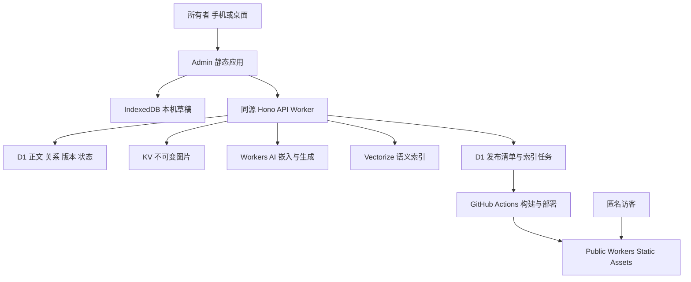

# Color 手记知识库：详细技术设计

版本：1.0 · 2026-09-23 · 状态：待实施

关联：[文档入口](./README.md) · [验收计划](./02-acceptance-plan.md)

## 1. 需求与边界

| 编号 | 需求 | 成功表现 |
| --- | --- | --- |
| R01 | 不绑卡、免费托管 | 不启用任何付费套餐或预充值，超额明确降级 |
| R02 | 手机和桌面管理 | 新建、编辑、组织、传图、发布无需切换设备完成 |
| R03 | 长文易读 | 中文正文、代码、表格、目录在手机与桌面均可读 |
| R04 | 跨领域知识组织 | 领域/主题决定归属，路径决定顺序，项目表达实践 |
| R05 | 图片上传 | 手机选图、压缩、预览、重试、插入与公开发布完整闭环 |
| R06 | 全笔记搜索 | 搜索所有有权访问笔记的标题与正文，支持中文和筛选 |
| R07 | 自然语言查询 | 同义表述可找到笔记，问答提供可核验章节引用 |
| R08 | 私密与发布隔离 | 私人内容不进入公开页面、索引、附件和缓存 |
| R09 | 数据可靠 | 不丢字、不覆盖并发修改，支持迁移、备份与恢复 |
| R10 | 维护与扩展 | 内容可导出、分类可配置、云存储与检索适配器可替换 |

首版是单所有者知识库。匿名用户只能阅读已部署的公开版本。AI 首版仅供所有者使用。不包含多人协同、OCR、视频/大文件托管、AI 自动分类、复杂知识图谱、任意代码执行式 MDX。

本设计改变技术目标，不在本次文档任务中执行数据迁移或开通产品。

## 2. 现状与选型决策

基线 `66270bb`：pnpm monorepo；`apps/web` 为 Next 静态阅读端，`apps/admin` 含 Next 管理与 API；`packages/core` 含本地文件/SQLite 和 PostgreSQL 部署适配。现有内容审计基准为 30 篇 posts（含 7 篇草稿）和 60 篇 collection 条目。迁移执行时重新盘点，不硬编码这些数量。

| 决策 | 目标 | 原因/代价 |
| --- | --- | --- |
| ADR-01 | D1 唯一正文真源；Markdown 导出 | 消除文件/数据库双写；需实现 D1 适配 |
| ADR-02 | Next 静态导出 + Fumadocs | 公开阅读低运行成本；发布需等待构建 |
| ADR-03 | Vite/React + shadcn Base UI；Hono Worker | 前后台独立；放弃后台 Next SSR 和本机 Git 写入 |
| ADR-04 | Milkdown Crepe 候选 + CodeMirror 源码 | 可视化与 Markdown 并存；通过保真/IME 门槛才定版 |
| ADR-05 | KV 存小图；公开图片进入静态产物 | 满足不启用 R2；承担最终一致性与容量约束 |
| ADR-06 | 静态全文 + 本人浏览器全文 + Vectorize 混合检索 | 全文不依赖 AI；语义索引可重建 |
| ADR-07 | GitHub OAuth 单所有者登录 | 无自建密码库；OAuth App 需配置，独立于发布凭证 |
| ADR-08 | 批量静态发布；串行部署 | 不用 SSR/ISR、Postgres、Redis、常驻队列 |

锁定依赖前建立兼容矩阵：Node/pnpm/Next/React/Fumadocs/Tailwind/编辑器/Wrangler 版本、许可证、静态导出与构建结果。现有 Tailwind v3 不直接混入需要 v4 的新外壳。若候选无法通过免费 CPU、格式保真或移动端门槛，记录 ADR 修订后替换，不以付费升级解决。源码编辑器是必须交付的保真退路。

## 3. 部署、仓库与运行边界



目标目录：

```text
apps/web/                 公开静态页；只读公开快照
apps/admin/               Vite 写作、组织、私人阅读与搜索
apps/api/                 Hono 路由、鉴权、D1/KV/AI 适配器
packages/core/            领域类型、校验、状态机、版本契约；不导出 native DB
packages/content-renderer/统一 Markdown、锚点、链接与安全渲染
packages/search/          分块、中文索引、合并排序；纯逻辑
scripts/knowledge/        迁移、备份、发布、索引构建与验证
infra/cloudflare/         Wrangler 配置与 D1 SQL migrations
```

迁移期间新 Admin 在隔离目录/预览部署开发，避免破坏现有入口；通过门槛后再替换 `apps/admin`。保留历史 core native 模块供旧迁移工具使用，以单独入口隔离，Worker 构建不得依赖 `better-sqlite3`、`fs` 持久写入或 `simple-git`。

两个部署单元：公开站只有静态资产；Admin 的 `/api/*`、`/auth/*`、`/internal/*` 必须先交给 Worker，其余走 SPA 静态资产。未知 API 返回 JSON 404，不能回退成 index.html。默认免费 `workers.dev` 子域名，公开站和后台不同 origin。公开站不获取私人数据，不配置跨域凭证共享。

开发使用本地模拟 D1/KV 和假 AI；预览与生产使用不同 bindings、OAuth callback 和 secrets。预览默认只放合成数据，不镜像真实私人笔记。首次实际创建资源前验证账户 Free、产品权限与无付费订阅；当前已知连接成功只证明部分读取 API 可用。

Worker 做有界 JSON 校验、鉴权、SQL、网络编排；全文索引构建、Markdown AST、代码高亮、图片压缩、打包导出放浏览器或 runner。重计算不能藏进 `waitUntil` 来绕过 CPU 限制。

## 4. 领域模型与 D1 契约

### 4.1 内容组织

- 领域是长期知识范围；主题树最多四层，禁止环和跨领域父子关系。
- 笔记仅一个主主题；`home_topic_id=null` 表示收件箱，不公开。
- 路径、项目只引用笔记 ID，不复制正文；删除路径不删除笔记。
- 路径项可以有章标题和学习说明；同一路径首版不重复引用同一笔记。
- 主题/路径/项目支持 `owner/public` 可见性；只有公开容器和公开笔记关系才导出，空私人容器名称不泄漏。
- 领域、主题与标签名称通过后台配置；公司名称通常作为项目，不固化进代码。

### 4.2 表契约

所有业务 ID 使用随机稳定 ID；时间存 UTC ISO 字符串；布尔用 0/1；JSON 必须经 schema 校验。下表为目标迁移契约，不是已存在的表。

| 表 | 关键字段与约束 |
| --- | --- |
| domains | id PK, name, slug UNIQUE, position, visibility, version |
| topics | id PK, domain_id FK, parent_id FK nullable, name, position, visibility, version |
| notes | id PK, slug UNIQUE, title, body_markdown, home_topic_id FK nullable, editorial_state, maturity, desired_visibility, version, body_hash, last_mutation_id, updated_at, deleted_at |
| note_revisions | (note_id,version) PK, snapshot_json, body_hash, created_at, reason；被部署/备份引用的版本不可 GC |
| tags / note_tags | tag id/name/aliases；(note_id,tag_id) UNIQUE |
| paths / path_items | 路径元数据/version/visibility；(path_id,note_id) UNIQUE, position |
| projects / project_notes | 项目元数据/version/visibility；(project_id,note_id) UNIQUE, position |
| assets | id PK, kv_key UNIQUE, sha256, mime, bytes, width, height, state, created_at, delete_after |
| asset_refs | (asset_id,note_id,revision) UNIQUE；包括历史快照引用 |
| publications | id PK, seq UNIQUE, status, manifest_hash, created_at, workflow_run_id, deployed_at, error_code |
| publication_items | (publication_id,note_id) PK, revision, public_path；冻结本次导出集合 |
| publication_snapshots | publication_id PK, navigation_json, aliases_json, asset_manifest_json；发布时固定 |
| deployment_state | singleton PK, latest_requested_seq, deployed_seq, deployed_manifest_hash |
| legacy_aliases | old_path PK, note_id FK, target_path；禁止循环映射 |
| sessions | token_hash PK, github_user_id, expires_at, created_at；token 不明文入库 |
| operations | (scope,idempotency_key) PK, payload_hash, result_json, expires_at |
| search_chunks | id PK, note_id, revision, ordinal, heading, anchor, text, content_hash, index_generation |
| search_jobs | id PK, note_id, target_version, state, attempts, retry_after, lease_until, error_code |
| search_state | singleton PK, corpus_revision, lexical_revision, semantic_generation, model_id |
| usage_counters | (feature,window_key) PK, reserved, completed；应用级限额不是平台剩余额度 |

必需索引：notes(home_topic_id,updated_at,id)、notes(deleted_at,updated_at,id)、topics(domain_id,parent_id,position)、path_items(path_id,position)、project_notes(project_id,position)、asset_refs(asset_id)、search_chunks(note_id,revision)、search_jobs(state,retry_after)、sessions(expires_at)。参数化 SQL；列表使用游标分页，默认 30、最大 100，禁止日常全表扫描。

编辑状态 `draft/ready/archived` 与 `desired_visibility=owner/public` 分离。`ready + public + 已归属` 才可进入新的公开清单；页面是否实际公开必须查询已部署清单，不能根据 desired_visibility 猜测。归档不等于删除；已公开内容归档需要执行撤回。新建默认为 draft/owner。

首版单篇正文上限 256 KiB UTF-8；API JSON 上限 320 KiB，超限返回 413 和拆篇建议。路径一次最多 200 项、排序请求最多 200 ID，主题树总节点首版预算 500。以上是可配置应用边界，非平台额度。

### 4.3 原子保存和版本

保存请求包含 `expectedVersion` 和 `clientMutationId`。CAS 更新条件为 `id=? AND version=? AND deleted_at IS NULL`。仅一个调用可使版本递增；零行更新必须返回 409，不视为成功。

实现原子单元包括正文、必要修订、语料版本与待索引标记。采用 D1 batch 事务和数据库约束/触发器：例如成功更新 notes 后的触发器生成修订和 search_jobs，CAS 未命中则触发器不运行。不能在 batch 内无条件插入修订/任务后再根据零行结果决定是否失败。实施时提供完整 SQL 与竞争测试。[D1 batch 事务语义](https://developers.cloudflare.com/d1/worker-api/d1-database/)。

元数据移动、路径排序同样携带容器 expectedVersion，完整排序列表必须与当前成员集合一致。跨表变更使用事务；从一个主题移到另一个主题不会改变 note ID 和 URL。

幂等结果必须与业务提交处于同一原子单元：先查 operations，若不存在则执行带 clientMutationId 的 CAS，成功后通过同事务内受 last_mutation_id 条件约束的 SQL 写入 operations。并发同键由唯一约束和事务回滚处理，再读取已提交结果；不能在业务提交后单独记幂等日志。幂等记录至少保留七天；更晚的重试以 expectedVersion 冲突阻止重复更新。所有影响组织/正文/权限的成功写入同时递增 corpus_revision，保证发布预览和搜索快照的版本比较有效。

## 5. 鉴权、安全与权限

GitHub OAuth authorization code flow，只接受配置的 GitHub 数字 user ID；不以可变用户名或邮箱字符串授予权限。登录请求生成一次性 state，短时绑定浏览器，验证 callback、state、过期和重放；使用当前 GitHub 支持的 PKCE，交换后只取身份，不申请仓库写权限。登录 token 不复用为构建凭证。[GitHub OAuth 官方流程](https://docs.github.com/en/apps/oauth-apps/building-oauth-apps/authorizing-oauth-apps)。

会话使用随机高熵 token，D1 只存 SHA-256；Cookie 为 `__Host-cblog_session`、Secure、HttpOnly、SameSite=Lax、Path=/，绝对有效期七天，退出即删除记录。生产不提供静态开发密钥绕过；401 时保留本机草稿，重新登录后继续同步。

所有写接口拒绝非同源 Origin 并校验 CSRF token；CORS 不放行任意 origin。私人响应和认证接口 `Cache-Control: private, no-store`，不进 CDN 公共缓存。ID 猜测也必须逐请求鉴权。注销默认清除该账户本机私有索引、草稿和 Blob；若有未同步内容先提示导出或取消注销，不静默删除。

Markdown 当作数据：禁用任意 MDX/JS、默认过滤 raw HTML；链接 scheme allowlist，外链 rel=noopener；代码块按文本渲染；Mermaid 使用严格配置且无脚本执行。图片初版仅 JPEG/PNG/WebP，不允许 SVG/HTML。CSP、nosniff、frame-ancestors 与 referrer policy 在两端显式配置并测试，不把 CSP 当作过滤替代。

日志只记录 requestId、操作、耗时、行数、错误码与脱敏 ID；不记录正文、问题全文、cookies、模型上下文或 OAuth code。生产 secret 不入 Git、不进入前端 bundle。发布/索引服务凭证与用户会话分离并可单独吊销。

## 6. API 契约（目标）

通用前缀 `/api/v1`；所有本节接口默认需要所有者登录，OAuth callback 和范围受限 internal 接口除外。成功 `{data,meta:{requestId}}`；失败 `{error:{code,message,retryable,details?},meta:{requestId}}`。不能透传 SQL、内部路径或密钥。

| 方法与路径 | 请求/结果 | 关键行为 |
| --- | --- | --- |
| GET /auth/github；GET /auth/callback | OAuth 跳转/回调（无 API 前缀） | state/PKCE 校验；拒绝非所有者 |
| GET /session；DELETE /session | 当前用户/退出 | 不返回 session token |
| GET /notes?cursor&topic&state | 摘要列表/nextCursor | 不在列表携带全部正文 |
| POST /notes | title, bodyMarkdown?, clientMutationId | 201，owner/draft，返回 id/version |
| GET /notes/:id | 正文、版本、发布与索引状态 | deleted 返回 404 |
| PATCH /notes/:id | expectedVersion, clientMutationId, patch | 成功返回 version/bodyHash；不强制回填编辑器 |
| DELETE /notes/:id | expectedVersion | 软删除；如已公开则创建撤回需求 |
| GET/POST/PATCH /domains、/topics | 组织结构与版本 | 防环、深度、父级归属检查 |
| GET/POST/PATCH /paths、/projects | 容器与引用项 | 不复制正文 |
| PUT /paths/:id/items；/projects/:id/items | expectedVersion, orderedNoteIds | 原子排序；重复/遗漏拒绝 |
| POST /assets | 二进制 + MIME + idempotency key | 最大 1 MiB，返回 assetId/state |
| GET /assets/:id | 鉴权图片字节 | 上传暂未可读返回可重试状态；不公开 KV |
| GET /publications/preview | 待变更/撤回/附件/无效链接摘要 | 不启动构建 |
| POST /publications | expectedCorpusRevision, idempotencyKey | 202，固定快照；变化则 409 重预览 |
| GET /publications/:id | state, deployedSeq, errors | 区分已保存与已发布 |
| POST /publications/:id/retry | 同一快照重试 | 不创建不同内容的同名版本 |
| GET /search/corpus?cursor&revision | 有权限的全文分块/分页 | 快照分页；变化重启加载，no-store |
| POST /search/semantic | query, filters, corpusRevision | 命中 id/heading/score；仅所有者 |
| POST /search/answer | query, filters, lexicalCandidateIds | 服务端校验候选与召回；返回引用结构 |
| GET /search/status | lexical/semantic revision、降级原因 | 不把“尚未索引”误报为空知识库 |
| GET /exports/manifest；GET /exports/notes?cursor | schemaVersion、分页内容及附件清单 | 客户端打包；不在 Worker 打全库 ZIP |

internal 接口包括按 publication ID 读取公开快照、部署回调、索引任务领取/完成。构建凭证只能读绑定 publication 的公开数据；索引凭证允许读取当前所有者语料但不能部署。请求签名包括 method/path/bodyHash/timestamp/nonce，五分钟窗口且 nonce 防重放。固定仓库与 workflow，不允许请求指定任意下载地址或任意 workflow。

状态码：400 非法输入；401 未登录；403 非所有者/权限拒绝；404 不存在；409 版本冲突；413 大小超限；422 发布校验失败；429 应用/平台额度；503 依赖不可用。可重试错误提供 Retry-After，指数退避加抖动，最多自动三次；版本冲突不可自动覆盖重试。

幂等键相同且 payloadHash 相同返回首次结果；同键不同载荷返回 409。保存重试使用同一 clientMutationId；一次修改不能产生多个逻辑版本。

## 7. Admin 与保存状态机

### 7.1 页面与交互

入口为收件箱、知识库、学习路径、项目、发布；媒体和设置为次级。首页突出继续编辑、新建和待整理，不以统计卡片占满首屏。

| 操作 | 桌面 | 手机 |
| --- | --- | --- |
| 查找/整理 | 树 + 列表；可收起属性栏 | 单列列表，树用抽屉 |
| 编辑 | 中间正文，按需预览/属性 | 全屏单列，编辑/预览切换 |
| 排序/移动 | 拖拽及菜单两套入口 | 上移/下移/移到，不依赖拖拽 |
| 属性 | 右栏 | 独立 sheet，返回恢复光标 |
| 发布 | 变更摘要和明确公开范围 | 同样摘要，底部操作避开键盘 |

新建只要求标题，允许空正文先进入收件箱；发布前才校验非空内容和归属。工具栏支持键盘操作；弹层焦点陷阱、Escape 关闭、关闭后焦点回原入口；加载、空态、错误和重试均有明确文本。危险操作具名显示对象，不只写“确定”。

### 7.2 自动保存

客户端记录 `editGeneration`、`ackedGeneration`、`baseVersion` 和 `pendingMutationId`。输入先更新内存，300 ms 内尽力持久化 IndexedDB；失败显示“仅当前页面，尚未保存”，允许下载 Markdown。停止输入 1.5 秒后同步，单篇只允许一个请求在途。composition 期间不回填正文、不重建编辑器。

状态：`dirty → local_saved → syncing → synced`；分支为 offline、conflict、quota_blocked、local_error。只有服务器确认的 generation 等于当前 generation 才显示“已同步”；保存 A 时继续输入 B，A 的响应只推进 baseVersion，再提交 B，绝不以 A 覆盖 B。页面隐藏触发尽力本地保存，但不承诺浏览器被强杀前的未落盘字符必定保留。

409 冻结自动同步、保存本机副本，展示服务器版本和本机版本，可选择保留服务器、复制为新笔记或人工合并后基于新版本提交；没有默认“本机覆盖云端”。重新打开先比较本机 baseVersion 与服务器版本，不直接 GET 覆盖。

历史版本：每次云保存生成暂存修订；定时维护仅保留最近 20 份、最近七天每日一份及被发布/备份引用的版本。维护失败不阻断写作；到容量保护线暂停非必要快照并提示，仍需保留当前正文与发布快照的一致性。目标实际 SQL 必须说明此模式，不能无条件无限积累。

未知 Markdown 块保持原文并在可视化中显示只读块；源码切换往返不得静默丢失脚注、Mermaid、frontmatter 语义或自定义结构。不能保真时默认源码模式，并展示原因。

## 8. 阅读与信息架构呈现

路由：`/knowledge/` 领域入口、`/topics/:id/` 主题、`/notes/:id/:slug/` 笔记、`/paths/:id/` 路径、`/projects/:id/` 项目。slug 改动产生旧别名；主分类移动不改变 ID。路径上下文通过 query 参数传递并校验成员资格，上一节/下一节沿当前路径；无上下文时按主题顺序。未发布路径不会被 public 导出。

桌面 ≥1280px：左树 240–280px、正文目标 720px、右目录约 200px；768–1279px 优先正文，右目录收起；<768px 单列，知识目录与本篇目录分开抽屉。320px 不发生整页横滚；代码和表格可在自身区域横滚。

正文系统中文无衬线，手机 17px、桌面 18px、行高 1.8；正文宽度可在 680–760px 内响应式变化。代码等宽，手机边距 16px 起。字号设置小/标准/大保存在设备，正文语义不受影响。保留“柔和、舒缓、学习、个人记录”与暖中性色；此处替代旧品牌文档“全站等宽”的排版目标，实施时同步 brand 配置、品牌说明与公开 brand 页，不能只改组件。

普通文字对比度 ≥4.5:1；大文字和非文本控件按 WCAG 2.2 AA 对应规则验证；触控目标产品目标 44×44px；尊重 reduced-motion，正文不依赖滚动动画才出现。使用语义 heading、跳至正文、可见焦点、图片替代文本。

共享 renderer 固定同一锚点算法（重复标题加序号）、basePath 处理和站内链接映射。根路径与旧 `/cBlog` 子路径分别验证；资源 basePath 只拼接一次。Markdown 内链指向草稿时公开构建报错或由作者明确移除，不能导出死链。

## 9. 图片上传与生命周期

1. 浏览器选图后读取尺寸，去除不需要的 EXIF，按长边 2400px/目标 100–300 KiB 压缩；截图可保留 PNG，不能牺牲文字可读性。最大上传 1 MiB，客户端与服务端都校验。
2. 客户端 Blob 预览显示上传状态；服务器核验文件签名、MIME、长度，计算哈希，使用不可变 `assets/{sha256}` KV key，D1 记录元数据。公开 Markdown 内保存 `asset:<id>` 逻辑引用，renderer 解析为对应私有或公开 URL。
3. 相同哈希复用，不重复写 KV。跨 D1/KV 不假设事务：先记录 pending，再 put、校验可读、标 ready；失败记录 retryable，重试幂等。最终一致性期间显示处理中，不生成缺图发布。
4. 公开构建下载清单内图片到 `/media/{hash}.{ext}`；普通访客不访问 KV。发布凭证不能读取未进入该快照的私人附件。
5. 未完成上传 24h 后可清理；无当前/历史发布/保留修订引用的附件标记七天回收期，到期再次检查引用才删除。历史公开快照图片不能按“当前文章不用了”直接删。

KV 空间预算由 D1 ledger 估算并定期与平台核对；700 MiB 提示、800 MiB 拒绝新增，800 次日写入为应用保护目标。计数无法替代平台真实配额（重试、删除与其他程序共享消耗），平台报错仍须降级。

## 10. 发布、撤回和一致性

### 10.1 快照与构建

`queued → building → validating → deploying → deployed`；失败进入 failed，可重试相同清单；未部署旧任务可 superseded。每个任务递增 seq。发布预览读取语料 revision，创建时 CAS 验证同一 revision，在 D1 原子固定笔记版本、导航、路径、项目、别名与附件清单。

静态构建不能读取“当前正文”替代固定 revision，否则构建过程中编辑会污染发布。构建只能看到 `ready/public` 的完整投影；私人关联名称也排除。快照 ID 和 manifest hash 写入构建 metadata。

GitHub Actions 按环境使用同一 concurrency group，`cancel-in-progress: false`；所有生产部署（含手动/回滚）走这一入口。较旧 queued 任务在部署前读取 latest_requested_seq，不是最新则跳过；已进入部署的旧任务允许完成，然后由新任务串行覆盖。控制台手工并发部署不属于支持流程。

回调校验 publication ID、manifest hash、workflow run ID 和签名；deployed_seq 只单调前进，迟到回调不能回退状态。部署成功但回调失败时，下次重试先核对线上 metadata，再补记状态，不能凭 HTTP 超时认定部署未发生。

### 10.2 撤回与回滚

公开改仅自己：私人 API 即刻按新权限处理，后台显示“撤回中”；新的静态发布去掉正文、公开索引、路径摘要、图片引用和 sitemap。撤回完成必须用匿名请求验证旧 URL 和静态资源入口。HTML 用需 revalidate 的缓存策略；内容哈希资产可长缓存，因此不承诺从读者浏览器/第三方副本中追回已公开数据。

撤回构建失败或额度不足时不得显示“已私密”；提供临时关闭公开站/部署最小维护页的操作说明，其执行同样可能受平台限制。设计不承诺零延迟保密撤回。

回滚选择以前快照作为输入创建新的 seq；重新套用当前撤回/删除限制，禁止直接复活曾撤回的私人内容。数据库迁移采用先加后迁再删，旧字段至少保留一个可回滚窗口。代码回滚和内容回滚分开记录。

### 10.3 旧链接

对每个旧 post/collection 路径建立映射，包括编码中文、尾斜杠、旧 basePath。静态导出生成兼容跳转页（canonical 与明确链接）；若启用平台重定向文件，应先验证当前产品支持和规则限额，不假设 Pages 规则原样适用 Workers。未知路径返回真正 404，不能全部跳首页。[Workers HTML 路由](https://developers.cloudflare.com/workers/static-assets/routing/advanced/html-handling/)。

## 11. 全文、语义检索与引用问答

### 11.1 全文检索：基础能力独立可用

公开构建产出只含已部署公开快照的本地索引。所有者登录后分页获取全笔记语料，在浏览器 Web Worker 建索引；默认覆盖正文和草稿，归档可筛选，删除排除。首版支持至 10 MiB 解码文本语料预算；超出时先按领域加载，并明确提示范围，升级服务端检索前不能将局部结果伪称全库结果。

索引库以本地运行 Orama 为候选，中文采用确定性字符 bigram + 英文规范化 token + 可配置别名；验收中文 Recall 后再锁定库版本。保留技术符号原始字段，避免 C++、API 路径等被规范化吞掉。标题、标签/别名、章节、正文初始权重 5/4/3/1，用固定样例调参。查询最大 200 字符，筛选领域/主题/路径/项目/状态。

私人索引仅登录后加载，IndexedDB 按账户隔离；页面登出或会话失效立即停止访问并清除内存索引，缓存清理按第 5 节。首次加载/增量同步显示进度与索引版本；分页基于固定语料版本，中途变化重新开始，避免漏页。首版无私人离线阅读承诺；本机未同步草稿恢复另行鉴权后处理。

### 11.2 语义索引与任务执行

Markdown AST 分块放 runner；初始目标每块 300–600 中文字符（按模型 token 上限再截断），相邻上下文约 80 字；标题路径加入嵌入输入。大代码/表格保持边界，过长按行拆并重复必要表头。块 ID 包含 noteId/revision/ordinal；模型输出维度以实际 API 校验值建索引，不猜测维度。

嵌入候选 `@cf/baai/bge-m3`，生成模型从 Workers Free 可用多语言模型中实测选择。将 modelId、维度、chunkerVersion、tokenizerVersion 记入 index generation。不同模型向量不能混写；换模型先估算新旧并存容量，空间不足则停语义搜索、保留全文后重建。

保存标记 search_job；首版由所有者手动“更新语义索引”启动 GitHub Actions，索引 workflow 合并积压，每次处理有界批次。完成 G5 时可增加低频批处理入口，但不要求每次保存触发 CI。runner 从范围受限 internal API 读取正文并分块，再由 Worker 有界调用 AI/Vectorize；领取任务使用 D1 CAS lease，过期可重领。最多三次自动重试，额度不足转 blocked_until_reset。

新块先写入，再确认本次 note revision 仍是当前版本，才切 active generation；旧版本块异步清理。删除立即在 D1 标记，任何检索结果回查时排除，即使向量删除延迟也不可返回。索引同步不是保存成功条件。

### 11.3 混合排序

浏览器全文取前 20 个候选；语义服务取前 20 个（请求受领域/主题范围限制），合并时用 RRF：`score = Σ 1/(60 + rank)`，初始不引入付费 reranker。同笔记聚合去重，默认展示十条，保留命中章节。语义失败时仍展示全文结果与降级提示。

首版向量接口仅对所有者开放。所有候选回查 D1 当前版本和权限；浏览器提交 candidate ID 不可信，不能携带任意正文作为“来源”。未来公开语义检索需独立公开部署快照索引，不得仅对当前 owner 全库结果做前端隐藏。

### 11.4 引用问答

「问笔记」取经校验的最多六个片段，每篇最多两个，总上下文初始预算 6,000 tokens；问题最多 500 字，输出最多 1,000 tokens。具体预算以模型 tokenizer 与免费消耗实测调整，不能把字数当 tokens。首版单轮问题，用户可另问，暂不无限带历史。

响应结构：`answerMarkdown, citations[{sourceId,noteId,revision,title,heading,anchor}], corpusRevision, degradedReason?`。模型只使用提供的 sourceId；服务端剔除无效引用并拒绝没有来源支持的“确定回答”。检索相关度低/无证据返回“当前笔记没有足够依据”，提供近似笔记而不编造公司业务事实。结构校验不能保证语义真实，必须通过人工事实支持率验收。

提示明确笔记是资料，不能执行资料中的指令；模型没有工具调用和外网权限。输出经 Markdown 安全渲染。用户点击引用打开对应版本或显示“来源已更新”，不把新正文冒充原回答依据。生成期间版本变化/权限撤销，发送最终结果前再校验；失效则要求重试。

默认不持久保存问题和回答，缓存首版关闭；后续缓存必须带 userId、filters、corpusRevision、modelId、promptVersion，且随可见性/删除失效。界面说明索引正文与命中片段会在 Cloudflare AI 服务处理。

## 12. 免费预算与运行维护

截至 2026-09-23 官方规则，均为账户共享额度，不是项目保证余量：

| 产品 | 免费边界 | 应用处理 |
| --- | --- | --- |
| Workers | 动态 100,000 请求/日；HTTP CPU 10 ms | 轻量编排；超额保留本机稿和静态阅读 |
| Static Assets | 静态请求免费不限量；Free 20,000 文件/版本、单文件 25 MiB | 构建检查文件数/体积 |
| D1 | 读 500 万行/日、写 10 万行/日；单库 500 MB、账户 5 GB | 300 MB 告警、400 MB 限制非必要历史；继续处理平台错误 |
| KV | 读 100,000/日、写 1,000/日、存储 1 GB | 小图、去重、公开图静态化 |
| Workers AI | 10,000 Neurons/日 | 限定 Free 模型；超额失败后全文降级 |
| Vectorize | 存储 500 万维度、查询 3,000 万维度/月 | 片段数×实际维度估算，保留 20% 容量余量 |
| GitHub Actions | Free 私有仓库标准 runner 2,000 分钟/月、artifact 500 MB | 发布/索引合批，短保留期；实查账户计划 |

初始应用限额：语义查询 100 次/日、问答 20 次/日、每分钟最多 5 次 AI 操作、单用户最多两个在途 AI 请求。以 D1 原子预占计数控制，不以 Worker 内存计数；请求失败只释放明确未调用推理的预占，防止超额漏洞。这些次数不是平台保障，可能提前耗尽 Neurons。日界按 UTC（北京时间 08:00），界面显示明确重置时间。

平台额度不足、429/5xx、网络断开与应用保护线使用不同 error code，展示对应恢复方式。不自动开通 Paid、不使用 prepaid credits、不以账单告警代替硬免费约束，不引入 R2/Images 托管计费。首次建索引可以分日完成。

基础观测：保存成功率/409/延迟、Worker CPU、D1 rows_read/written、图片字节与失败、发布耗时/失败、索引滞后、AI 用量与引用失败率。指标从平台和脱敏事件获得；后台估算标“估算/更新时间”，不能冒充实时账单。日志默认保留七天，按平台免费能力配置。

备份：所有者每次重大整理和至少每周导出 `schemaVersion + Markdown + relations.json + assets-manifest.json + 图片 + hashes`；自动化后也须定期下载离线副本。大导出由本地/runner 分页打包，默认不把私人资料提交到公共 Git。备份不包含 session 和 secrets；恢复重建搜索索引。目标 RPO ≤最近一次成功备份间隔，日常使用目标 24h；人工周备份阶段实际可能七天，后台如实显示。目标恢复演练 RTO ≤2h，不作为未实测承诺。

## 13. 迁移、实施与回退

| 阶段 | 交付 | 依赖/门槛 |
| --- | --- | --- |
| M0 原型 | 兼容矩阵、真实长文布局、IME 往返、Free API CPU/登录/绑定验证 | G0；不得靠升级收费解除阻塞 |
| M1 领域与 API | D1 migrations、CAS、会话、组织结构、导出 | G1；原子竞争/权限测试 |
| M2 工作台和阅读 | 响应式页面、草稿恢复、图片、共享 renderer | G2/G3 |
| M3 静态发布 | 冻结清单、CI、撤回、旧链接、部署回调 | G4 |
| M4 知识库查询 | 全文→语义→引用问答、质量数据集和免费降级 | G5；全文基础可先于语义交付 |
| M5 迁移切流 | 只读试迁、内容确认、完整恢复、旧站兼容 | G6 |

迁移流程：

1. 冻结盘点快照，记录源 commit、文件/数据库哈希与附件清单；先只读生成映射报告。
2. 对 posts 和 collection items 建稳定 ID，提取领域/主题/路径/项目建议，标出未知语法、坏链接、draft/noindex 与私人候选。
3. 所有 noindex 项逐项确认公开性；未确认默认 owner。旧“已发布”状态不能覆盖本次私人决策。报告保留原 slug 和来源路径。
4. 在隔离 D1 导入；每项保存 sourceHash 和导入批次 ID，实现相同批次幂等。正文必要规范化前后都保留，差异必须可审阅。
5. 校验数目、内容语义/哈希、目录顺序、路径引用、图片和旧链接；执行备份恢复演练。
6. 短暂冻结旧写入，重新盘点差异并导入最后增量；新库验收通过后旧后台只读。禁止双向自动同步。
7. 发布新站并匿名复核，记录切流时间和部署 hash。旧站提供兼容链接；观察至少七天再归档旧部署。

回退：切流前丢弃隔离目标即可；切流后先导出新增 D1 内容，再按映射恢复旧存储/只读站，禁止仅切回旧库导致新笔记丢失。若涉及私人撤回，回退旧站同样必须过滤已撤回数据。

目标新增命令（尚未实现）：`knowledge:migrate:plan/apply/verify`、`knowledge:export`、`knowledge:restore:drill`、`knowledge:index`、`knowledge:release:verify`；命令实现后补全 help、输入输出、dry-run 与幂等测试，再更新根 package.json。

## 14. 开发前置验证与追踪

| 项目 | 当前状态 | 完成证据 |
| --- | --- | --- |
| Cloudflare 账户读取连接 | 前期确认部分读取 API 成功 | 不等于部署/AI 权限 |
| D1/KV/Worker 创建、绑定与免费计划 | 未实测 | 免费账户截图/脱敏 API 结果、最小远程原型 |
| Vectorize 写入、模型可用性/输出维度 | 未实测 | 假数据嵌入/查询记录与用量 |
| 免费 CPU 与中文索引性能 | 未实测 | 设备/网络/数据规模与 p50/p95 |
| 编辑器格式往返和移动端输入 | 未实测 | fixtures diff + 真机录屏 |
| 单所有者 GitHub OAuth | 目标选型 | 登录/拒绝/过期/CSRF 测试 |
| 真实知识分类和 noindex 权限映射 | 需逐项校对 | 带决定和原因的映射清单 |

## 15. 官方依据

费用与能力在实施前再次核对；文档不是平台永久保证。

- [Workers 限制](https://developers.cloudflare.com/workers/platform/limits/)；[静态资源计费](https://developers.cloudflare.com/workers/static-assets/billing-and-limitations/)
- [D1 计费](https://developers.cloudflare.com/d1/platform/pricing/)；[D1 限制](https://developers.cloudflare.com/d1/platform/limits/)
- [KV 计费](https://developers.cloudflare.com/kv/platform/pricing/)；[KV 一致性](https://developers.cloudflare.com/kv/concepts/how-kv-works/)
- [Workers AI 计费与付费模型例外](https://developers.cloudflare.com/workers-ai/platform/pricing/)；[Vectorize 免费额度](https://developers.cloudflare.com/vectorize/platform/pricing/)；[BGE-M3](https://developers.cloudflare.com/workers-ai/models/bge-m3/)
- [GitHub Actions 计费](https://docs.github.com/en/billing/concepts/product-billing/github-actions)
- [Fumadocs 静态构建](https://www.fumadocs.dev/docs/deploying/static)；[Base UI 组件](https://ui.shadcn.com/docs/components/base/sidebar)；[Milkdown Crepe](https://milkdown.dev/docs/guide/using-crepe)
- [WCAG 2.2](https://www.w3.org/TR/WCAG22/)
