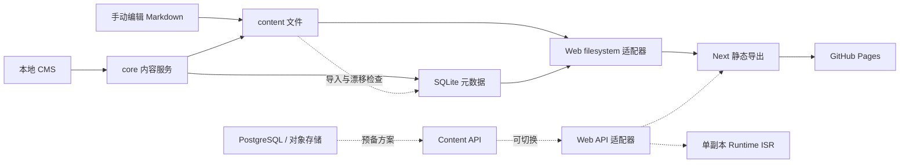

# cBlog 整体审计

审计日期：2026-09-23。代码基线：`66270bb`。范围：前台、管理端、共享核心、内容数据库、品牌配置、构建和部署工作流。

## 结论

这是一个有清晰领域边界和较完整部署预案的个人知识站点。`web / admin / core` 的拆分合理，Markdown 共享渲染、内容适配器、发布状态机和迁移演练具有保留价值。

目前工程基础设施的成熟度高于读者体验和写作可靠性。下一轮投入应优先解决「文章间能顺畅跳转、手机能读长文、编辑内容不丢、发布问题提前发现」，然后才考虑正式启用 PostgreSQL / ISR。

不建议整体推翻重做。保留现有品牌与三包结构，围绕内容契约、阅读流程和验证机制做收敛。

## 审计依据与验证边界

已完成：

- 阅读主要页面、核心阅读组件、内容适配层、Markdown 管道、保存/删除/发布实现、鉴权边界、三个 GitHub Actions 工作流及项目规范。
- 只读查询 `data/blog.db`：30 篇文章，其中 published 23、draft 7；4 个专栏、60 篇 published 条目；四个专栏的 `noindex` 均为 true。
- SQLite `quick_check` 返回 ok，`foreign_key_check` 无错误。这仅说明结构完整，不代表文件与数据库语义完全一致。
- 扫描已发布正文：63 处根路径站内 Markdown 链接，其中 4 处指向非 published 文章。
- 用独立 Node 脚本执行原有图片路径替换表达式，复现 `/cBlog/cBlog/content/...`。
- `node --test scripts/postgres-drill.test.mjs`：7 个测试全部通过；该结果仅覆盖备份/恢复门禁脚本，不代表执行过真实恢复。

尚未完成：

- `pnpm -r test` 和 `pnpm build` 在环境自动准备依赖时遇到 npm registry DNS 失败，已停止无效重试，未得到测试或构建结果。
- 浏览器访问公开博客出现 `ERR_NAME_NOT_RESOLVED`；本地也没有现成导出产物，未完成桌面/手机/深色模式实机截图检查。
- 未执行 PostgreSQL、对象存储、OAuth、Outbox、ISR 的真实集成演练；未执行依赖漏洞数据库扫描。

下文的布局结论来自组件和 CSS；不提供 Lighthouse 分数、真实访问速度或视觉截图结论。网络故障是此次审计环境限制，不能据此判断博客线上宕机。

## 当前架构与规模

README 明确当前流量仍走静态方案，v2 未切流。本审计据此划分优先级，不把仓库内预备能力视作已上线保障。

| 维度 | 判断 | 主要依据 |
|---|---|---|
| 架构分层 | 较好 | 展示、管理、领域有明确边界；共享渲染；内容源可替换 |
| 内容一致性 | 需优先补强 | Markdown 与 SQLite 双写；检测不阻断；生产工作流绕过检测 |
| 品牌与视觉体系 | 方向清楚，规范存在漂移 | 暖色、排版、卡片有 token；skill 与运行时字体不一致 |
| 阅读与发现 | 基础可用，回查和连续阅读薄弱 | 缺全站搜索、移动端目录、有效的文章间链接保障 |
| 作者体验 | 有基本保护，仍有丢编辑风险 | 未保存提醒、快捷保存已有；保存后全量回填与继续输入冲突 |
| 测试与发布 | 演练较丰富，日常门禁不足 | 23 个 TS 测试文件；未发现 PR 自动单测门禁；页面交互未覆盖 |
| 未来扩展 | 扩展接口充分，维护组合偏多 | 双存储、双内容源、双渲染、多发布驱动需要持续回归 |

## 优先修复的问题

P1：下一次功能迭代前处理，关系到写作数据、阅读主流程或发布正确性。P2：随后改善质量、可维护性和体验。以下未发现足以确认的 P0 事故。

### A01 · P1 · 正文站内链接没有适配 `/cBlog` 部署路径

证据：`packages/core/src/markdown/render.ts:68` 使用 remark 输出 HTML，后续只处理图片、标题和 Mermaid，没有重写 `<a href>`。正文通过 `dangerouslySetInnerHTML` 展示，不经过 Next Link。

例如 `](/posts/engineering-practice-hub/)` 会指向域名根目录的 `/posts/...`，而仓库默认 Pages 地址在 `/cBlog/posts/...`。当前 23 篇已发布文章里扫描到 63 处根路径站内 Markdown 链接，涉及 13 篇文章。

建议：在统一渲染管道中规范化站内 URL，区分站内根路径、已有前缀、外部 URL、协议相对 URL、页内锚点。链接和图片使用同一套幂等规则。优先通过 AST 处理，减少字符串替换的相互影响。

验收：在 `BASE_PATH=''` 与 `/cBlog` 两种构建中检查最终 HTML 的站内 href；每个链接均能映射到实际导出文件或有效锚点。此处确认的是代码与当前部署配置之间的问题，未在线点击复测。

### A02 · P1 · 保存期间继续输入，可能被保存后的回读覆盖

证据：`apps/admin/app/posts/[id]/page.tsx:145` 保存当前快照；成功后调用 `loadPost({ silent: true })`，而 `loadPost` 在第 114–122 行无条件覆盖全部表单并清除 dirty。保存时只禁用保存按钮，编辑器和其他字段仍可修改。

触发顺序：输入 A → 保存 A → 请求期间继续输入 B → 保存成功 → GET 回 A → 表单变回 A，B 丢失，dirty 也被清除。保存成功后的 GET 如果失败，还会执行 `setPost(null)`，使编辑视图消失。

建议：保存使用编辑修订号；成功仅同步服务端版本，只有当前修订与提交修订一致时才清除 dirty。回读失败保留编辑缓冲区。补本地草稿恢复后，再改善浏览器后退未保存保护。

验收：模拟慢网络，保存 A 期间输入 B，返回后 B 仍在且提示未保存；GET 失败不清空编辑视图；冲突提示刷新前能保留或导出本地内容。本问题为代码路径分析，尚未浏览器复现。

### A03 · P1 · 内容漂移检查没有形成发布门禁

证据：根 `package.json` 的 build 包含 `content:check`，但 `.github/workflows/deploy.yml:76` 直接执行 Web 包的 build。`packages/core/src/cli/check.ts:6` 又明确「仅告警不阻断」，数据库不存在也退出 0。

手动修改 frontmatter、增删文章后如果忘记导入 SQLite，生产可以构建成功，却仍按旧元数据决定标题、分类、发布状态与文章集合。这是现有双来源设计下的可靠性缺口，不代表当前数据库已经漂移。

建议：保留本地宽松检查，新增 `content:check --strict`；filesystem 生产构建必须执行严格检查。API 模式验证 API 合同，不依赖本地数据库检查。把缺失文件、未知文件、元数据漂移和无效链接写成可读错误。

验收：修改 frontmatter 而不导入时 CI 失败；导入后通过；新 Markdown 不入库不能静默漏发；API profile 仍可独立构建。

### A04 · P1 · 随文图片在子路径部署下被重复加前缀

证据：`packages/core/src/markdown/render.ts:73` 先把 `./assets/x.png` 转成 `${basePath}${assetBase}/assets/x.png`；第 81 行又为所有 `/` 开头图片补一次 basePath。

独立复现结果：`./assets/cover.png` → `/cBlog/cBlog/content/posts/example/assets/cover.png`。后续 WebP manifest 匹配也不会修正这一地址。管理端 `saveAssetFile` 正是返回 `./assets/...`。

当前内容扫描没有发现这种 Markdown 相对图片引用，因此这是已复现的上传写作路径缺陷，不能表述为「现有全部图片已损坏」。

建议与 A01 合并修复。验收覆盖相对图片、根路径图片、已有 basePath 图片、外部图片和 WebP 替换。

### A05 · P1 · 已发布正文链接到尚未发布的文章

数据库和正文交叉检查得到 4 处：

| 来源文章 slug | 目标文章 slug |
|---|---|
| ecommerce-timezone-management | cross-border-i18n-strategy |
| ecommerce-timezone-management | multi-market-feature-flag |
| ecommerce-architecture-redesign | multi-market-feature-flag |
| pdp-product-selector-indexing | ecommerce-plp-refactor |

其中部分文案已标记「草稿」，但仍是可点击链接。即使修好 basePath，生产也没有目标页面。

建议：未发布内容显示为「整理中」文本，或发布时去掉链接；生产检查以实际可公开路由为准。不要为了消除死链自动发布草稿。

验收：所有已发布正文链接均可达，明确标记外部链接和允许的例外；草稿仍保持非公开。

### A06 · P1 · 移动端缺少长文目录与连续阅读入口

证据：普通文章 `apps/web/app/posts/[slug]/page.tsx:264` 的 aside 使用 `hidden ... lg:block`，目录和「同主题继续」都在其中。专栏条目也采用同样结构。手机和平板小宽度没有替代入口。知识图谱特殊文章有单独的目录，不受同一条件限制。

建议：正文前增加默认折叠目录；文章底部增加同主题相关文章，专栏增加上一篇/下一篇。保留轻阅读进度线。

验收：390px、768px、桌面宽度均可打开目录和跳转章节，标题不被 sticky header 遮挡；文章读完有明确下一步；键盘可操作折叠控件。

### A07 · P2 · 静态内容可见性依赖客户端动效成功启动

证据：layout 内联脚本预先给 html 添加 `reveal-ready`；`globals.css:36` 随即把标记内容透明化；React effect 再解除。网络导致客户端 chunk 未加载或 hydration 出错时，内联脚本可能已执行，正文保持透明。

完全禁用 JavaScript 时内联脚本不执行，和「内联运行、应用脚本失败」是不同情形，不能混为一谈。

建议：先保证 SSR 正文可见，控制器成功启动后再装饰进入动画；正文与主导航避免依赖 reveal 才能阅读。验收时阻断 Next 客户端脚本，正文仍可读。

### A08 · P2 · 日期等写入字段缺少运行时校验

证据：文章 PUT 路由直接传递 `body.date`、`body.updatedAt` 等；filesystem 保存只对标题做显式非空校验，日期直接落库；前台使用 `format(new Date(post.date), ...)`。

输入非法日期可进入内容层，随后在渲染处失败。TypeScript 类型不能约束 HTTP JSON 或手写 frontmatter。

建议：内容服务入口校验日期、slug、字段类型、长度和状态；导入与 CMS 复用规则。验收非法日期返回清晰 400，文件和数据库均不变。

### A09 · P2 · 删除缺少跨文件/数据库失败补偿

证据：`packages/core/src/repo/posts-write.ts` 的 `deletePost` 先删数据库，再 `moveToTrash`。如果文件移动失败，记录已经消失，正文还留在原目录，未来导入可能恢复出意外记录。

建议：删除与保存一样有明确补偿协议；先记录操作、移动文件，再提交数据变更，失败还原。验收注入文件权限错误后，两边仍能一致恢复。当前没有执行真实删除。

## 设计、UI 与信息架构

### 保留的部分

暖纸色背景、陶土色标签、较宽正文行高、轻进度线、桌面 sticky 目录以及长标题响应字号，都符合个人学习笔记定位。已有深色样式和 reduced-motion 分支，不需要重新发明视觉体系。

### 值得调整的部分

| 观察 | 对读者的影响 | 建议 |
|---|---|---|
| 首页先展示大标题、概览数字、标签、导航，再展示最新推荐与列表 | 内容入口偏后；总阅读分钟和标签数不一定帮助选择 | 缩短介绍，将 2–3 个主题入口和最近更新提前；保留一处核心 CTA |
| 「阅读路径」实际是分类列表 | 用户可能预期有顺序、目标和前置知识 | 当前改称「主题」；真正的路径用 collection 明确目标、顺序和完成范围 |
| 「先读这篇」直接取 `posts[0]` | 最新文章未必是最佳入门篇 | 区分 latest 与 featured；推荐文章由少量元数据控制 |
| 「同主题继续」遍历所有分类，各取前四篇 | 不是严格同主题推荐，而且占用目录侧栏 | 先同分类/同标签，排除当前篇；只列少量相关内容，放到文末 |
| 标签呈 pill，但只是 span | 占用了分类信息位置，却不能用于继续查找 | 有标签页再做链接；此前弱化视觉交互暗示 |
| 桌面导航缺当前页指示，移动导航已有 | 不同设备反馈不一致 | 统一 active 状态与 aria-current |
| 首页列表自动无限加载，没有加载更多按钮或分页 URL | 返回定位、键盘发现和无脚本访问不稳定 | 优先显式「再看几篇」；规模增大后采用可链接分页，并保留状态 |

没有截图证据，因此上述是结构与交互建议，而不是断言首页在某个屏幕上具体占了多少像素。

### 品牌规范已经发生漂移

- `apps/web/lib/brand.ts`、`docs/brand-core.md` 和 Tailwind 均采用 Maple Mono CN。
- `.agents/skills/style-optimization/SKILL.md` 仍要求 Noto Serif / Noto Sans，并引用 monorepo 拆分前的根目录路径。
- skill 倾向 semibold 和避免大字距，页面仍大量使用 bold、uppercase 和大 tracking。
- `brandCore.page.sections.pillars.lead` 写「大致分三类」，实际定义四类。

建议以运行时品牌配置为基础同步技能与文档。保留 font-display / font-sans / font-mono 的语义 token，即便暂时映射到同一字体，也便于未来调节。全站等宽字体是风格取舍，不是天然错误；应通过中文长文和移动端样本比较阅读密度再决定是否改变。

### 深色与可访问性

`ThemeProvider` 把 dark class 加在 html 上，但 `globals.css:28` 的自定义背景规则写作 `body.dark`，该背景图切换不会按预期触发；Tailwind dark 文字和底色仍会生效，不能说整个深色模式失效。

建议修正选择器并统一检查：跳至正文链接、清晰键盘焦点、导航标签、菜单 Escape 后焦点、图表弹层键盘退出、表格横向滚动、200% 缩放、减少动态效果。现有 CSS 还无条件启用 smooth scroll，可随 reduced-motion 一并关闭。具体颜色对比度与触控尺寸需恢复浏览器验证后再定性。

## 博客易用性与内容经营

读者目前主要靠首页、分类和正文链接找内容。没有发现前台全站搜索入口或 RSS 输出。对于已经拥有 23 篇公开文章和 60 篇专栏笔记的知识站，回查能力比增加首页装饰更有价值。

建议先做轻量静态搜索，覆盖标题、摘要、标签和标题段落，展示主题及上下文。搜索索引必须明确公开范围，不能默认把 noindex 专栏纳入。RSS 为可选的低打扰更新入口，优先级低于链接与移动阅读。

后台已有快捷保存、离开提醒、图片上传、Markdown 预览和版本冲突提示，方向正确。后续优先补：本地草稿恢复、保存成功/已发布/已部署状态区分、失败后不丢编辑缓冲、面向作者的正文链接预检。`useUnsavedChangesGuard` 已写明浏览器前进/后退是已知限制，不能把现有提醒视作完整防丢方案。

管理端编辑页固定 `minmax(0,1fr) 320px` 两列，缺少小屏切换。当前定位本机桌面 CMS，可放在 P2；真正需要手机写作时，先让元数据面板折叠，再考虑更复杂功能。

## 性能、SEO 与公开边界

### 性能

- filesystem 的 `getAllPostsIncludingDrafts()` 对全部非 archived 文章读正文，再做发布过滤；分类、统计、文章页侧栏又反复使用全量读取。多页面构建中会累计重复 I/O。
- 首页把全部文章摘要传入客户端，再限制只展示六项。这是渲染分批，不是网络分页。当前规模未必显著，内容增长后应拆分列表与详情契约。
- 外部字体样式表位于 head，实际加载稳定性和布局偏移需测量；不根据代码推断具体毫秒收益。
- Mermaid 和知识图谱有专门组件与懒加载入口，应保留按需加载方向；无需为了当前几十篇文章引入新的缓存基础设施。

建议先缓存单次构建的内容索引，列表仅读摘要，阅读时间在导入/保存时计算。用 30 / 300 / 1000 篇数据测量构建耗时后再决定进一步优化。

### SEO

普通文章已有 canonical、OG、Twitter、BlogPosting JSON-LD、sitemap，基础比较齐全。

专栏目录和详情的 `generateMetadata` 没有单独声明 canonical/OG URL，可能继承 layout 首页 canonical；sitemap 也没有按 noindex=false 纳入专栏的逻辑。当前四个专栏全是 noindex，所以这是未来公开专栏前必须处理的缺口，不是当前 SEO 损失的实测结论。

建议建立统一 metadata 构造函数，公开页面用自己的绝对 canonical；noindex 专栏继续排除 sitemap。更新时间应反映实际内容更新，避免静态页面每次构建都宣称更新。

### 安全与公开范围

值得保留：默认静态站；Admin dev 绑定 loopback；生产会话 allowlist、写操作 Origin 检查和限流；公开 API flag/token；部署回报 HMAC；Git 提交白名单和暂存区检查。

四个专栏的 noindex 表示不希望被搜索引擎收录，不表示访问控制。filesystem 适配器会为 published 条目生成页面，知道 URL 的人仍可访问。应明确它们究竟是「公开但不索引」还是「私人资料」；若要求私人，必须从静态产物排除或使用实际鉴权。此次没有据名称推断任何内容属于秘密，也没有擅自改变发布状态。

未来公网 Admin 上线前再核查测试身份开关、依赖安全补丁、对象存储访问策略、服务端错误脱敏、备份恢复和真实 OAuth。当前未完成这些安全专项验证，不能给出整体安全认证结论。

## 维护和扩展策略

### 保留三包边界，收紧内容契约

当前适配层很好地隔离了文件/数据库实现，但 `Post` 同时承载列表、详情、文件路径、正文等多种职责。filesystem 列表读正文，而 API 列表主要来自摘要；相同方法名不应让调用方误以为都拥有完整详情。

建议明确 `PostSummary / PostDetail / CollectionSummary / CollectionItemDetail`，用同一组契约样例验证两套适配器，日期、URL、状态、可见性规则放 core。不要把 Next 页面或 React 类型带进 core。

### 不再扩大部署组合

为当前单人写作、静态阅读，v1 是合理默认。v2 的价值应由远程写作、多设备、多人协作或发布时延要求触发。保留迁移成果，并明确支持矩阵与各 profile 的回归负责人/检查命令。

不建议此时新增 Redis、多副本或更多发布驱动。共享 ISR Cache 尚未实现，现有单副本显式限制应保留。

### 把演练变成日常可依赖的检查

现有 shadow-build 会在 main push 后检查适配一致性，是有价值的保障；但它是独立工作流，生产部署不会等待其成功。三个工作流未发现 pull_request 触发的统一单测/类型门禁。Web/Admin 的 Vitest 配置只覆盖 `lib/**/*.test.ts`、Node 环境，不覆盖本次发现的编辑器交互和响应式阅读。

建议增加 PR 必跑的分层检查：core/web/admin 单测、类型检查、严格内容检查、生产 `/cBlog` 构建和导出链接检查。关键 UI 用少量端到端场景覆盖：保存期间继续编辑、移动目录、主题切换、返回文章列表、客户端脚本失败后的可读性。数据库/Outbox 集成测试放在明确配置的集成流水线，避免拖慢每次写作。

根目录 `test` 仅跑 core，`lint` 仅跑 web，应以 `test:unit` / `check` 等名称提供明确的全工作区入口，保留快速局部命令。

Markdown 标题提取现在逐行正则匹配，再按 HTML 标题顺序分配 id。如果未来文章在代码围栏中包含 `## 示例`，目录和锚点会错位；当前内容扫描未发现该触发样例。建议下一次处理渲染管道时从同一 AST 生成目录与锚点，并加入针对性测试。

## 建议执行顺序与完成标准

| 阶段 | 工作包 | 完成标准 |
|---|---|---|
| 第一批：可靠性 | A01/A04 统一 URL；A05 死链；A02 保存竞态；A03 严格门禁 | 子路径产物链接正确；未发布文章无死链；慢保存不丢新输入；漂移阻止发布 |
| 第二批：阅读体验 | 手机折叠目录、文末续读、显式加载、正文可见性降级 | 手机长文可导航；读完能继续；脚本加载失败仍可读 |
| 第三批：内容回查 | 全站搜索、主题命名、latest/featured 分离、品牌规范同步 | 能按关键词找到目标公开文章；入口语义与实际行为一致 |
| 第四批：维护治理 | 运行时校验、删除补偿、摘要/详情契约、PR 门禁 | 无效输入不落库；故障注入后可恢复；两种适配器合同一致 |
| 按需求启动：v2 | 公网 CMS、Postgres、对象存储、ISR 切流 | 真实演练、回滚、备份恢复、权限和发布观测均通过 |

上线验收应同时覆盖「作者能放心写」和「读者能顺畅读」。建议下一次迭代只围绕第一批和手机目录展开，建立稳定基线之后再增加功能。

本次仅新增审计报告，没有修改业务代码、品牌文件、内容状态或部署配置。
